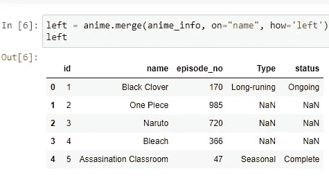

# 与熊猫数据框架连接

> 原文：<https://levelup.gitconnected.com/joins-with-pandas-dataframes-bd077a6ec20d>

**连接**是数据科学家应该知道的关键概念之一。当数据科学家工作时，他主要是收集和组织数据。组织是按要求做的。

照片由[罗马卡夫](https://unsplash.com/@romankraft?utm_source=unsplash&utm_medium=referral&utm_content=creditCopyText)在 [Unsplash](https://unsplash.com/s/photos/join?utm_source=unsplash&utm_medium=referral&utm_content=creditCopyText) 上拍摄

联接有助于组织数据和使用数据。在这篇博客中，我将告诉你如何对数据执行连接，你只需要了解熊猫就能理解。没有 SQL，只有熊猫。

我们将使用函数 ***。*合并()**的熊猫库。它具有以下语法。

的语法。合并()

`df1.merge(df2, on=“the column on which you want to join”)`

这需要更多的参数，我会在连接中讲到。

说到连接，有 4 种类型的连接。它们是:

1.  内部连接
2.  左连接
3.  右连接
4.  外部连接

# 内部连接

内部联接返回两个表中的行。这意味着如果它们不在两个表中，数据就会丢失。

如果多个列具有相同的名称，那么它们会被赋予后缀。我们可以通过给出 ***来实现。merge()*** 函数参数后缀我们要给的名字作为后缀。

比如说我有下面的 anime.csv 文件，里面有下面的数据。

作者图片

我已经将这些数据读入一个名为 anime 的变量中。

`anime = pd.read_csv(“anime.csv”)`

我们希望将此数据与另一个名为 anime_info.csv 的文件连接起来，该文件包含有关动画的 id、名称、状态和类型(季节性或长期播放)的数据

作者图片

我将这些数据读入名为 anime_info 的变量中。

`anime_info = pd.read_csv(“anime_info.csv”)`

> 声明:我使用的数据是我为了更好地解释而编造的。在现实中，它们是巨大的。

当我们执行内部连接时，你认为哪些行将保留？我们将对 name 列执行连接。

> common _ anime = anime . merge(anime _ info，on="name ")

两个表中的公共行是在内部连接中唯一被选中的行。

作者图片

在这个连接中，如果两个表中都没有数据，数据就会丢失。

# 左连接:

它返回左表中的所有行，并且只返回右表中匹配的行。

为了执行左连接，我们将使用“how”参数。

## 示例:

`left = anime.merge(anime_info, on=“name”, how=“left”)`

作者图片

正如您所看到的，左侧表格(anime.csv)中的所有数据都包含在内，只有匹配的数据包含在右侧表格(anim_info.csv)中。缺失的数据表示为 NaN(不是数字)

这样可以保留大部分数据，不像内部连接会丢失大部分数据。

# 右连接:

作者图片

这是左连接的镜像副本。在这个连接中，所有右表数据都被保留，只有匹配的数据被保留在左表中。这也是通过使用 ***的“如何”论证来实现的。合并(*** )。

## 示例:

`right = anime.merge(anime_info, on=“name”, how=“right”)`

作者图片

如您所见，右侧表中的所有数据都被保留，左侧表中匹配的数据也被保留。缺失值由 NaN 表示。

# 外部联接:

作者图片

在这个连接中，每个数据都被保留。没有例外。在这个连接中，没有观察到数据丢失。

示例:

`all_anime = anime.merge(anime_info, on=“name”, how=“outer”)`

作者图片

正如您在上面的图像中看到的，所有的数据都被合并，缺少的值用 NaN 填充。

默认加入的是这个 ***。merge()*** 方法做的是“**内部连接**”。

# 将表格合并到自身

如果你想知道我们什么时候将一个表合并到它自己，不要担心，我马上就会讲到。但是如果你想知道是否有新的语法，那么不要担心。它类似于你到目前为止看到的那些。

示例:

`anime.merge(anime, on=“id”)`

以上只是给大家展示一下它的工作原理。

## 何时将表格合并到自身？

*   当你有等级关系时
*   当你有连续的关系时

# 结论

上面提到的联接只是基本的联接。还有其他连接数据的方法。

关键要点是:

*   什么是连接
*   如何使用它们
*   不同类型的联接
*   何时使用它们

我希望这篇博客对你有所帮助。如果你喜欢这个博客，那么我建议你在 [Medium](https://karthikbhandary2.medium.com/) 和 [YouTube](https://www.youtube.com/channel/UCKplT0-YqAQdCq6Xajcq5Tw) 上关注我，了解更多关于生产力、自我提升、编码和技术的内容。

同时，你为什么不看看我最近的作品:

 [## 使用 Unix Cmds 在数据科学上大展身手

### 让你成为一个厉害的数据科学家

pub.towardsai.net](https://pub.towardsai.net/soar-your-bet-in-data-science-using-unix-cmds-607bc34d7f70)  [## 测试可以让你的数据科学游戏一飞冲天

### 使调试变得轻而易举

medium.datadriveninvestor.com](https://medium.datadriveninvestor.com/testing-can-skyrocket-your-data-science-game-c193ac3e39e6)