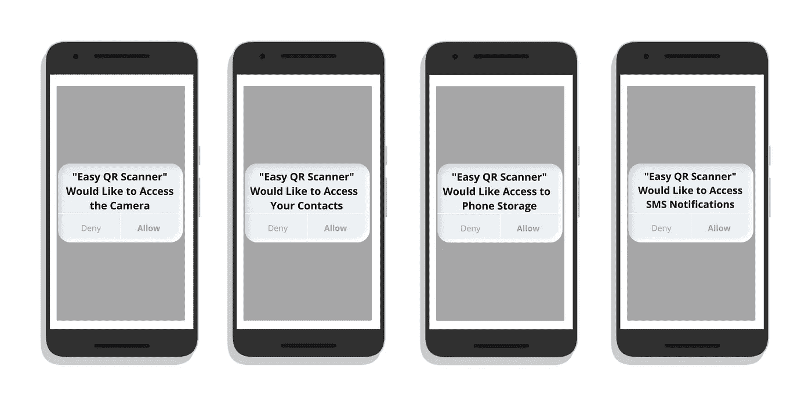

# 小丑病毒——分析耐人寻味的面包病毒的隐蔽表现

> 原文：<https://levelup.gitconnected.com/joker-virus-analyzing-the-unobtrusive-performance-of-the-intriguing-bread-virus-9e4804ec482b>

## 理解黑客的编码思维

[Bermix 工作室](https://unsplash.com/@bermixstudio?utm_source=medium&utm_medium=referral)在 [Unsplash](https://unsplash.com?utm_source=medium&utm_medium=referral) 拍摄的照片

名为**小丑病毒**的有趣的木马恶意软件再次在舞台上找到了自己的位置，在 Play Store 的更多应用中蔓延。该病毒于 2017 年首次出现在 Play Store 应用程序中，然后在去年 2020 年再次出现，目前再次成为辩论的话题。

虽然它的名字听起来有趣又令人震惊，但它背后的动机绝对不是什么有趣的事情。相反，它有能力吃掉被感染的安卓手机用户的全部银行或信用卡余额。

什么是小丑病毒，它如何对您的银行帐户和信用卡造成威胁？在我的另一篇文章中了解它:

 [## 悄悄的，不引人注意的，你的银行账户正在成为小丑病毒的受害者吗？

### 当心你安装的应用程序，小丑病毒又回来了，它可能会暗中干扰你的银行账号。

medium.com](https://medium.com/geekculture/silently-unobtrusively-are-your-bank-accounts-becoming-a-victim-to-the-joker-virus-a1d31f688173) 

更糟糕的是，小丑病毒是一种大多数反恶意软件都无法检测到的恶意软件，因为黑客在包含实际病毒的代码片段中采用了经典而先进的创新加密技术。

从 Play Store 中截至 2021 年被感染的 8 个应用程序列表中，我们将考虑一个 Easy QR Scanner，这是一个 Android 扫描应用程序，并分析黑客如何隐藏一段代码，对您辛苦赚来的面包和黄油构成威胁。

如果你还没有阅读我上面提到的前一篇文章，这里有一个关于该病毒如何工作的小概述:你在你的 Android 设备上安装这 8 个受感染应用程序中的一个(对该病毒一无所知)。安装后，在第一次运行时，它会请求几个权限，其中访问短信，联系人，电话设备信息是需要你注意的，但通常情况下，我们都会忽略它们，只需点击“允许”来拒绝每个请求。

一旦你点击了“允许”按钮，病毒就可以在你不知情情况下向供应商发送短信，并以你的名义进行可疑的订阅。这些可疑的订阅费用会在月底出现在运营商收费的“附加费用”部分。

作者在 Canva 中设计的图像

除了短信计费混淆之外，Joker 病毒黑客还利用收费计费欺诈，通过网页向用户提供支付端点。当用户点击黑客通过他们的“运营商”(SIM 卡公司)提供给他们的 URL embed，并在支付完成时添加他们的电话号码时，黑客了解到电话号码，甚至通过以下两种方法中的任何一种来验证进入的请求是否来自同一用户:

1.  当用户点击嵌入的 URL 时，他们设备的数据连接会切换(在他们不知道的情况下)，这样用户就可以连接到移动数据，而不是 Wifi。这样，因为服务提供商直接处理移动运营商的连接，所以可以容易地追踪和验证电话号码。
2.  用户需要将通过 SMS 发送给他们的密码检索到网页中，当用户点击嵌入的 URL 时，该网页就会打开。这样，用户自己验证 SMS 发送到的电话号码的接入。

迄今为止，小丑病毒背后的黑客一直使用长途电话计费和短信计费这两种技术。无论他们采用何种技术，他们的目标都是获取运营商信息和用户的电话号码，以自动化可疑的订阅，这些订阅将在用户不知情的情况下代表用户不断累积附加费。

# 解析黑客的编码思维

那么，黑客如何将代码片段组合在一起，使病毒对反恶意软件隐藏起来，同时在后台持续运行呢？我们来看看被小丑病毒感染的**易二维码扫描 app** 的网络日志报告(这里正在进行的收费账单欺诈)。

## 第 1 步—安装后首次启动应用程序

应用程序在首次启动时会请求以下四种权限:

作者图片(Canva 设计)

1.  进入**摄像头**
2.  访问**联系人**
3.  访问**手机存储器**
4.  访问**短信通知**

一旦你允许以上所有操作，应用程序就会启动一个**摄像头**来扫描应用程序本身提供的**二维码**。QR 码包含嵌入 URL 的信息，当扫描时，会在浏览器选项卡中打开该嵌入 URL。无论页面是否完全加载，它都会在用户不知情的情况下，通过一个接一个地下载有效载荷来触发病毒。

现在，应用程序的这一行为不会被安装在您设备上的反病毒软件注意到，因为黑客已经利用了[腾讯打包器](https://blog.quarkslab.com/a-glimpse-into-tencents-legu-packer.html)，它基本上隐藏了恶意代码，因此反病毒引擎(甚至是 Play Store)无法检测到它们。以下是从 Play Store 下载的应用程序包的外观:

下载的应用程序内容(图片由作者提供)

看到那个腾讯。StubShell 文件？这是包含隐藏恶意活动代码的加密数据包，恶意活动是在用户不知情的情况下在后台下载有效载荷。应用安装程序下载的第一运行时间运行第一网络日志条目。当腾讯。StubShell 文件被解压缩，它包含连续下载三个有效载荷的指令，每个有效载荷都有一个自动下载下一个有效载荷的指令请求。以下是通过 APK 分析软件获得的活动截图:

总共下载了 3 个有效载荷(图片由作者提供)

所有三个有效载荷都是使用 *GET 方法/命令*从同一个域下载的，但是路径不同。第一个有效载荷被命名为**xiwa . doc***，它的包含下载下一个有效载荷的代码片段。***

***下面是第一个有效载荷的编程情况:***

******

***作者图片***

***在成功执行第一有效载荷之后，执行第二有效载荷，其首先检查 SIM 运营商类型。这是使用*getsimooperator*命令完成的。一旦*getsimooperator*命令被成功执行，它将返回移动国家代码和移动网络代码。收到该信息后，应用程序代码会发送一个 OTP 请求确认，以验证流程并获得对电话号码的访问权。***

******

***第二个有效负载的代码片段(图片由作者提供)***

***当用户通过发回 OTP 来批准确认请求时，他们的电话号码以及运营商信息都容易受到病毒的攻击。然后，它继续为用户订阅高级服务，这是小丑病毒的主要动作。这是通过隐藏在最终阶段(第三阶段)有效载荷中的代码片段来完成的，一旦用户发回 OTP 以确认对设备的访问，就会自动完成。***

****onReceive()命令*用于从来自广播接收机的确认消息中收集所有用户信息(带有完整运营商信息的手机号码+设备信息)。***

***以下是黑客用于简单 QR 应用的 *onReceive 命令*的代码片段。***

******

***收集收到的文本、用户设备和运营商信息(图片由作者提供)***

***最后阶段的有效载荷还包含字符串混淆，以防止基于模式的签名检测，这也有助于隐藏病毒的恶意活动。基于模式的检测是一种安全检查，它分析源代码中先前已知的威胁；这些威胁的唯一标识符在被发现后就已确定。通过使用字符串混淆，黑客可以绕过这些标识符的相似性检查，因此不会被基于模式的签名检测检测到。***

***下面是字符串混淆如何出现在 Easy QR 扫描仪应用程序的源代码中。***

******

***绕过基于模式的签名检测的代码片段(图片由作者提供)***

***这就是你对黑客如何恶意编码以达到他们想要的结果的一个小小的了解。大多数情况下，这些应用程序看起来运行平稳、高效，而且绝对是良性的，直到用户意识到他们每月的账单上有附加费，或者变得足够好奇，去探索 APK 分析软件中应用程序的幕后过程。***

***因此，建议通过已知和可靠的来源下载应用程序，以避免成为网络犯罪的受害者。***

*****披露:** *写这个内容的唯一目的是教育和学习，而不是说服任何人去接受黑客的野心或职业。****

***阅读更多我的故事内容和许多其他由杰出作者在媒体上写的无限有趣的文章。只需 5 美元即可获得 [Medium 的月度订阅](https://safoorawrites.medium.com/membership),并立即获得平台上无限有趣的内容。***

*****注:** *上面的链接是会员链接，意思是如果你通过这个链接以读者或者作家的身份加入 medium platform，我会给你赚一小笔佣金，绝对不会额外收费。****