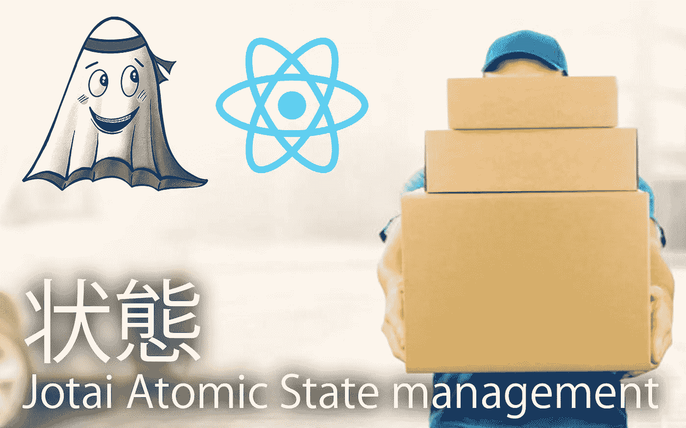
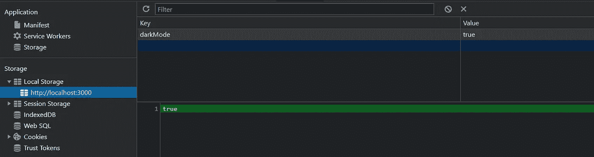

# 为什么 Jotai 是 React 最好的基于原子的状态管理库

> 原文：<https://levelup.gitconnected.com/jotai-atom-based-state-management-for-react-1ce8fd380296>



在过去的几年里，国家管理有了很大的发展。在 React 应用程序中，有许多可以管理状态的库和方法。尽管 Redux 是使用最广泛的状态管理，但由于它带来的复杂性和样板代码，它的受欢迎程度已经随着时间的推移而下降。人们开始转向其他选项，如[反应-查询](https://react-query.tanstack.com/)、[反冲](https://recoiljs.org/)、 [Zustand](https://zustand.surge.sh/) 、[钩子状态](https://hookstate.js.org/)、[上下文-API](https://reactjs.org/docs/context.html) ，因为它们非常小，易于维护。

2020 年，脸书引入了一种叫做“反冲”的管理国家的新方法。反冲采用了一种**原子**方法，就像一个附在你的反应树上的图，其中状态变化从这个图的根(称为**原子**)通过纯函数(称为**选择器**)和组件流动。由于应用程序会将状态拆分成原子，这将比 redux 中的存储空间小。本文主要关注状态管理领域的另一个竞争对手，叫做 **Jotai，**一个**原子的**，一种轻量级的、简单明了的 React 应用程序状态管理方式。

# Jotai 是什么

Jotai 是一个简单的状态管理库，由 [Zustand](https://zustand.surge.sh/) 的创建者开发。Jotai 的灵感来自反冲，这是一种原子的状态管理方法。与反冲不同，Jotai 不需要传递字符串密钥。Jotai 提供了一个极简的 API，具有类型脚本就绪性，并与[反应暂停](https://reactjs.org/docs/concurrent-mode-suspense.html)和[并发模式](https://reactjs.org/docs/concurrent-mode-intro.html)兼容。

# 是什么让它独一无二

与反冲相比，Atom 相对较轻，反冲的束大小为 14kb，而 jotai 仅为 3.3 kb。Jotai 有一个简单的 API，由像`Provider`、`atom`和`useAtom`这样的 API 方法组成。与反冲不同，它不需要钥匙来识别原子

```
// Recoil's atom with a **key**
const counterState = atom({
 **pokemon**: {
  pokemons: [],
  pokemon: '',
  isEditing: false
 }
})// Jotai's atom
const **pokemonAtom** = atom({
 pokemons: [],
 pokemon: '',
 isEditing: false
})
```

状态可以通过传递一个接受另一个原子的函数来实现像选择器这样的选项。

```
const pokemonSelector = atom({
 (get) => get(**pokemonAtom**).filter((e) => e === id)
})
```

# Jotai 与反冲、Zustand 和 Redux 的比较

React now 提供了许多状态管理工具，其中大多数都属于特定的类别。

*   通量( [Redux](https://redux.js.org/) ， [Zustand](https://zustand.surge.sh/)
*   代理( [Mobx](https://mobx.js.org/) ， [Valtio](https://valtio-demo.pmnd.rs/) )
*   原子([反冲](https://recoiljs.org/)，[约泰](https://jotai.pmnd.rs/))

Flux 体系结构基于由订阅存储/状态的组件触发的动作所引起的变化。最著名的基于 flux 的状态管理是 Redux，它仍然是 react 社区中使用最多的状态管理库。由于样板文件和高度复杂性等问题，像 Zustand 这样的库变得流行起来。Zustand 维护了一个类似 Redux 的商店，但样板代码更少。

代理是一种利用可观察对象并使用订阅者来管理状态的模式，这意味着您不需要像选择器和区分这样的传统方法来识别和重新呈现状态的组件。代理模式不需要触发独特的动作，就像 Redux 或 Zustand 一样，它将订阅存储中的值。Mobx 可以被认为是最著名的，因为这种特殊的模式和 valtio 是由 [Daishi Kato](https://medium.com/@dai_shi) 创造的，他也是 Zustand 和 Jotai 的作者。Flux 和代理存储数据都不绑定到 React 树。因此，您甚至可以从 React 树外部使用它。

原子模式类似于 React 状态，它将状态存储在 React 树中。原子将保持应用程序状态，组件可以订阅这些独立的原子。脸书的反冲是使用原子方法的最著名的图书馆。Jotail 是另一个利用原子结构来管理状态的库。

# Jotai API

Jotai 是最小的国家管理图书馆之一。Jotai 包含 3 个主要的核心功能，它们是

## [原子](https://docs.pmnd.rs/jotai/api/core#atom)

一个原子代表一段应用程序状态。原子可以是原始值，如数字或布尔值，并接受对象或数组。你可以任意定义原子。但由于它不使用任何类似反冲的键，所以使用起来相当容易。

```
import { **atom** } from '**jotai**'const **pokemonAtom** = **atom**({
 pokemons: [],
 pokemon: '',
 isEditing: false
})//Derived atom which uses **pokemonAtom**
const pokemonCountAtom = **atom**(
 (get) => get(**pokemonAtom**).pokemons.length
)
```

## [使用原子](https://docs.pmnd.rs/jotai/api/core#use-atom)

useAtom 方法的行为类似于 React 提供的 [useState](https://reactjs.org/docs/hooks-state.html) 方法。该方法用于从组件中读取存储/原子数据。useAtom 返回两个值 value 和 setter 函数。

```
const {**pokemonAtom**} from "../atoms"
const [pokemon,setPokemon] = **useAtom**(**pokemonAtom**);
```

## [供应商](https://docs.pmnd.rs/jotai/api/core#provider)

提供了一个高阶函数，使您能够从应用程序内部的任何地方访问原子。该提供者与 React 上下文提供者非常相似。

除了这些核心 API 之外，还有一些像 [**atomWithStorage**](https://docs.pmnd.rs/jotai/api/utils#atom-with-storage) ，这样的实用 API，它们将数据持久存储在浏览器的 [localStorage](https://developer.mozilla.org/en-US/docs/Web/API/Window/localStorage) 或[session storage](https://developer.mozilla.org/en-US/docs/Web/API/Window/sessionStorage)中。[**split atom**](https://docs.pmnd.rs/jotai/advanced-recipes/large-objects#split-atom)**这个 util 函数是在处理数组对象时使用的。这个函数将把数组中的每个对象转换成一个原子。**

# **Jotai 入门**

**在这一节中，让我们看看如何在实际应用程序中使用 Jotai。让我们构建一个小的口袋妖怪应用程序，它将维护你最喜欢的口袋妖怪的数据库。**

# **步骤 01:安装**

**让我们通过下面的命令在 React 应用程序上安装 Jotai。这些命令将安装所有必需的**

```
npx create-react-app jotai-pokemons
cd jotai-pokemons
yarn add **jotai optics-ts** semantic-ui-react semantic-ui-css
```

# **步骤 02:创建存储/原子**

**当构建一个实际的工作应用程序时，我们将不得不处理原子中的大型对象。主要有三种方法。**

1.  **一个大原子把一个物体作为一个整体并创造出更小的衍生原子**
2.  **标准化数据结构**
3.  **创建微小的，并将它们与原子引用相结合**

## **一个大原子和小衍生原子**

**这种方法不是保存数据的最基本的方式，但是，这使得管理状态和将状态推送到服务器变得更容易，因为它不需要对数据进行任何规范化或调整。Jotai 附带了一些实用函数，如`selectAtom`、`splitAtom`、`focusAtom`，可以方便地访问它们。**

```
const dataAtom = atom({
 pokemons: [
 { id:1,name: 'Pikachu', power: 'Lightning',description: 'Fluffy'},
 { id:2,name: 'Charizard', power: 'Fire',description: 'Brown'}
 ],
 pokemon: '',
 isEditing: false
})export const pokemonsAtom = **focusAtom**(dataAtom, (optic) => optic.prop('**pokemons**'))
```

## **标准化数据**

**在这里，我们可以规范化数据，使之更容易，并提高应用程序的性能。你可以使用像 [normalizr](https://github.com/paularmstrong/normalizr) 这样的工具来实现。**

```
const pokemonMapAtom = atom({
  p1: { name: 'Pikachu', power: 'Lightning',description: 'Fluffy'},
  p2: { name: 'Charizard', power: 'Fire',description: 'Brown'},
})
```

## **原子引用**

**这种方法有点混乱，但是它的工作原理是一样的，每一部分数据都用一个原子包装。**

```
const dataAtom = atom({
  pokemon: atom([
    atom({ name: 'Pikachu', power: 'Lightning',description: 'Fluffy'}),
    atom({ name: 'Charizard', power: 'Fire',description: 'Brown'}),
  ]),
}
```

**让我们使用 atom.js 文件中的大原子来创建一个全局存储**

**Store.js 文件**

# **步骤 Jotai 的实用程序和集成**

**Jotai 允许一些有用的插件来增强开发体验。下面是其中的几个。**

1.  **[atomWithStorage](https://docs.pmnd.rs/jotai/api/utils#atom-with-storage)**
2.  **[atomWithReset](https://docs.pmnd.rs/jotai/api/utils#atom-with-reset)**
3.  **[用户自定义](https://docs.pmnd.rs/jotai/api/utils#use-reducer-atom)**

**让我们看看如何使用[**atomWithStorage**](https://docs.pmnd.rs/jotai/api/utils#atom-with-storage)**util 函数将数据存储在浏览器的本地或会话存储中。让我们将下面几行添加到 **store.js** 文件中。****

```
**import { **atomWithStorage** } from 'jotai/utils'export const darkModeAtom = **atomWithStorage**('darkMode', false)**
```

****接下来，让我们从组件中访问这个原子。让我们创建一个包含切换按钮的导航组件。****

****Navigation.jsx 文件****

****现在，我们可以转到浏览器中的应用程序选项卡，查看其中存储的数据。****

********

****浏览器的本地存储****

# ****步骤 o4:处理异步状态****

****在 Jotail 中处理异步状态更容易。只不过是传递那个回报你数据的承诺而已。让我们考虑一个从 API 获取数据的小例子。****

```
**export const getPokemonAtom = atom(
 **async** () => fetch(URL).then((resp) => resp.json())
)**
```

****您可以通过这个 [Github](https://github.com/TRomesh/jotai-pokemon) repo 来了解如何在 React 应用程序中配置和使用 Jotai。****

# ****结论****

****总之，Jotai 图书馆是最轻的国家管理图书馆之一。它还通过与 [Immer](https://immerjs.github.io/immer/) 、 [Optics](https://github.com/akheron/optics-ts) 的集成提供了扩展其功能的灵活性，以增强开发体验。比如 Jotai 支持 React DevTools，Persist，支持 React 钩子，TypeScript 等。****

****因此，Jotai 看起来是一个优秀的国家管理候选人。该库的简单性也使它成为使用 React 进行状态管理的初学者的一个好选择。最后，感谢您花时间阅读本文。我想看看你下面的问题和评论。****

****干杯！****

# ****了解更多信息****

****[](/build-your-own-self-hosted-ci-cd-workflow-with-github-actions-ec9ee1dcd800) [## 使用 GitHub 操作构建您自己的自托管 CI/CD 工作流

### GitHub 引入了 GitHub Actions，使开发人员能够直接从他们的 GitHub 库自动化工作流…

levelup.gitconnected.com](/build-your-own-self-hosted-ci-cd-workflow-with-github-actions-ec9ee1dcd800) [](/hookstate-the-simplest-state-management-tool-b02f7d3b01a4) [## 最简单的状态管理工具

### 小型、最小、简洁、可扩展、基于钩子的状态管理库

levelup.gitconnected.com](/hookstate-the-simplest-state-management-tool-b02f7d3b01a4) [](https://medium.com/swlh/intro-to-recoil-d689a77c5f04) [## 反冲介绍

### 反冲是一个反应的状态管理库，是由脸书的实验和开放源码…

medium.com](https://medium.com/swlh/intro-to-recoil-d689a77c5f04)****