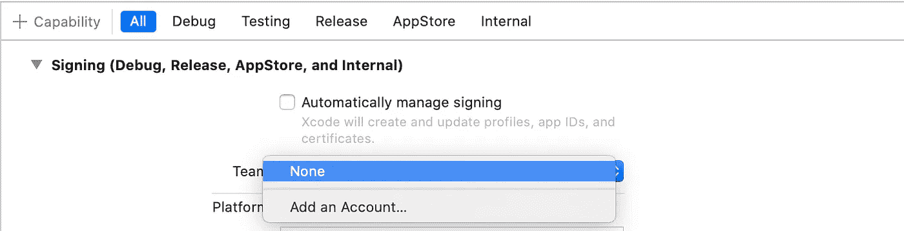

# 为移动开发设置新机器:移动开发者杂志

> 原文：<https://levelup.gitconnected.com/journal-of-a-mobile-developer-setup-the-machine-9779e9985ece>

## 设置移动开发

## 了解移动开发者使用什么工具


照片由[恒娄比尔](https://unsplash.com/@constant_lb?utm_source=medium&utm_medium=referral)在 [Unsplash](https://unsplash.com?utm_source=medium&utm_medium=referral) 拍摄

我一直用于开发的 MacBook Pro 已经用了五年，快要报废了。今天我把它换成了新的。因为已经过了这么久，我花了一段时间才想起来要安装什么。

下面我将分享你(和我未来的自己)构建移动应用需要什么工具。

# 连接到 Git Repo


卢克·切瑟在 [Unsplash](https://unsplash.com?utm_source=medium&utm_medium=referral) 上拍摄的照片

这是最重要的事情，得到你所有的源代码。为了确保我们可以为每台新机器访问我们的 Git Repo，我们需要设置我们的机器来拥有访问 Repo 的正确凭证。典型的方法是生成机器的 SSH 密钥，并将其放入 Git Repo 中。

## 1.生成 SSH 密钥

在终端中键入以下内容。

```
ssh-keygen -t rsa
```

您可以输入机密短语或使用默认短语。这将在`*~/.ssh/*`文件夹中生成`*id_rsa*`和`*id_rsa.pub*`文件。

## 2.复制公钥

使用下面的命令复制公钥

```
pbcopy < ~/.ssh/id_rsa.pub
```

转到你的 github 账户的[https://github.com/settings/ssh/new](https://github.com/settings/ssh/new)，然后将公钥粘贴到密钥栏。你可以给任何你喜欢的名字。

就是这样！

以上是针对 Mac 机的。如果你在另一个平台上，请查看下面的链接。

[](https://inchoo.net/dev-talk/how-to-generate-ssh-keys-for-git-authorization/) [## 如何为 Git 授权生成 SSH 密钥

### @boetter / flickr 版权所有嗨！这篇文章将会非常简单明了，并且会涉及到窗口…

inchoo.net](https://inchoo.net/dev-talk/how-to-generate-ssh-keys-for-git-authorization/) 

# 安装所需的 ide

作为一名移动开发人员，我在 iOS、Android 和一些后端系统上工作。因此下面是我下载的 ide。

## 1.安装 Xcode(用于 iOS 开发)


照片由 [Przemyslaw Marczynski](https://unsplash.com/@pemmax?utm_source=medium&utm_medium=referral) 在 [Unsplash](https://unsplash.com?utm_source=medium&utm_medium=referral) 上拍摄

如果你从谷歌搜索安装 Xcode，它会把我们带到 AppStore 来安装最新最好的 Xcode。例如

[https://developer.apple.com/xcode/resources](https://developer.apple.com/xcode/resources/)

然而，大多数时候，在实际开发中，我们宁愿使用 Xcode 的稳定版本，也要花一些时间去新版本。因此，安装位置改为

https://developer.apple.com/download/more/

在这里，我们可以找到旧版本，并安装我们喜欢的。请注意，它很大。我装的是 7.6 GB。

> 注:你需要苹果帐户来安装它。

Xcode 上的另一件编译工作，如果你正在进行一个公司项目，你需要为它设置合适的团队，或者设置它自动管理签名。这完全取决于您所拥有的项目，以支持编译。



查看 https://stackoverflow.com/a/39633498 的[了解更多信息。](https://stackoverflow.com/a/39633498)

## 2.安装 Android Studio(用于 Android 开发)


照片由 [Unsplash](https://unsplash.com?utm_source=medium&utm_medium=referral) 上的 [Matam Jaswanth](https://unsplash.com/@mjaswanth?utm_source=medium&utm_medium=referral) 拍摄

Android Studio 要小很多，不到 900 MB。最新版本可在中找到

[https://developer.android.com/studio](https://developer.android.com/studio)

如果你需要旧版本的 Android Studio，你可以从

[https://developer.android.com/studio/archive](https://developer.android.com/studio/archive)

对于 JDK 来说，你可以选择任何一种

*   Mac 版 open JDK[https://stackoverflow.com/a/28635465/3286489](https://stackoverflow.com/a/28635465/3286489)
*   用于 Linux 的 open JDK[https://openjdk.java.net/install/](https://openjdk.java.net/install/)
*   OpenJDK(祖鲁语)[https://www.azul.com/downloads/zulu-community/](https://www.azul.com/downloads/zulu-community/)
*   甲骨文 JDK[https://www . Oracle . com/au/Java/technologies/javase/javase-JDK 8-downloads . html](https://www.oracle.com/au/java/technologies/javase/javase-jdk8-downloads.html)

## Android Studio 需要的其他东西

尽管最初的 Android Studio 安装很小，但是以后还需要安装其他东西，例如

1.  Android SDK，只有在您第一次启动 Android Studio 后才会安装。
2.  Android 模拟器，即使是 Android Studio 中的第一个模拟器，你也必须使用 AVD 管理器手动创建
3.  Java 开发工具包(JDK)。我从[https://www . Oracle . com/au/Java/technologies/javase/javase-JDK 8-downloads . html](https://www.oracle.com/au/java/technologies/javase/javase-jdk8-downloads.html)下载 JDK 8.0。奇怪的是，这一次它要求我们登录后才能安装它。这在过去不是一个要求。

另一个关于 Android 的问题是，SDK 29 需要许可接受才能继续，但是它也需要 Java 按照 https://stackoverflow.com/a/43003932/3286489[中的指令执行](https://stackoverflow.com/a/43003932/3286489)

## 3.为非移动开发安装另一个 IDE，例如后端


由 [Marvin Meyer](https://unsplash.com/@marvelous?utm_source=medium&utm_medium=referral) 在 [Unsplash](https://unsplash.com?utm_source=medium&utm_medium=referral) 上拍摄的照片

不幸的是，尽管是一个“纯粹的”移动开发者，我们也需要让自己进入一些后端服务。因此，我们需要工具来这样做。我知道的两个最突出的并且有一些使用经验的例子是

1.  IntelliJ IDEA:[https://www.jetbrains.com/idea/](https://www.jetbrains.com/idea/)
2.  Visual Studio 代码:[https://code.visualstudio.com/](https://code.visualstudio.com/)

我肯定还有更多，比如 Eclipse、Atom、VIM 等等，我听说其他核心开发者也在用。

# 其他编程语言(脚本)


詹姆斯·巴尼特在 [Unsplash](https://unsplash.com?utm_source=medium&utm_medium=referral) 上拍摄的照片

我们有时会不时使用其他编程语言(脚本)。因为我以前的 Mac 机是旧的，所以它带有一些脚本语言，我不确定是以前的用户安装的还是预装的。

## 现成

反正对于这台机器，下面是看起来唾手可得的。

1.  ruby——只需输入`ruby -v`,就会看到版本
2.  python(版本 2)——只需输入`python — version`就能看到版本
3.  python 3——只需输入`python3 — version`就能看到版本
4.  perl —只需输入`perl -v`就可以看到版本。

## 附加安装

我想要但没有的是 Node。通常我自制它。令我惊讶的是，自制软件并不容易在 mac 上运行。我需要使用下面的命令来获取它。

```
/bin/bash -c "$(curl -fsSL https://raw.githubusercontent.com/Homebrew/install/master/install.sh)"
```

之后，我现在可以安装 node，使用

```
brew install node
```

> 如果您已经有了`brew`，您可能想要使用`brew update`来更新它。[https://tree house . github . io/installation-guides/MAC/node-MAC . html](https://treehouse.github.io/installation-guides/mac/node-mac.html)了解更多选项。

完成后，您现在可以检查 go 以确保您有`node`和`npm`。

```
node -v
npm -v
```

同时我也对得到`yarn`感兴趣，所以用`npm`装`yarn`。

```
npm install -g yarn
```

[](/know-yarn-before-learning-node-js-bf39a50fb27f) [## 先认识纱线再学习 Node.js

### 希望在我学习 Node.js 之前有人给我讲过 Yarn，没看到有 Node.js 的教程提到过。所以…

levelup.gitconnected.com](/know-yarn-before-learning-node-js-bf39a50fb27f) 

我觉得有趣的是，从 Ruby 开始，我们安装了 Homebrew，安装了 NPM 和 YARN。


如果您使用 TypeScript for Node，您可以按如下方式安装它们

```
npm install -g typescript 
npm install -g @types/node
```

# 其他工具


塞萨尔·卡里瓦里诺·阿拉贡在 [Unsplash](https://unsplash.com?utm_source=medium&utm_medium=referral) 上的照片

我很确定你会需要很多其他的工具。但是下面列出的是我的分享

1.  [Charles Proxy](https://www.charlesproxy.com/) :这是调试网络调用等最重要的网络代理工具。
2.  [ProxyMan](https://proxyman.io/) :又一个新兴的网络代理工具，用于调试网络调用等。
3.  [SourceTree](https://www.sourcetreeapp.com/) :任何 git repo 的图形用户界面，便于查看和管理 git。
4.  崇高编辑器:一个文本编辑器工具，你可以在上面安装语法检查和颜色。[链接进入命令行界面](https://www.sublimetext.com/docs/command_line.html)。
5.  一个容器管理框架，允许人们在自己的环境中快速运行网络服务，比虚拟机好得多
6.  Sequel Pro :一个简单的关系数据库查看器。有时查看一些服务器数据库以进行调试等非常有用。
7.  [graphql](https://www.electronjs.org/apps/graphiql):一个 graphql 端点响应用户界面，用于查看和编写 graph QL 请求
8.  [邮递员](https://www.postman.com/):帮助执行网络请求的 UI 界面，对 POST rest 请求特别有用
9.  GIMP :一个图片编辑工具，用于对图片进行一些小的修改(比如模糊图片，制作透明背景等)
10.  AMPP:一个支持 PHP、Apache 服务、MySQL 等的 web 框架，类似于许多外部 PHP 主机免费支持的框架。

就是这样。我一整天都在用工具安装和设置我的机器。我可以在将来再次检查这个列表，或者安装它，或者可能想知道为什么我会使用它们，或者只是怀念从前使用这些工具的历史时刻。