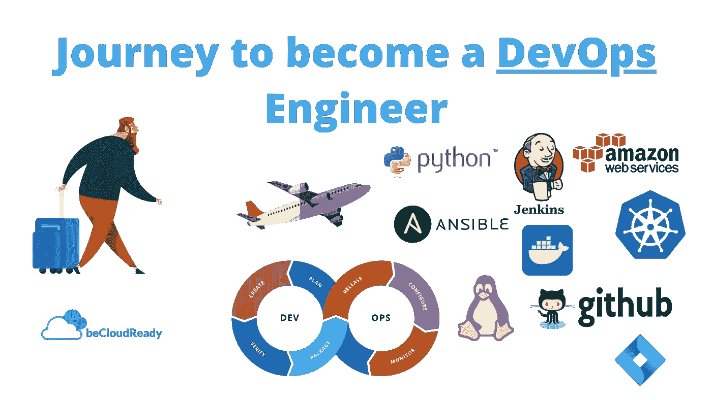
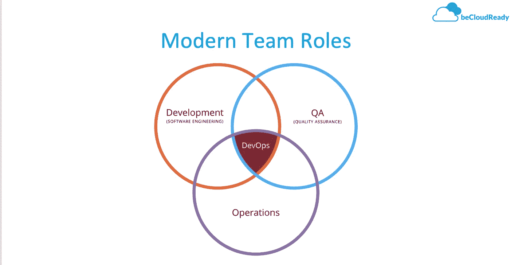
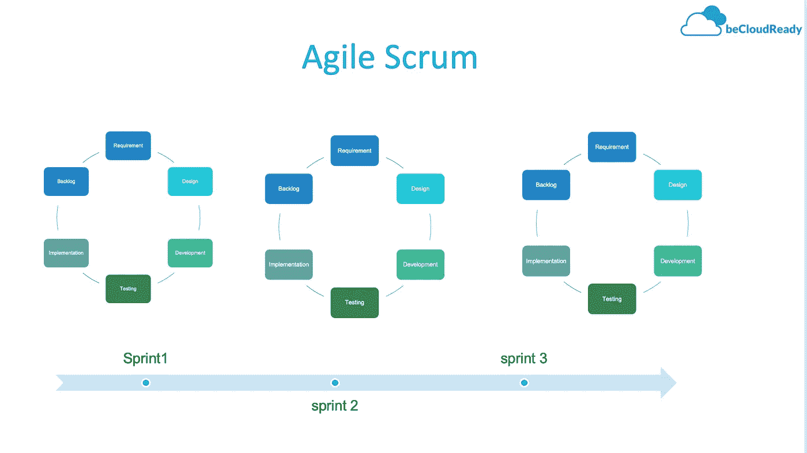
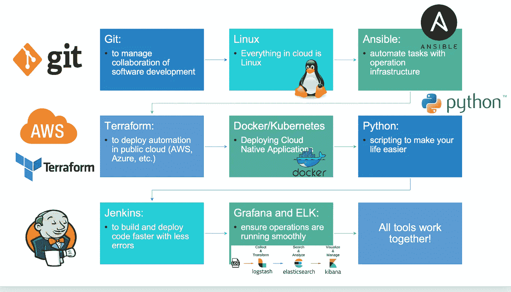

# 成为 DevOps 工程师的旅程

> 原文：<https://levelup.gitconnected.com/journey-to-become-a-devops-engineer-2a4cdfd1912c>

如果你想进入 DevOps，那么这篇文章将指导你如何实现你的目标。如果你刚刚开始，这篇文章将为你提供成为 DevOps 工程师的学习途径。

有一种普遍的误解，认为任何系统管理员成为 DevOps 工程师都是一种自然的进化。然而，大多数情况下，说起来容易做起来难。

有 3 个最常见的职业道路，带你到 DevOps

1.  绝对初学者(新生)
2.  系统管理员到 DevOps
3.  开发人员到开发人员

普遍的误解是，任何已经有技术背景的人都会比初学者有优势，但事实上，成为 DevOps 的旅程对每个人来说或多或少都是一样的。事实上，有时一个有兴趣和渴望学习的初学者是无法打败一个有经验的人的。

在我们进入到 DevOps 的职业过渡之前，让我们了解一下什么是 DevOps 以及与之相关的概念。

# DevOps 是什么？

DevOps 不是一个工具，而是一套原则和哲学，可用于实现以下目标(软件开发管道):

1.  减少组织孤岛
2.  实施循序渐进的小变革
3.  实施工具和自动化
4.  接受失败并解决它们，这样同样的失败就不会再次发生

让我们来详细探讨一下其中的每一项:

# 减少组织孤岛

传统上，开发人员和运营团队在不同的环境和心态下工作。开发人员通常很少或根本不了解操作，操作人员也很少了解开发过程是如何进行的，这就产生了组织孤岛，最终导致了许多摩擦。一个典型的例子是，开发人员希望尽可能快地将他们的代码部署到生产中，而运营团队希望以稳定而缓慢的速度移动代码，以减少运营或生产故障。

DevOps 的理念是将这两个团队整合在一起，协同工作，让开发人员成为运营团队的利益相关者，让运营团队成为开发流程的利益相关者。理解了彼此的过程，极大地减少了组织的筒仓，这导致了代码从开发到生产环境的更快的移动。

# 实施渐进变革—实施敏捷

基于敏捷的软件交付机制在软件开发过程中带来了小而快的开发周期。这种方法不同于瀑布模型，在瀑布模型中，您进行一次大爆炸式升级。较小的增量变化有其自身的优势:

*   顺产
*   轻松回滚
*   易于追踪和审计。

另一方面，如果不自动化，会给部署管道带来很大压力。

# 实施工具和自动化

正如我们所看到的，渐进的改变是有益的，但是如果没有完全自动化的管道，这些类型的实现是不可能管理的。因此，为了实现上述 DevOps 原则，我们需要进行自动化。为了成为 DevOps 工程师，您应该具备以下条件:

*   构建自动化
*   测试自动化
*   部署自动化
*   监控和警报
*   故障和回滚自动化

# 接受失败是正常的

DevOps 哲学的另一个关键原则是接受失败是正常的事情。当故障发生时，应进行调查并确保同类故障不会再次发生。只有将基础设施资源视为可以通过一段代码修复并可以进行版本控制的软件产品，这种方法才是可行的。

# 什么技能是关键

现在回到如何通过从系统管理员过渡到 DevOps 来成为一名 DevOps 工程师的话题，前面提到的理念和实践需要转化为技能和工具。

在进入核心技能/工具之前，让我先分解一下概念[

需要学习的概念:

1.  了解开发流程
2.  学习自动化成为 DevOps 工程师(学习如何编码)
3.  理解测试概念和测试自动化
4.  基础架构部署自动化

在当前形态下，DevOps 也有一些专业化。最常见的专业化是

1.  DevOps 构建软件开发者管道(Jenkins、Gitlab、CI/CD)
2.  DevOps 建设现代基础设施(Kubernetes、Ansible、Terraform)

在较小的组织中，两个专业都有一个人，然而，在较大的组织中，你可以看到人们专注于不同的领域。

无论哪种方式，以下基本概念对任何成功的 DevOps 工程师都至关重要。

# 了解开发流程

因为系统管理员的日常工作包括应用补丁和编写临时脚本，这使得他们对开发生命周期或过程知之甚少或一无所知。

软件开发过程部分取决于编程语言或使用的平台。主要有两种类型的编程语言。

编译语言和构建概念:编译语言本质上是在部署或运行到系统中之前需要转换成可执行二进制文件的语言。

与 Java 或 C/C++等脚本语言相比，这类语言的开发过程有点复杂。涉及的一般步骤有:

*   汇编
*   连接
*   包装

当开发人员用 Java 编写代码时，他们通常会包含多个库，这些库需要在构建时进行解析。Apache Maven 是 Java 环境中最流行的构建自动化工具。因此，为了理解和有效地构建，您应该理解核心 Java 平台以及 maven 如何进行构建操作。

因此，列出构建自动化所需的技能应该是:

*   了解 Java 平台
*   阿帕奇 Maven
*   詹金斯
*   用于源代码控制的 Git

脚本语言和解释语言:这些语言如 PHP、Python 和 JavaScript。它们不需要编译，只需在机器上执行即可。尽管这些语言没有任何编译或链接的复杂性，但它们运行的环境应该已经预装了软件包。例如，对于 Python 或 Ruby，在它们运行之前，您需要将它们的相关库或模块预先安装在机器中。

# 学习自动化成为 DevOps 工程师

在 DevOps 哲学中，自动化的方法是关键，而不是自动化本身。

实现自动化的方法应该是任何人都可以执行的。就基于 DevOps 的自动化而言，如果可能，应避免临时自动化。

临时自动化通常是为了解决一个非常小的问题，而没有一个完整的流程方法。例如，如果一个系统管理员想在五台 Linux 服务器上部署 10 个补丁，他或她可能想写一个小脚本来快速完成这个任务。

在 DevOps 世界中，这种特别的自动化应该以一种更有组织的方式来完成，以便这种自动化:

*   任何人都有可能经营
*   易于插入其他模块
*   定义输入和输出接口
*   跟踪脚本的变化(git-源代码控制)

> 有一种说法是，你不应该自动化自动化

这意味着如果你想自动化，你必须准备好编码。你不能用另一个自动化来自动化一件事。如果你正在寻找软件开发方法的自动化，你应该看看

*   Python for DevOps
*   Ruby for DevOps
*   DevOps 的 Perl

我想在这里强调的关键点是，为了成为一名成功的 DevOps 自动化开发人员，你不需要学习一门语言的全部功能。例如，python 是一种非常多样化和通用的编程语言。它可以用于 web 开发数据科学大数据或任何东西，为什么学习 python 您应该首先专注于正确的基本概念，然后开始学习特定于 DevOps 自动化的模块，这将大大减少学习曲线，并有助于提高您的生产力。

> 对于 DevOps Automation，您不需要成为一名摇滚明星 Python 开发人员

# 理解测试概念和测试自动化

软件测试是任何软件交付周期的重要部分。为了实现高质量的软件，专门的测试工程师设计和开发测试用例，这些测试用例将验证和确认软件的功能，并在软件投入生产之前发现错误。与大多数其他工作角色一样，测试自动化工程师的角色变得越来越技术化和开发者驱动，这意味着测试自动化工程师传统使用的工具不足以满足不断变化的软件接口的需求。

现在越来越多的测试团队正在寻找具有开发技能的人，他们可以帮助和改进文本功能。然而，在现实中，大多数测试团队都指望 DevOps 工程师来帮助他们自动化他们的测试用例。在这样的场景中，DevOps 工程师必须是多才多艺的，并且至少对测试有基本的了解，这样他或她才能帮助团队或者编码他们的测试用例，以自动化的方式部署它们。

所以再次谈到技能，你应该具备以下几点:

*   基本测试概念
*   单元测试、集成和用户验收测试
*   了解单元测试框架，如 JUNIT、python 单元测试
*   使用 Jenkins 实现测试的部署自动化

# 基础架构部署自动化我们的配置管理

这是 DevOps 工程师操作、部署、管理和控制基础架构的最大领域之一。随着我们逐渐转向多云和混合云环境，例如异构系统的管理变得越来越复杂，管理这些基础架构的传统方法不再适用。

为了实现高效且可扩展的基础架构，必须熟练使用全自动配置管理工具。与软件开发技能、测试自动化技能不同，当涉及到配置管理技能时，DevOps 工程师必须是配置管理工具中的明星

*   Ansible
*   木偶
*   将（行星）地球化（以适合人类居住）

> 谈到配置管理技能，DevOps 工程师必须是一个摇滚明星

# Linux，Linux 和 Linux

在现代世界中，每当我们谈到计算资源时，我们指是 Linux 虚拟机、容器等。所有技能中最重要的是你对 Linux 环境的适应程度，以及如何解决任何问题。我建议任何对长期 DevOps 职业感兴趣的人，必须专注于掌握 Linux、bash 和基本的 Linux 故障排除技能。

# 结论

众所周知，DevOps 领域仍在不断发展和变化。要想在这个领域取得成功，列出你必须知道的每一项技能/工具几乎是不可能的，但是，我们总是可以为核心技能创建一个基本的蓝图。前面提到的概念、哲学和工具对一些人来说可能是压倒性的，对一些人来说可能太少。事实上，你从哪里或什么时候开始并不重要，关键是要坚持不懈，在一段时间内缓慢而稳定地培养这些技能。

老实说，如果你想进行我刚才在文章中提到的旅程，至少需要 3 到 6 个月的时间来对整个系统有一个基本的了解，最多需要一年的时间来精通其中一个关键领域。

说到这里，我想对你们所有人致以最美好的祝愿。

如果您想与我们一起开始您的旅程，请注册我们即将推出的批次:

[https://becloudrey . com/journey-to-being-a-devo PS-professional/](https://becloudready.com/journey-to-devops-engineer/)