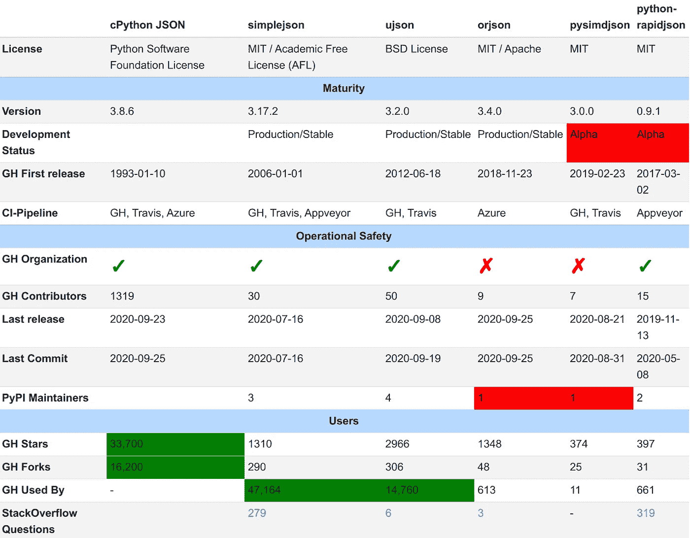
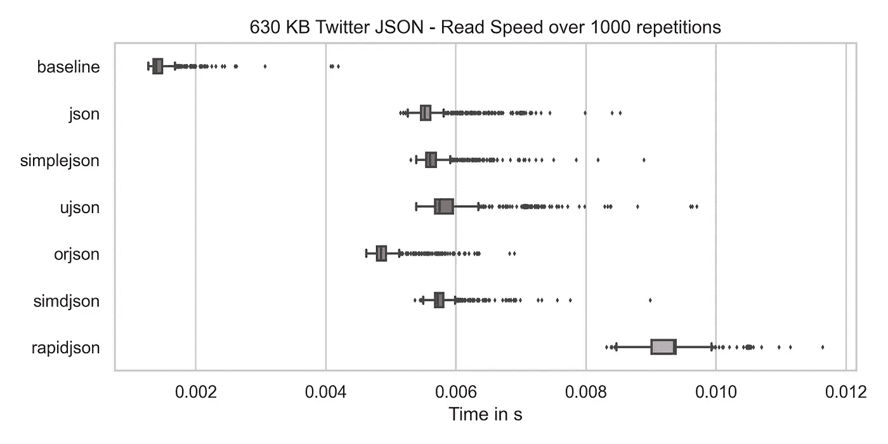
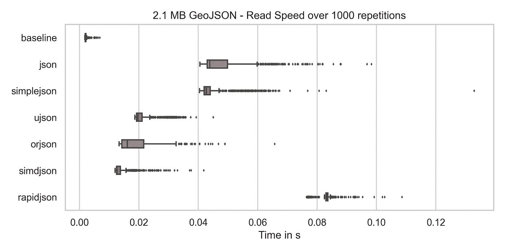
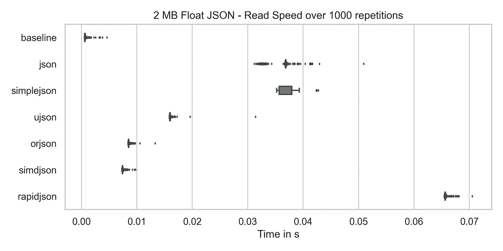
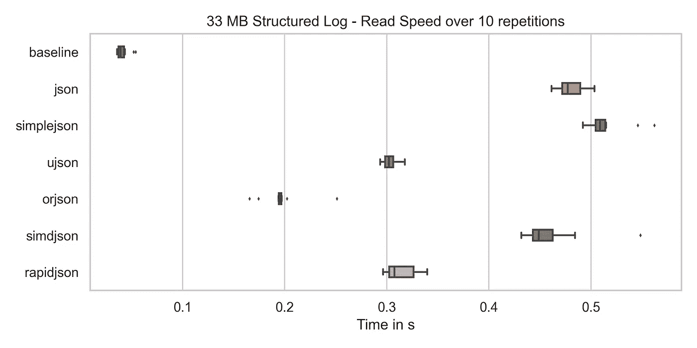
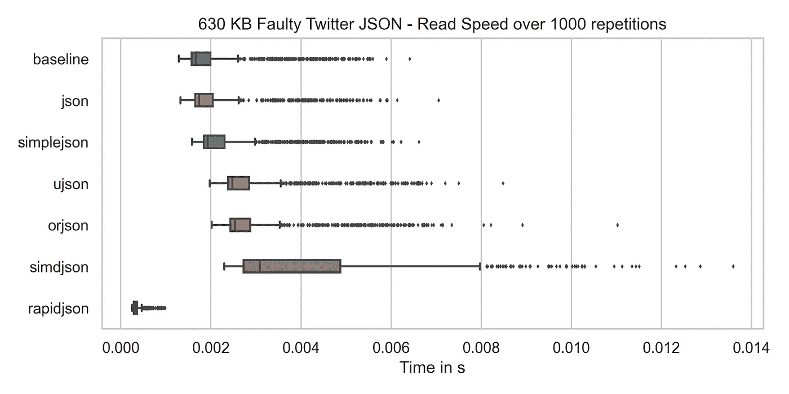
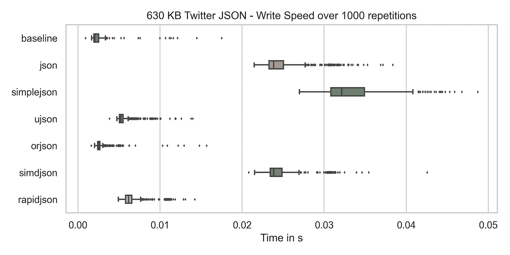
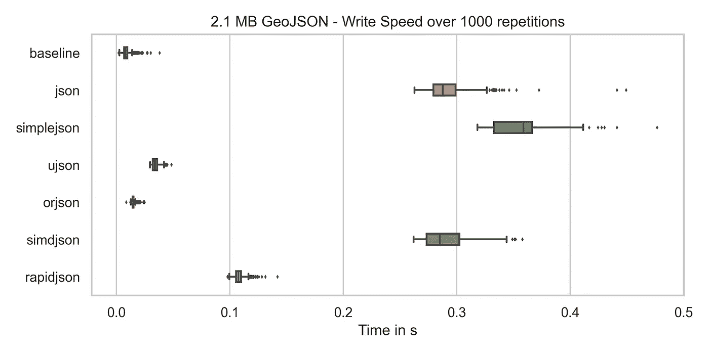
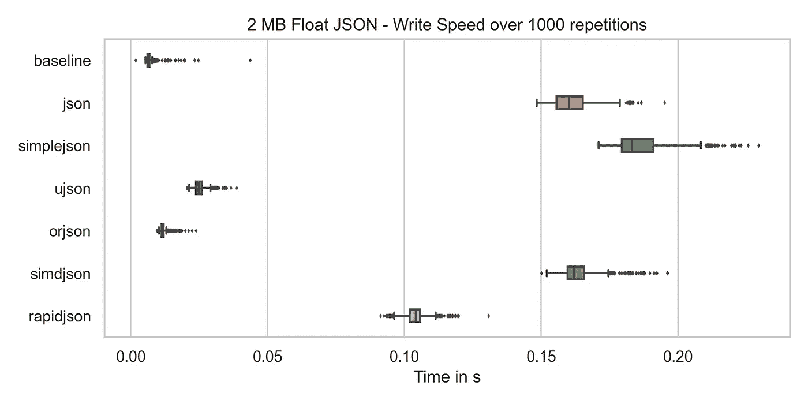
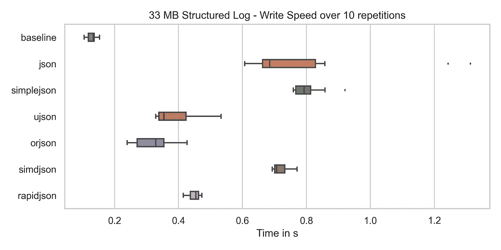

# 用 Python 进行 JSON 编码/解码

> 原文：<https://levelup.gitconnected.com/json-encoding-decoding-with-python-62a2cae63a6a>

## 从速度、成熟度和操作安全性方面比较库


照片由 [chuttersnap](https://unsplash.com/@chuttersnap?utm_source=medium&utm_medium=referral) 在 [Unsplash](https://unsplash.com?utm_source=medium&utm_medium=referral) 上拍摄

SON 是互联网上数据交换的基石。REST APIs 在全世界都使用标准化的消息格式。作为 JavaScript 的一个子集，它从一开始就获得了巨大的推广。事实上，它的语法非常清楚，易于阅读也有所帮助。

JSON 在我所知道的每种语言中都有用于序列化和反序列化的库。在 Python 中，实际上有多个库。在本文中，我将为您比较它们。

# 图书馆

**CPython** 本身有一个`[json](https://docs.python.org/3/library/json.html)`模块。它最初由 Bob Ippolito 开发为`simplejson`，并被并入 Python 2.4 ( [来源](https://docs.python.org/3/whatsnew/2.6.html#the-json-module-javascript-object-notation))。CPython 是在 Python 软件基础许可证下授权的。

simplejson 仍然作为它自己的库存在，你可以通过 pip 安装它。这是一个纯 Python 库，带有可选的 C 扩展。Simplejson 获得了麻省理工学院和学术自由许可(AFL)的许可。

[**ujson**](https://pypi.org/project/ujson/) 是绑定到 C 库[的超 JSON](https://github.com/ultrajson/ultrajson) 。Ultra JSON 由 ESN([an Electronic Arts Inc .](https://techcrunch.com/2012/09/26/electronic-arts-buys-online-gaming-development-studio-esn/)工作室)开发，并根据 [3 条款 BSD 许可](https://tldrlegal.com/license/bsd-3-clause-license-(revised))获得许可。Ultra JSON 在 Github 上有 3k 星，305 叉，50 贡献者，最后一次提交只有 12 天，最后一期是 5 天前开的。听说是在“维护模式”([来源](https://github.com/ultrajson/ultrajson/issues/428#issuecomment-699456053)，表示没有新的开发。

**pysimdjson** 是 C++库 [simdjson](https://github.com/simdjson/simdjson) 的绑定。SIMDjson 得到了加拿大的资助。simdjson 在 Github 上有 12.2k 星，611 叉，63 贡献者，最后一次提交是 11 小时前，最后一期是 2 小时前开的。

**python-rapidjson** 是 C++库 [RapidJSON](https://github.com/Tencent/rapidjson) 的绑定。RapidJSON 由[腾讯](https://en.wikipedia.org/wiki/Tencent)开发。RapidJSON 在 GitHub 上有 9.8k 的星，2.7k 的叉，150 个贡献者，最后一次提交是大约 2 个月前，最后一期是 17 天前开放的。

[**orjson**](https://pypi.org/project/orjson/) 是一个依靠 Rust 来完成重任的 Python 包。

# 成熟度和操作安全性

所有提到的库都适用于基准示例，没有任何问题。切换 JSON 模块并不是什么大不了的事情，但我仍然想知道该模块是否受支持。

CPython、simplejson、ujson 和 orjson 认为自己已经可以生产了。

python-rapidjson 将自己标记为 alpha，但是一个维护者说这是一个错误，很快就会被修复。



图片作者:马丁·托马斯

# 这些问题

解决问题的难易程度的一个指标是提出问题并观察行为如何:

*   [SimpleJSON](https://github.com/simplejson/simplejson/issues/267) :第二天就有回复了。回答清晰、易懂、友好。Bob Ippolito 回答了我——最初开发它的人，在 JSON 模块的 Python 文档中也提到了他！
*   我在 30 分钟内得到了一个清晰、友好、容易理解的答案。@hugovank
*   [ORJSON](https://github.com/ijl/orjson/issues/127):10 天没有反应，然后就被关闭了，没有任何评论。
*   PySIMDJSON:15 天后没有回音。
*   Python-RapidJSON :我在 30 分钟内得到了一个清晰、友好、易于理解的答案。一个[简单的公关](https://github.com/python-rapidjson/python-rapidjson/pull/143)十天之后就合并了。

我从所有项目中得到的一个答案是，它们本质上彼此没有联系。

# 基准

为了正确地对不同的库进行基准测试，我想到了以下场景:

*   **API**:交换信息的网络服务。它可能包含 Unicode 并具有嵌套结构。来自 Twitter API 的 JSON 文件听起来很适合测试这一点。
*   **API JSON 错误**:我很好奇如果 JSON API 格式出现错误，性能会有什么变化。所以我去掉了中间的支架。
*   **GeoJSON** :我第一次看到[geo JSON 格式](https://en.wikipedia.org/wiki/GeoJSON)和[transition Turbo](https://overpass-turbo.eu/)，一个开放的 Streep 地图导出器。您将得到非常大的 JSON 文件，其中大部分是坐标，但也有很多嵌套。
*   **机器学习**:只是一个庞大的浮点数列表。这些可能是神经网络层的权重。
*   **JSON 行**:结构化日志在行业中大量使用。如果您分析这些日志，您可能需要浏览千兆字节的数据。它们都是简单的字典，带有日期时间对象、消息、日志记录器、日志状态，也许还有更多。

## 反序列化速度

我的硬盘速度给出了读取速度的下限。我将它作为基线包含在以下三个图表中。



马丁·托马斯创造形象



马丁·托马斯创造形象



马丁·托马斯创造形象



马丁·托马斯创造形象



马丁·托马斯创造形象

由此得出的结论是:

*   Rapidjson 很慢，但是对于像 twitter.json 这样的小型 json，您不会注意到有什么不同。从结构化日志中可以看出这一点。
*   辛姆德森，奥杰森，乌杰森都快疯了。
*   对于大多数库来说，读取包含结构错误的 JSON 文件同样很快。一个明显的例外是 rapidjson。我猜一旦发现错误，它就会中止读取文件。

## 序列化速度

在本例中，我预先创建了 JSON-String，并测量了将其写入磁盘所需的时间作为基线。



图片作者:马丁·托马斯



图片作者:马丁·托马斯



图片作者:马丁·托马斯



马丁·托马斯创造形象

我由此得出的结论是:

*   奥逊的速度快得惊人。这是超级接近最大化我的硬盘驱动器。ujson 非常接近这一点。
*   rapidjson 速度相当快，但和奥 json 或者 ujson 不是一个级别的。
*   辛姆德森很慢。

# 使用 JSON 的专业工作流程

作为结束语，我想指出一些我有时看到的和我自己写的问题:

*   调用变量`foo_json` : JSON 是字符串格式。如果不是字符串，就不是 JSON。如果你用`bar = json.loads(foo)`反序列化了一个 JSON，那么`bar`就不是 JSON。你可以将`bar`序列化为一个 JSON，它等同于 JSON `foo`，但是`bar`不是 JSON。这是一个 Python 对象。很可能是一本字典。然后你就可以全部搞定了`foo_dict`。
*   到处进行属性检查:如果你收到一个 JSON，把它转换成 Python 对象(例如 dict)并使用它是非常容易的。这对于概念验证代码或非常小的 JSON 字符串来说很好。如果你不把它转换成类似于[数据类](https://docs.python.org/3/library/dataclasses.html)的东西，它会咬你的屁股。

pydantic 是一个非常有用的验证库。您可以使用 JSON-string，用您最喜欢的 JSON 库将它解析为带有字典/列表/字符串/数字/布尔值的 Python 基本表示，然后用 Pydantic 再次解析它。你从中得到的好处是你知道你以后要处理什么。不再仅仅将`Dict[str, Any]`作为[类型标注](https://medium.com/analytics-vidhya/type-annotations-in-python-3-8-3b401384403d)。不再无用的编辑器自动完成。不再检查属性是否存在于你的代码中。

为了包含除默认`json`之外的其他 json 包，我推荐该模式

```
import ujson as json
```

对于烧瓶，您可以使用另一个[编码器](https://flask.palletsprojects.com/en/1.1.x/api/#flask.json.JSONEncoder) / [解码器](https://flask.palletsprojects.com/en/1.1.x/api/#flask.json.JSONDecoder)，如下所示:

```
from simplejson import JSONEncoder, JSONDecoder

app.json_encoder = JSONEncoder
app.json_decoder = JSONDecoder
```

# 请参见

*   [丹尼尔·勒米尔](https://medium.com/u/c087890e7b68?source=post_page-----62a2cae63a6a--------------------------------) : [解析 JSON 真的很快:InfoQ 的经验教训](https://www.youtube.com/watch?v=wlvKAT7SZIQ)
*   [Ng Wai Foong](https://medium.com/u/9d91b858f6e4?source=post_page-----62a2cae63a6a--------------------------------):[orjson 简介](/introduction-to-orjson-3d06dde79208)
*   [尼古拉斯·塞里奥](https://medium.com/u/94828466f99?source=post_page-----62a2cae63a6a--------------------------------) : [解析 JSON 是雷区](http://seriot.ch/parsing_json.php)