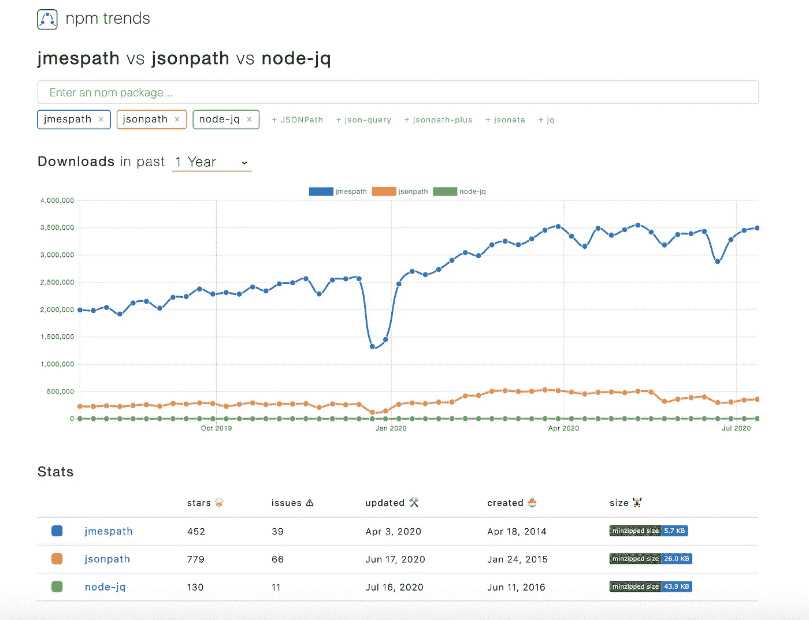

# JSON 查询？使用 JMESPath 增强用户的能力！

> 原文：<https://levelup.gitconnected.com/json-queries-give-your-users-jmespath-power-ef8ab0d38553>

为什么应该将 JSON 查询处理器集成到 API、SDK 或 CLI 中


JSON 可能是当今开放数据交换最常见的格式。尽管 JSON 文档被设计成一种轻量级的类似 JavaScript 对象的格式，但它可能会变得非常大，尤其是当它们包含深度嵌套的对象和数组时。

真正需要的是能够在 JSON 文档上运行一般的处理查询——过滤、整形和转换 JSON 数据。

一些文档数据库，如 MongoDB 和 PostgreSQL，有自己的查询语言，允许在 JSON 上运行复杂的查询，但当我们的 JSON 数据在数据库记录的上下文之外时，这通常是无关紧要的(尽管您可以使用 [MingoJS](https://github.com/kofrasa/mingo) ，一种 MongoDB 查询语言的 JavaScript 实现)。**如果我们能为用户提供这种查询的内置支持会怎么样？**

# 使用案例:

1.  你的软件输出一些 JSON，你想给用户一个简单、标准化的方法来过滤或操作数据(例子:**API、SDK、CLIs、在线游乐场**
2.  您的软件将 JSON 作为输入，并且您希望以统一且可重用的方式以编程方式过滤或操作数据。(想想 JSON 文档，对象数组嵌套了更多的数组和对象)。是的，您可以使用 map、filter 和 reduce 函数编写自己的逻辑，但也许有更好、更具声明性的方法。

这篇文章主要关注第一个用例，您希望**为您的用户提供一个内置选项来处理输出**(但实际上，这两个用例是相似的)。

# JSON 查询语言的候选语言

> **XML 有**[**XPath**](https://developer.mozilla.org/en-US/docs/Web/XPath)**用于查询和遍历 XML 节点。JSON 的等价物是什么？**

## JSONPath

[JSON path](https://www.baeldung.com/guide-to-jayway-jsonpath)——“JSON 的 XPath 是[第一个想到的查询语言](https://goessner.net/articles/JsonPath/)。这是 JSON 查询语言的最早实现之一，它完成了任务。它的一个优点是允许遍历整个 JSON 树(例如，访问父节点)，并且可以将树中的路径位置作为 JSON 指针(嵌套键)输出。

问题是，如果我们希望向用户提供一个基于 JSONPath 的接口，那么 JSON path 的语法并不那么直观。更大的问题是它没有严格的规范，这意味着有许多 JSONPath 的实现可能会给出不同的结果。这使得在很多情况下很难依赖 JSONPath。


# japan quarterly 日本季刊

[**jq**](https://stedolan.github.io/jq/) 是命令行 JSON 处理器，使用强大的 JSON 查询语言。用 jq 你几乎可以做任何事情！一种在 DevOps 人群中流行的通用语言，可能是因为 CLI 很容易通过管道传输另一个进程的输出，然后使用 jq 的管道系统通过附加管道处理格式化的输出。

**但是有两个问题:** jq 是一个命令行工具，而不是我们可以在自己的 API、SDK 等中提供给用户的接口。像 [node-jq](https://github.com/sanack/node-jq) 和 [java-jq](https://github.com/arakelian/java-jq) 这样的库只是 jq 二进制文件的包装器，可能会遇到性能问题，这对实时性能至关重要。其次，强大的功能带来了巨大的复杂性——一些用户声称 jq 是一种太复杂的语言，对我们的用例来说可能是多余的，因为它允许的不仅仅是操纵现有的 JSON。


# JMESPath

[jme path](http://jmespath.org/)是一种针对 JSON 的查询语言，允许对 JSON 文档进行复杂的过滤、提取和转换。与 JSONPath 和 jq 不同，它有完整的规范和精确的语法，所以语法在所有实现中都有很好的定义。它拥有完全兼容的多种语言的库(Java、Python、JavaScript、Go、PHP 等等)。它是一种强大的查询语言，但语法非常简单。

由于这些原因，在将 JMESPath 作为面向用户的接口集成到我们自己的服务中时，它是我们的首选语言。它有一个友好的[游乐场](https://jmespath.org/)和[教程](https://jmespath.org/tutorial.html)，我们可以提供给用户作为参考。

https://jmespath.org/examples.html 的例子可以让你了解这种语言的强大和简单。



[JMESPath、JSONPath 和 JQ 的流行度比较——在 JavaScript / npm 领域](https://www.npmtrends.com/jmespath-vs-jsonpath-vs-node-jq)

# **给用户供电**

多亏了库，将 JMESPath 添加到我们的服务代码非常简单。通过集成 JMESPath，我们现在可以为我们的 API、SDK 或 CLI 用户提供一种强大、简单和标准化的方法来形成从我们的服务返回的 JSON 响应，而不需要外部工具。

例如，我们假设我们的服务是一个公共 REST API。通过让用户能够在数据上指定一个 JMESPath 查询，他们最终节省了时间、网络上的字节数和进行后处理的代码行，因为处理发生在服务器上，并且响应正好包含用户需要的内容。

将 JMESPath 集成到我们的 API 处理程序代码中非常简单，因为这个库只有一个功能(“search”)。下面以 Node.js / JavaScript 为例:

```
const jmespath = require(‘jmespath’);const requestHandler = (req, res, next) => {
    // response res was passed here from previous handler 
    if (req.query && req.query.filter) {
        res = applyJmesPathFilter(res, req.query.filter); 
    } // ...more logic and eventually res.send()
}const applyJmesPathFilter = (res, jmespathExpression) => {
    try {
       res = jmespath.search(res, jmespathExpression) || {}; 
    } 
    catch (e) { 
        res = {}; 
        log.error(e);
    }
    return res;
}
```

这样，用户可以立即使用*过滤器*查询参数指定一个 JMESPath 表达式来处理初始 JSON 结果:

GET /api/players？过滤器= `[JMESPATH_EXPRESSION]`

假设我们的服务输出是 NBA 球员 API，其中存储了一些传奇篮球运动员的信息。一个`GET /api/players`请求返回下面的 JSON 对象数组:

```
[
 {
  "playerId": "7c3f73dd-0b38-48dc-9347-c78811bd80c4",
  "playerName": "Scottie Pippen",
  "yearOfBirth": "1965",
  "collegeId": "77302082-2758-48cc-ab3a-7b811a8bdf80",
  "jerseyNumber": "33",
  "playerStats": {
      "points": 18940,
      "rebounds": 7494,
      "assists": 6135
  },
  "teamNames": [
     "Chicago Bulls",
     "Portland Trail Blazers",
     "Houston Rockets",
     "Chicago Bulls"
  ]
 },
 {
  "playerId": "8d75bb0f-a444-4264-a583-4ca5799169cf",
  "playerName": "Patrick Ewing",
  "yearOfBirth": "1962",
  "collegeId": "0456a17b-320d-4ddc-bfc2-011670af2b77",
  "jerseyNumber": "33",
  "playerStats": {
     "points": 24815,
     "rebounds": 11617,
     "blocks": 2894
  },
  "teamNames": [
     "New York Knicks",
     "Seattle SuperSonics",
     "Orlando Magic" 
  ]
 } 
]
```

因为原始结果是一个数组，所以下面的 JMESPath 表达式以“[]”开头来引用该数组。

`GET /api/players?filter=[].playerName`将返回以下数组:

```
[
  "Scottie Pippen",
  "Patrick Ewing"
]
```

我们也可以改为索要对象，并修改原来的键名:
`GET /api/players?filter=[].{name: playerName, number: jerseyNumber}` 返回:

```
[
  {
    "name": "Scottie Pippen",
    "number": "33"
  },
  {
    "name": "Patrick Ewing",
    "number": "33"
  }
]
```

我们可以基于一个或多个键运行过滤查询，并通过管道将结果格式化(这里是普通字符串):

`GET /api/players?filter=[?yearOfBirth > `1964`].playerName | [0]`回报

```
"Scottie Pippen"
```

以及更高级的逻辑，它使用 sort()和 join()函数:

`GET /api/players?filter=[].playerName | sort(@) | { nbaLegends: join(‘, ‘, @) }`

```
{
  "nbaLegends": "Patrick Ewing, Scottie Pippen"
}
```

用户可以调整结果，使其符合自己的确切需求。例如:

`GET /api/players?filter=[].{name: playerName, firstTeam: teamNames | [0], points: playerStats.points }`

```
[
  {
    "name": "Scottie Pippen",
    "firstTeam": "Chicago Bulls",
    "points": 18940
  },
  {
    "name": "Patrick Ewing",
    "firstTeam": "New York Knicks",
    "points": 24815
  }
]
```

这些只是通过 JMESPath 可用的 JSON 处理选项的一部分。

一些读者可能会注意到，通过使用 GraphQL 可以让用户“准确地获得他们想要的数据”。没错，但这是一个 REST API:)(这个场景可以用 SDK 或 CLI 代替)。事实上，GraphQL 并没有提供像 JMESPath 这样的 JSON 查询语言所提供的处理能力。当然，JSON 处理在初始数据集被完全获取后运行，这不如在 GraphQL APIs 中使用数据访问层上的解析器进行早期过滤有效。

我已经将 JMESPath 集成到一些 [Sisense 公共 REST API](https://sisense.dev/guides/rest/datamodels.v2.html)中，并作为 [GraphQL2REST 包](https://medium.com/swlh/graphql-api-or-rest-api-why-not-have-both-c4171e68900a)中的一个特性。


# 限制

与 jq 和 JSONPath 相比，JMESPath 有一些限制。对我来说，最大的限制是没有简单的方法来获取给定 JSON 文档的路径列表(也称为节点名或 JSON 指针)，并且您不能将键表示为 JMESPath 表达式(以便在满足测试的一组键上运行操作)。递归遍历是不可能的——您必须指定 JSON 键的完整路径。另一个问题是 JMESPath 不允许在迭代时引用父节点。这些限制有时会限制开发人员的使用，但通常不会影响这里讨论的常见用例。

# 额外资源

## 对于冒险者—更多查询语言:

*   [YAQL(又一种查询语言)](https://yaql.readthedocs.io/en/latest/)
*   [rq 查询语言](https://github.com/dflemstr/rq)
*   [JL(JSONλ)查询语言](https://github.com/chrisdone/jl)
*   [glom (Python)](https://glom.readthedocs.io/en/latest/)
*   [对象路径(JavaScript)](https://github.com/mariocasciaro/object-path)

[jp:JMESPath 的命令行接口(CLI)](https://github.com/jmespath/jp)