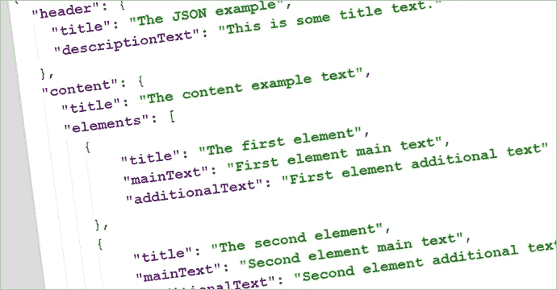
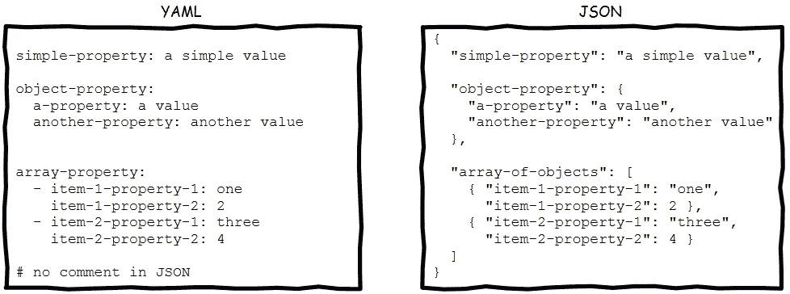
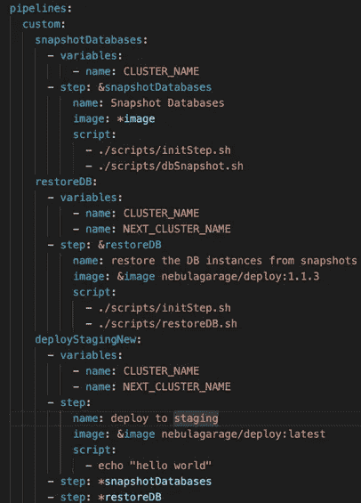

# JSON vs YAML

> 原文：<https://levelup.gitconnected.com/json-vs-yaml-6aa0243aefc6>

## 深入探讨两种流行的数据序列化语言

由 [Unsplash](https://unsplash.com?utm_source=medium&utm_medium=referral) 上的 [vipul uthaiah](https://unsplash.com/@vipul_uthaiah?utm_source=medium&utm_medium=referral) 拍摄的照片

任何对编程和技术感兴趣的人都知道 **JSON** 是什么。 **YAML** 不像 JSON 那么常见，但它也是一种流行且令人敬畏的数据序列化语言。例如，任何使用过 docker 的人都知道 YAML 是什么。

首先，我们来看看什么是数据序列化。根据 [Devopedia](https://devopedia.org/data-serialization) 的说法，数据序列化是将复杂数据结构中的数据对象转换为字节流的过程，以便在物理设备上进行存储、传输和分发。所以 JSON 和 YAML 都是在文件中存储数据对象和结构的方法。

## JSON 是什么？

虽然我们大多数人都知道 JSON 是什么，但是我们还是快速介绍一下。 **JSON** 是 **JavaScript 对象符号的简称。** JSON 基于 JavaScript 编程语言标准 ECMA-262 第三版(1999 年 12 月)的子集。JSON 广泛用于 JavaScript，但是因为它是独立于语言的，所以它可以用于任何编程语言。

JSON 有一个标准的数据存储格式。它以键/值对的形式存储数据。记录用逗号分隔，字段名和字符串都用双引号括起来。

JSON 示例—图片来自[超级文本](https://blog.supertext.ch/en/2016/05/json-file-type-for-trados/)

这里，*【title】*是一个键，*【第一个元素】*是一个值。“元素”键包含一个元素对象数组，而*“内容”*键包含一个数据对象。

## 什么是 YAML？

YAML 是 YAML 不是标记语言的简称。和 **YAML 不是标记语言**是 **YAML 不是标记语言不是标记语言的简称。很酷吧。更有趣的是，YAML 官方网站也以 YAML 格式显示。**

YAML 使用三个破折号(“`**---**`”)来表示文档的开始，使用三个点(“`**...**`”)来表示文档的结束。与 JSON 不同，YAML 像 Python 一样使用缩进来显示数据的级别。在 YAML，键/值对用冒号分隔，列表以连字符开头。此外，YAML 文件在某些地方用扩展名 YML 书写，`.YAML`和`.YML`表示相同的文件类型。

YAML 示例—图片来自 [TechTarget](https://searchitoperations.techtarget.com/tip/Learn-YAML-through-a-personal-example)

这里，*名字*是一个键，*亚当*是一个值。*配偶*指向以*姓名*、*职业*、*兴趣*为子女、*兴趣*为数据数组的数据对象。

## 利弊——JSON vs YAML

从理论上讲，JSON 和 YAML 应该执行同样的任务。它提供了一种人类可读的数据交换格式。

两种格式的相同内容—图片来自[曼宁](https://livebook.manning.com/book/the-design-of-everyday-apis/chapter-4/v-8/13)

***可读性&复杂度***

JSON 的设计目标是尽可能简单，并具有通用性。所以这在一定程度上降低了数据的可读性。相比之下，YAML 的设计目标是提供良好的人类可读格式，并为序列化任意本机数据结构提供支持。因此，这增加了 YAML 文件的可读性，但也使文件的解析和生成变得有些复杂。我们可以在 [YAML 官方网站](https://yaml.org/)中清楚地看到这一点，网站以 YAML 格式显示内容，任何访问该网站的人都很容易阅读。另一方面，如果以 JSON 格式显示，网页就没用了。

据说 YAML 是 JSON 格式的超集。这意味着我们可以使用 YAML 解析器来解析 JSON。然而，在实际场景中，这种解析可能会产生问题，但理论上是可行的。

***系列化性能***

在数据序列化竞赛中，JSON 是赢家，因为它能够以更简单的设计快速轻松地解析 JSON 序列化数据。这使得 JSON 在开发人员中更受欢迎，导致越来越多的原生支持，这再次提高了性能。因此，JSON 已经成为 web 应用程序和 web 服务最广泛使用的数据交换格式。

***社区支持***

对于任何编程语言，我们都可以很容易地找到与该语言集成的 JSON 库，因为它很受欢迎，易于实现，并且非常简单。 [JSON 官方网站](https://www.json.org/json-en.html)列出了许多语言以及许多支持 JSON 的库。YAML 也有广泛的支持和许多库来将其与各种语言集成，但不如 JSON 多。你可以在这里得到支持 YAML 的库和语言列表。

***注释***

到目前为止，我们讨论了 JSON 优于 YAML 的优点。但是 YAML 的一些相当重要的特性是 JSON 所没有的。YAML 支持 JSON 不支持的评论。我们可以用一个简单的#字符在文档的任何地方进行注释。事实证明，在编写配置文件时，开发人员可以使用注释轻松地描述配置，这是非常有利的。因此，YAML 格式在许多技术栈中使用，如 [ElasticSearch](https://www.elastic.co/guide/en/elasticsearch/reference/current/settings.html) 、 [Docker](https://www.docker.com/) 用于存储配置信息。

***使用复杂结构的能力***

YAML 提供的另一个特性是引用其他数据对象的能力。通过这种引用，可以在 YAML 文件中写入递归数据。

参考其他物体—图片来自[亚特兰蒂斯社区](https://community.atlassian.com/t5/Bitbucket-questions/Reuse-other-custom-pipelines-in-one-custom-pipeline/qaq-p/1301118)

为此，我们可以在 YAML 文件中用“ *&* ”定义**锚**，以后用**别名**、 *** 引用它们。这是 JSON 在 YAML 没有提供的一个非常重要的特性。在 JSON 中，用对象引用序列化复杂结构是不可能的。但是 YAML 的上述功能解决了这个问题。但这样做的一个缺点是在某些转换器中可能会出现无限循环。

因此，从以上几点，我们可以看出，JSON 和 YAML 都有各自的优势和劣势。一个好的开发者应该能够识别这些，并在正确的地方使用正确的格式。

我希望你从我的文章中有所收获。希望尽快带来更多文章。感谢您的阅读。干杯。

## 资源

*   [*YAML 官方网站*](https://yaml.org/)
*   [*JSON 官方网站*](https://www.json.org/json-en.html)
*   [*来自 Devopedia*](https://devopedia.org/data-serialization) 的数据序列化