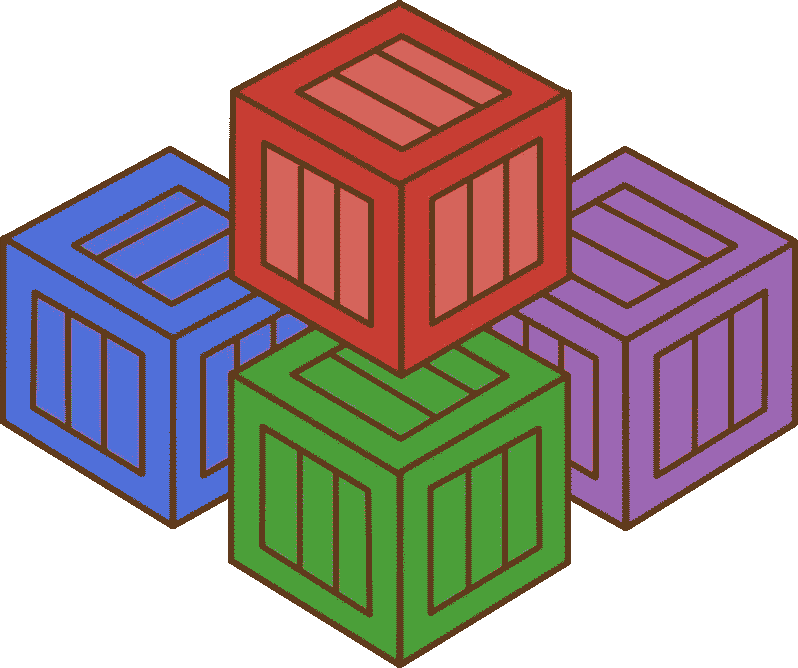

# 朱莉亚假人艺术品

> 原文：<https://levelup.gitconnected.com/julia-artifacts-for-dummies-f2eef4fc193a>

## 一个聪明的系统，使图像，二进制文件，训练集和其他数据可以在你的软件包中匹配你的架构。



O 凯我承认，当我阅读[茱莉亚神器文档](https://julialang.github.io/Pkg.jl/v1/artifacts/)的时候，我对很多事情都很困惑。如果你是一个聪明的人，谁能想出它，那么恭喜你，你不需要进一步阅读。

我们其余的人需要更多关于工件的介绍和背景，以及更详细的 API 和用法的演练。这就是我希望在这里提供的。我也将涵盖我最初的误解，希望你可能有同样的想法，我可以向你澄清其中的一些。

在我们开始之前，让我快速提示一下我们正在谈论的内容。工件在 Julia 中以一个模块的形式存在于名为`Pkg.Artifacts`的`Pkg`模块中。您可以通过以下方式访问 REPL 中的功能:

```
julia> using Pkg.Artifacts
```

提供`artifact_toml`、`artifact_path`、`artifact_exists`等功能。我们稍后会详细讨论这些内容。

与此相结合，工件还向您的源代码仓库添加了另一个文件:

```
Foobar
├── Artifacts.toml        # Stores info about artifacts
├── Manifest.toml
├── Project.toml          # Direct package dependencies
├── src
│   └── Foobar.jl         # Defines Foobar module
└── test
    ├── Manifest.toml
    ├── Project.toml       # Package dependencies for tests
    ├── runtests.jl        # Contains your tests
```

除此之外，工件不会给你的实际源代码包增加太多，这就是问题的关键。但是，要理解为什么，让我们退一步，看看大局。

# 我们不能把所有数据都放在 Git Repo 中吗？

如果将图像、二进制文件、数据集和类似的数据放入 git 仓库是没有痛苦和问题的，我们可能根本不需要工件。

然而，git 不是为二进制数据而设计的。因此，将这种数据放入源代码存储库很容易使其膨胀。第二个问题是，对于二进制文件来说，空间需求会变得非常快。想象一下，你依赖于 Qt 库、OpenCV、VTK 或任何其他 C++怪物项目。为每一个平台编译一个版本，32 位、64 位和许多其他版本，并把它放在你的源代码库中会带来灾难。它会占用太多的空间。

# 工件解决的问题

有了工件，原则上多个包可以使用相同的数据，你不需要下载两次。说包 A 和包 B，都依赖于 Qt 库。这个问题的虚拟解决方案是让两个库都存储一个 Qt:

```
A
└─ libs
    └── Qt 

B
└─ libs
    └── Qt
```

但是现在我们不得不两次下载一个巨大的库，我们在硬盘上吸收了两倍的空间。所以不是一个好的解决方案。现在其他人可能认为他们很聪明，将 Qt 存储在一个共享目录中，供两个包使用。各种操作系统很早就这样做了，并创造了我们称之为“DLL 地狱”的有趣的东西。当所需的 Qt 版本不完全相同时，就会出现这种情况。下载的 Qt 版本可能适用于 A，但不适用于 b。

## 内容可寻址数据

Git 推广了一种解决这个难题的方法，叫做*内容寻址*数据。这意味着不要通过给出名称路径如`A/libs/Qt`来定位数据，而是使用有趣的路径如:

```
7c9ef733699a1d86b8a6073ed08a4457e3e790f7/Qt
```

什么鬼东西？那些难看的数字是干什么用的？这些是存储在。哈希是通过对组成某些数据的所有字节运行算法而产生的固定长度的字符串。在这种情况下，Qt 库二进制文件的每一个字节都被输入到一个散列算法中，它产生一个惟一的数字，即散列。从理论上讲，你当然不能保证两个数据集产生不同的散列。这个真的是基于概率的。不同的数据集产生相同散列的机会类似于地球上随机位置的两个人捡起相同的一粒沙子。这可能发生，但可能性不大。

这个系统的美妙之处在于你可以避免下载两次完全相同的数据。Julia 跟踪您的主目录中的所有软件包信息。看起来是这样的:

```
$ cd ~/.julia
$ ls
artifacts/    compiled/     config/       environments/ packages/     registries/
clones/       conda/        dev/          logs/         prefs/
```

这里要注意的是，工件不是存储在它们所属的包下，而是存储在`artifacts`目录中:

```
> ls ~/.julia/artifacts/
0c063b1aef124b99659e1604675f2dce871e7e97
0eb6ffcbe0cde10007a2678013611da80643b728
6b04ad7f71b1a29adad801f4fdd0d34b3535c638
```

我们可以打开其中一些看看里面有什么:

```
$ ls ~/.julia/artifacts/6b04ad7f71b1a29adad801f4fdd0d34b3535c638
bin include lib logs    share

$ ls ~/.julia/artifacts/6b04ad7f71b1a29adad801f4fdd0d34b3535c638/lib/
engines-1.1     libcrypto.a     libssl.1.1.dylib    libssl.dylib
libcrypto.1.1.dylib libcrypto.dylib     libssl.a        pkgconfig
```

正如你所看到的，这恰好是某个包所依赖的加密库。每个依赖于这个加密库的包都会有一个`Artifacts.toml`文件，说明加密库有 hash `6b04ad7f71b1a29adad801f4fdd0d34b3535c638`。然后，Julia 包系统可以通过检查具有该散列的目录是否已经存在来检查它是否已经安装了这个库，并且避免第二次下载同一个库。

请记住，这不只是针对二进制文件。这也可能是一个大图像，或者大规模的机器学习训练数据集。你不想下载这些超过一次。

## 避免 Git Repo 膨胀

工件的第二个问题是，它们避免了用二进制文件膨胀您的 repo。假设你有一个`Comics`包，里面有展示漫画的代码。不是在你的包 repo 中放一个目录`super-heroes`和每个超级英雄的图像，而是创建一个`Artifacts.toml`文件。在里面你描述了超级英雄的照片是在哪里找到的:

```
# Comics/Artifacts.toml 
[super-heroes]
git-tree-sha1 = "c5f4d31e5c9c5d6fba2469ceff3d9916050d92d2"
lazy = true

    [[super-heroes.download]]
    sha256 = "2aea399ab3c6b6e3a4285ec6ae31b858803442bf1b3e3e4889a2e3e8287d56c6"
    url = "https://github.com/jimmy/Comics.jl/releases/download/super-heroes.tar.gz"
```

假设你有一个朱莉娅的项目。通常你会像这样加载超级英雄图像文件:

```
path = joinpath("super-heroes", "batman.png")
# equivalent to: path = "super-heroes/batman.png"
batman_img = load(path)
```

但是使用伪像，你不能假设图像是局部的。相反，你应该写:

```
using Pkg.Artifacts

path = joinpath(artifact"super-heroes", "batman.png")
batman_img = load(path)
```

`artifact"super-heroes"`部分是一个宏。这导致 Julia 在解析时运行代码，下载工件。如果`Artifacts.toml`文件中有`lazy = true`，那么这个工件只有在这样访问的时候才会被下载。这避免了下载超过用户实际使用的量。

在运行时,`artifact"super-heroes"`表达式返回工件的本地路径，因此您可以加载它。

您可以用更多的手动方式来完成这项工作。下面是一些朱莉娅·REPL 的代码来证明这一点:

```
julia> super_hash = artifact_hash("super-heroes", "Artifacts.toml")
SHA1("c5f4d31e5c9c5d6fba2469ceff3d9916050d92d2")

julia> basepath = artifact_path(super_hash)
"~/.julia/artifacts/c5f4d31e5c9c5d6fba2469ceff3d9916050d92d2"

julia> path = joinpath(basepath, "batman.png")
"~.julia/artifacts/c5f4d31e5c9c5d6fba2469ceff3d9916050d92d2/batman.png"
```

请注意，这里没有太多的魔法。你可以做一个看起来像这样的“包”来让它工作:

```
$ tree Comics
Comics/
└── Artifacts.toml
```

各种工件函数实际上只是在读取`Artifacts.toml`文件。当然，由于我们没有在给定的 URL 中放入任何`.tar.gz`文件，也没有在`~/.julia/artifacts`目录中放入任何东西，我们当然不能加载任何东西。

# 创建 Artifacts.toml 文件

创建一个`Artifacts.toml`文件最初让我很困惑。我不明白:

1.  `git-tree-sha1`中的 SHA1 哈希来自哪里？我需要运行一些命令来创建它吗？
2.  `sha256`散列来自哪里，为什么有两个散列？

最初我认为`git-tree-sha1`与我的存储库上的提交散列有某种关系。我太纠结于 git 这个名字了。但是放弃这个想法。工件不是 git 仓库。藏物只是一个文件。通常它是一个`.tar.gz`文件。这样你就可以收集一些资源，比如超级英雄的图片目录，然后打包。

基本上，`Pkg.Artifacts`模块的目的不仅仅是在设置好一切后访问工件。这也意味着您可以使用它来创建`Artifacts.toml`文件。许多包包含 Julia 脚本，这些脚本在`Artifacts.toml`文件中填充正确的信息，并负责将工件在线上传到正确的位置。

我最初对这些脚本的误解是，我以为它们是在软件包安装期间运行的。但是，这些脚本是由包的创建者运行的。他们甚至不需要成为包装的一部分。这是你的选择。这样做只是方便。

## git-tree-sha1

在`Pkg.Artifacts`模块中，我们使用`create_artifact`函数为包含要放入工件的所有文件的目录实际生成一个 SHA1 散列。

```
julia> create_artifact() do dir
           @info "storage dir: " dir
       end
┌ Info: storage dir:
└   dir = "~/.julia/artifacts/jl_l4XQEX"
SHA1("4b825dc642cb6eb9a060e54bf8d69288fbee4904")
```

可以看到，它创建了一个名为`jl_l4XQEX`的临时目录，用于放置要哈希的文件。如果目录是空的，你可以看到我们得到了`"4b825dc642cb6eb9a060e54bf8d69288fbee4904"`散列。这当然毫无意义。我们想把一些真实的文件放进去。让我们制作一些文件。

```
$ mkdir data
$ echo "hello world" > data/hello.txt
$ echo "how do you do?" > data/howdy.txt
```

这些原则上可以放在任何地方。接下来我们使用`create_artifact()`为包含这两个文件的目录生成一个散列:

```
julia> hash = create_artifact() do dir
           cp("data/hello.txt", joinpath(dir, "hello.txt"))
           cp("data/howdy.txt", joinpath(dir, "howdy.txt"))
       end
SHA1("604c1a4760bd32fbb9758a84c1507a117252e688")
```

此时，您可以看到文件已存储在正确的工件哈希下:

```
julia> artifact_path(hash)
"~/.julia/artifacts/604c1a4760bd32fbb9758a84c1507a117252e688"

julia> readdir(artifact_path(hash))
2-element Array{String,1}:
 "hello.txt"
 "howdy.txt"
```

## Tarball SHA256 哈希

接下来，我们想以某种方式上传这些文件。原则上，这些文件可以以任何方式打包，我们希望确保下载的`.zip`、`.tar`或`.tar.gz`文件没有被篡改。因此，我们获取了压缩 tarball 的散列，因为原则上这可能与 git 树 SHA1 完全不同，后者涉及未打包文件的散列。

```
julia> tarball_hash = archive_artifact(hash, "data.tar.gz")
"7bd1483bc31fd3cd885a6b3c8f953af5815ac7729593bde29c6cdec9ca16268e"
```

`archive_artifact`函数获取与给定散列相关联的工件目录中的内容，并以给定的文件名路径创建压缩存档。它会对结果 tarball 执行常规的 SHA256 散列。可以在 shell 中验证:

```
shell> ls
Artifacts.toml  data        data.tar.gz

shell> shasum -a 256 data.tar.gz
7bd1483bc31fd3cd885a6b3c8f953af5815ac7729593bde29c6cdec9ca16268e  data.tar.gz
```

我们还可以列出 tarball 的内容，看看它是否确实包含存储在工件目录中的两个文件。

```
shell> tar -tf data.tar.gz
./
./howdy.txt
./hello.txt
```

## 将详细信息写入工件. toml

现在我们已经得到了所有的散列，我们原则上可以将相关信息填入`Artifacts.toml`文件。您还需要一个 URL，用于存储`data.tar.gz`文件。

```
julia> bind_artifact!("Artifacts.toml", "hi", hash,
          download_info=[("http://howdy.com/data.tar.gz", 
                          tarball_hash)])
```

这将一个名为`hi`的人工产物放入`Artifacts.toml`文件，其中包含唯一标识该人工产物的 SHA1 散列`hash`。此外，它还规定该软件包的用户将从`http://howdy.com/data.tar.gz` URL 下载这个`hi`工件。它还将此上传文件的 SHA256 哈希记录为`tarball_hash`。因此，当用户下载该文件时，系统可以验证其具有相同的散列。

让我们看看`Artifacts.toml`现在的样子:

```
shell> cat Artifacts.toml
[hi]
git-tree-sha1 = "604c1a4760bd32fbb9758a84c1507a117252e688"

    [[hi.download]]
    sha256 = "7bd1483bc31fd3cd885a6b3c8f953af5815ac7729593bde29c6cdec9ca16268e"
    url = "http://howdy.com/data.tar.gz"

[super-heroes]
git-tree-sha1 = "c5f4d31e5c9c5d6fba2469ceff3d9916050d92d2"
lazy = true

    [[super-heroes.download]]
    sha256 = "2aea399ab3c6b6e3a4285ec6ae31b858803442bf1b3e3e4889a2e3e8287d56c6"
    url = "https://github.com/jimmy/Comics.jl/releases/download/super-heroes.tar.gz"
```

想要掌握这些数据的人现在可以使用:

```
julia> hi_hash = artifact_hash("hi", "Artifacts.toml")
SHA1("604c1a4760bd32fbb9758a84c1507a117252e688")

julia> artifact_path(hi_hash)
"~/.julia/artifacts/604c1a4760bd32fbb9758a84c1507a117252e688"
```

当然，使用的快捷方式是`artifact"hi"`，但这将尝试从`http://howdy.com/data.tar.gz`下载，我没有在那里存储任何东西。

如果你想测试这个下载是如何工作的，你可以简单地把 URL 指向一个本地文件位置。因为您正在更改记录在`Artifacts.toml`文件中的内容，所以您需要指定`force=true`。

```
julia> bind_artifact!("Artifacts.toml", "hi", hash, download_info=[("file:/home/steve/dev/Comics/data.tar.gz", tarball_hash)], force=true)shell> cat Artifacts.toml
[hi]
git-tree-sha1 = "604c1a4760bd32fbb9758a84c1507a117252e688"[[hi.download]]
    sha256 = "7bd1483bc31fd3cd885a6b3c8f953af5815ac7729593bde29c6cdec9ca16268e"
    url = "file:/home/steve/dev/Comics/data.tar.gz"
```

在这个例子中，我们假设你的漫画包存储在`/home/steve/dev`下。将其替换为硬盘上的有效路径，然后`artifact"hi"`将在第一次访问时从该位置“下载”。

# 工件示例

如果您想了解所有这些是如何组合在一起形成实际的工件脚本的，您可以查看一下 [ObjectDetector.jl](https://github.com/r3tex/ObjectDetector.jl/blob/master/dev/artifacts/generate_artifacts.jl) 包中工件的使用。

还在官方文档中，有[这个例子](https://julialang.github.io/Pkg.jl/v1/artifacts/):

```
using Pkg.Artifacts

artifact_toml = joinpath(@__DIR__, "Artifacts.toml")
iris_hash = artifact_hash("iris", artifact_toml)

if iris_hash == nothing || !artifact_exists(iris_hash)
     iris_hash = create_artifact() do artifact_dir
        iris_url_base = "https://archive.ics.uci.edu/ml/machine-learning-databases/iris"
        download("$(iris_url_base)/iris.data",
                 joinpath(artifact_dir, "iris.csv"))
        download("$(iris_url_base)/bezdekIris.data", 
                 joinpath(artifact_dir, "bezdekIris.csv"))
        download("$(iris_url_base)/iris.names", 
                 joinpath(artifact_dir, "iris.names"))
    end

    bind_artifact!(artifact_toml, "iris", iris_hash)
end

iris_dataset_path = artifact_path(iris_hash)
```

这个脚本可以多次运行，因为它检查工件是否已经存在。这是一个将 iris 数据集作为工件提供的例子。

# 处理二进制文件

当处理二进制文件时，我们需要一种不同的方法，因为与在不同类型的计算机上运行不同操作系统的人相比，您的机器的架构和您运行的操作系统需要不同的二进制文件。

这将在我的下一个故事中讲述:[Julia Binary Artifacts for Dummies。](https://erik-engheim.medium.com/julia-binary-artifacts-for-dummies-7c80955604ea)

在这种情况下，每个工件都有多个散列。每个操作系统和架构组合一个。理解这一点有助于理解朱莉娅 JLL 包如何工作。