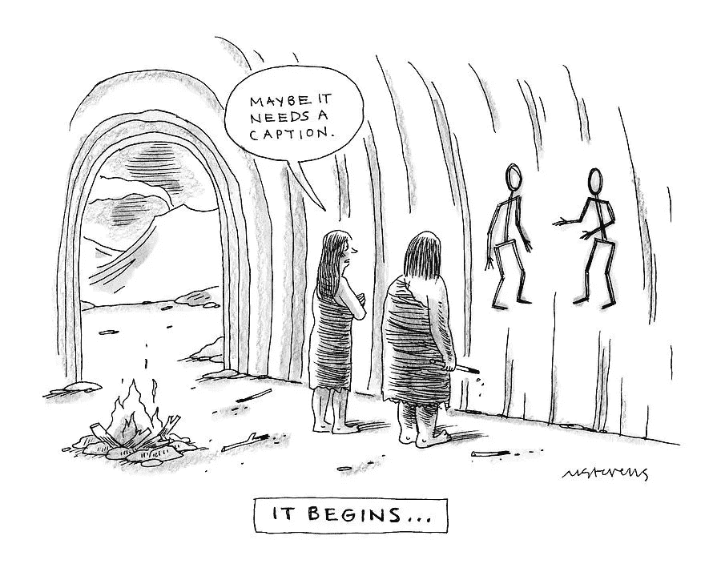
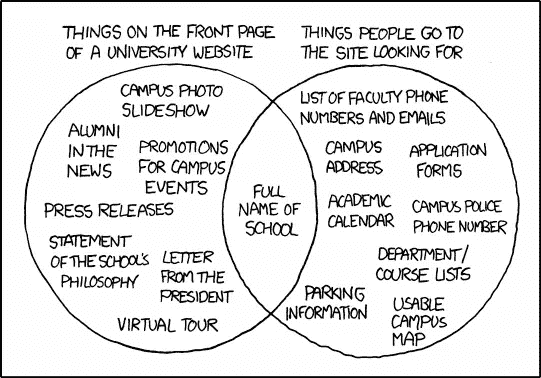

# 少年开发者:不要让我思考！

> 原文：<https://levelup.gitconnected.com/junior-devs-dont-make-me-think-6bfdbddc78f3>

## 史蒂夫·克鲁格经典 UI/UX 指南的 5 个要点

苏珊·尹在 [Unsplash](https://unsplash.com?utm_source=medium&utm_medium=referral) 上的照片

Web 开发的世界变化很快。新技术似乎每天都在涌现，新趋势几乎同样频繁地出现在你的新闻提要中。你今年应该学 React 吗？扑？一些机器学习？现在围棋不是很火吗？

> 虽然技术和趋势可以在一夜之间改变，但许多核心设计原则保持不变。

说到底，你的用户并不在乎你用的是什么框架；**你的用户想不假思索地浏览你的产品。**

作为初级开发人员，很容易迷失在大量想要学习的东西中。但最终，你的技术对用户来说并不重要；如果使用您的应用程序就像在迷宫中导航，那么人们不会使用它。他们会转移到下一个人的应用上，这个应用与他们的相似，也更容易使用。

史蒂夫·克鲁格的“不要让我思考”是 UI/UX 原则的经典金矿。它简洁、实用，非常实际。

你应该马上停止阅读这篇博文，去图书馆借阅。

…如果你还在读这本书(而不是你应该读的那本书)，这里有 5 条建议可以让你有所收获。

## 1.不要让我思考

照片由[小商业极客](http://www.smallbizgeek.co.uk)拍摄

没错，就是标题。是的，它应该是不言自明的。不，它并没有被所有的开发者所接受。所以还是要说说。

当你设计你的应用程序时，你应该不断地问自己:“我怎样才能使它尽可能直观？我如何才能让我的用户不再浪费时间去考虑如何找到东西，让他们更多地考虑我的产品？”

正如 Steve 所说，您的应用程序应该易于导航，以至于…

> “……你的隔壁邻居，对你网站的主题不感兴趣，而且几乎不知道如何使用后退按钮，可能会看着你的主页说‘哦，这是一个 _ _’"

logo 应该放在哪里？**左上角。**

我的按钮文本应该是“Jobs”还是“Exciting Job-O-Rama”？**工作岗位。**

我应该如何描述？去掉每页一半的单词，然后去掉剩下的一半。

是的，这可能听起来很基本。但是如果你把基本的东西弄错了，那么你就把房子建在了沙子上，而不是石头上。

现在跟我说:**不要。制造。我。想想吧。**

## 2.像用户一样思考——你正赶着去参加足球训练

阿萨埃尔·培尼亚在 [Unsplash](https://unsplash.com?utm_source=medium&utm_medium=referral) 拍摄的照片

作为开发人员，您对您的应用程序了如指掌。你可以在睡梦中驾驶它，你知道哪里有窃听器，你花了几个小时在每一个角落。

新闻快讯:你的用户可能没有在你的网站上花太多时间。你的用户可能不会坐在办公桌前给你的应用程序 100%的注意力。*你的用户可能正在星巴克排队时快速访问你的网站，给朋友发短信，试图及时看到他们孩子的足球训练。*

用户行为受到许多因素的影响，包括分心、匆忙和多年的不良网络习惯。当你知道用户有多频繁地浏览你的网站时，你可能会感到惊讶。“点击这里，不，返回。点击那里，不，再返回。点这里，啊对，知道了！”

好消息是，多年的不良网站已经训练用户在互联网上快速试错。坏消息是，人们对不良网站越来越没有耐心；如果他们不能很快找到他们想要的，他们会毫不犹豫地离开你去另一个网站。

那么如何为赶时间的人设计应用呢？

首先:

*   导航条项目和页面标题应该简短且具有描述性。
*   应该非常清楚某个东西是否是可点击的。
*   图案、图像和图形应该是微妙的。他们应该帮助用户找到他们想要的，而不是分散他们的注意力。
*   不要多此一举。你关于把搜索栏放在 logo 里面的聪明想法会让在星巴克排队的同时处理多项任务的人感到困惑。

## 3.你不能管理你不测量的东西——可用性测试

照片由[斯科特·格雷厄姆](https://unsplash.com/@sctgrhm?utm_source=medium&utm_medium=referral)在 [Unsplash](https://unsplash.com?utm_source=medium&utm_medium=referral) 上拍摄

可用性测试是构建高质量应用程序的关键步骤。你可能会想，“我是一名开发人员，我不需要关心可用性测试。”也许运行测试会话是其他人的工作描述，但是理解基本的“是什么”和“为什么”只会帮助你。

Steve Krug 概述了一个关于可用性测试的重要性以及如何有效运行的速成课程。需要注意的第一点是，每个项目一次会议是不够的。**可用性测试会议应该在整个开发过程中相对频繁地进行。**

可用性测试的目的不是找出你的应用程序的所有问题。相反，目标应该是找到最重要的问题，并强调你应该如何分配你有限的时间和努力。

史蒂夫强调了可用性测试的五个常见误区:

*   我们没有时间了。 *假的。*测试不需要花费很长时间，当你不需要重做大量的工作时，它可以为你节省大量的时间。
*   **我们没有钱。** *假。测试不需要花费数千美元。几百块就能轻松搞定。通过志愿者进行免费的可用性测试也是完全可以接受的，并不少见。*
*   我们没有这方面的专业知识。 *假。可用性测试不是火箭科学。如果你花 20 分钟阅读 Steve 关于测试的章节，你可以进行一次有意义的会议。*
*   我们没有可用性实验室。 *也许是真的，但无关紧要。你不需要实验室或任何其他花哨的设备。一张桌子、一台电脑和一杯免费的咖啡就足够了。或者这几天，只是一个缩放帐户。*
*   我们不知道如何解释这些结果。 *不能接受。这就像说我们没有预算，因为我们不是财务专家。用户反馈的好处是问题对所有观察者来说都是显而易见的。*

## 4.让你的代码走出石器时代——让它变得可访问

照片由[元艺术](https://fineartamerica.com/art/meta)

在 21 世纪 20 年代，编写不可访问的代码是完全不可接受的。

> “除非你决定一概而论，认为残疾人不是你的受众，否则你真的不能说你的网站是可用的，除非它是可访问的。”史蒂夫·克鲁格

有时候，开发人员听到“让你的网站具有可访问性”，他们会说“我必须做更多的工作”和“我必须妥协我的设计”。但事实是，如果做得好，让你的网站更容易访问，可以让你的网站体验对每个人都更好。

由于网页可访问性经常被推到次要位置，这里有一些低挂的可访问性果实，你可以很快解决。

*   给每张图片添加适当的替换文字。这确实是你能做的最起码的事情。
*   正确使用标题。如页面标题或主要内容的< h1 >，主要部分的< h2 >，副标题的< h3 >等。然后用 CSS 随心所欲的样式化。
*   让你的表单与屏幕阅读器一起工作。使用<标签>元素将字段与其文本标签关联起来，这样人们就知道他们应该输入什么。
*   在文本和背景之间形成明显的颜色对比。这条原则在网上经常被违反，但这并不意味着它是正确的。

专业提示:【webaim.org】的[是一个极好的资源，可以提供从选择调色板到编写高质量的替代文本的所有辅助功能。](http://webaim.org)

## 5.甜蜜的家？

xkcd.com[的“大学网站”](http://xkcd.com)

来说说你的主页吧。你的主页要承担很多责任的重量。如果搞砸了，你的用户可能不会体验到你的应用的核心功能就离开了。

史蒂夫·克鲁格说主页需要立即回答四个问题:

> 这是什么？
> 
> 我在这里能做什么？
> 
> 他们这里有什么？
> 
> 为什么我应该在这里——而不是别的地方？

你的应用程序越大，你的主页就要做出越大的妥协。你的主页不能突出每一个功能、文章和位置不佳但令人印象深刻的图表。你的主页必须传达大局。

在现实世界中，人们普遍认为，当你遇到某人时，你只有三秒钟的时间来留下印象。

你的主页通常会给用户留下第一印象，所以它应该简单，有吸引力，易于导航，并且清楚地描绘出你的网站的全貌。

## 你最好的作品可能会被忽视——这是件好事

在体育界，裁判的处境特别艰难。当他/她说一个糟糕的游戏时，每个人都会注意到并失去理智。在一个裁判最好的一天，当他/她宣布一场完美的比赛时，没有人会注意到他们。

我把 UI/UX 设计比作一个裁判。如果你的应用程序设计得很差，每个人都会知道有什么不对劲。如果你为你的用户设计了一个干净、简单的体验，你的用户永远不会停下来考虑你。但没关系，这是你想要的。

> 用户应该毫不费力地浏览你的应用程序。

现在，去你的图书馆看看史蒂夫·克鲁格的《不要让我思考》。或者[抓取你自己的副本](https://www.amazon.com/Dont-Make-Think-Revisited-Usability/dp/0321965515/ref=sr_1_1?dchild=1&keywords=don%27t+make+me+think&qid=1601139901&sr=8-1)并保存起来以备将来参考。你不会后悔的。