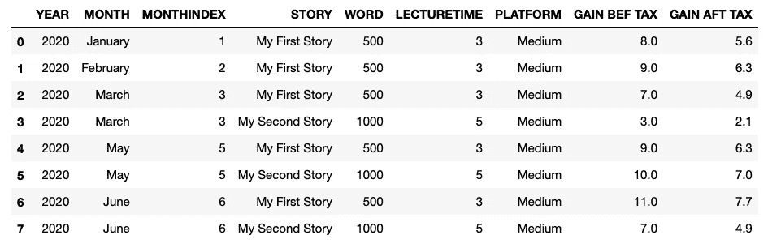
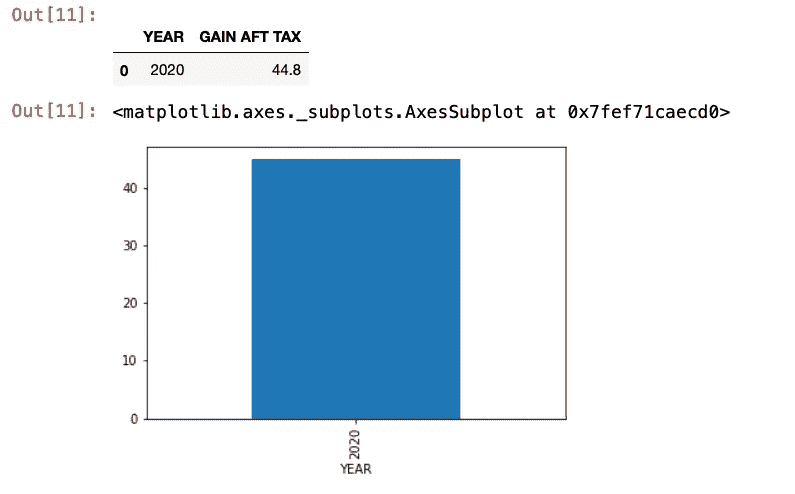
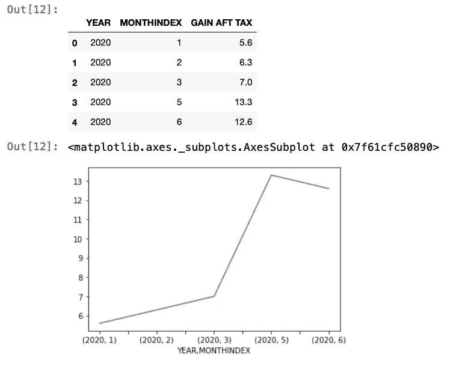

# Jupyter +中等收入:一个分析

> 原文：<https://levelup.gitconnected.com/jupyter-medium-earning-an-analysis-11b6f6e8e7fc>


艾萨克·史密斯在 [Unsplash](https://unsplash.com?utm_source=medium&utm_medium=referral) 上拍摄的照片

我喜欢统计学。我喜欢数字和图表。因此，当我开始写一些文章并在媒体上发表时，我认为有一些这样的统计数据会很好。

我不喜欢 Excel。这是一个伟大的工具，我相信是最好的创造之一，但我不特别喜欢使用它。可能因为我是从数据库管理员做起的吧，不知道。

在我开始写作的同时，我发现了一个新工具:JUPYTER。

Jupyter 是一个基于 web 的集成开发环境，用于 Python 和许多其他语言。它主要被数据科学家用来分析数据和快速显示结果。

你可以在网上找到很多关于 Jupyter 和他们笔记本的文档。

我们将看到如何用一个来分析你可能从 Medium 中获得的收益。

首先，我们需要定义我们将要使用的数据。

先说痛苦的那个，税率。

```
Tax = 0.7
```

然后我们需要有我们正在出版的故事。

```
class Stories(Enum):
    STORY_1_TITLE = Story("My First Story", 500, 3)
    STORY_2_TITLE = Story("My Second Story", 1000, 5)
```

第一个参数是题目，第二个是字数，第三个是讲课时间。

最后，我们需要输入每个故事的月收益。

```
gains = [
    Gain(Stories.STORY_1_TITLE, Platform.Medium, Month.January, 2020, 8.00),
    Gain(Stories.STORY_1_TITLE, Platform.Medium, Month.February, 2020, 9.00),
    Gain(Stories.STORY_1_TITLE, Platform.Medium, Month.March, 2020, 7.00),
    Gain(Stories.STORY_2_TITLE, Platform.Medium, Month.March, 2020, 3.00),
    Gain(Stories.STORY_1_TITLE, Platform.Medium, Month.May, 2020, 9.00),
    Gain(Stories.STORY_2_TITLE, Platform.Medium, Month.May, 2020, 10.00),
    Gain(Stories.STORY_1_TITLE, Platform.Medium, Month.June, 2020, 11.00),
    Gain(Stories.STORY_2_TITLE, Platform.Medium, Month.June, 2020, 7.00)
]
```

这很简单。你有了故事，有了平台，有了月份，有了年份，最后有了收获的金额。*金额为税前。*

# 熊猫+ MATPLOTLIB

我们将使用 pandas 进行计算，使用 matplotlib 进行图形显示。

## 步骤 1-我们创建熊猫数据框。

```
myData = []
for gain in gains:
    ligne = []
    ligne.append(gain.year) # We get the year
    ligne.append(gain.month.name) # We get the month
    ligne.append(gain.month.value) # We get the month index
    ligne.append(gain.story.value.title) # We get the story
    ligne.append(gain.story.value.words) #We get the word count
    ligne.append(gain.story.value.lectureTime) #We get the length
    ligne.append(gain.platform.name) #We get the plateform
    ligne.append(gain.gain) # Gain before tax
    ligne.append(gain.gain * Tax) # Gain After tax
    myData.append(ligne)dataFrame = pd.DataFrame(myData, columns=["YEAR","MONTH","MONTHINDEX","STORY","WORD","LECTURETIME","PLATEFORM","GAIN BEF TAX","GAIN AFT TAX"])
```

现在我们有了一个表格中的所有数据。



## 第 2 步—每年的收益

熊猫有很多操作数据的功能。我们将使用 *GROUPBY* 函数对每年的数据进行分组，然后使用 *SUM* 函数计算总数。最后，我们将显示结果并绘制成条形图。

```
gainsPerYear = dataFrame**.groupby(["YEAR"])["GAIN AFT TAX"].sum()**
gainsPerYear.to_frame().reset_index()
gainsPerYear.plot(**kind='bar'**)
```



## 步骤 3—每年、每月的收益

现在我们已经掌握了 GROUPBY 函数，我们可以在列上显示更多或更少的信息。为了得到每月的总和，我们在 group by 中添加列。

```
gainsPerYearPerMonth = dataFrame**.groupby(["YEAR","MONTHINDEX"])["GAIN AFT TAX"].sum()**
gainsPerYearPerMonth.to_frame().reset_index()
gainsPerYearPerMonth.plot(**kind='line'**)
```



我们得到了预期的结果。请注意，plot 函数采用的是行参数，而不是条形参数。

## 第 4 步——每个故事的收获

我很确定你现在已经明白了。我们将按故事而不是按年分组。代码是一样的。只需更新列的名称。

```
gainsPerStory = dataFrame**.groupby(["STORY"])["GAIN AFT TAX"].sum()**
gainsPerStory.to_frame().reset_index()
gainsPerStory.plot(**kind='bar'**)
```

你可以在 GIT 上找到整个 Jupyter 笔记本:[这里](https://github.com/satan87/Medium-Writing_earning-analysis)。

可以直接在 Binder 上发起:[这里](https://mybinder.org/v2/gh/satan87/Medium-Writing_earning-analysis/master)。