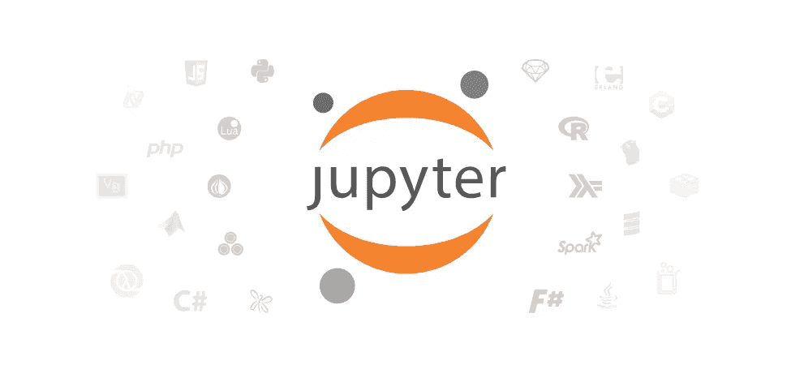
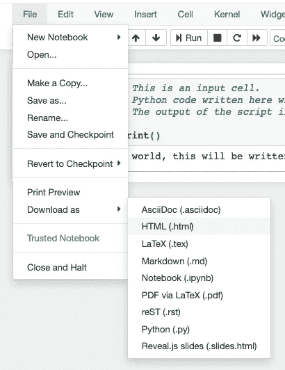
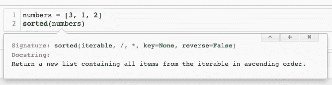
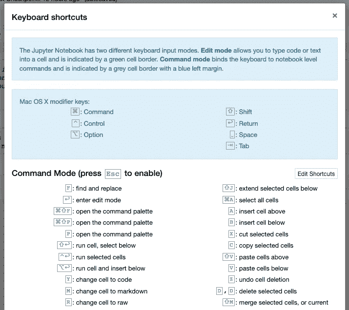

# Jupyter 笔记本最佳实践

> 原文：<https://levelup.gitconnected.com/jupyter-notebook-best-practices-fc326eb5cd22>

马克·瑟尼斯在 [Unsplash](https://unsplash.com/t/nature?utm_source=unsplash&utm_medium=referral&utm_content=creditCopyText) 上的照片

当涉及到数据科学解决方案时，总是需要快速原型开发。无论是复杂的人脸识别算法还是简单的回归模型，拥有一个可以让你轻松测试和验证想法的模型都是非常有价值的。

由于问题的性质，许多数据科学问题需要**特制的解决方案**。这意味着处理这些问题的数据科学家最终将需要**在这个问题上随机应变**，这意味着**不必在每次执行脚本时等待**计算数据集上的一些附加特征列，这在生产率方面是一个至关重要的收益。由于这是编程界的一个长期存在的问题，社区实际上已经为这个问题建立了一个解决方案:进入 [Project Jupyter](https://jupyter.org/) 。

来源:[Jupyter 项目](https://jupyter.org/)

# 朱庇特是什么？

Jupyter 源于 IPython 项目，是一个交互式编程环境，主要关注数据科学和科学编程。尽管 Project Jupyter 包括许多在某些情况下非常有用的组件，但最著名的 Jupyter 组件是笔记本。Jupyter Notebook 是一个开源的网络应用程序，它允许**将代码与文本、可视化、等式和分析**结合起来。事实证明，它在各种情况下都很有用，比如用嵌入式交互式小工具共享数据分析结果，或者围绕各种复杂的主题构建教程。

# Jupyter 笔记本的优势

由于其简单的界面，笔记本电脑为许多复杂项目的发展提供了一个很好的起点。笔记本本质上由称为“输入”的单元组成，笔记本中的每个输入单元都有一个对应的称为“输出”的单元。下图以非常基本的形式展示了它的外观:

一个非常简单的 Jupyter 笔记本电池。

## 快速数据探索

Jupyter 笔记本电脑最重要的优势之一来自笔记本电脑的逐单元特性，这意味着**拆分每个可能的逻辑步骤**允许以非常互动的方式探索手头的数据:

*   每个小单元格都可以被删除或修改，而不会对其余分析产生任何影响。
*   单元格**上的任何变化都可以被还原**，因此它允许自信地快速移动，而不用过多考虑代码的后果。
*   在前面的步骤中，某个单元格的任何输入和输出都是**高度可见的**，可以在开始研究数据之前很容易地显示出来。

由于这些优势，无需处理外部影响或输入输出匹配，就可以非常简单地将激光聚焦于分析的特定部分。

## 数据缓存

由于每个单元格只对自己负责，这允许自动保存单元格数据以供将来参考，而不需要运行整个脚本来到达某个点。

想象一下，您对一个外部服务进行了一个缓慢的 API 调用，然后您在可以开始处理数据之前进行了一堆数据清理操作；您可以在`Cell 3`中提取数据，对其进行处理，直到在`Cell 4` **中完全完成数据清理，而无需从 API 中重新下载数据**，并且仍然能够从`Cell 18`中引用清理后的数据，能够以非常强大的方式提高生产力**，一旦您习惯了，您将开始到处寻找它。**

## 独立文档

Jupyter 笔记本本质上是 **HTML 页面**；这意味着，在常见情况下，当您需要共享您的工作成果时，生成的分析笔记本文件可以简单地**呈现为 HTML 文件**，一旦您有了文件，您可以直接与接收者共享它，或者您可以简单地通过远程主机提供文件，无需在远程主机中设置 Python 或任何编程环境。

Jupyter 笔记本电脑的各种出口选项

除了 HTML 格式，Jupyter 笔记本还可以导出许多其他格式，如 AsciiDoc、LaTeX 或 Markdown。

## 嵌入式文档

Jupyter Notebook 的一个非常简单但有效的特性是它的简单的**文档弹出**。一旦你有了一个函数并打开括号，点击`Shift + Tab`就会打开一个弹出窗口，显示该函数的文档。

Jupyter 笔记本的弹出文档

# 最佳实践

就像任何其他工具一样，Jupyter 笔记本也有最佳实践，使数据科学家的生活更加轻松，并使他们能够毫无困难地从事复杂的项目。一如既往，这些不是硬性规定，可能会根据项目而变化；他们在那里用以前的经验提供指导。

## 使用版本控制系统

对于常规的软件开发生命周期来说，这可能是非常基本的最佳实践；然而，在数据科学家中，像 Git 这样的版本控制系统的采用率似乎仍然很低，这可能是一个非常容易实现的成果，肯定会给**带来生产力的提升**。版本控制系统:

*   允许你在不同版本的代码之间进行时间旅行
*   启用更改内容**而不用担心丢失代码**
*   启用**与员工一起审查**项目
*   **及时跟踪变更**与所有权

由于所有这些优点，版本控制系统已经成为软件开发项目中的基本要素之一，在开发 Jupyter 笔记本分析时也应该使用它们。

## 尝试使用新的变量

Jupyter 笔记本支持在逐个单元格的结构中处理数据，这意味着您可以使用前一个单元格中定义的变量，并在这些值的基础上**构建，但有一点要小心，不要重写该变量。这种最佳实践主要取决于手头的问题，可能不适用于处理无法多次放入内存的大型数据集，但一般来说这是一种很好的实践。**

考虑从笔记本电脑的远程服务器下载一个 CSV 文件，并将其存储在一个名为`data_csv`的变量中。此时，您想要对该数据进行一些修改，并改变其结构，使其更适合您的分析。有两种方法可以做到这一点，你可以转换数据并再次将所有内容存储在`data_csv`变量上，或者你可以在另一个变量`formatted_data` 上运行所有转换。

第一种方法的优点是**更有效的内存使用**，因为在进一步的分析中，您可能需要格式化的数据，而不是原始的 CSV 数据；然而，这种方法有一个重要的缺点:每当你出错并需要重置数据时，**你需要重新下载 CSV 并再次运行所有步骤，直到你到达笔记本中的当前点。**由于这个限制，如果你遵循第二种方法，你只需要重新设置你的`formatted_data`变量的赋值就可以了；无需再次下载 CSV，无需从头开始运行所有细胞。

## 学习键盘快捷键

在任何学科中，学习您的工具总是大有帮助，在数据科学中也是如此。除了了解 Jupyter 笔记本的一般功能之外，了解**键盘快捷键**和**也非常有用，了解得越多，使用笔记本的速度就越快**。

为了查看键盘快捷键，使用`Help > Keyboard Shortcuts`菜单项，这将打开一个显示快捷键的弹出窗口。除此之外，您还可以通过`Help > Edit Keyboard Shortcuts`菜单项更改快捷方式。

键盘快捷键弹出菜单示例

## 记录您的分析

笔记本应该是一个交互式环境，在这里你可以将代码和纯文本结合起来。笔记本单元格还允许你**写 markdown** ，这使你能够写你想写的所有文档，然后以一种漂亮的文本格式呈现。编写文档时，**遵循由**专有标题**、解释以及代码块和示例支持的逻辑层次**。

在渲染之前，这是你如何在单元格中写 markdown。

通过选择`Cell > Cell Type`菜单中的`Markdown`选项，可以启用单元格的降价模式。

这是细胞被执行时的样子。

记录分析将使跟踪变得容易，并为修改提供进一步的指导。

## JupyterLab 代替普通笔记本

JupyterLab 是 Jupyter 的下一代基于网络的界面。除了笔记本，它还支持各种文件类型，文本编辑器，终端和其他自定义查看器。你可以把它想象成一个强大的笔记本环境，它有文件资源管理器，允许你把你的工作分成几个标签，不用离开你的笔记本就可以在浏览器上运行进一步的分析和执行。

为了运行 Jupyter 实验室，只需在您的终端中运行`jupyter lab`，这将启动实验室界面。

## 保持笔记本简单

尽管笔记本本身应该是完整的分析，但是继续利用一般的软件开发实践是明智的，尤其是在管理复杂性方面。对某个主题的分析可能会变得非常复杂，包括各种数据获取操作、操作、清理和可视化；然而，保持笔记本整洁有序是很重要的。笔记本鼓励探索，但是任何严肃的分析和模型都需要适当的测试和组织。有一些建议可以遵循:

*   **用** [**Python 模块**](https://docs.python.org/3/tutorial/modules.html) **让你的代码井井有条。**理想情况下，笔记本不应该包含复杂的逻辑，应该易于理解。不要把所有的代码都记在笔记本上，而是把它们提取到模块中，然后从你的笔记本上使用这些模块。
*   **编写测试。编写测试不是一个容易养成的习惯，但是一旦你掌握了它，你会注意到它在多大程度上提高了工作质量。您不必从测试开始，但是一旦您有了一个稳定的功能或模块，编写一个简单的测试来涵盖该行为将会大有帮助，并且它还将允许在将来使用该功能，包括与模型一起投入使用。**
*   **删除死代码。**这个死代码可能是被遗忘的`print`语句、旧模型的注释掉的版本或未使用的循环；不管是什么，如果代码不再相关，就删除它。**笔记本中的每一行代码都有数据科学家**需要记录的精神开销，这意味着代码越少，你的精神负担就越少。
*   **利用广泛接受的编码标准，如**[**pep 8**](https://www.python.org/dev/peps/pep-0008/)**。有了一个合适的标准，你就可以轻松地在不同的项目间导航，也可以减少在这里和那里决定使用何种风格的认知负担。**

# 结论

尽管这里的建议足够通用，可以在许多项目中实现，但是您自己的工作方式也会对这些实践产生影响；有些可能对你有用，而有些可能会拖你的后腿。总的来说，利用 Jupyter 笔记本电脑的强大功能，您可以节省大量时间，并将更多精力放在核心业务上，而不是小细节上。

# 进一步阅读

*   [https://www . thoughtworks . com/insights/blog/coding-habits-data-scientists](https://www.thoughtworks.com/insights/blog/coding-habits-data-scientists)
*   [https://florianwilhelm . info/2018/11/working _ efficient _ with _ jupyter _ lab/](https://florianwilhelm.info/2018/11/working_efficiently_with_jupyter_lab/)
*   [https://code burst . io/jupyter-notebook-tricks-for-data-science-that-enhanced-your-efficiency-95f 98 D3 ade 4](https://codeburst.io/jupyter-notebook-tricks-for-data-science-that-enhance-your-efficiency-95f98d3adee4)
*   [https://www . geeks forgeeks . org/jupyter-notebook-tips-and-tricks/](https://www.geeksforgeeks.org/jupyter-notebook-tips-and-tricks/)

 [## 编写面试问题

### 一个完整的平台，在这里我会教你找到下一份工作所需的一切，以及…

技术开发](https://skilled.dev)