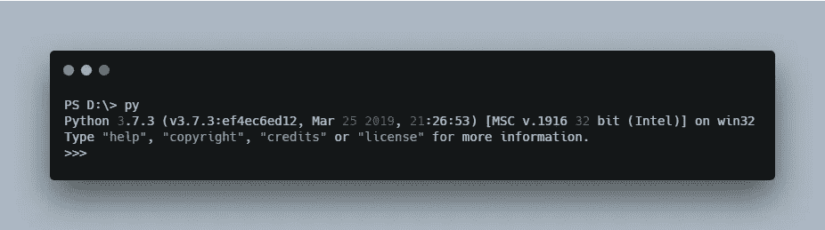
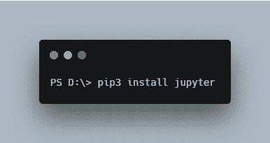
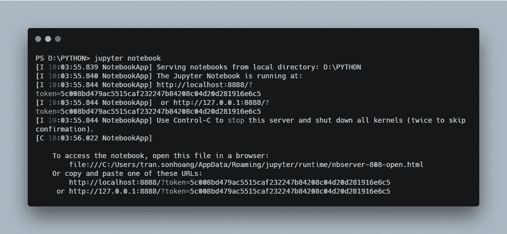
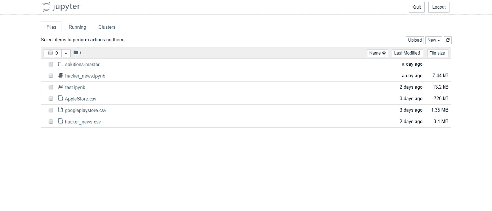
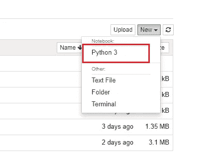
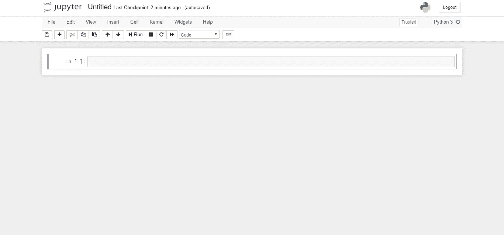
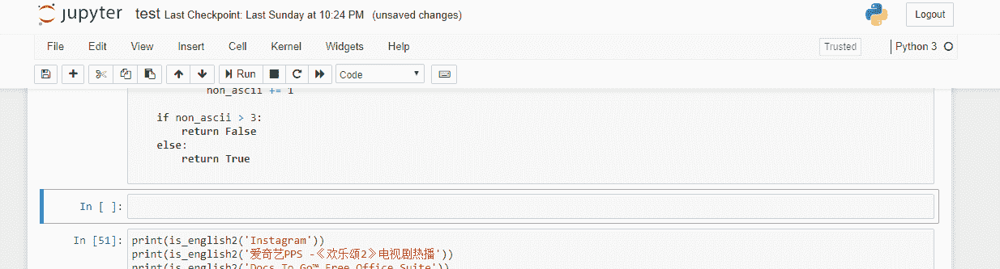
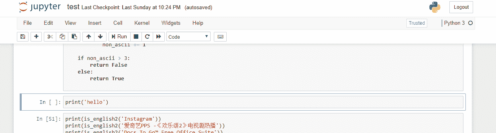
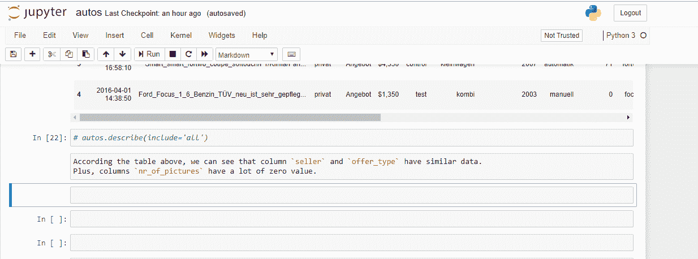

# Jupyter 初学者笔记本

> 原文：<https://levelup.gitconnected.com/jupyter-notebook-for-beginners-7cddae3d5466>

## 计算机编程语言

## Jupyter 笔记本介绍，如何安装，以及一些必备的键盘快捷键。

在 [Unsplash](https://unsplash.com/s/photos/python?utm_source=unsplash&utm_medium=referral&utm_content=creditCopyText) 上由 [Hitesh Choudhary](https://unsplash.com/@hiteshchoudhary?utm_source=unsplash&utm_medium=referral&utm_content=creditCopyText) 拍摄的照片

Jupyter Notebook 是一个非常强大的交互式开发和展示数据科学项目的工具。本文将带您了解:

1.  Jupyter 笔记本是什么？
2.  如何安装 Jupyter 笔记本
3.  基本键盘快捷键

【https://betterfullstack.com 查看 [*更多类似内容*](https://betterfullstack.com)

# Jupyter 笔记本是什么？

Jupyter Notebook 是一个开源的 web 应用程序，允许您创建和共享包含实时代码、等式、可视化和叙述性文本的文档。

您可以将它用于多种目的，例如:

1.  数据清理和转换
2.  数值模拟
3.  统计建模
4.  数据可视化
5.  机器学习

Jupyter 笔记本包含三个组件:

*   **notebook web 应用**:一个交互式 web 应用，用于交互式地编写/运行代码和创作笔记本文档。
*   **内核**:由笔记本网络应用程序启动的独立进程，以给定的语言运行用户代码，并将输出返回给笔记本网络应用程序。内核还处理交互式小部件的计算、标签完成和自省等事情。
*   **笔记本文档**:包含笔记本 web 应用程序中所有可见内容表示的独立文档，包括计算的输入和输出、叙述文本、等式、图像和对象的富媒体表示。每个笔记本文档都有自己的内核。

# 如何安装

在 Window 上安装 Jupyter 有两种主要方式:

1.  [蟒蛇](https://anaconda.org/)
2.  终端(我用这个)

## 蟒蛇

Anaconda Cloud 是数据科学家分享工作的地方。您可以搜索并下载流行的 Python 和 R 包以及笔记本，以开始您的数据科学工作。

[https://www.anaconda.com/](https://www.anaconda.com/)

您还可以将您的包、笔记本和环境存储在 Anaconda Cloud 中，并与您的团队共享它们。

要得到 Anaconda，很简单:

*   从[这里](https://www.anaconda.com/distribution/)获得 Python 3.7 或 2.7 的 Anaconda 最新版本
*   按照下载页面上的说明安装 Anaconda

**使用蟒蛇的好处:**

*   它让您可以在自己的全面储备的数据科学研讨会中立即投入运行，而不会有管理无数安装的麻烦，也不会担心依赖关系和特定于操作系统的安装问题。
*   快速下载 1，500 多个 Python/R 数据科学包
*   使用 [Conda](https://conda.io/docs/) 管理库、依赖项和环境
*   用 [scikit-learn](https://scikit-learn.org/stable/) 、 [TensorFlow](https://www.tensorflow.org/) 和[the no](https://pypi.org/project/Theano/)开发和训练机器学习和深度学习模型
*   使用 [Dask](https://dask.org/) 、 [NumPy](http://www.numpy.org/) 、 [pandas](https://pandas.pydata.org/) 和 [Numba](http://numba.pydata.org/) 分析具有可伸缩性和性能的数据
*   用 [Matplotlib](https://matplotlib.org/) 、[散景](https://bokeh.pydata.org/en/latest/)、[数据着色器](http://datashader.org/)和[全息视图](http://holoviews.org/)可视化结果

## 末端的

通过在终端上键入`py`,确保您已经在计算机上安装了 Python。

端子上的 py 标牌

如果该语法不可用，您将需要[安装 Python](https://www.python.org/downloads/) 并将变量添加到您的计算机中。

现在通过执行以下命令来安装`jupyter`:

安装 jupyter

发射`jupyter notebook`:

从终端发射 jupyter

他们会给你一个带有令牌的链接。只需将其复制粘贴到您的浏览器中即可打开笔记本。

# 基本键盘快捷键

这是我们发布笔记本时的笔记本仪表盘。

[http://localhost:8888/tree](http://localhost:8888/tree)

通过该屏幕，您可以访问 Jupyter 启动目录中包含的文件和子文件夹。

点击新建-> Python3 打开笔记本

打开笔记本

点击 Python 3 后的笔记本编辑器:

[无标题. ipynb](http://localhost:8888/notebooks/Untitled.ipynb)

你必须记住，Jupyter 笔记本有两个主要部分:

*   **Cells** :笔记本中显示的文本或者笔记本内核执行的代码的容器。
*   **内核**:执行笔记本文档中包含的代码的“计算引擎”。

以下是使用笔记本时需要记住的一些快捷方式:

使用 **Enter** 和 **Esc** 键盘切换单元格的编辑模式。

使用 esc 和 enter 键盘

使用**向上**和**向下**箭头键上下移动。使用 **A** 和 **B** 在上方和下方插入一个新单元格。要删除单元格，请按两次 **D** 。

使用上、下、A、B、D 键盘

按下 **Z** 删除删除。

通过按键盘上的 **Y** 和 **M** 在代码模式和降价模式之间切换(通过[降价备忘单](https://github.com/adam-p/markdown-here/wiki/Markdown-Cheatsheet)了解如何使用降价)

使用 Y 和 M 来切换降价和编码模式

按下 **CTRL + S** 保存检查点。

什么是检查点？

据我所知，检查点是当你的计算机出现意外问题时，你可以恢复你的工作的地方。Jupyter 会每 120 秒自动更新一次检查点，或者在你保存检查点的时候更新。

# 摘要

本文提供了什么是 Jupyter 笔记本，如何安装它的基本知识，以及我们在使用笔记本时需要知道的一些主要快捷键。

我希望这篇文章对你有用！可以跟着我上[中](https://medium.com/@transonhoang?source=post_page---------------------------)。我也在[推特](https://twitter.com/transonhoang)上。欢迎在下面的评论中留下任何问题。我很乐意帮忙！

 [## 故事-更好的全栈

### 关于 JavaScript、Python 和 Wordpress 的有用文章，有助于开发人员减少开发时间并提高…

betterfullstack.com](https://betterfullstack.com/stories/)