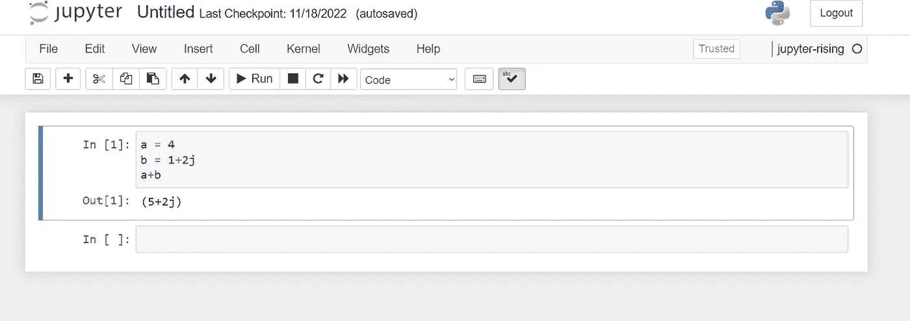
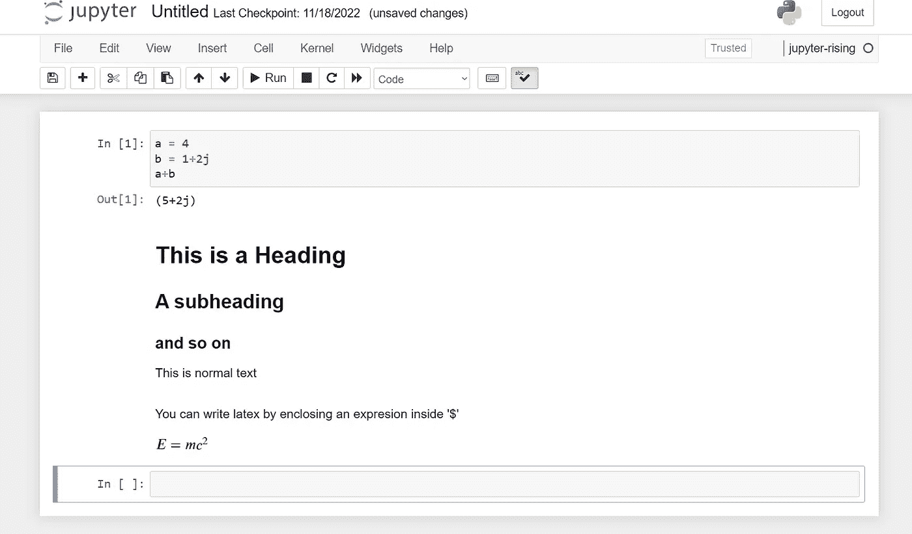

# 朱庇特上升

> 原文：<https://levelup.gitconnected.com/jupyter-rising-530211dd6311>

## Jupyter 笔记本入门


Jupyter 笔记本为创建演示、记录可重复的研究和提供教育内容提供了一种很好的方式。它们通过显示正在执行的程序的结果来使代码变得生动。Jupyter 笔记本讲述了一个故事，其互动功能让用户参与其中。

这篇文章是写给任何对 Jupyter 笔记本感兴趣的人的。不需要 Python 经验。

## 安装 Anaconda

Jupyter 笔记本需要 Python 才能运行。对于本文，我将使用名为 Anaconda 的 python 工具箱和包管理器。可以从这个站点安装:[https://www.anaconda.com/](https://www.anaconda.com/)。

一旦 Anaconda 安装完毕，您就可以使用命令行工具了。如果您使用的是 mac，它们将被集成到正常的终端窗口中。如果你使用的是 Windows，会有一个“Anaconda Prompt”终端窗口。或者，如果您更愿意在 Powershell 中打开它，您可以遵循本文中的说明:[Windows Powershell 上的 Anaconda](/anaconda-on-the-windows-powershell-c3b1425be9ae)。

## 创造环境

推荐的 python 编程实践是为每个项目创建一个虚拟环境。虚拟环境将一个项目所需的依赖关系与其他项目隔离开来。

让我们创造一个叫做“jupyter-rising”的环境打开 Anaconda shell 并键入

```
 conda create -n jupyter-rising
```

输出将如下所示:

```
Preparing transaction: done
Verifying transaction: done
Executing transaction: done
#
# To activate this environment, use
#
# $ conda activate jupyter-rising
#
# To deactivate an active environment, use
#
# $ conda deactivate
Retrieving notices: …working… done
```

听从建议，激活环境

```
 conda activate jupyter-rising
```

激活环境后，您安装的每个库都将仅用于该环境。

## 安装并启用 Jupyter

激活环境后，现在可以安装 jupyter 了

```
conda install jupyter
```

下一步是安装内核。内核就像 jupyter 的 Anaconda 环境。它们允许不同的项目访问不同的特性，但与 conda 不同，在 conda 中，每个环境都在 Python 中，jupyter 内核可以使用许多支持的编程语言。支持的内核列表可以在[这里](https://github.com/jupyter/jupyter/wiki/Jupyter-kernels)找到。

```
 ipython kernel install --name "jupyter-rising" --user 
```

现在开始一个 jupyter 笔记本..

```
jupyter notebook
```

将在地址[http://localhost:8888/tree](http://localhost:8888/tree)打开一个浏览器窗口，显示当前目录的内容。点击右上角的“新建”，选择“jupyter-rising”内核。

# Jupyter 入门

我不打算详细介绍 Jupyter 笔记本的功能。幸运的是，有无数的在线资源可以找到。我只简单地演示一下我最常用的功能。

## 交互式编程

在笔记本中输入以下代码

```
a = 4
b = 1+2j
a+b
```

当你点击“运行”时，笔记本将执行代码，显示结果，并打开另一个单元格。



## 减价文件

在下一个单元格中，转到菜单上的下拉菜单，从“代码”切换到“降价”。此设置用于在文本中而不是代码中编写文本。写例如:

```
# This is a Heading
## A subheading
### and so on 

This is normal text
```

当您单击“运行”时，结果将是格式化文本:


## 乳胶渲染

Jupyter 内置了对 LaTex 公式格式的支持。在下一个单元格中，再次选择“降价”,并写下

```
$E = mc^2$
```

单击“运行”查看渲染的方程式:



## 共享 Jupyter 笔记本

*   GitHub 是一个流行的项目合作源代码库。当你点击一个笔记本时，Github 提供了一个基本的查看器。例如参见[https://github . com/algorythmist/finance-toolbox/blob/main/notebooks/cppi-demo . ipynb](https://github.com/algorythmist/finance-toolbox/blob/main/notebooks/cppi-demo.ipynb)
*   在撰写本文时，GitHub 还没有提供交互功能，它的 latex 渲染也有问题。要共享具有互动功能的笔记本，您可以使用 [nbviewer](https://nbviewer.org) 。S
*   [Google colab](https://colab.research.google.com) 提供在 Google 服务器上创建和共享在线笔记本的能力，包括在 CPU 或 GPU 上运行的选项。它需要一个谷歌电子邮件账户，并提供付费版本，让你获得更多的计算能力。
*   [Kaggle](https://www.kaggle.com/) 是一个机器学习竞赛的在线平台。它为 ML 学生和从业者提供了大量的干净数据集和大量的资源。它还提供了自己的在线 Jupyter 笔记本的实现。这些笔记本的外观和感觉不同，但功能几乎相同。