# 只是另一个改变生活的 VS 代码黑客的集合

> 原文：<https://levelup.gitconnected.com/just-another-collection-of-life-changing-vs-code-hacks-1f3b60ca6ff8>

## 给每个人最喜欢的编辑器更多的提示和技巧

在 [Unsplash](https://unsplash.com?utm_source=medium&utm_medium=referral) 上由 [Hitesh Choudhary](https://unsplash.com/@hiteshchoudhary?utm_source=medium&utm_medium=referral) 拍摄的照片

似乎每隔一周就有一个新的未被发现的“革命性”VS 代码好东西的列表。我相信你知道我在说什么: [*26 个神奇的 VSCode 工具*](https://medium.com/better-programming/26-miraculous-vscode-tools-for-javascript-developers-in-2019-e184131d75af) *，* [*超级秘密 VS 代码黑客*](https://medium.com/free-code-camp/here-are-some-super-secret-vs-code-hacks-to-boost-your-productivity-20d30197ac76) ， [*7 VS 代码扩展，让你的生活变得更加轻松*](https://medium.com/better-programming/vs-code-extensions-1da56837dd10) *，*等等

但是事情是这样的:不管出于什么原因，我发现自己总是*点击那些文章。好吧，你在这里，读这份名单。怎么回事？*

尽管每个收藏中不可避免地会出现重叠，但我总能找到一两个以前从未听说过的新扩展或快捷方式。这是我现在在日常开发流程中使用的东西——非常有价值！这是我写这篇文章的灵感:我希望你能在这里找到一些有用的东西，最终你每天都会用到。

所以，事不宜迟，这里是*另一个*改变生活的 VS 代码黑客列表。

# 节省时间的人

> 加快工作流程的巧妙技巧和键盘快捷键

## 保存时格式化

我认为这个内置特性是非常明显的，但是让我惊讶的是有多少人不知道这是一个东西。每次保存文件时，都可以运行格式化程序。这不仅是保持代码整洁的好方法，而且它还会告诉您是否有语法错误，因为如果您有语法错误，格式化程序可能会失败。

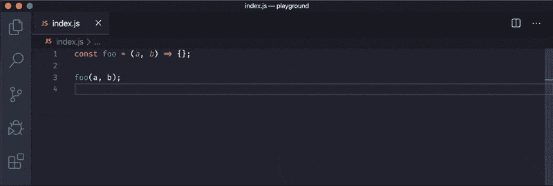

记得经常保存你的工作！(GIF)

要启用，只需打开 VS 代码设置，搜索“保存时格式化”。您甚至可以将 VS 代码配置为粘贴时格式化(这是我非常喜欢的)，或者在输入后一段时间不活动后格式化(这可能有点过头了)。

## 快速格式化不可读的代码块

你有没有发现自己试图破译一个巨大的 JSON blob，也许是从你的 Chrome 调试器的*网络*标签中？或者试图解释从一个蹩脚的基于 web 的终端的输出日志中复制的冗长的错误消息？

你可能会打开谷歌，输入“JSON prettifier”或“Python formatter”——但这很麻烦。我发现，格式化一段冗长、不可读的代码的最有效方法是将文本粘贴到 VS 代码中的一个新文件中，适当地更改文档语言，然后运行格式化程序。像这样:

不需要就不要离开你的编辑！(GIF)

通过记住一些快捷方式来加快速度。

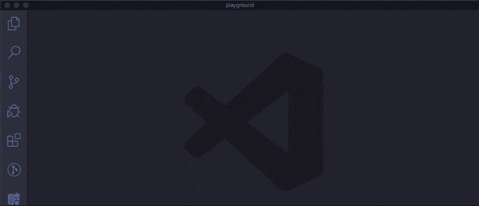

有什么比掌握命令调板更好的？掌握键盘快捷键！(GIF)

## 重新加载窗口

VS 代码很棒，但是像其他程序一样，它有时会陷入困境或者出错。当这种情况发生时，只需通过在命令面板中搜索“重新加载”来重新加载你的窗口。完整的命令是*开发者:重新加载窗口*。

不要担心:任何当时未保存的作品都会被保存下来。但是，如果您打开了任何集成终端，这些都将丢失。

## 切换自动换行

我喜欢将我的屏幕分成多个编辑器，这通常会给我留下很少的空间。我最讨厌的事情之一是不得不左右水平滚动来查看比我的编辑器还要宽的代码行——这实在是太烦人了！

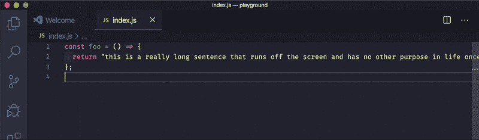

幸运的是，VS 代码有一个内置的解决方案。你可以让长行溢出到下一行，而不是离开屏幕——只需在你的命令面板中搜索*切换自动换行*。我发现自己用得太频繁了，以至于记住了默认的键盘快捷键:Mac 上的 **⌥** + **z** 或者 Windows 上的 **Alt** + **z** 。

# 化妆师

> 喜欢你的代码，每一个细节。
> 
> 或者至少，喜欢它的样子。

## ascii 装饰者

这里有一个你可能没听说过的。 [ASCIIDecorator](https://marketplace.visualstudio.com/items?itemName=helixquar.asciidecorator) 使用 [FIGlet](http://www.figlet.org/) 生成大块文本。

用它来改善代码的组织和可读性。我写了一整篇[文章](/blocky-block-comments-an-easy-way-to-improve-code-readability-563122cd9f75)解释这是什么以及如何使用。如果你以前没有尝试过，我真的建议你试一试！

大块注释是使用这个扩展生成的。试一试，你可能会有惊喜！

## 德古拉和菲拉密码

每个人都有一个选择的主题。我的是[德古拉](https://draculatheme.com/)。

我将它与 [Fira Code](https://github.com/tonsky/FiraCode) 配对，这是一种带有*编程连字*的等宽字体——也就是像 **= >** 或**这样的编程语言中使用的常见字符组合！==** 连接成一个逻辑符号。

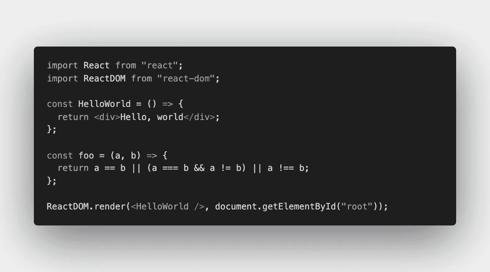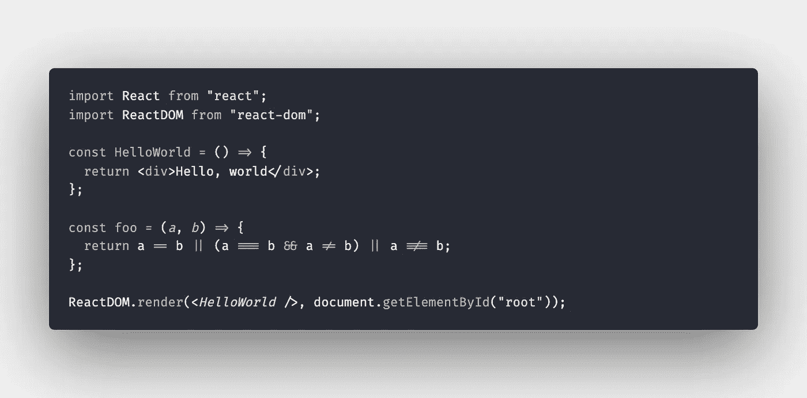

顶部:默认主题(深色+)和默认字体。下图:德古拉主题和 Fira 代码。

哦，我不使用图标包——我对默认图标非常满意。

## 波拉科德

用 [Polacode](https://marketplace.visualstudio.com/items?itemName=pnp.polacode) 给你的代码截图。我在这篇文章中用它来制作漂亮的代码片段，并且我经常用它来和别人分享代码片段(当复制/粘贴代码本身不是必须的时候)。

Polacode 在他们的概述中说得很好:

> 你已经花了无数的时间寻找完美的 [JavaScript 语法](https://marketplace.visualstudio.com/search?term=javascript%20grammar&target=VSCode&category=All%20categories&sortBy=Relevance)，将它与一个[看起来光滑的 VS 代码主题](https://marketplace.visualstudio.com/search?target=VSCode&category=Themes&sortBy=Downloads) …你为[斜体草书 html 属性](https://www.typography.com/blog/introducing-operator)支付了 200 美元。
> 
> 代码必须看起来正确。Polacode —宝丽来代码📸

## 括号对着色程序 2

不言自明— [括号对着色程序 2](https://marketplace.visualstudio.com/items?itemName=CoenraadS.bracket-pair-colorizer-2) 帮助您使用颜色识别匹配的括号。使用的颜色可以根据需要定制。

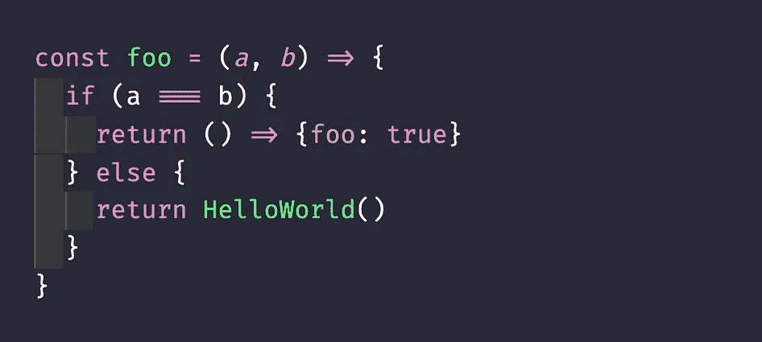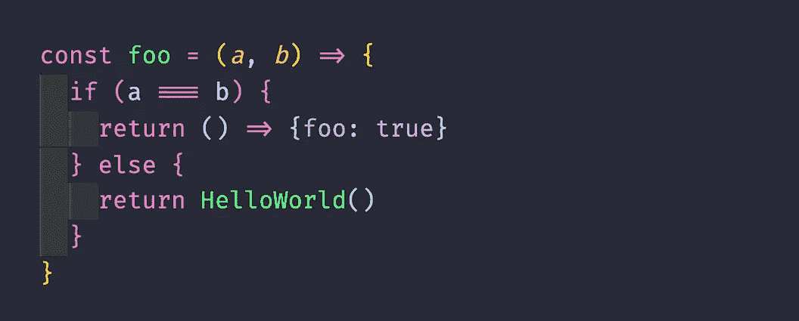

左:正常，无色括号。右:漂亮的彩色括号与括号着色 2

## 缩进-彩虹

你可能已经注意到了上面截图中突出显示的缩进。这要感谢这个漂亮的扩展， [Indent-Rainbow](https://marketplace.visualstudio.com/items?itemName=oderwat.indent-rainbow) 。同样，颜色可以根据你的心意定制。

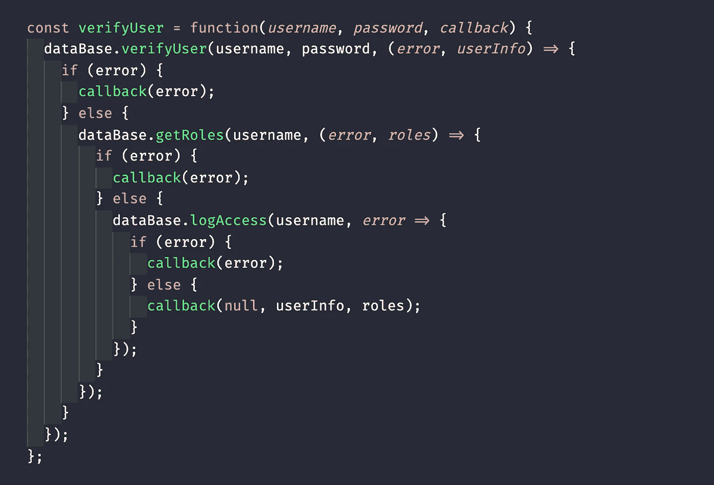

PSA:避免回调地狱！

# 基本要素

> 每个人都应该安装的扩展。
> 
> 很可能你已经听说过其中的大部分。

## 设置同步

如果你正在读这篇文章，你可能已经花了很多时间来配置你的 VS 代码:设置、扩展、主题等等。你最不想做的事情就是当你换到一台新的笔记本电脑时手动获得完美的配置，或者不断确保你的工作和个人机器同步。

[设置同步](https://marketplace.visualstudio.com/items?itemName=Shan.code-settings-sync)自动同步您所有设备上的 VS 代码设置。它很容易设置，而且工作起来非常有魅力——老实说，我不知道为什么一开始它没有内置到 VS 代码中。

## 代码拼写检查器

[代码拼写检查器](https://marketplace.visualstudio.com/items?itemName=streetsidesoftware.code-spell-checker)知道不同的命名约定，如 camelCase、TitleCase 和 snake_case。它支持全局、文件夹和工作区级别的自定义词典。根据编程语言、路径/文件、自定义 RegExp 表达式等对其进行定制。

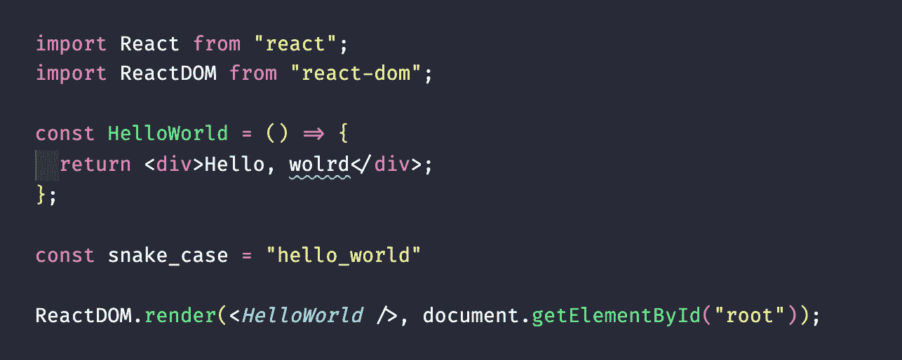

你好，沃尔德！我是说，世界。

## 远程 SSH

如果你和我一样，你不是 Vim 或类似编辑器的最大粉丝(毕竟这是一篇关于 VS 代码的文章！).如果你希望即使在 SSH 进入远程机器时也能使用 VS 代码设置，那么你很幸运——微软的[远程 SSH](https://marketplace.visualstudio.com/items?itemName=ms-vscode-remote.remote-ssh) 可以让你做到这一点。

只需通过这个扩展 SSH 到您的远程机器，它会处理剩下的事情！

## 实时分享

你可能会认为这就像带有语法高亮的 Google Docs，但它远不止如此。您可以共享调试会话、终端实例和本地 web 应用程序，而无需克隆任何 repos 或安装包。

[实时分享](https://marketplace.visualstudio.com/items?itemName=MS-vsliveshare.vsliveshare)结对编程的必备工具，因为您可以维护自己的个人编辑器偏好，并且可以奢侈地使用自己的鼠标和键盘！

我还发现它对于小代码演示和技术讲座非常有用。我的编辑不用在一台电视上放大 200%,人们可以在他们的笔记本电脑上跟随。他们会自动跟随我，我可以邀请参与者根据需要进行编辑，让技术讲座和演示变得超级互动！

# 不合群的人

> 我没有分类来放这些了…

## 进口成本

你会进口一大堆你几乎不用的包吗？[导入成本](https://marketplace.visualstudio.com/items?itemName=wix.vscode-import-cost)显示您导入的每个包裹的大小。这是提醒自己除非绝对需要，否则不要导入包，并且只从包中导入您需要的东西的好方法！

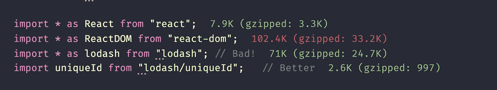

仅导入您需要的内容—最小化这些包的大小！

## Webpack 进度

在 VS 代码状态栏中直接显示 [Webpack 构建进度](https://marketplace.visualstudio.com/items?itemName=wk-j.webpack-progress)的小生境扩展。如果你一直在使用 Webpack，那就太棒了——隐藏终端，只看状态栏，节省一些屏幕空间！

它依赖于您必须安装的另一个 npm 包，但是按照提供的说明进行安装非常容易。

## 挽救（saving 的简写）

[直接在 VS 代码中预览 SVG](https://marketplace.visualstudio.com/items?itemName=jock.svg)。与其他选项相比，我更喜欢这个扩展，因为它很容易改变背景颜色和放大/缩小。

它还提供了对 SVG 的大量支持，比如自动完成和缩小，如果你需要的话。

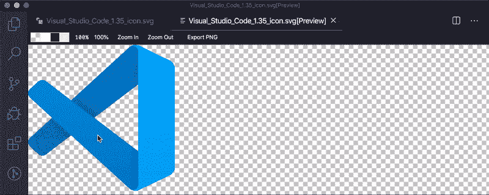

就这样——希望你能在这里找到一些有用的东西，并将其添加到你的日常工作流程中！让我知道你的想法，如果我错过了什么，应该列在清单上。

当然，感谢您的阅读！