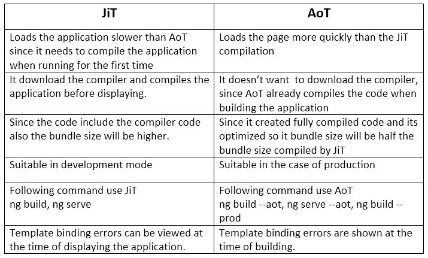

# Angular 中的实时(JIT)和提前(AOT)编译

> 原文：<https://levelup.gitconnected.com/just-in-time-jit-and-ahead-of-time-aot-compilation-in-angular-8529f1d6fa9d>

## 了解 JIT 和 AOT，它们是如何工作的，以及 JIT 和 AOT 的比较。

照片由[布鲁克·拉克](https://unsplash.com/@brookelark?utm_source=unsplash&utm_medium=referral&utm_content=creditCopyText)在 [Unsplash](https://unsplash.com/search/photos/coffee?utm_source=unsplash&utm_medium=referral&utm_content=creditCopyText) 拍摄

在本文中，我们将讨论即时和提前编译。我们将在 Angular 项目的上下文中查看它，但是这些原则可以应用于任何前端框架。

1.  什么是 JIT
2.  JIT 是如何工作的
3.  什么是 AOT
4.  AOT 是如何运作的
5.  JIT 和 AOT 比较

*更多类似内容，请查看*[*https://betterfullstack.com*](https://betterfullstack.com/stories/)

# 什么是 JIT

根据[维基百科](https://en.wikipedia.org/wiki/Just-in-time_compilation):

> 在[计算](https://en.wikipedia.org/wiki/Computing)中，**实时** ( **JIT** ) **编译**(也称**动态翻译**或**运行时编译**)是一种执行[计算机代码](https://en.wikipedia.org/wiki/Computer_code)的方式，它涉及在程序执行期间[编译](https://en.wikipedia.org/wiki/Compiler)——在[运行时间](https://en.wikipedia.org/wiki/Run_time_(program_lifecycle_phase))——而不是在执行之前。

或者更简单地说，就是代码在需要的时候被编译，而不是在运行之前。

# JIT 是如何工作的

最初，编译器负责将高级语言转换成目标代码(机器指令)，然后将目标代码链接成可执行文件。

实时(JIT)编译器是运行时解释器的一个特性，它不是每次调用一个方法就解释字节码，而是将字节码编译成运行机器的机器代码指令，然后调用这个目标代码。

角度项目中的流程:

1.  使用 Typescript、HTML、CSS (SCSS 或 SASS)开发一个 Angular 应用程序。
2.  使用`ng build`将源代码构建成包。这包括资产、js 文件(惰性加载和 JS 映射中的模块、供应商和 polyfill)、index.html 和 CSS。
3.  然后我们将它构建到一个 war 文件中，由 jboss 部署，或者使用 heroku 或其他支持 Node 的主机直接部署。然后，我们通过 CNAME 将该主机映射到我们的域。
4.  最终用户通过域访问我们的 web 应用程序。浏览器将下载所有资源，包括默认视图所需的 HTML、CSS 和 JavaScript。
5.  角形引导应用程序
6.  Angular 将对应用程序中的每个组件进行 JIT 编译。然后应用程序被渲染。

注意:

1.  在 JIT 中，最初并不是所有的代码都被转换成机器码。只有必要的(立即使用的)代码才会被转换成机器码。然后，如果一个方法或功能被调用并且不在机器代码中，那么它也将被转换成机器代码。这减轻了 CPU 的负担，并使应用程序渲染更快，因为它只使用需要的东西。
2.  您可以在实现过程中在浏览器中进行调试，因为代码是用映射文件在 JIT 模式下编译的。这有助于您在 inspector 上直接查看和链接源代码。

# 什么是 AOT

根据[维基百科](https://en.wikipedia.org/wiki/Ahead-of-time_compilation)。

> 在计算机科学中，**提前编译** ( **AOT 编译**)是[编译](https://en.wikipedia.org/wiki/Compiler)更高级的[编程语言](https://en.wikipedia.org/wiki/Programming_language)如 [C](https://en.wikipedia.org/wiki/C_(programming_language)) 或 [C++](https://en.wikipedia.org/wiki/C%2B%2B) ，或[中间表示](https://en.wikipedia.org/wiki/Intermediate_representation)如 [Java 字节码](https://en.wikipedia.org/wiki/Java_bytecode)或[的行为。NET 框架](https://en.wikipedia.org/wiki/.NET_Framework) [通用中间语言](https://en.wikipedia.org/wiki/Common_Intermediate_Language) (CIL)代码，转换成本机(系统相关)[机器码](https://en.wikipedia.org/wiki/Machine_code)以便生成的二进制文件可以本机执行。

这似乎很复杂，很难理解。他是怎么想的呢:

在浏览器下载并运行代码之前，提前(AOT)编译器会在编译期间转换你的代码。在构建过程中编译应用程序可以更快地在浏览器中呈现。

以下是好处[2]:

*   *更快的渲染* —通过 AOT，浏览器下载应用程序的预编译版本。浏览器加载可执行代码，因此它可以立即呈现应用程序，而无需等待先编译应用程序。
*   *更少的异步请求—* 编译器*在应用程序 JavaScript 内内嵌*外部 HTML 模板和 CSS 样式表，消除了对这些源文件的单独 AJAX 请求。
*   *更小的 Angular 框架下载大小* —如果 app 已经编译好了，就不需要下载 Angular 编译器了。编译器大约是 Angular 本身的一半，所以省略它会大大减少应用程序的负载。
*   *更早地检测模板错误*—AOT 编译器在构建步骤中检测并报告模板绑定错误，然后用户才能看到它们。
*   *更好的安全性* —在 HTML 模板和组件提供给客户端之前，AOT 就已经将它们编译成 JavaScript 文件。由于没有需要读取的模板，也没有危险的客户端 HTML 或 JavaScript 评估，注入攻击的机会就更少了。

Tobias Bosch 的角度汇编解释

# AOT 是如何运作的

你可以在 [Angular documentation](https://angular.io/guide/aot-compiler#how-aot-works) 阅读更多信息，了解 AOT 是如何工作的。但是，我有一个简单的解释:

1.  使用 Typescript、HTML、CSS (SCSS 或 SASS)开发一个 Angular 应用程序。
2.  使用`ng build --prod`构建源代码包，其中包括资产、JS 文件(主文件、供应商文件和多填充文件)、index.html 和 CSS。在这一步中，Angular 使用 [Angular 编译器](https://www.npmjs.com/package/@angular/compiler-cli)来构建源代码，他们在[三个阶段](https://angular.io/guide/aot-compiler#compilation-phases)中完成，这三个阶段是*代码分析、*和*模板类型检查。*在这一步中，捆绑包的大小将小于我们以 JIT 模式构建时的捆绑包大小。
3.  然后，我们将它构建到 war 文件中，由 jboss 进行部署，或者使用 heroku 或其他托管支持节点的工具直接进行部署。然后，我们使用 CNAME 将该主机映射到我们的域。
4.  最终用户通过域访问我们的 web 应用程序。浏览器将下载默认视图所需的所有资源，包括 HTML、CSS 和 JavaScript。
5.  有角度的引导和应用程序得到渲染。

# JIT 和 AOT 比较

JIT 和 AOT 在角度上的主要区别是:

*   *实时* (JIT)，运行时在浏览器中编译你的应用。
*   *提前* (AOT)，在服务器上编译你的应用。

当您运行`[ng build](https://angular.io/cli/build)`(仅构建)或`[ng serve](https://angular.io/cli/serve)`(本地构建和服务)CLI 命令时，JIT 编译是默认的。这是为了发展。

对于 AOT 编译，包括带有`ng build`或`ng serve`命令的`--aot`选项。另一种方法是使用`--prod`，默认生产模式在`Angular.json`中配置，AOT 设置为`true`。

下面是另一个对比:

JIT 和 AOT 比较

# 摘要

JIT 和 AOT 是 Angular 项目中编译代码的两种方式。我们在开发模式中使用 JIT，而 AOT 用于生产模式。

我们可以很容易地在 JIT 模式下实现功能和调试，因为我们有映射文件，而 AOT 没有。然而，当我们将 AOT 用于生产时，最大的好处是减少了包的大小，从而加快了渲染速度。

我希望这篇文章对你有用！可以跟着我上[媒](https://medium.com/@transonhoang)。我也在推特上。欢迎在下面的评论中留下任何问题。我很乐意帮忙！

# 资源/参考资料

[1]:JIT[https://guide . freecodecamp . org/computer-science/just-in-time-compilation/](https://guide.freecodecamp.org/computer-science/just-in-time-compilation/)

[2]:https://angular.io/guide/aot-compilerAOT

 [## 故事-更好的全栈

### 关于 JavaScript、Python 和 Wordpress 的有用文章，有助于开发人员减少开发时间并提高…

betterfullstack.com](https://betterfullstack.com/stories/)