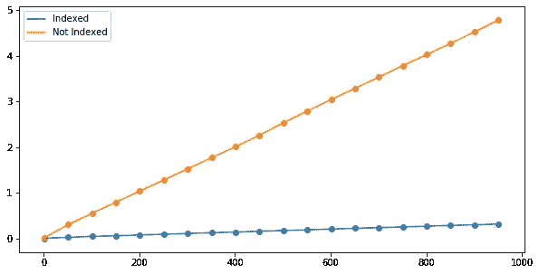

# Django 中的一个索引就能让您的应用速度提高 15 倍！

> 原文：<https://levelup.gitconnected.com/just-one-index-in-django-makes-your-app-15x-faster-742e2f13108e>

## 你的应用有了索引会快多少？


数据库索引就像一本电话簿

即使是“高级”开发人员也经常忘记在 Django 中使用索引。您无法想象，如果您只需在模型中添加两行代码，速度会有多快！

在本文中，我们将一起进行测量:有索引和没有索引。

## 设置

我们的病人将是一个只有 7 个字段的小 Django 应用程序。

我将在这里展示这个模型:

```
**class** Student(models.Model):
    first_name = models.CharField(max_length=100)
    last_name = models.CharField(max_length=100)
    code0 = models.CharField(max_length=100, blank=**True**)
    code1 = models.CharField(max_length=100, blank=**True**)
    code2 = models.CharField(max_length=100, blank=**True**)
    code3 = models.CharField(max_length=100, blank=**True**)
    code4 = models.CharField(max_length=100, blank=**True**)
```

我们有很多 CharFields。没有索引。

我们将用 100K 行进行测试，如下所示:

```
**from** django.test **import** TestCase
**from** student.models **import** Student
**import** datetime

**class** StudentTestCase(TestCase):
    **def** setUp(self):
        start_time = datetime.datetime.now()
        students = []
        batch_size = 500
        **for** i **in** range(100000):
            student = Student()
            student.first_name = str(i)
            student.last_name = str(i)
            student.code0 = **f"code{**i**}"** students.append(student)
        Student.objects.bulk_create(students, batch_size)

        end_time = datetime.datetime.now()
        print(**f" Created in {**end_time - start_time**}"**)

    **def** test_lookup(self):
        start_time = datetime.datetime.now()
        **for** i **in** range(50000, 51000):
            Student.objects.get(code0=**f"code{**i**}"**)

        end_time = datetime.datetime.now()
        print(**f"Looked up in {**end_time - start_time**}"**)
```

我们首先创建 100K 个元素。然后，就在数据库的中间，我们将寻找其中的 1000 个。

现在，我们迁移并运行测试。

```
Creating test database for alias 'default'...
System check identified no issues (0 silenced).
Created in 0:00:03.429665
Looked up in 0:00:05.001903
----------------------------
Ran 1 test in 8.504sOK
```

查找 1000 个元素花了 5.1 秒。

## 我们的第一个指数

我们现在将引入一个只有一个字段的简单索引。确定这个字段是`code0`:

```
**class** Student(models.Model):
    first_name = models.CharField(max_length=100)
    last_name = models.CharField(max_length=100)
    code0 = models.CharField(max_length=100, blank=**True**)
    code1 = models.CharField(max_length=100, blank=**True**)
    code2 = models.CharField(max_length=100, blank=**True**)
    code3 = models.CharField(max_length=100, blank=**True**)
    code4 = models.CharField(max_length=100, blank=**True**)

    **class** Meta:
        indexes = [models.Index(fields=[**'code0'**, ]), ]
```

您可以看到为我们的模型添加了一些元数据。

进行迁移，迁移，运行测试:

```
Creating test database for alias 'default'...
System check identified no issues (0 silenced).
Created in 0:00:03.473439
**Looked up in 0:00:00.3344573 <---**
-------------------
Ran 1 test in 3.840sOK
```

在数据库中查找 1000 个元素的时间是 0.3 秒，而不是 5.1 秒！



整整快了 15 倍！如约而至。老实说，我首先测量，然后创建了这篇文章的标题。

## 复杂索引

通常情况下，您需要搜索 2 个字段。

所以，我们稍微改变一下我们的测试。

```
**class** StudentTestCase(TestCase):
    **def** setUp(self):
        start_time = datetime.datetime.now()
        students = []
        batch_size = 500
        **for** i **in** range(100000):
            student = Student()
            student.first_name = str(i)
            student.last_name = str(i)
            student.code0 = **f"code0{**i%2**}"** student.code1 = **f"code1{**i**}"** students.append(student)
        Student.objects.bulk_create(students, batch_size)

        end_time = datetime.datetime.now()
        print(**f" Created in {**end_time - start_time**}"**)

    **def** test_lookup(self):
        start_time = datetime.datetime.now()
        **for** i **in** range(50000, 51000):
            Student.objects.filter(code0=**f"code0{**i%2**}"**).get(code1=**f"code1{**i**}"**)

        end_time = datetime.datetime.now()
        print(**f"Looked up in {**end_time - start_time**}"**)
```

也就是说，我们现在查询两个字段— `code0`和`code1`。

这对于数据库来说要复杂得多。它花了

```
Looked up in 0:00:12.380889
```

12.3 秒来处理。虽然我们有一个`code0`的索引。

要不要加个指数？让我们先试试错误的版本:

```
**class** Student(models.Model):
    first_name = models.CharField(max_length=100)
    last_name = models.CharField(max_length=100)
    code0 = models.CharField(max_length=100, blank=**True**)
    code1 = models.CharField(max_length=100, blank=**True**)
    code2 = models.CharField(max_length=100, blank=**True**)
    code3 = models.CharField(max_length=100, blank=**True**)
    code4 = models.CharField(max_length=100, blank=**True**)

    **class** Meta:
        indexes = [models.Index(fields=[**'code0'**, ]),
                   models.Index(fields=[**'code1'**, ])]
```

进行迁移，迁移并运行测试:

```
Looked up in 0:00:00.450037
```

已经很不错了。快了 27 倍！

但是在这种情况下，创建索引的正确方法如下:

```
**class** Meta:
    indexes = [models.Index(fields=[**'code0'**, **'code1'**]),]
```

对于我们的简单测试，它快不了多少，只有 0.42 秒。相对于 0.45 秒。但是对于庞大且更复杂的数据库来说，这真的很重要。

如果您经常在一个查询中使用两个字段，就像我们在这里做的那样，您最好在一个索引中添加两个字段。

> 有趣的事实:如果你只有一个字段被索引，比如说，`code0`，首先通过`code0`然后通过`code1`过滤和通过`code1`然后通过`code0`过滤一样快

这里有一个例子:

```
Student.objects.filter(code0=**f"code0{**i%2**}"**).get(code1=**f"code1{**i**}"**)
```

和...一样快

```
Student.objects.filter(code0=**f"code1{**i**}"**).get(code1=**f"code0{**i%2**}"**)
```

即使只有一个字段被索引。

## 为什么使用索引会更快？

当您进行查询时，数据库管理系统(DBMS)必须按照保存的顺序遍历包含所有字段的完整数据库。如果你的数据库有 100 万条记录，它必须遍历 100 万行并检查你的查询。

我们如何避免这种情况？我们应该对感兴趣的列进行排序和分离。

因此，当您创建索引时，DBMS 会创建另一个只包含所需字段的表。所以，这个表要小得多，搜索起来已经很方便了。但没有那么多。

> DBMS 对那个特殊表中的行进行排序！

这样，它可以使用，例如，二分搜索法，使它更快。如果一个列表是按字母顺序排列的，即使是人也能在几秒钟内找到所需的数据。

这就是指数。

## 为什么 Django 中默认没有索引？

如果索引这么好，为什么默认情况下没有为所有列创建索引？这很合理，不是吗？

> 因为每次更改数据库时，所有索引都必须更新。所以，你需要创造 100K 的记录？如果你只有一个索引，它必须为你创建 20 万条记录。如果你有两张，那就 30 万张唱片。因为我们现在有了更多的表格，所有的表格都应该在同一个页面上。

不仅如此，它还会消耗你的硬盘空间。

不仅如此，DBMS 不知道您将在查询中使用什么组合。你会同时查询姓和名吗？有时候，即使是程序员，事先也不知道这一点。

好吧，但是插入数据库会变得更慢？

是的，可能会慢一些，但通常这不是问题。通常，记录不是成批插入的，而是一个一个插入的。或者一次多达 10 条记录(是的，在 ERP 系统中，一个操作可能导致插入 10 个表，每个表 100 行，有时甚至更多)。所以，当你创建一个新用户时，可能会慢十分之一秒。谁在乎呢。

参见我关于 Django 优化的另一篇文章:

[](/optimizing-django-queries-28e96ad204de) [## 如何编写快 35 倍的 Django 查询

### 使用批量查询、预加载外键等。

levelup.gitconnected.com](/optimizing-django-queries-28e96ad204de)