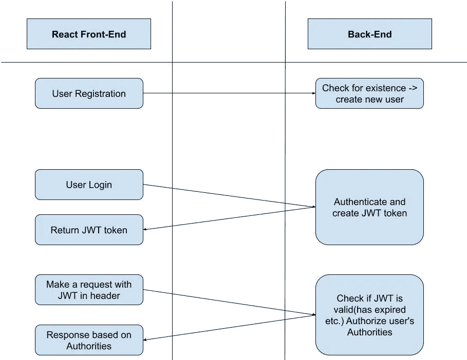

# React 中的 JWT 认证

> 原文：<https://levelup.gitconnected.com/jwt-authentication-in-react-a2b1b705b7a>

## 如何消费和使用 JWT 代币

马库斯·斯皮斯克在 [Unsplash](https://unsplash.com/photos/6pflEeSzGUo) 上的照片

## 什么是 JWT

JWT 或 JSON Web 令牌是声明的编码表示，可以在双方之间传输，声明由令牌的发行者(在我们的例子中是后端)进行数字签名。稍后，我们可以使用该令牌来验证索赔的所有权。

这是 JWT 工作方式的直观展示。

我们注册一个特定的网站，然后登录并接收一个存储在客户端的令牌，然后我们使用它作为请求头发送回后端，以证明我们有权查看我们想要的页面。

## 在 React 中实现 JWT

长话短说，我假设您已经获得了用于返回 JWT 的任何服务器端语言，并且身份验证工作正常，因此我们可以只关注 React。

正如我们在上面的图表中看到的，我们首先需要登录到我们的帐户，这样服务器会将令牌返回给我们，所以第一步是设置我们的 POST API。然后根据你的文件夹的结构，你会从某个地方调用这个 postData，在我的例子中，我会有一个 AuthApi 类。

这里发生的事情是，我们调用我们的 API，传递一个电子邮件和密码，如果登录成功(result.status === 200 ),我们可以继续更新令牌。

为此，我们需要创建那个 AuthenticationManager。

这将为你做很多繁重的工作。从添加初始令牌、在令牌过期时刷新令牌到用户注销时删除令牌。如果您构建的软件需要角色，您最终可以添加角色等等。

此时，我们只需要在将来对服务器的请求中添加这个令牌。

GET API 类似于我们使用的 POST API，不同之处在于我们现在可以使用 authManager 的 *getAccessToken* 函数来尝试检索存储在浏览器中的 JWT 令牌，然后将其添加到标头中，以便我们有权发出请求。

我真的希望这篇文章对你有所帮助，如果有什么不清楚的地方，请留下你的评论，我会尽快回复你。

 [## 通过我的推荐链接加入 Medium-Ivan Stoev

### 作为一个媒体会员，你的会员费的一部分会给你阅读的作家，你可以完全接触到每一个故事…

medium.com](https://medium.com/@ivan.zstoev/membership)