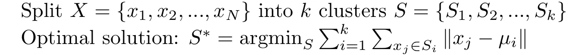
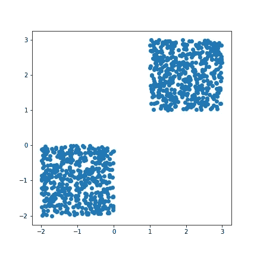
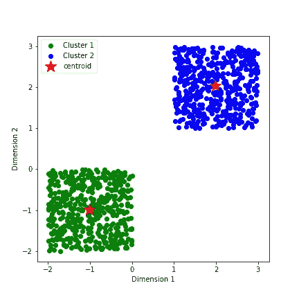
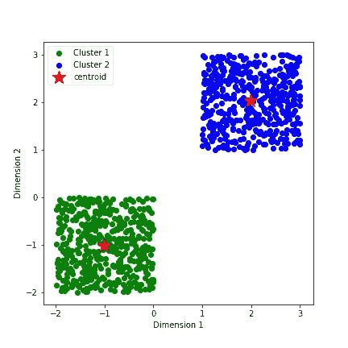

# k-均值聚类算法

> 原文：<https://levelup.gitconnected.com/k-means-clustering-algorithm-4fc5f1d74a23>

*简介* : K-means 聚类是一种无监督的学习方法。在这篇文章中，我将介绍无监督学习的概念以及它为什么有用。然后我会谈到 K-means 聚类:问题的数学公式，python 从头实现，以及使用机器学习库。

# 无监督学习

通常，机器学习模型会对数据进行预测，学习以前看不到的模式来做出重要的商业决策。当数据集由标签和数据点组成时，它被称为**，垃圾邮件检测、语音识别、手写识别是它的一些用例。从没有任何*基本事实*或*正确标签*的数据点中提取洞察力的学习方法属于 [***无监督学习***](https://en.wikipedia.org/wiki/Unsupervised_learning) 的范畴。**

***无监督学习*是 [*探索性数据分析*](https://en.wikipedia.org/wiki/Exploratory_data_analysis) 中使用的基本技术之一，在准备制作复杂的机器学习模型进行推断之前，对数据进行意义分析。由于这不包括人类标记的数据，偏差被最小化。同样，因为没有标签，所以没有正确的答案。从概率的角度来看，*监督*和*非监督学习*之间的对比如下:监督学习推断*条件概率分布 p(x|y)* ，而非监督学习关注的是*先验概率 p(x)* 。**

# **k-均值聚类算法**

> **聚类方法的目标是将数据点分成单独的聚类(预先确定的)，最大化聚类间距离并最小化聚类内距离(增加相似性)。**

**K-Means 是无监督学习算法中的一种聚类技术。其他一些常用的技术有[模糊聚类](https://en.wikipedia.org/wiki/Fuzzy_clustering)(软 k 均值)、层次聚类、混合模型。*硬聚类*或*硬 k 均值*是将每个数据点只分配给一个聚类(例如垃圾邮件或非垃圾邮件)，而不是像*软 k 均值*那样为每个聚类分配非零成员值(垃圾邮件:13%，非垃圾邮件:87%)。在这篇文章中，我将介绍*硬聚类*。**

***K 均值算法*的工作原理:**

1.  **从 ***X*** 中随机选取 ***k*** 个质心(不替换)。**

**2.计算每个*到所有 ***μ*** 的距离( *L2* 或*欧几里德距离****

**3.挑选最近的一个簇作为这个 ***x*** 的标签。**

**4.通过找到每个 ***k*** 簇的算术平均值来更新质心。**

**5.重复步骤*2–4*直到质心停止变化。**

**数学上可以归结为寻找数据集*的一个最优划分*。****

******

***K-均值的数学公式***

# ***密码***

***首先，我将用 python 从头开始编写 k-means 的基本实现。***

***让我们生成一些数据并应用 k-means 来看看它是如何工作的。***

******

***合成数据***

******

***输出:K-意味着从零开始***

***不错吧。用 50 行代码从头构建一个模型很酷:)***

***通过导入 scikit-learn 库，只需几行代码就可以完成同样的任务。***

******

***输出:K-表示使用 sklearn***

***Sklearn 给出了与我们在这个虚拟数据集上从头构建的模型几乎相同的输出。***

***一旦你从头开始编写了一个基本的框架结构，并且熟悉了实现的细节。之后，实现 ***k-means*** 或者任何其他算法，都是使用专门的库函数在公园里散步。***

# **结论**

**K-means 是最简单的无监督学习方法之一。在继续构建复杂的架构以做出决策之前，它可以用来为 EDA 提供见解。这个博客是了解无监督学习、聚类、k-means 及其实现的一个很好的起点。**

**请随意阅读、编码和探索以了解更多信息。在下面留言，分享你的经历。感谢阅读:)**