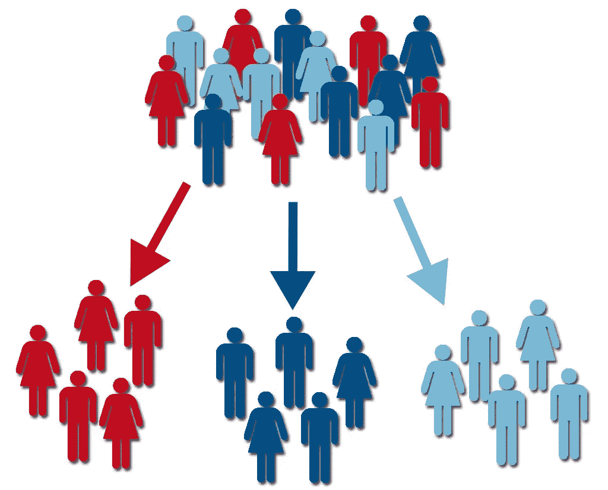
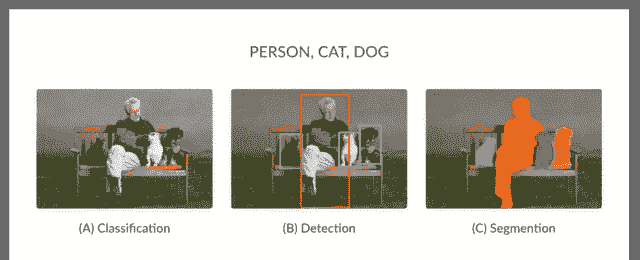
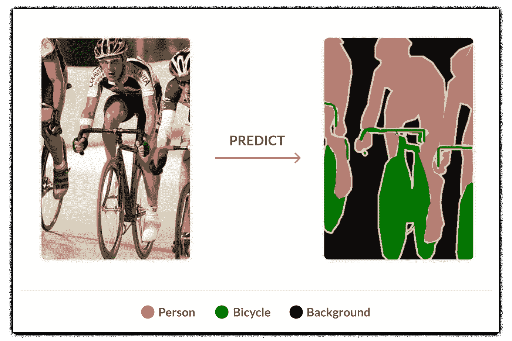

# k 均值聚类分析:机器学习

> 原文：<https://levelup.gitconnected.com/k-means-clustering-analysis-machine-learning-c98ed9f85d8a>

# 什么是聚类分析？

*   聚类分析是一种多元统计技术，它根据观察值的一些特征或描述它们的变量对观察值进行分组。
*   聚类分析也可以归类为数据科学家用来更好地理解数据的无监督机器学习。

# 目标

聚类的目标是最大化一个聚类内的观察值的相似性，并最大化聚类之间的不相似性。

1.  探索数据
2.  确定目标

> 直观地说，数据集中的观察结果可以分成不同的组，有时这对公司、实验室和科学家非常有用。

# 一个简单的例子

来源:https://www.time.gov/

聚类可以由组和特征具有相似性和差异性的任何事物组成。上面的美国图片显示了 4 个星团:红色、黄色、绿色和橙色。根据您对聚类的了解，这些州或地区有什么共同的属性或特征，是什么使每个聚类与其他聚类不同？就这样，干得好:时区！这些群集代表美国的 4 个不同时区。红色集群是东部夏令时，黄色是中部夏令时，绿色是山地夏令时，橙色代表太平洋夏令时。

我相信你已经知道美国和其他国家根据地理位置有不同的时区。然而，这是一个如何使用集群的真实例子。

## 由于这个集群，人们每天都在调整商业决策、关系、教育和许多更重要的事务。

> 虽然这个例子很简单，但是聚类并不像看起来那么简单，并且可以应用于更难解释的更难的问题。

来源:[https://www . grey campus . com/blog/project-management/raid-log-how-it-used-for-a-a-project-manager](https://www.greycampus.com/blog/project-management/raid-log-how-is-it-useful-for-a-project-manager)

# 为什么有用？

聚类的缺点是结果不一定提供是或否的答案。聚类需要对结果进行适当的解释。解释和洞察力是由一个人试图解决的问题决定的。现在您已经熟悉了集群，让我们更深入地了解一下，除了显示时间之外，它们为什么有用。

在所有不同类型的分析之前，聚类通常被用作初步步骤。

1.  聚类分析
2.  其他类型的分析

## 示例应用

*   市场细分
*   图象分割法

> **聚类分析非常直观，但也可能非常棘手。**

## 市场细分

来源:[https://www . business 2 community . com/strategy/segmentation-for-winning-in-the-market-02208686](https://www.business2community.com/strategy/segmentation-for-winning-in-the-market-02208686)

来源:[http://social heroes . co . uk/how-can-I-segment-my-social-media-audience/](http://socialheroes.co.uk/how-can-i-segment-my-social-media-audience/)

市场细分的聚类分析允许公司的数据科学家和营销部门根据行为、人口统计、心理特征和位置来识别客户如何与他们的产品交互的聚类。

> 公司将使用市场细分和聚类分析来了解更多关于如何销售给他们的客户。

来源:[https://medium . com/@ corporate wisman/the-solution-to-every-marketing-problem-market-segmentation-4432622 AEC 8](https://medium.com/@corporatewiseman/the-solution-to-every-marketing-problem-market-segmentation-4432622aece8)

例如，当一家公司想知道以哪些个人为目标时，他们可以使用聚类分析根据相似性和差异性对客户进行细分。一旦公司分析了分析结果，确定了哪些客户属于每个群体，他们就根据不同的目标群体制定了营销策略。

> 聚类分析还允许公司根据他们的产品划分市场。这有助于公司了解竞争对手是谁，并找出新市场的差距。

# 图象分割法

来源:[https://missing link . ai/guides/computer-vision/image-segmentation-deep-learning-methods-applications/](https://missinglink.ai/guides/computer-vision/image-segmentation-deep-learning-methods-applications/)

图像分割是将图像分成不同组的过程。有许多不同的方法来应用图像分割，最常用的是使用 **K-Means 聚类算法**。图像分割允许人们基于这些分割清楚地区分对象。

来源:[https://missing link . ai/guides/computer-vision/image-segmentation-deep-learning-methods-applications/](https://missinglink.ai/guides/computer-vision/image-segmentation-deep-learning-methods-applications/)

图像分割的目标是将图像增强为更有意义和更清晰的图像。这个过程需要人们根据相似的特征通过线条和形状来标记每个像素。

> 自动驾驶汽车能够区分街上的小约翰尼和一条蛇，这是现代图像分割的一个例子。

# 结论

聚类可用于所有类型的分析。像许多其他机器学习算法一样，聚类不断被用于增强人们与世界的交互方式。

## 分析类型

*   *确认性*
*   *解释性*
*   *试探性的*

通常，验证性分析用于验证先前的见解或假设。解释性用于更好地理解为什么数据集中会出现问题。聚类还可以用于通过探索性分析来发现数据中的新见解和趋势。聚类最常用于探索性分析。例如，市场细分属于探索性分析的范畴。这种类型的分析有助于企业、政府甚至科学家做出有影响力的决策，如跟踪冠状病毒的传播或找出哪些客户是忠诚的。当给定正确的数据时，无监督学习技术是非常强大的。

# 更多关于我的事

 [## Andre Williams——美国电话电报公司| LinkedIn 数据分析/数据科学实习生

### 在全球最大的职业社区 LinkedIn 上查看 Andre Williams 的个人资料。Andre 在他们的清单上列出了 5 份工作…

www.linkedin.com](https://www.linkedin.com/in/andrewilliams22/)  [## Andre-Williams22 —概述

### 在 GitHub 上注册你自己的个人资料，这是托管代码、管理项目和构建软件的最佳地方…

github.com](https://github.com/Andre-Williams22)  [## 安德烈·威廉姆斯-中等

### 用户面试！听说过吗？这是花生酱和果冻三明治里的花生酱。许多人未能…

medium.com](https://medium.com/@andre_williams) 

# 参考

 [## 灰色校园

### 仍然想知道 RAID 日志由什么组成？这是一个有效的项目管理工具，旨在集中和…

www.greycampus.com](https://www.greycampus.com/blog/project-management/raid-log-how-is-it-useful-for-a-project-manager)  [## 机器学习中的聚类——极客论坛

### 它基本上是一种无监督学习方法。无监督学习方法是一种方法，其中我们画…

www.geeksforgeeks.org](https://www.geeksforgeeks.org/clustering-in-machine-learning/)  [## 机器学习中最常用的聚类算法

### 机器学习问题处理各种各样的新数据，如果将其扩展到更广泛的背景下。比如说…

analyticsindiamag.com](https://analyticsindiamag.com/most-popular-clustering-algorithms-used-in-machine-learning/)