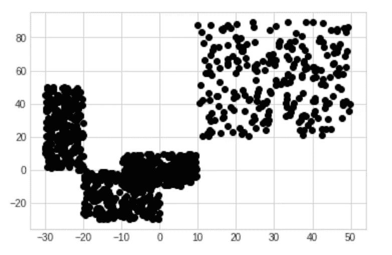
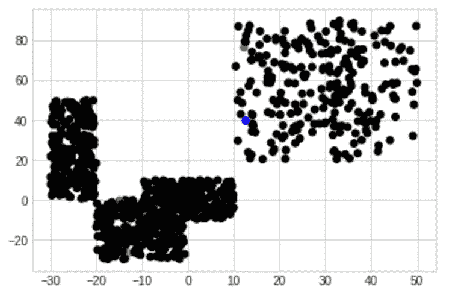
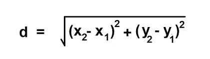
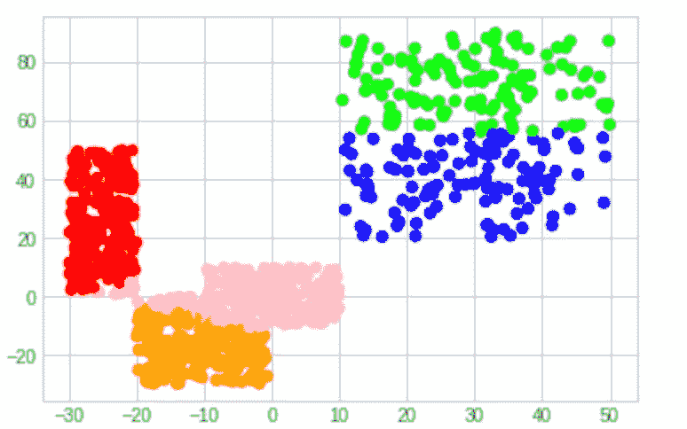
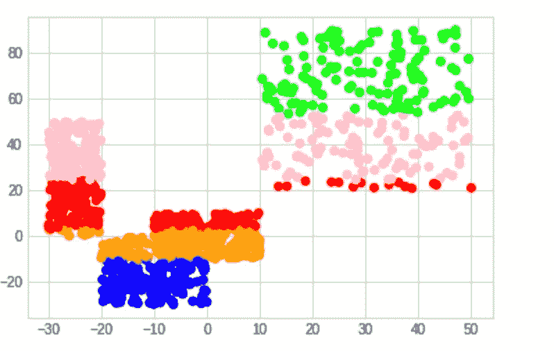

# k 均值聚类

> 原文：<https://levelup.gitconnected.com/k-means-clustering-c7a78b0fd1d3>

今天，我们将快速浏览一个二维数据集的 K-Means 聚类示例。如果你想跟进，下面是 ipynb 的链接。

 [## k 表示聚类

colab.research.google.com](https://colab.research.google.com/drive/1fM2SLTfZpr7NoHO2cCINsMK-wCqjQe-r) 

在前两个单元格中，我们导入所需的库，然后使用不同的范围创建一组随机点。

我们图表的输出

接下来，我们将创建我们的彩色地图，我们将有 6 种颜色，1 个用于我们的 5 个集群，1 个用于开始的黑色。然后我们为每 5 种颜色随机分配 1 个点作为开始，这些是开始的 k 个质心。

现在我们将编写一个简单的函数来计算两点之间的笛卡尔距离(我们将使用它来决定哪些点属于哪个簇。

现在我们已经设置好了一切，我们可以开始聚类算法了

# 算法

## 1.对于数据集中的每个点

*   计算到 k 个质心的距离
*   将该点指定给最近的质心

## **2。对于每个点 k 组**

*   获取第 k 组中各点的 x 和 y 平均值
*   将第 k 个组的质心更新为该平均值

在 K-Means 的一个生产用例中，我们将重复运行这个算法，直到我们到达一个阈值以下的点，这些点的组在一次迭代中被改变。对于我们的玩具例子，我们可以只运行细胞几次。下面是运行该单元几次的输出。

你可以在不同维度空间的许多不同媒介中使用这种技术。例如，我们可以对 3D 空间中的点进行分组，以获得照片中的 3 种平均颜色，我们可以采用任意 n 维向量来获得任何空间中的组。我们还可以修改 difference 函数，根据其他度量对事物进行分组(比如字符串 diff 表示字符相似性，对具有相似字符的单词进行分组)。

例如，如果我们更新距离函数，将 y 的差值提高到 4 的幂而不是 2(这将为 y 点相距较远的点提供更大的距离值)，我们将得到以下结果。

这里我们可以看到我们的聚类喜欢将 y 个点组合在一起。