# k-表示循序渐进

> 原文：<https://levelup.gitconnected.com/k-means-manual-implementation-9f6fd9375b86>

聚类算法有助于将数据分组为相似的组或簇。有许多不同的聚类方法。在这篇文章中，我们来看看最流行的聚类算法之一:K-Means。该算法的目标是通过质心识别每个聚类。接下来的动机是理解 K-Means 算法是如何实现的。包含的代码不是为了用于生产，而是为了理解算法如何学习聚类。

我们首先导入我们将使用的相关库。

```
import numpy as np
import matplotlib.pyplot as plt
from sklearn.cluster import KMeans
```

每个算法都需要某种初始化。结果表明，K-Means 对质心的初始化非常敏感。有很多方法可以初始化质心𝜇_k.，我们实现了文献中所说的 *K-Means++* 初始化。我们通过随机选择一个数据点来初始化第一质心𝜇_1:

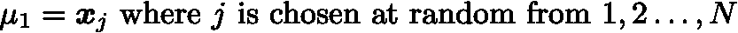

对于每个后续质心，我们希望选择一个数据点，该数据点很有可能远离前一个质心。假设已经选择了前 k-1 个质心:

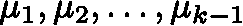

我们要选择下一个，让它大概率远离上一个。每次我们选择一个质心，我们从原始数据集中删除相应的数据点。

因此，我们开发了集合{1，2，…，N-k}上的分布𝜈(其中数据集已经被重新索引)。这种分布使得选择第 I 个数据点的概率与其自身和最后选择的质心之间的平方距离成比例。

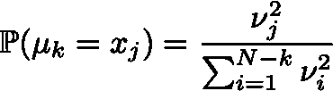

```
def initialize_centers(X,K):
    '''Implements K-Means++ initialization given the data matrix X and the number of cluster K
    Input:
        X - shape (N, D) - data matrix containing N examples of D-dimensional data
        K - a positive integer - the number of clusters

    Output:
        mu - shape(K,D) - K centroids each of which is a D-dimensional vector
    '''

    N,D = X.shape #find out the number of example and the dimesion of the data
    mu = np.zeros((K,D)) #initialize the variable that will store the K (D-dimensional) centroids
    idx = np.random.randint(0,X.shape[0]) #choose an index at random
    mu[0] = X[idx] #assign the respective data point as the first centroid
    X = np.delete(X,idx,axis=0) #remove the chosen data point from the data set.
    for k in range(1,K): #for each of the subsequent clusters
        #compute the square-norm of the different between each data point and the previous centroid
        nu = np.linalg.norm(X-mu[k-1],axis=1)**2 
        #divide these square-norms by their sum to get a distribution
        nu = nu / np.sum(nu)
        #choose an index at random from the distribution
        idx = np.random.choice(np.array(range(X.shape[0])),1,replace=False,p=nu)
        #assign the centroid of the k^th cluster as the respective data point
        mu[k] = X[idx]
        #remove the selected data point from the data matrix
        X = np.delete(X,idx,axis=0)
    #return the centroids
    return mu
```

你可能知道，许多机器学习算法通过优化“好”(最大化)或“坏”(最小化)的某种衡量标准来工作。在 K-Means 算法中，我们定义了一个我们想要最小化的损失函数(“坏性”)。这个函数计算每个集群中的“坏性”。这是通过计算分配给一个聚类的每个数据点与该聚类的质心之间的平方距离来实现的。失真损耗就是所有这些平方距离的总和。因此，如果一个数据点离质心不够近，它将对损耗产生很大的影响。

```
def distorsion_loss(X,mu, Z):
    '''Given the data matrix X, the current set of centroids mu
    and the assignment-matrix Z (also called a latent variable),
    computes the distrortion-loss

    Input:
        X - shape (N, D) - data matrix containing N examples of D-dimensional data
        mu - shape(K,D) - K centroids each of which is a D-dimensional vector
        Z - shape (N, K) - each element in the row contains exactly one 1 and the rest zero
            indicating the assignment of the respective data point to the cluster.
            For example Z_{53}=1 means that the 5th data point belongs to cluster 3 (4th cluster)
    '''
    K = mu.shape[0] #get the number of cluster by looking at how many centroids there are
    loss = 0 #initialize the loss to zero
    for k in range(K): #for each cluster
        #get the data points assigned to that cluster
        X_k = X[Z[:,k]==1]
        #compute the square-dstiance between each of these data points and the centroid
        D=np.linalg.norm(X_k-mu[k],axis = 1)**2
        #accumulate the loss
        loss += np.sum(D)
    #return
    return loss
```

我们现在已经准备好训练 K-Means 算法。培训将按如下方式进行:

1.  初始化质心:mu_init = initialize_centers(X，K)
2.  更新分配矩阵。每个数据点被分配到最近的质心。
3.  更新质心。新的质心是它们各自聚类内的数据点的平均值。
4.  记录 distorion_loss。如果当前损失和先前损失之间的变化小于容差，或者我们已经达到最大迭代次数，则停止，否则转到步骤 2。

```
def train_kmeans(X,K,mu_init,max_iter=10,tol=1e-4):
    '''Train the K-Means algorithm using the data matrix X, the number of clusters K,
    and the initial centroids mu_init

    Input:
        X - shape (N, D) - data matrix containing N examples of D-dimensional data
        K - a positive integer - the number of clusters
        mu_init - shape(K,D) - initial K centroids each of which is a D-dimensional vector
        max_iter - positive integer (default 10) the maximum number of iterations
        tol - positive number (default 1e-4) the tolerance which determines that
                the distorion_loss has converged.
    '''
    N = X.shape[0] #read in the number of data points
    mu = mu_init #initialize mu with mu_init
    loss_trace = [] #initalize an array to keep track of the losses
    mu_trace = [] #initialize an array to keep track of the centroids
    Z_trace = [] #initialize an array to keep track of the assignment matrices
    for it in range(max_iter): #for each iteration
        #Update cluster indicators
        Z = np.zeros((N,K)) #initialize the assignment matrix
        for i in range(N): #for each data point
            #compute the square distance between the datapoint and all the centroids
            d = np.linalg.norm(X[i]-mu,axis=1)**2
            #select the index of the smallest distance (corresponding to the closest centroid)
            j = np.argmin(d)
            #update the assingment matrix by assigning the i^th data point to the j^th cluster
            Z[i,j]=1

        #Update centroids
        N_k = np.sum(Z,axis=0) #count the number of data points in each cluster
        for j in range(K): #for each cluster
            #sum up the data points
            mu[j] = np.sum(X[Z[:,j]==1],axis=0)
            if N_k[j] > 0: #if there is at least one data point in the cluster
                mu[j] = mu[j] / N_k[j] #divide to get the average, the centroid
        loss_ = distorsion_loss(X,mu,Z) #compute the loss
        loss_trace.append(loss_) #record the loss
        mu_trace.append(mu) #record the current value of mu
        Z_trace.append(Z) #record the current assignment matrix
        if len(loss_trace) > 1: #if we have at least 2 iterations
            if abs(loss_trace[-2]-loss_trace[-1]) < tol: #check convergence
                return mu, Z, loss_trace, mu_trace, Z_trace #return if loss has converged
    #return
    return mu, Z, loss_trace, mu_trace, Z_trace
```

我们找到了。K 均值算法。让我们生成一些玩具数据来看看 K-Means 的表现。

我们将生成以下列点为中心的 3 个集群:

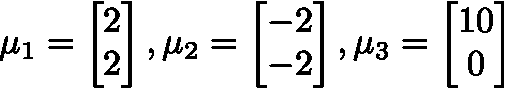

这些中心周围的所有数据点将根据具有单位(各向同性)协方差矩阵的多元正态分布进行分布:

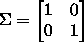

```
#centroids
mu_1_actual = np.array([2,2])
mu_2_actual = np.array([-2,-2])
mu_3_actual = np.array([10,0])
#covariance matrix
sigma = np.eye(2)

#Clusters
X1 = np.random.multivariate_normal(mu_1_actual,sigma,100)
X2 = np.random.multivariate_normal(mu_2_actual,sigma,100)
X3 = np.random.multivariate_normal(mu_3_actual,sigma,100)

#Data matrix:
X = np.concatenate([X1,X2,X3],axis=0)#Visualize the data and visualize the actual clusters.

fig = plt.figure(figsize=(20,5))
plt.subplot(121)
plt.scatter(X[:,0],X[:,1])
plt.subplot(122)
plt.scatter(X1[:,0],X1[:,1],c='r')
plt.scatter(X2[:,0],X2[:,1],c='g')
plt.scatter(X3[:,0],X3[:,1],c='b')
plt.show()
```

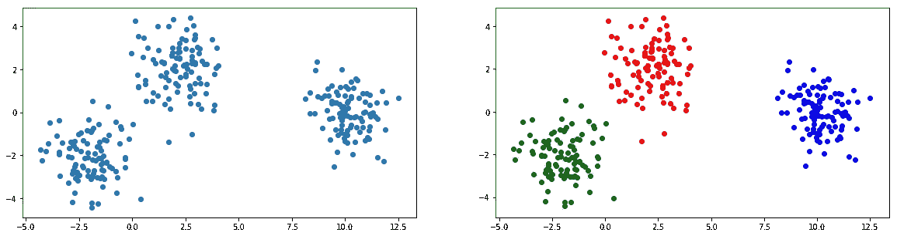

```
mu_init = initialize_centers(X,3)
mu,Z,loss_trace, mu_trace, Z_trace =train_kmeans(X,3,mu_init,max_iter=300,tol=1e-4)fig = plt.figure(figsize=(20,5))
plt.subplot(121)
plt.scatter((X[Z[:,0]==1])[:,0],(X[Z[:,0]==1])[:,1],color='r')
plt.scatter((X[Z[:,1]==1])[:,0],(X[Z[:,1]==1])[:,1],color='g')
plt.scatter((X[Z[:,2]==1])[:,0],(X[Z[:,2]==1])[:,1],color='b')
plt.scatter(mu[:,0],mu[:,1],color='black',marker='o',s=200,alpha=0.75)
plt.title('K-Means with K=3')
plt.xlabel('x_1')
plt.ylabel('x_2')
plt.subplot(122)
plt.plot(range(len(loss_trace)),loss_trace)
plt.title('Distorion Loss')
plt.xlabel('Iteration')
plt.ylabel('Loss')
plt.show()
```

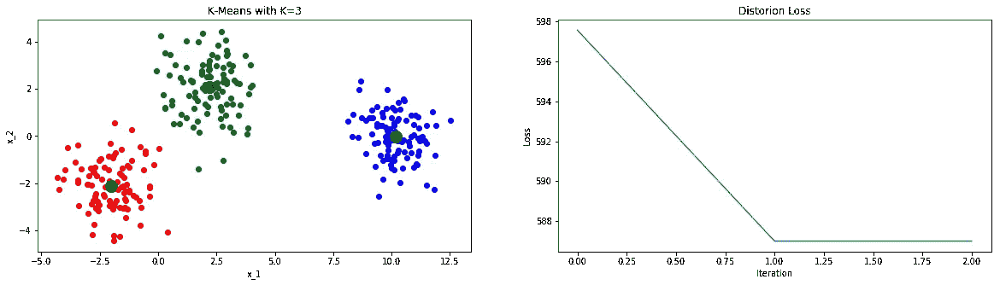

还不错。看起来算法收敛了一些迭代。

```
fig = plt.figure(figsize=(20,25))
for i in range(len(loss_trace)):
    plt.subplot(521+i)
    Z_i = Z_trace[i]
    mu_i = mu_trace[i]
    plt.scatter((X[Z_i[:,0]==1])[:,0],(X[Z_i[:,0]==1])[:,1],color='r')
    plt.scatter((X[Z_i[:,1]==1])[:,0],(X[Z_i[:,1]==1])[:,1],color='g')
    plt.scatter((X[Z_i[:,2]==1])[:,0],(X[Z_i[:,2]==1])[:,1],color='b')
    plt.scatter(mu_i[:,0],mu_i[:,1],color='black',marker='o',s=200, alpha=0.75)
    plt.title('Iteration:' + str(i+1) +'\nLoss:'+str(round(100*loss_trace[i])/100))
plt.show()
```

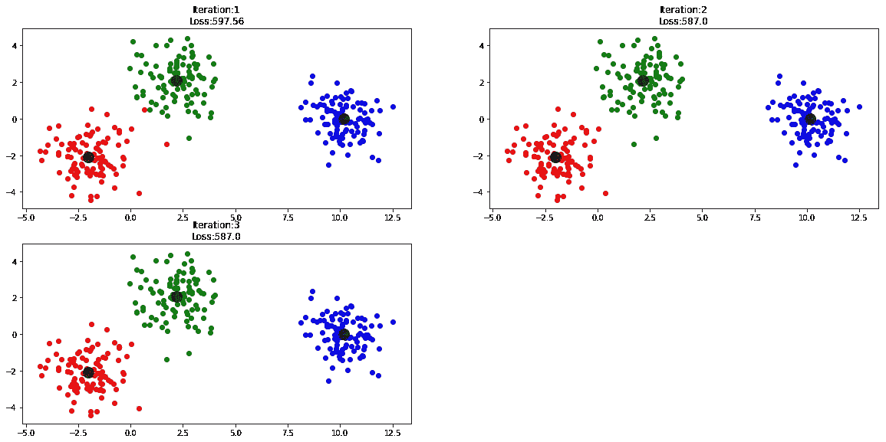

现在事情可能没这么美好了。K-Means 对初始化非常敏感。事实上，如果我们用不同的初始质心再运行一次，它看起来可能不会这么漂亮。

```
mu_init2 = initialize_centers(X,3)
mu2,Z2,loss_trace2, mu_trace2, Z_trace2 =train_kmeans(X,3,mu_init2,max_iter=300,tol=1e-4)fig = plt.figure(figsize=(20,5))
plt.subplot(121)
plt.scatter((X[Z2[:,0]==1])[:,0],(X[Z2[:,0]==1])[:,1],color='r')
plt.scatter((X[Z2[:,1]==1])[:,0],(X[Z2[:,1]==1])[:,1],color='g')
plt.scatter((X[Z2[:,2]==1])[:,0],(X[Z2[:,2]==1])[:,1],color='b')
plt.scatter(mu2[:,0],mu2[:,1],color='black',marker='o',s=200,alpha=0.75)
plt.title('K-Means with K=3')
plt.xlabel('x_1')
plt.ylabel('x_2')
plt.subplot(122)
plt.plot(range(len(loss_trace2)),loss_trace2)
plt.title('Distorion Loss')
plt.xlabel('Iteration')
plt.ylabel('Loss')
plt.show()
```

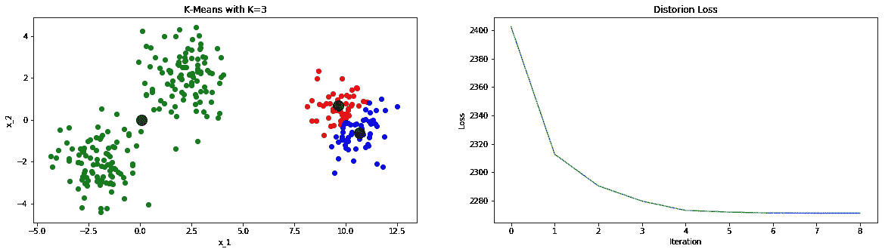

请注意算法如何收敛到更高的损失值，并且聚类不是我们想要的。现在在实践中，我们不知道集群应该是什么样子，这就是为什么我们首先要运行这个算法。那么我们如何克服这个障碍呢？实际发生的是 distortion_loss 函数有许多局部最小值。此外，K-Means 算法不能保证收敛到全局最小值。因此，在实践中，我们将使用不同的初始值运行 K-Means 几次，并选择具有最低收敛损失的结果。正如你在上面看到的，损失集中在 587 左右，而在第二次运行中，它集中在 2200 左右。

## k-表示使用 Sci-Kit 学习

为了进行比较，让我们使用机器学习领域的黄金标准 SciKit-Learn 软件包来运行 K-Means 算法。这实际上做了我们需要的。它会多次运行 K-Means，每次使用不同的初始值，然后选择最佳结果。

```
kmeans = KMeans(n_clusters=3, random_state=0,verbose=0).fit(X)clusters=kmeans.predict(X)
cluster_centers = kmeans.cluster_centers_
Z_sklearn = np.zeros((X.shape[0],3))
for i in range(X.shape[0]):
    Z_sklearn[i,clusters[i]]=1plt.scatter((X[Z_sklearn[:,0]==1])[:,0],(X[Z_sklearn[:,0]==1])[:,1],color='r')
plt.scatter((X[Z_sklearn[:,1]==1])[:,0],(X[Z_sklearn[:,1]==1])[:,1],color='g')
plt.scatter((X[Z_sklearn[:,2]==1])[:,0],(X[Z_sklearn[:,2]==1])[:,1],color='b')
plt.show()
```

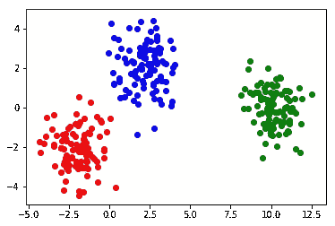

顺便说一下，有一种更简单的方法来给集群着色..

```
plt.scatter(X[:,0],X[:,1],c=clusters)
plt.scatter(cluster_centers[:,0],cluster_centers[:,1],color='black',marker='o',s=200,alpha=0.75)
plt.show()
```

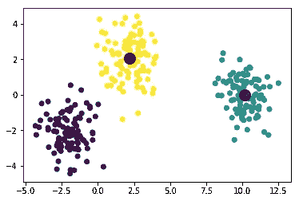

## 比较结果…

```
#converged loss from sklearn
distorsion_loss(X,cluster_centers,Z_sklearn)586.9973311742276#converged loss from our good resultdistorsion_loss(X,mu,Z)586.9973311742275#difference between our centroids and the ones found by sklearn
np.linalg.norm(np.sort(mu,axis=0)-np.sort(cluster_centers,axis=0),axis=1)array([1.25607397e-15, 5.20417043e-18, 1.83102672e-15])
```

都几乎为零。

我希望这篇文章对 K-Means 有所启发，K-Means 是当今无监督学习中最流行的聚类算法之一。在我的下一篇文章中，我们将考虑使用高斯混合的软聚类算法。

这是完整的 jupyter 笔记本。

如果你喜欢这篇文章，请花点时间给我一些掌声。