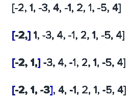
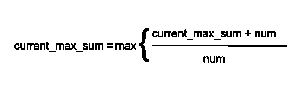
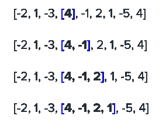
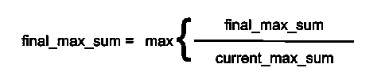

# Kadane 算法——在 O(n)时间和 O(1)空间求解最大子阵

> 原文：<https://levelup.gitconnected.com/kadanes-algorithm-solving-for-maximum-subarray-in-o-n-time-and-o-1-space-776290910090>

pc: [@christinhumephoto](https://unsplash.com/@christinhumephoto)

# 介绍

Kadane 的算法能够找到一个运行时间为 O(n)的数组中相邻子数组的最大和。众所周知，这种算法能够优雅地解决最大子阵列问题及其变体(参见 [LeetCode](https://leetcode.com/problems/maximum-subarray/) )。

如果你的工作遇到基因组[序列分析](https://en.wikipedia.org/wiki/Sequence_analysis)和[计算机视觉](https://en.wikipedia.org/wiki/Computer_vision)，你可能会遇到工业中的最大子阵列问题。

# 要旨

Kadane 的算法为结束于每个索引的所有子阵列找到可以从子阵列产生的最大值。

例如，在本例中，蓝色括号 **[]** 表示正在评估的子阵列。

第一行是原始的给定数组。第二行是仅保存值-2 的第一个子阵列。第三行是保存值-2 和 1 的另一个子数组。

这个序列将继续下去，直到我们到达数组的末尾，值为 4，索引为 8，在这里我们将理想地找到我们的问题的解决方案。

# 逻辑大纲

当我们到达一个新的指数，同时仍然试图找到结束于该指数的最大和时，我们有两个选项可以考虑来实现我们的目标:

1.  取在前一个索引处结束的最大和，并加上当前数( **current_max_sum + num** )
2.  或者仅使用当前号码( **num** )

两个选项的 alt 表示:current_max_sum 是任一选项的最大值

从上面的例子开始: **[-2，1，-3]** ，4，-1，2，1，-5，4]

**current_max_sum** 为-4(从-2 + 1 + -3 导出),下一个索引处的 **num** 为 4。如果我们选择选项 1，新的最大和将是 0(-4+4)；因此，不值得添加到当前数字，因此我们将选择第二个选项，并继续使用当前数字(4)。

未来的迭代如所讨论的那样继续，以最终找到子阵列[4，-1，2，1]具有最大和 6。

到目前为止，我们正在跟踪基于子阵列末端的当前最大总和。但最终，我们试图完成的是从子数组中找到最大和。

两个选项的 alt 表示:两个选项的最终和是最大的

继续同一个例子:[-2，1，-3，**【4，-1，2，1】**，-5，4]

在这个迭代**中，最终 _ 最大 _ 总和**是 6，(4 + -1 + 2 + 1)，并且在前一个索引(4 + -1 + 2) **中，当前 _ 最大 _ 总和**是 5。因为 6 大于 5，所以在最近的迭代中，**最终 _ 最大 _ 总和值**被更新为 6。

# **代码**

像所有算法一样，Kadane 的算法是语言不可知的，但是这里有一个 Python3 的实现例子，它结合了上面讨论的两个公式。

快乐编码(: