# 工程师的卡夫卡

> 原文：<https://levelup.gitconnected.com/kafka-for-engineers-975feaea6067>

## 每个软件工程师都需要了解这个变革工具

Gerard Lakerveld 在 [Unsplash](https://unsplash.com?utm_source=medium&utm_medium=referral) 上拍摄的照片

Kafka 是一个变革性的工具，也是当今许多基于事件的系统的关键组件。软件工程师——尤其是我们这些参与构建微服务的人——可能在某种程度上使用过 Kafka。然而，并不是我们所有人都真正了解卡夫卡。

在本文中，我们将从以下方面讨论软件工程师需要了解的关于 Kafka 的事情:

*   Kafka 的设计目的是什么，它与其他信息系统有何不同
*   卡夫卡的基本组成部分，包括那些我们作为工程师可以直接与之互动的部分，以及那些我们不能与之互动的部分
*   如何最有效地利用卡夫卡
*   如何避免误解或误用卡夫卡时常见的陷阱

此外，虽然 Kafka 适合行业中的许多用例，但我们将重点关注如何在微服务架构中最好地利用 Kafka。

# 卡夫卡是什么？

卡夫卡 2010 年出生于 LinkedIn。它是作为一种工具开发的，以提交日志的概念为中心，为该公司提供一个单一的统一发布-订阅平台，并解决其新的(当时)微服务架构提出的扩展需求。LinkedIn 在 2011 年开源了 Kafka。

在某些方面，卡夫卡似乎是长长的[消息队列](https://en.wikipedia.org/wiki/Message_queue)中的又一个工具。在 Kafka 出现之前，IBM MQ、Apache ActiveMQ、RabbitMQ 和硬件解决方案已经存在了一段时间。这些工具之间的基本前提是相同的:

*   软件组件(*生产者*)向中央队列发送一条谨慎的数据(一条*消息*)。一旦它的消息被发送，发布者就可以自由地执行其他操作(可能向队列发送更多的消息)。
*   一段时间后，不同的组件(*消费者*)将被通知队列上的消息，并将读取消息并处理它。

工程师们通常希望根据各种标准将它们与 Kakfa 进行比较，如性能、特性、成本、可用性等。这些可能都是需要考虑的重要事情。但是他们忽略了一个事实——从根本上说——这些工具是为做不同的事情而设计的。尤其是卡夫卡，不仅仅是另一个信息队列。

## 消息队列 vs 卡夫卡

首先，让我们看看典型的消息队列是做什么的。正如我们之前讨论的，一个*生产者*将发布一条消息到一个队列中。一个*消费者*——他已经订阅了那个队列——将会收到消息，结果可能会执行一些工作。此时，消息从队列中消失。

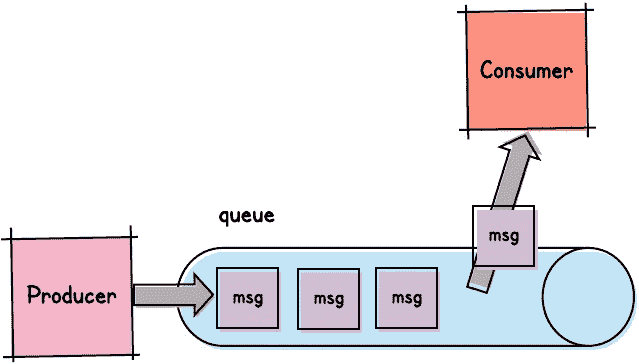

典型的消息队列及其使用者是如何工作的

这是一种简化，但它本质上是大多数消息队列的工作方式。

卡夫卡的作品不同。我们仍然创建发布消息的发布者。但是 Kafka 出版商发布到一个*事件日志*，而不是发布到一个队列。

这似乎是一个微小的区别，但它非常重要。有了队列，最前面的消息将被有效地弹出并传递给消费者。然而，有了事件日志，*消费者*决定它接下来想要读取哪个消息*。*

这主要是由两个因素造成的:

*   消费者收到消息后，不会将其从事件日志中删除。相反，它们被无限期保留。*(注意:在实践中，为了节省空间/成本，邮件通常会在超过指定的保留策略(通常以天、周或月为单位)后被清除)*。
*   消息包含时间戳和*偏移量*。客户端跟踪它们最近处理的消息的偏移量，以便它们可以请求下一个偏移量。

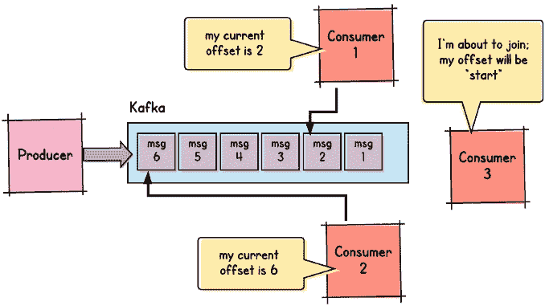

卡夫卡和他的消费者是如何工作的

这意味着卡夫卡允许我们做这样的事情:

*   给定主题附加任意数量的消费者。所有发布的消息都会通知他们。
*   将新的消费者附加到主题，并允许它处理该主题上的所有消息。这包括在消费者订阅之前已经发布的消息。
*   向特定消费者重播消息。如果消费者错误地处理了一个或多个错误，消费者的代码可以被修复，然后它的偏移量可以被“倒回”到第一个有问题的消息(当然，消费者随后将重新消费该点之后的所有消息。)

## 这改变了我们对使用卡夫卡的看法

尽管这些差异看起来很微妙，但它们从根本上改变了我们使用 Kafka 的方式，以及我们使用典型消息队列的方式。

我们通常使用消息队列将*同步操作*分解成*异步部分*。换句话说，消息通常在复杂操作的过程中被发布到一个队列中，并期望特定的使用者能够获得消息并继续操作。

例如，我们可能有一个接受客户订单的系统。我们的订单系统可能有点复杂，所以我们可以把它分成异步阶段。例如:

*   阶段 1 可能涉及验证用户是否正确输入了所有必需的信息。
*   阶段 2 可能涉及验证客户订购的产品是否有库存。
*   第 3 阶段可能涉及与我们的运输提供商协调，以确保订单能够得到处理。

在单个同步请求线程中，这可能太多了。所以在每个阶段之后，我们发布一条消息，这样下一个阶段的消费者就会收到这条消息并继续工作。

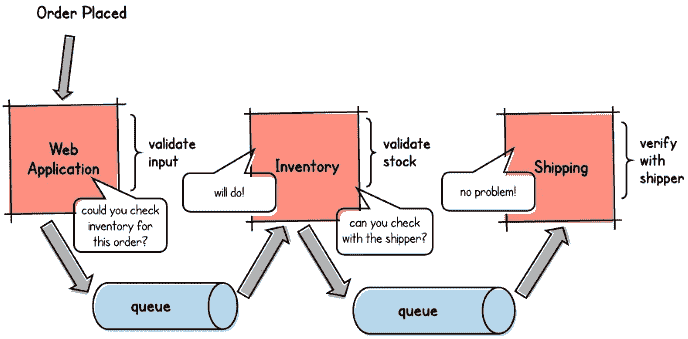

另一方面，当我们*完成*一个操作时，我们通常使用卡夫卡，向可能需要对该操作做出反应的其他系统发送通知。此外，任何数量的消费者都可以订阅；他们都会收到通知。

例如，我们的团队可能负责上面描述的整个订单处理系统。在领域驱动的设计术语中，我们拥有*订单处理* [有界上下文](https://medium.com/datadriveninvestor/if-youre-building-microservices-you-need-to-understand-what-a-bounded-context-is-30cbe51d5085)。一旦订单得到处理，我们将发布一个事件。其他有界环境中的消费者可以订阅，得到这些事件的通知，并采取他们需要的任何行动。

例如，不同的*通知*团队可能负责向客户发送电子邮件和 SMS 消息。他们可能会订阅接收我们的消息，以便通知客户他们的订单正在处理中。另一个团队可能拥有 *Fulfillment* Bounded 上下文，因此将订阅以便他们可以开始订单履行流程。

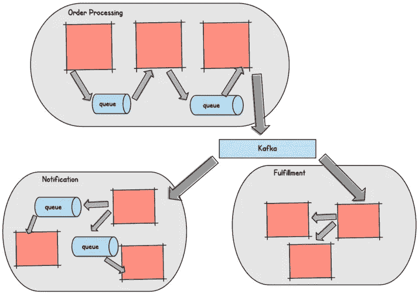

这里，我们使用消息队列在我们自己的有界上下文中处理谨慎的操作。我们使用 Kafka 来通知其他有界上下文我们完成的操作。

## 消息队列，Kafka，命令和事件

另一种看待 Kafka 和大多数消息队列的区别的方式是 [*事件*和*命令*](https://medium.com/better-programming/commands-and-events-in-a-distributed-system-282ea5918c49) 。简而言之，一个 ***事件*** 就是一个已经完成的操作。另一方面， ***命令*** 表示正在进行的操作，该操作尚未完成(或失败)。

在我们的例子中，一个完成的订单(甚至是一个失败的订单)代表一个*事件*。刚刚提交但尚未提交的订单代表一个*命令*。

消息队列通常用于处理*命令*。它们通常在单个复杂操作中涉及的*耦合*组件之间异步移动数据。

正如我们上面讨论的，Kafka 被设计来处理分布式*事件*。它的优点是允许*解耦的*系统对完成的操作做出反应。

有了这样的理解，让我们来看看卡夫卡的一些关键组成部分。

# 主题

当我们使用卡夫卡时，我们只想把信息发送给感兴趣的消费者。例如，给定的消费者可能希望在下订单时得到通知，但可能对任何其他事件不感兴趣。

卡夫卡为此提供了*主题*。主题是我们发布某种类型消息的渠道。如果您使用过 Kafka，那么您可能必须指定一个主题来发布消息，或者从该主题消费消息。

所以在上面的例子中，我们可以定义一个*订单创建*主题。每当在我们的 OrderService 中创建一个订单时，我们都会发布一条关于该主题的消息。任何对新订单感兴趣的消费者都会订阅该主题。

## 主题和模式

但这比这个简单的定义所暗示的有更大的含义。主题中生成的所有消息必须传达相同类型的数据。此外，发布到主题的每个消息都必须遵循*完全相同的模式*。

为什么？这个话题的另一端会有消费者。他们需要知道如何解析和理解他们消费的每一条消息。模式是完成这一任务的契约。

如果你编写过微服务 API(比如说 ReST)，你可能很熟悉避免对 API 进行破坏性修改的必要性。如果我们有一个返回 order 对象的 *get-order* 端点，我们不应该以破坏现有 ReST 客户端的方式修改返回的对象。相反，我们应该保持向后兼容性。

避免对 Kafka 主题模式的破坏性改变至少同样重要，甚至可能更重要。

这是为什么呢？考虑一个包含消息的主题，其中一些消息符合模式的版本 1，另一些消息符合版本 2——包含重大更改。由于卡夫卡的性质，每种类型的信息可以在同一主题中共存相当长的时间——几天，甚至几个月。如果这些版本彼此不兼容，那么为版本 1 编写的使用者在尝试使用符合版本 2 的消息时会崩溃，反之亦然。

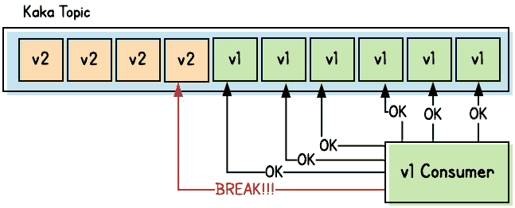

出于这个原因，许多团队更喜欢使用消息格式，如 [Avro](https://www.confluent.io/blog/avro-kafka-data/) 来编码他们的消息。除了是一个快速、紧凑的二进制协议，Avro 还允许我们为单独的主题创建和注册一个模式。这些模式不仅确保发布的消息符合一致同意的协议，而且当我们发展模式时，它们还帮助我们加强向后和向前的兼容性。

那么，*我们可能会问，如果我们真的需要对一个模式做出突破性的改变呢？*最好的解决方案是简单地创造一个全新的话题。我们的消费者可以升级他们的消息处理逻辑，订阅新旧主题。一旦消费者确信他们已经处理了所有的旧消息，他们就可以取消订阅旧消息。

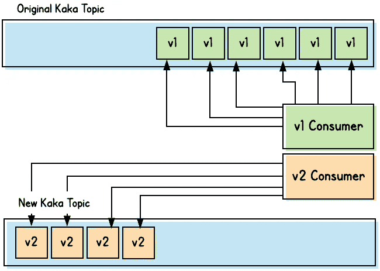

# 划分

卡夫卡的主题被进一步细分为一组“日志”，也被称为*分区*。因此，当一个生产者向一个主题写消息时，它实际上是将消息写到主题中的一个*分区。*

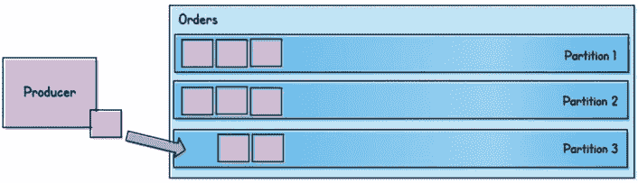

分区的主要目的是可伸缩性和并发性。给定主题的每个分区可以驻留在一个单独的节点上。这使我们能够扩展并提供容错，因为单个节点故障不会导致整个管道瘫痪。它还允许多个消费者并行消费单个主题。此外，单个消费者本身可以拆分成多个实例，这些实例可以并行地从主题中消费。

## 分区和并发，而不是保持顺序

分区使得扩展和提高我们的 Kafka 管道的性能变得非常容易。但这通常会带来很多工程师直到发生时才预见到的代价。

这个代价就是数据完整性。

怎么会？一句话:*点餐*。在许多情况下，我们发布的数据的消费者必须按照数据生成的顺序处理数据。让我们举一个简单的例子。假设我们有用户喜欢改变他们的屏幕名称，并且经常这样做。我们希望记录这些更改，并且在任何给定的时间向他们显示他们最近选择的屏幕名称。

因此，我们可能有一个服务，允许用户修改他们的屏幕名称。一旦服务提交了这样的更改，它就将更改作为一个事件发布到 Kafka 主题(更准确地说，发布到该主题的一个分区)。现在想象一个消费者正在收听这个话题，这样它就可以知道任何给定用户的最新屏幕名称。

现在想象一个给定的用户正在快速更改他们的屏幕名称…他们就是不能选择！在提交了无数次修改后，他们最终选定了自己的网名。与此同时，所有这些临时变化都被记录下来并作为事件发布。

如果这些事件跨主题的多个分区发布，那么它们将被异步发送和处理。因此，不能保证最终的屏幕名称实际上是消费者处理的屏幕名称。

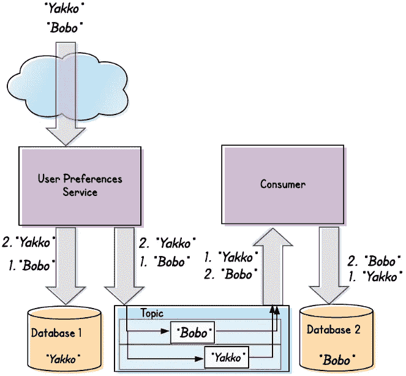

用户首先将其屏幕名称更改为“Bobo”，然后更改为“Yakko”。因此“Yakko”被保存在用户偏好服务的数据库中。然而，Kafka 内部出现了竞争条件，消费者在“Bobo”变化之前处理“Yakko”变化。所以它的数据库最终显示“波波”。维奥拉。我们的数据不同步。

## 分区键

我们希望与单个用户相关联的所有消息都被路由到同一个分区。这样，我们可以保证它们将按顺序发布和使用。

为此，Kafka 允许我们指定一个*分区键*。从 Kafka 代理的角度来看，分区键是一个值，它对该值应用一种算法，以确定将消息发布到哪个分区。通常，该算法将涉及某种散列函数，随后是主题中分区数量的模。

从我们的角度来看，分区键应该唯一地标识我们发布的任何消息的主题。那么我们应该选择什么作为我们的分区键呢？在我们的例子中，我们*可以*选择屏幕名称作为分区。让我们看看如果我们做了会发生什么。

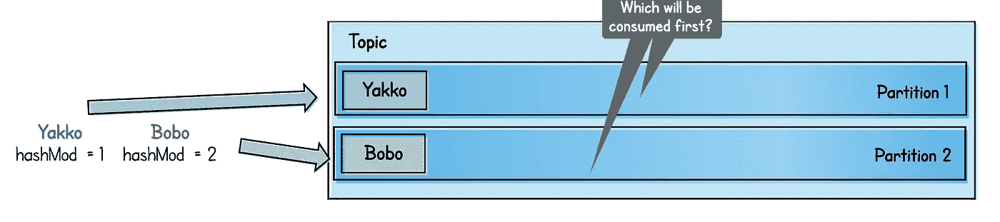

这里，我们选择了屏幕名称作为分区键

当用户选择屏幕名称“Bobo”时，散列算法可能产生值 *2* 。因此，消息将被路由到我们主题的分区#2。当同一个用户随后选择“Yakko”作为他们的屏幕名称时，该算法可能会产生一个值 *1* ，因此同一个用户的下一个编辑将被发布在分区#1 上。

那不行。

相反，我们应该简单地将用户的惟一标识符指定为分区键。假设我们已经为用户分配了某种形式的 ID——如果不是 UUID，可能是数字数据库 ID。如果我们使用它作为我们的分区键，那么一个*单个给定用户*的所有屏幕名称改变消息将被路由到*同一个分区*。因此，在另一端的任何消费者将能够按照事件发生的顺序处理事件。

## 分区、排序和聚合

我们关于选择分区键的讨论与[集合](https://medium.com/better-programming/why-your-microservices-architecture-needs-aggregates-342b16dd9b6d)的概念相吻合，这是一种源自领域驱动设计的设计模式。如果我们围绕聚合设计了微服务，那么确保我们发布到 Kafka 的事件能够按照它们发生的顺序进行处理就变得容易多了。

为什么[聚合本身就是一个话题](https://medium.com/better-programming/why-your-microservices-architecture-needs-aggregates-342b16dd9b6d)，但要点是聚合是构成原子单位的实体的集合。对聚合中任何实体的更改都代表对整个聚合的更改。此外，每个聚合都包含一个根实体。通过这个根实体——并且只有通过这个根实体的*——集合才能被引用。*

一个典型的例子是用户实体。我们的模型可能定义以下实体:

*   一个核心*用户*对象(具有名字/姓氏、出生日期、性别等属性，在我们的例子中是屏幕名称)。
*   联系方式，如*邮箱*、*电话*、*地址*等。

这些实体一起将形成我们的用户集合。此外，用户实体本身是聚合的根。要访问用户聚合，任何其他实体都必须引用用户实体的 ID。没有一个外部实体可以直接引用一个电话实体。

这种设计模式使得向 Kafka 订购更加简单。在上面的示例中，每当用户更改他们的屏幕名称时，我们只需将整个用户集合(按用户 ID 划分)作为消息发布到主题。如果用户随后进行了另一项更改(比如，更改他们的姓氏和屏幕名称)，我们会再次将整个用户聚合(再次按用户 ID 进行分区)发布到主题。

这确保了我们的消费者可以按照发生的顺序处理给定用户的任何和所有更改。

# 消费者群体

我们前面提到过，一个消费者可以被分割成多个实例。这些消费者中的每一个都将属于一个单独的消费者群体。使用者组的目的是确保来自一个主题的所有消息都被应用程序读取和处理，同时允许并行处理。

创建一个消费者组的方法是首先创建一个消费者，用一个`group.id`对其进行配置，并为其订阅一个特定的主题。然后，您可以使用相同的`group.id`创建任意数量的额外消费者，并为他们订阅相同的主题。Kafka broker 会将每个消费者分配到主题的一个或多个分区。

正如您可能猜到的，最佳方法是为一个主题创建与该主题中的分区数量相同的使用者组(这将导致分区与组中的使用者之间的一对一映射)。

任何额外的消费者将只是空闲的，没有被分配给任何分区。

更少的消费者意味着一些消费者将与多个分区相关联(这当然不是世界末日，但可能导致一个消费者承担大部分消息)。

部署消费者组的最常见方式——至少在微服务领域——是简单地部署包含消费者代码的微服务的多个实例。只要所有实例的配置相同(至少在主题和 group.id 方面)，它们在部署时将形成一个使用者组。

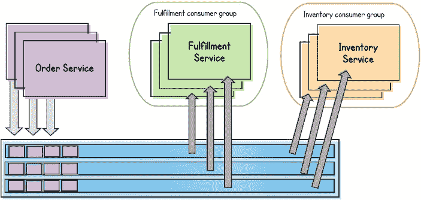

消费者组对于处理负载是有用的。但是当我们不小心的时候，它们会给我们带来潜在的问题，尤其是在测试这样的事情上。假设我们有以下开发环境:

*   我们的团队正在开发一个微服务，它消费并处理来自*订单创建的*主题的事件
*   我们有一个集中的 Kafka 开发集群，我们的微服务的所有开发实例都向该集群生成消息，并且所有开发微服务都从该集群消费消息。

我们团队的每个成员在微服务的不同部分并行工作。在测试时，每个团队成员需要消费来自*订单创建的*主题的事件。因此，作为测试变更的常规部分，团队成员将发布该主题的事件。会发生什么？

如果我们非常幸运，每个工程师都会看到他们产生的消息。然而，更有可能的是，工程师只会偶尔看到他们发布到该主题的任何消息，如果他们看到任何消息的话。

发生了什么事？

所有工程师的测试微服务都属于同一个消费者群体。因此，如果它们都订阅了同一个主题，那么每个主题将被分配到一个特定的分区。因此，任何给定的工程师只能看到针对该主题生成的消息的子集。

我们如何解决这个问题？我们只需修改我们的开发配置，将每个工程师的测试实例分配给不同的 group.id。这样，每个工程师的实例将组成自己的消费者组，因此，每个工程师将消费所有的消息。(当然，每个工程师都应该期望消费他们队友产生的消息。)

# Kafka 消费者和网络服务器

当我和不同的团队一起工作时，我会不时地看到某种类型的误解。谈到多线程，开发人员有时会像看待 Web 应用服务器一样看待 Kafka 消费者。实际上，两者处理完全不同的用例，需要被认为是完全不同的野兽。

让我们看一个典型的 web 服务器。一般来说，web 服务器会公开允许调用者提交数据的端点。以我们前面的例子为例，我们可以创建一个允许客户提交订单的 web 应用程序。

现在，如果我们有一个成功的企业，我们将期望同时处理多个客户的订单。

为此，任何现代的 web 应用程序都将被构建来处理并发请求。多个订单可以几乎同时提交、并发处理和提交。

这些订单最终提交的顺序可能不同于它们被放置的顺序。这很好。多年来，这就是我们成功构建和运行 web 应用程序的方式。

现在让我们看看基于 Kafka 的事件处理基础设施。毫无疑问，我们的消费者将处理至少和我们的 web 服务器一样多的负载。那么，难道我们不希望我们的消费者同时处理消息吗？

对于卡夫卡的消费者来说，答案有点复杂。

## 记住命令和事件？

之前，在讨论 Kafka 和大多数消息队列的区别时，我们谈到了*命令*和*事件*的区别。在这种情况下，网络服务器处理*命令*。例如，当用户提交一个订单时，那就是一个 ***命令*** 。此时，订单尚未处理。更多的是一种愿望，一种希望，订单最终通过。

这有几个后果:

*   ***一个命令可以失败，没事*** 。当然，没有用户希望看到一个错误屏幕，告诉他们输入了无效的信用卡号。或者有一个未知的错误，但是请稍后再试。但是在更大的方案中，如果命令未能完成，不会导致数据损坏或不一致。
*   ***命令可以按任意顺序完成*** 。即使用户 A 在用户 B 之前提交订单，如果用户 B 的订单最终被首先提交也没关系。

然而，当卡夫卡的消费者听到订单时，订单已经完成了。现在是 ***事件*** 。它不再有失败的机会。反过来，这也有其自身的影响:

*   ***该事件必须由任何感兴趣的消费者处理*** 。否则会导致数据损坏或不一致。例如，如果一个订单成功提交，但随后履行消费者决定缺少一条信息，因此忽略该事件，该客户将永远不会收到他或她的购买。
*   ***事件处理的顺序往往很重要*** 。一旦提交了一系列命令，它们将按一定的顺序提交。在这一点上，以相同的顺序处理产生的事件通常是至关重要的。前面我们已经看到了一个例子(涉及用户的屏幕名称)来解释原因。扩展我们的订单示例，我们可能允许用户创建一个后续订单，有效地修改他们刚刚下的订单。在原始订单之前处理后续订单*可能会产生严重后果。*

## 不要丢弃事件

我们的订单下达 web 应用程序还将验证客户下达的订单。我们需要确保提供了所有必需的信息，用户输入了有效的信用卡号，等等。如果有任何信息不正确，我们可以——也应该——拒绝该订单，并向用户发回一条错误消息。

因此，许多工程师认为在使用消息时也应该进行这样的验证。然而，正如我们刚刚指出的，事件*必须由感兴趣的消费者*处理。因此，如果必须处理一个事件，那么消费者如何首先对该事件执行验证呢？

答案通常是*不应该*。验证是我们可以也应该对命令做的事情，在这种情况下，我们有机会让命令失败。但是一旦这个命令变成了一个事件，那么不管发生什么情况，这个事件都需要被处理。

换句话说，*不要丢事件*。

尽管如此，我们可能会争辩说，我们已经从另一个团队的[有界上下文](https://medium.com/datadriveninvestor/if-youre-building-microservices-you-need-to-understand-what-a-bounded-context-is-30cbe51d5085)中收到了一个没有被正确验证的事件，现在，我们不能正确地处理该事件。在这种情况下我们该怎么办？

没有很好的答案，但是无论我们选择什么答案，它仍然必须符合不放弃事件的原则…至少，不是永久的。

## 事件和并发

我不止一次地看到组织围绕 Kafka 消费者编写包装器，这些包装器在接收到来自 Kafka 的消息时会产生一个新的线程来处理该消息。毕竟我们用的是多线程的 web 服务器，为什么不写多线程的 Kafka 消费者呢？

问题是，我们刚刚重现了我们之前讨论过的消息排序问题，只是这次问题缩小到了单个应用程序。

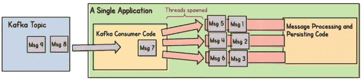

在我们发现如何使用分区键之前，我们面临着与我们的主题相同的问题…我们的消息将以什么顺序被处理和持久化？

一些应用程序可能不关心消息的排序。那很好…除了两件事:

*   像这样的代码往往会在多个应用程序中重用。正如我们许多人亲眼所见，通常不用多久，这些代码就会进入一个库，成为组织的官方 Kafka 消息处理实现。
*   即使是最初不在乎点餐的消费者，后来也可能会发现在乎。

尽管如此，如果我们有大量的事件，我们不一定要在一个线程上处理它们。那我们该怎么办？

*   扩展我们的服务，这样我们就能在消费群体中增加更多的消费者。这就是消费者群体概念产生的原因。
*   如果我们必须在一个运行的应用程序中利用多线程，那么我们可以在应用程序中初始化多个消费者。同样，我们应该确保每个消费者都被配置为属于同一个消费者组。
*   如果我们*绝对必须*编写我们自己的线程代码，那么我们需要以这样一种方式来编写它，即它可以沿着分区键(例如，由消息表示的集合的 ID)来划分传入的消息，并使用类似的散列方法来确保相同的集合总是被路由到相同的线程。

# 最终消息

Kafka 是无数现代微服务架构的关键组件。尽管一些工程师有误解，Kafka 不仅仅是另一个消息队列，而是一个事件流平台。它是为跨解耦系统的分布式事件而设计的，而不是在耦合的组件之间传递消息。

## 有没有类似的产品？

如果 Kafka 实际上与传统的消息队列如此不同，如果它对今天的许多系统如此重要，那么您可能会想，是否出现了任何类似的产品？

Kafka 确实在开源事件流媒体平台领域占据了至高无上的地位。然而，云提供商已经开始发布类似的产品。值得注意的是， [AWS Kinesis](https://aws.amazon.com/kinesis/) 和 [Google Cloud (GCP) PubSub](https://cloud.google.com/pubsub/) 和 [Azure Event Hubs](https://azure.microsoft.com/en-us/blog/azure-event-hubs-for-kafka-ecosystems-in-public-preview/) 经常被认为是卡夫卡的替代品。

事实上，它们的用例和基本功能有很多重叠。但是——虽然对这些产品的全面比较是其他文章的主题——它们之间存在差异。例如，如果您的组织已经在使用 AWS、GCP 或 Azure，那么相应的特定于云的产品将更容易设置和管理。毕竟，它们是作为托管服务提供的原生云产品。

也就是说，[为主要云提供商](https://aiven.io/kafka)托管 Kafka 也是存在的。此外，如果你不在主要的云提供商上运行，Kafka 是最好的——也许是唯一的——选择。

这两种产品在功能级别和技术设计上也有差异。但从根本上说，它们都提供跨分布式组件的事件流处理。

## 记住这些概念

Kafka 可以成为您组织的微服务架构的重要组成部分。请记住一些重要的概念，例如:

*   利用*主题*，并实施*模式*，安全地发布事件供组织的其他成员使用
*   利用*分区*来扩展您的系统
*   通过围绕*聚合*进行设计，为您的消息分配正确的*分区键*，维护*排序*(并且不要试图发明您自己的并发机制)
*   记住响应*事件*——我们通常会用 Kafka——和处理*命令* —我们会用典型的消息队列

有了这种坚实的理解，你和你的组织可以充分利用卡夫卡。

# 参考

*   [https://sookocheff.com/post/kafka/kafka-in-a-nutshell/](https://sookocheff.com/post/kafka/kafka-in-a-nutshell/)
*   [https://www . LinkedIn . com/pulse/Kafka-optimization-how-many-partitions-need-Maria-Hatfield-PhD/](https://www.linkedin.com/pulse/kafka-optimization-how-many-partitions-needed-maria-hatfield-phd/)
*   [https://www.confluent.io/blog/avro-kafka-data/](https://www.confluent.io/blog/avro-kafka-data/)
*   [https://inside bigdata . com/2016/04/28/a-简史-卡夫卡-linkedins-messaging-platform/](https://insidebigdata.com/2016/04/28/a-brief-history-of-kafka-linkedins-messaging-platform/)
*   [https://aws.amazon.com/msk](https://aws.amazon.com/msk)

觉得这个故事有用？想多读点？只要在这里订阅，我的最新故事就会直接发到你的收件箱里。

你也可以支持我和我的写作——并获得无限数量的故事——通过今天[成为媒体会员](https://dt-23597.medium.com/membership)。