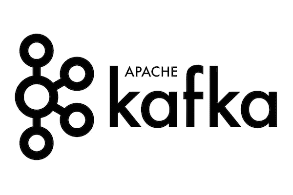
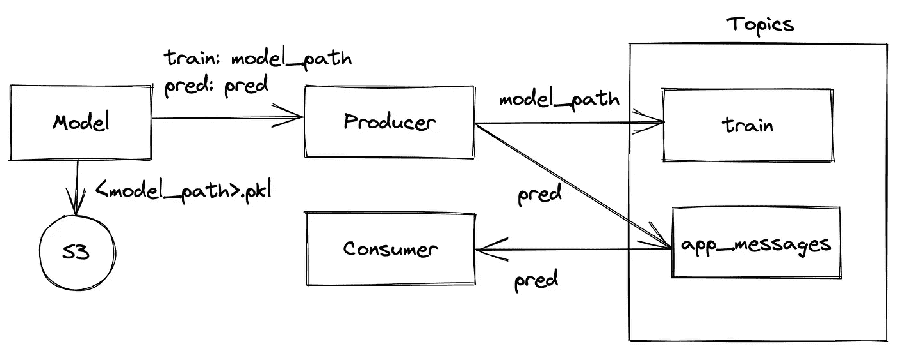
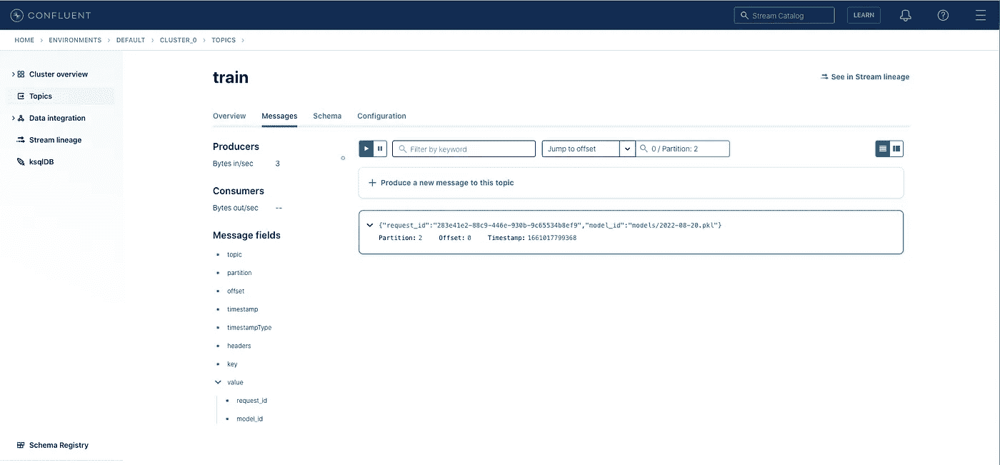
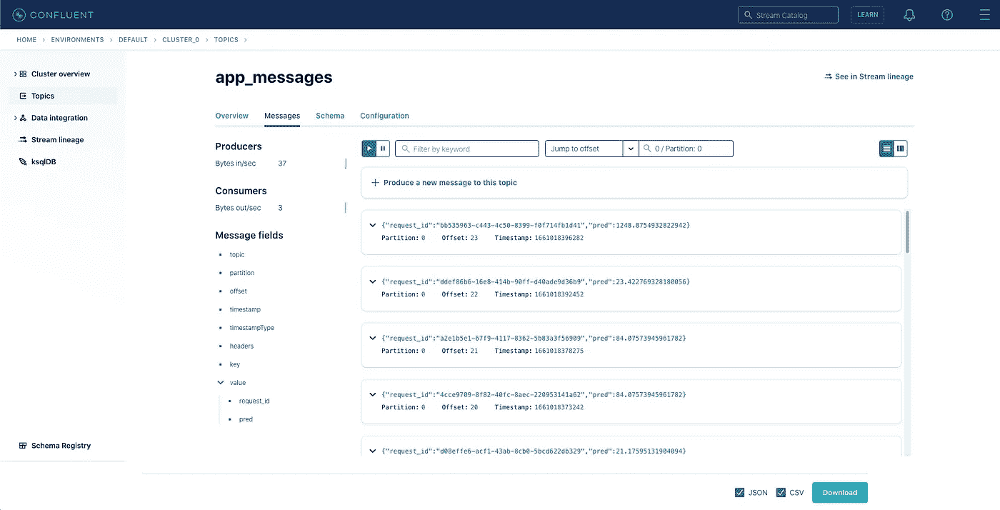

# 用于实时预测的机器学习中的卡夫卡

> 原文：<https://levelup.gitconnected.com/kafka-in-machine-learning-for-real-time-predictions-45a4adf4620b>

## 使用 scikit 运行 Kafka 学习实时应用程序

来源:[https://www.confluent.io/blog/author/martin-kleppmann/](https://www.confluent.io/blog/author/martin-kleppmann/)

在我们的[上一篇文章](https://betterprogramming.pub/kafka-with-python-how-to-get-your-projects-up-and-running-34bc58c46652)中，我们介绍了 Apache Kafka 的主要元素和功能，并看到了 Kafka 如何与 Python API[confluent-Kafka](https://github.com/confluentinc/confluent-kafka-python)一起使用。在本文中，我们将重点讨论如何将 Kafka 应用于机器学习项目中的训练和预测。

为此，我们将使用以前文章中的模型，在这些文章中，我们建立了回归模型，根据西班牙葡萄酒的种类、地区、年份、类型、酸度等来预测其价格。我们将把这个项目作为基线。

 [## 与 DVC 和 S3 一起构建生产就绪的 ML 工作流

### DVC:和 Git 一样，只是数据不同

better 编程. pub](https://betterprogramming.pub/build-production-ready-ml-workflow-with-dvc-and-s3-cdd9c95bf19) 

工作流程将如下所示:

*   在[汇流云中运行 Kafka 集群](https://confluent.cloud/home)。创建远程主题:`train`和`app_messages`。
*   运行`trainer.py`中的 Kafka Producer，将经过训练的模型的路径信息写入主题`train`。
*   把训练好的模型写给 S3。
*   在`predictor.py`经营卡夫卡生产者和消费者。这里我们会做预测，并写进题目`app_messages`。

我们在关于 Kafka 的第一篇文章中讨论了安装[Confluent-CLI](https://docs.confluent.io/confluent-cli/current/overview.html)、设置融合云帐户以及创建 Kafka 集群和主题。Kafka 集群配置的以下工作将基于它，因此我鼓励您提前尝试本教程。

 [## 使用 Python 的 Kafka:如何启动和运行您的项目

### 使用 Kafka 运行流式作业

better 编程. pub](https://betterprogramming.pub/kafka-with-python-how-to-get-your-projects-up-and-running-34bc58c46652) 

我们应该添加到`params.py`类来读取 Kafka Broker 和 Consumer 所必需的参数。这里我们添加了新的类`KafkaConsumerParams`、`KafkaBrokerParams`和`KafkaParams`来设置服务器、安全协议和融合云凭证。

从`kafka_config.yaml`中定义并读取参数值。在初始化消费者时，我们指定`group.id`我们的消费者所属的消费者组。`auto.offset.reset`指定如果分区没有提交的偏移量或者提交的偏移量无效，使用者应该从哪个偏移量开始读取。

现在，当 Kafka 集群的配置设置好后，我们可以在训练后使用生成器来编写模型参考。我们将以培训日期的形式书写模型路径，例如`models/2022-08-19.pkl`。为了将`.pkl`写入 S3 存储，我们使用了针对 Python 的 AWS SDK [boto3](https://github.com/boto/boto3) 。

培训结束后，我们将模型写入`wines_models` S3 铲斗。

我们实现了`trainer.py`，在模型训练之后，我们用`kafka_config.yaml`中定义的参数字典初始化一个生产者。为了向 Kafka 发送消息，我们调用`producer.produce`方法，传递主题`train`和消息键，值对。它将消息排队进行批处理、压缩和传输到代理。在这里，我们还使用`flush`方法在关闭生产者之前进行同步写入，以确保所有排队的消息都被传递。因为我们不需要高吞吐量，所以保持高吞吐量是可以的，但是当应用程序需要写入大量数据时，就不应该使用高吞吐量。

写完之后，我们可以在融合云中可视化`train`主题中的消息。

`predictor.py`代码如下所示。这里，生成器的配置与`train.py`类似，但用于将预测写入`app_messages`主题。

下面的代码片段显示了一个消费者循环，它重复调用`poll`方法来逐个检索记录。使用`consumer.subscribe`,我们指定要从中获取的主题`app_messages`。轮询超时设置为 1 秒，即如果在超时到期前没有收到记录，`poll`将返回一个空记录集。我们还应该调用`consumer.close`,因为它确保活动套接字被关闭，内部状态被清除。

在运行`predictor.py`之后，我们还可以可视化融合云的`app_messages`主题中的消息。

## 最后的想法

在本文中，我们将机器学习管道与 Kafka 集成在一起，并通过融合云在远程服务器上序列化 Kafka 主题中的训练结果和预测。您的应用程序可以进一步实时使用发布的消息。

我将非常感谢你在下面评论区的反馈！

## 链接

*   [https://docs . confluent . io/Kafka-clients/python/current/overview . html](https://docs.confluent.io/kafka-clients/python/current/overview.html)
*   【https://github.com/confluentinc/confluent-kafka-python 
*   [https://github.com/EvgeniiMunin/dvc-art-minio](https://github.com/EvgeniiMunin/dvc-art-minio)

 [## 使用 Python 的 Kafka:如何启动和运行您的项目

### 使用 Kafka 运行流式作业

better 编程. pub](https://betterprogramming.pub/kafka-with-python-how-to-get-your-projects-up-and-running-34bc58c46652)  [## 与 DVC 和 S3 一起构建生产就绪的 ML 工作流

### DVC:和 Git 一样，只是数据不同

better 编程. pub](https://betterprogramming.pub/build-production-ready-ml-workflow-with-dvc-and-s3-cdd9c95bf19) 

# 分级编码

感谢您成为我们社区的一员！在你离开之前:

*   👏为故事鼓掌，跟着作者走👉
*   📰查看[升级编码出版物](https://levelup.gitconnected.com/?utm_source=pub&utm_medium=post)中的更多内容
*   🔔关注我们:[Twitter](https://twitter.com/gitconnected)|[LinkedIn](https://www.linkedin.com/company/gitconnected)|[时事通讯](https://newsletter.levelup.dev)

🚀👉 [**加入升级人才集体，找到一份神奇的工作**](https://jobs.levelup.dev/talent/welcome?referral=true)