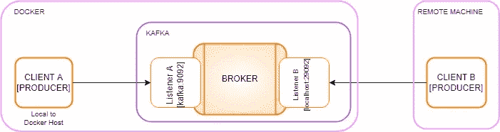
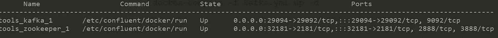
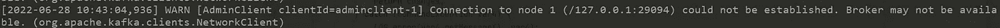
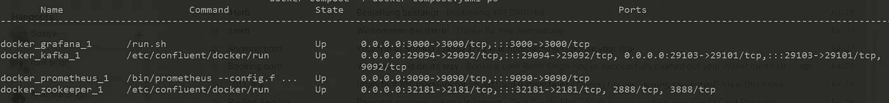
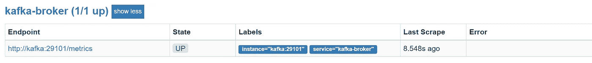
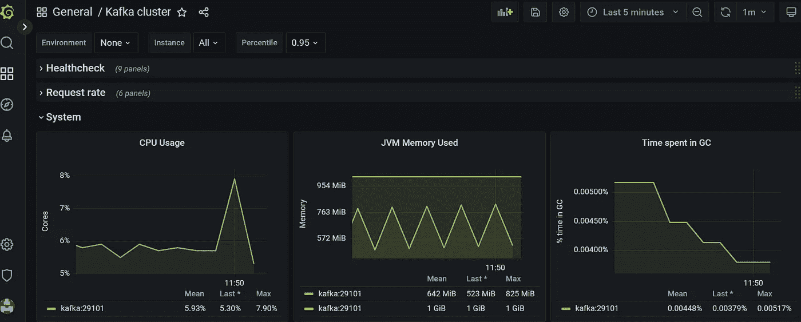

# Docker 的 Kafka 初级读本:如何在 Docker 中设置 Kafka、启动消息传递和监控代理指标

> 原文：<https://levelup.gitconnected.com/kafka-primer-for-docker-how-to-setup-kafka-start-messaging-and-monitor-broker-metrics-in-docker-b4e018e205d1>

这篇文章的重点是如何在 docker 环境中设置 Kafka，我们在从 Docker 主机或远程机器连接到 Kafka 时经常犯的错误，以及如何通过 Prometheus 和 Grafana 监控 Kafka 指标。

# **概述**

Kafka 是一个高度可用的分布式消息传递系统，设计为一个事件流平台。Docker 是一个用于运行容器的应用容器化平台。Kafka 可以作为 docker 服务运行，并通过监听器公开，这允许客户端与 Kafka 通信。

# 卡夫卡听众

有两种类型的监听器，我们需要从 Docker 的角度来理解。第一， ***听者，*** 是卡夫卡绑定的界面。这是为在 docker 上连接的客户准备的。其次， ***ADVERTISED_LISTENERS，*** 是外部客户端如何连接到 Kafka，这是针对在 Docker 机器外部连接的客户端。在下图中，监听器 *A* 充当内部监听器，并向 Docker 主机上运行的客户端公开 Kafka。监听器 *B* 充当外部监听器，允许从 Docker 主机外部到远程客户端的 Kafka 连接。



# 作为码头集装箱的卡夫卡

下面是一个将 Kafka 设置为 Docker 容器的标准示例。我们必须声明两个服务，一个是 *kafka* ，另一个是 *zookeeper* ，因为 kafka 依赖 zookeeper 进行元数据和领导者选举。我们对卡夫卡使用融合的图像。让我们看看每个属性。

> 港口——向外界展示卡夫卡服务。
> 
> 图像— docker 图像 URL
> 
> 代理 id——代表 Kafka 代理实例的符号 id。
> 
> 动物园管理员连接—动物园管理员连接
> 
> listeners —具有主机/IP 和端口的监听器集，Kafka 代理绑定到这些监听器进行监听。
> 
> 广告侦听器—一组侦听器及其主机/IP 和端口，客户端将使用它们从内部或外部连接到代理。
> 
> 侦听器安全协议映射—为每个侦听器名称定义要使用的安全协议的键/值对。(SSL 或无 SSL)
> 
> 代理间侦听器名称—代理内部用于连接的侦听器。

```
*services:
  kafka:
    ports:
      -* ***29094:29092*** *image: confluentinc/cp-kafka:latest
    environment:
      KAFKA_BROKER_ID: 1
      KAFKA_ZOOKEEPER_CONNECT: zookeeper:2181* ***KAFKA_LISTENERS: PLAINTEXT://:9092,PLAINTEXT_HOST://:29092******KAFKA_ADVERTISED_LISTENERS: PLAINTEXT://kafka:9092,PLAINTEXT_HOST://127.0.0.1:29094*** *KAFKA_LISTENER_SECURITY_PROTOCOL_MAP: PLAINTEXT:PLAINTEXT,PLAINTEXT_HOST:PLAINTEXT
      KAFKA_INTER_BROKER_LISTENER_NAME: PLAINTEXT
      KAFKA_OFFSETS_TOPIC_REPLICATION_FACTOR: 1   
    networks:
      - kafka
    depends_on:
      - zookeeper
  zookeeper:
    ports:
      - 32181:2181
    environment:
      ZOOKEEPER_CLIENT_PORT: 2181
      ZOOKEEPER_TICK_TIME: 2000
    image: confluentinc/cp-zookeeper:latest
    networks:
      - kafka
networks:
  kafka:
    external: false*
```

有了上面的配置，我们可以在支持 Docker 的机器上运行 Kafka 作为 Docker 服务。将上述文件另存为 kafka.yml，并运行以下命令:

```
*---> run
docker-compose -f kafka.yml up -d**---> status
docker-compose -f kafka.yml ps*
```



作为码头工人服务的卡夫卡

# 与 Kafka 的客户端连接

Kafka 客户可能在经纪人网络的本地，也可能不在本地，正如前面所描述的，这就是听众发挥重要作用的地方。当连接上时，每个监听器将报告可以到达的地址。到达经纪人的地址取决于所使用的网络。如果您从内部网络连接到代理，那么它将是与外部连接时不同的主机/IP。基本上会出现三种情况:

1.  **Docker 网络内的客户端**—Docker 网络内的客户端*使用监听器*明文*连接，端口 *9092* ，主机名为 *kafka* 。每个 Docker 容器将使用 Docker 的内部网络解析 *kafka* ，并能够到达代理。客户端用来连接的引导服务器将是*【Kafka:9092】**
2.  **Docker 网络外部但在同一 Docker 主机**上的客户端*—客户端使用监听器 *PLAINTEXT_HOST* 连接，端口 *29092* ，主机名 *localhost* 。端口 29092 由 Docker 容器公开，因此可以连接。客户端用来连接的引导服务器将是*【localhost:29092】**
3.  **Docker 网络外部的客户端*和 Docker 主机—*** 客户端使用监听器 *PLAINTEXT_HOST* 连接，端口 *29094* ，主机名 *localhost* 。端口 29094 由 Docker 容器向外部客户端公开，并且端口被映射。请注意，为了访问它，您还需要在客户机上的 putty 中进行端口映射，这需要解析到这个 docker 主机。客户端用于连接的引导服务器将是[ *localhost:29094]。*

# 端口映射(外部远程客户端)

正如这里提到的，如果你看到如下描述的消息，大多数情况下我们确实会出错。首先，请确保 Kafka 代理正在运行，并检查日志以确保 Kafka 服务器成功启动。其次，如果您从远程客户机进行连接，那么请确保在连接隧道中更新端口映射，在连接隧道中，您已经将引导服务器端口映射到运行 Kafka 服务的 docker-machine。例如，假设您的 Docker 机器 IP 是*62.96.231.219*，Kafka 服务在端口 29094 上公开，然后在远程客户端机器上，将端口 *29094* 映射到*62.96.239.219:29094，*，然后客户端可以通过引导服务器 *localhost:29094 连接到 Kafka。*

> 无法建立连接。经纪人可能不在。



# 度量和监控

可以使用 prometheus 和 grafana 监控 Kafka 经纪人。我们将使用 JMX 导出器向普罗米修斯展示 Kafka 的指标，然后在 Grafana 仪表板上显示这些指标。JMX 导出器充当收集器，通过 HTTP 端点公开 Kafka 指标，然后可以被任何系统(如 Prometheus)使用。

我们已经添加了 *EXTRA_ARGS* 来使用 JMX exporter 来暴露 Kafka 指标，并添加了端口映射来暴露相同的指标供普罗米修斯目标使用。JMX 出口商同样需要广口瓶。我们还需要提供 Kafka 度量配置(kafka-broker.yaml ),以便公开所需的度量。

更新了 docker-compose:(暴露了指标)

```
*services:
  kafka:
    logging:      
      driver: local
    ports:
      - 29094:29092
      -* ***29103:29101*** *image: confluentinc/cp-kafka:latest
    environment:
      KAFKA_BROKER_ID: 1
      KAFKA_ZOOKEEPER_CONNECT: zookeeper:2181
      KAFKA_LISTENERS: PLAINTEXT://:9092,PLAINTEXT_HOST://:29092
      KAFKA_ADVERTISED_LISTENERS: PLAINTEXT://kafka:9092,PLAINTEXT_HOST://127.0.0.1:29094
      KAFKA_LISTENER_SECURITY_PROTOCOL_MAP: PLAINTEXT:PLAINTEXT,PLAINTEXT_HOST:PLAINTEXT
      KAFKA_INTER_BROKER_LISTENER_NAME: PLAINTEXT
      KAFKA_OFFSETS_TOPIC_REPLICATION_FACTOR: 1* ***EXTRA_ARGS: -javaagent:/usr/share/jmx_exporter/jmx_prometheus_javaagent-0.17.0.jar=29101:/usr/share/jmx_exporter/kafka-broker.yaml* ***networks:
      - kafka* ***volumes:      
      - ./jmx-exporter:/usr/share/jmx_exporter/      
      - kafka-jmx-volume:/jmx-exporter*** *depends_on:
      - zookeeper
  zookeeper:
    ports:
      - 32181:2181
    environment:
      ZOOKEEPER_CLIENT_PORT: 2181
      ZOOKEEPER_TICK_TIME: 2000
    image: confluentinc/cp-zookeeper:latest
    networks:
      - kafka
volumes:* ***kafka-jmx-volume:*** *networks:
  kafka:
    external: false*
```

将文件更新并保存为 kafka.yml，然后运行以下命令:

```
*---> run
docker-compose -f kafka.yml up -d**---> status
docker-compose -f kafka.yml ps*
```



作为码头工人服务的卡夫卡、普罗米修斯和格拉法纳

> 卡夫卡指数可以在:[http://localhost:29103/metrics](http://localhost:29103/metrics)找到
> 
> 普罗米修斯可以在:[http://localhost:9090/graph](http://localhost:9090/graph)找到
> 
> 可以通过[http://localhost:3000/log in](http://localhost:3000/login)(Kafka/Kafka)联系到 Grafana

如果 Kafka metrics endpoint 成功启动，并且 Prometheus 目标可以抓取它，它应该如下所示:



暴露于普罗米修斯的卡夫卡式的度量

Kafka 集群的 Grafana 仪表板:



Kafka 集群仪表板

设置普罗米修斯和格拉夫纳的详细配置可以在这里找到:

> https://github . com/RoHS in 47/Kafka-docker-kubernetes/tree/main/docker

# 参考资料:

[](https://www.confluent.io/blog/kafka-listeners-explained/) [## 卡夫卡听众-解释|汇合

### 您需要将 advertised.listeners(或者 KAFKA_ADVERTISED_LISTENERS，如果您使用 Docker 图像的话)设置为外部…

www.confluent.io](https://www.confluent.io/blog/kafka-listeners-explained/) [](https://github.com/confluentinc/jmx-monitoring-stacks/tree/6.1.0-post/jmxexporter-prometheus-grafana) [## JMX-monitoring-stacks/JMX exporter-Prometheus-grafana at 6 . 1 . 0-post…

### Kafka 要输出配额指标，至少需要一个配额配置。

github.com](https://github.com/confluentinc/jmx-monitoring-stacks/tree/6.1.0-post/jmxexporter-prometheus-grafana) 

# 分级编码

感谢您成为我们社区的一员！更多内容见[升级编码出版物](https://levelup.gitconnected.com/)。
跟随:[推特](https://twitter.com/gitconnected)，[领英](https://www.linkedin.com/company/gitconnected)，[通迅](https://newsletter.levelup.dev/)
**升一级正在改造理工大招聘➡️** [**加入我们的人才集体**](https://jobs.levelup.dev/talent/welcome?referral=true)