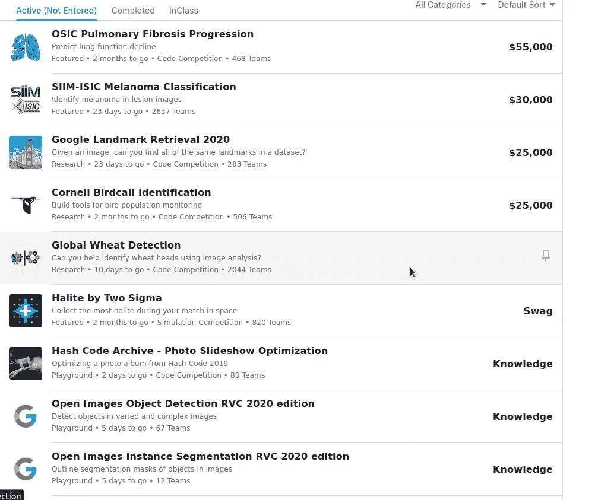
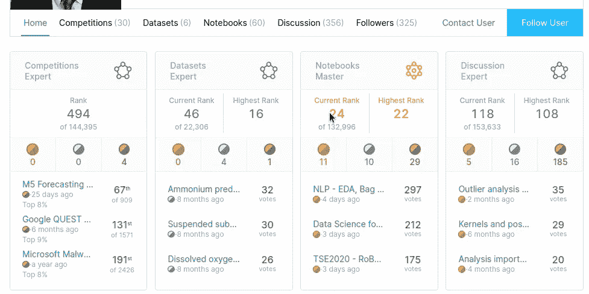
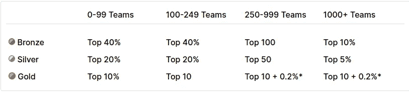
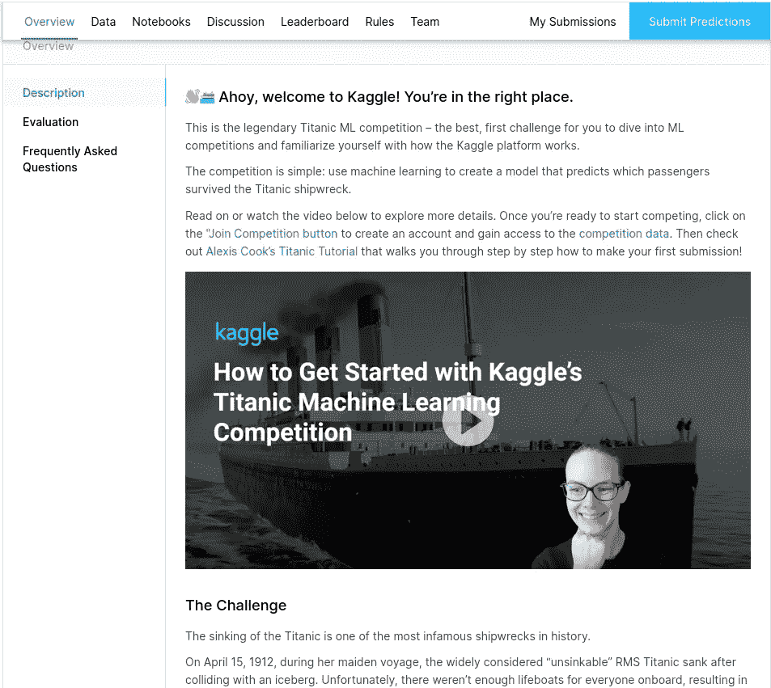
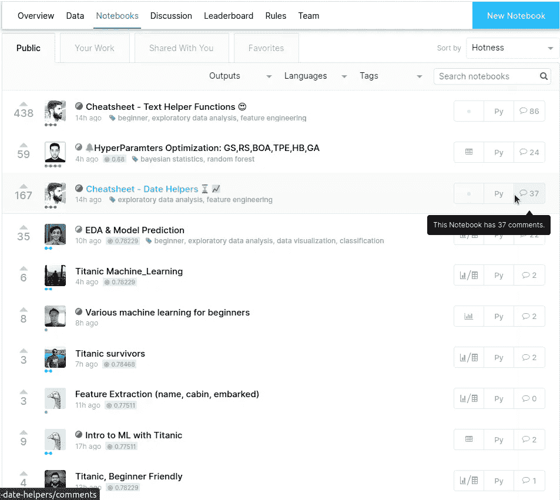
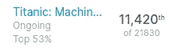
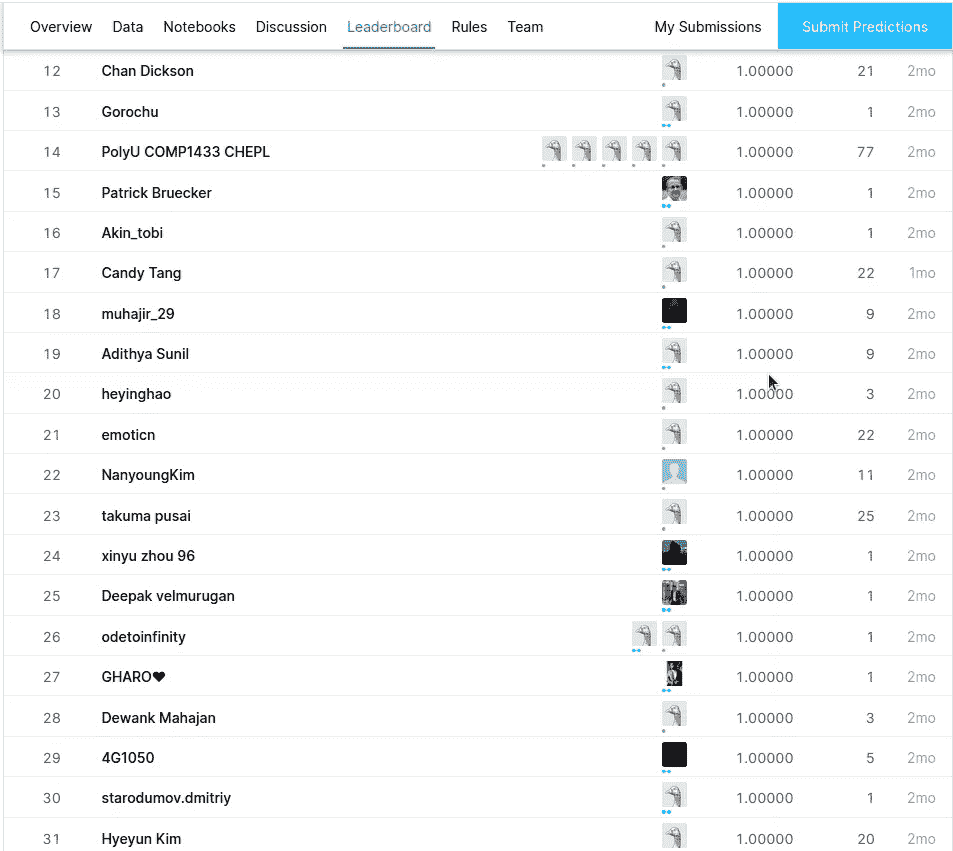
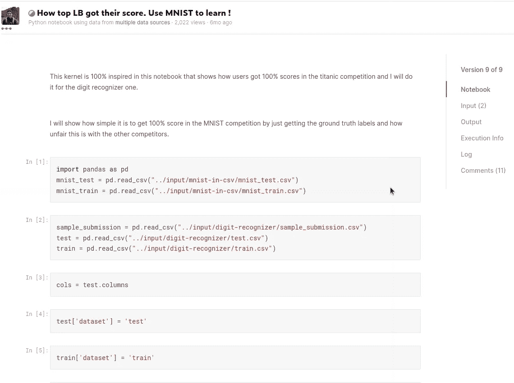
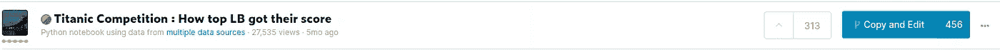

# Kaggle 初学者比赛可以作弊

> 原文：<https://levelup.gitconnected.com/kaggle-beginner-competitions-can-be-cheated-5f97ca96042c>

micha Parzuchowski 在 [Unsplash](https://unsplash.com?utm_source=medium&utm_medium=referral) 上的照片

## 在“入门”比赛中不要看记分牌。

这篇文章的目的是在新手浪费时间试图得到一个不可能的分数之前警告他们。一些 kagglers 一键获得最大的准确性。在我们讨论他们是如何做的以及为什么做之前，让我们先简单介绍一下 Kaggle 评分模型，以理解为什么会有人试图作弊。

## Kaggle 级数系统

[Kaggle](https://www.kaggle.com) 是一个门户网站，数据科学家、机器学习专家和分析人员可以在这里挑战他们的技能，分享知识，并参加各种比赛。它对每个层次的经验都开放——从完全的新手到大师。你可以使用开放数据集来拓宽你的知识面，获得荣誉，甚至赢得金钱。

一些可用的竞争。(*图片作者*)

赢得比赛，参与讨论，分享你的想法都会获得奖牌。奖牌会在你的个人资料中与你的所有成就一同呈现。

Kaggle 的一个活跃成员的简介。(*图片作者*)

这样的简介对你的简历是一个很好的补充。对于一个刚开始职业生涯的人来说，附上这样的知识证明就更重要了。

但是如何获得这样的勋章和军衔呢？对于竞赛来说，获得奖牌只有一种方式。通过在最好的分数范围内得到你的分数。对于其他“学科”,你可以在你的笔记本、评论和数据集中获得一定数量的投票。所以你基本上可以通过分享知识或在比赛中得分来进步。

Kaggle 前进系统截图。(*图片作者*)

## 登上泰坦尼克号

当你注册时，Kaggle 提供你从知名比赛开始，以了解更多关于门户网站的信息，并获得信心。建议初学者在泰坦尼克号数据集比赛中一试身手:

卡格尔多么欢迎你。(*作者图片*)

在这个挑战中，你要试着预测谁在海难中幸存。从这里开始，你可以从两个方面着手——下载数据集并尝试自己寻找解决方案，或者查看笔记本。笔记本是一个学习、测试你的想法、与他人互动、参与讨论的好地方。笔记本通常会解释获得高分的方法或如何开始探索性数据分析。

随机笔记本。(*作者图片*)

作为一个新手，我发现了一本初学者笔记本，它解释了如何使用 Jupyter 并提交您的预测。第一次尝试后，我得到了 77.5%的准确率。这让我在比赛中获得了 53%的最好成绩。

我的第一次提交。(*图片作者*)

我决定和其他乞丐比一比。问题就从这里开始了。

泰坦尼克排行榜。(*图片作者*)

初学者竞赛排行榜将从超过 2 个月的提交内容中清除，以免阻碍新的贡献者:

> 一旦提交的内容超过两个月，就会失效，不再计入排行榜。— Kaggle 入门竞赛常见问题

但是有些事情不对劲。为什么有那么多人百分百准确？甚至还有满分的人前几天提交了。甚至有可能达到这样的分数？我想——好吧，也许这是可能的，因为这是为新手准备的。但是 224 人得到最高分？

## 第二场比赛

我的下一个目标是数字竞赛。在这里，我的解决方案达到了 96.7%的准确率！我为自己感到非常自豪。期望在排行榜中获得好位置。获得了 78%的最高分。检查排行榜，又有数百人 100%准确。我又做错什么了吗？

笔记本部分似乎是理解这一点的好地方。然后我找到了一个[笔记本](https://www.kaggle.com/bgmello/how-top-lb-got-their-score-use-mnist-to-learn)，它回答了我所有的问题。

允许获得 100%准确性的笔记本电脑。(*图片作者*)

这个笔记本可以复制，用于生成提交，并在数字竞赛中获得冠军。为了解释这个笔记本是如何工作的——数字数据集是公开的。您可以获得地面真相标签，只需提交这些数据即可获得最高分。

所以在泰坦尼克笔记本版块发现[类似笔记本](https://www.kaggle.com/tarunpaparaju/titanic-competition-how-top-lb-got-their-score)我一点都不惊讶。里面有一个类似的解决方案:

456 叉(*图片作者*)

这个解决方案被复制了 450 次，可能被用来获得最高分。在数字竞赛中，笔记本作者表示，即使是 MNIST 数据集的[研究人员也无法获得 100%的准确率](http://yann.lecun.com/exdb/mnist/)。

我很惊讶有人会在操场上作弊。也很失望。还有很多其他人。在评论部分，您可以找到如下评论:

> 难怪我过不了 99。这确实打击了初学者努力做得更好的积极性。

> 哦，原来他们是这么做的..😯😯。我惊呆了。这完全不公平。这段时间我一直在想他们到底是怎么得到 100 分的，而另一方面，我尽一切努力把我的分数从 99.45 提高到 100 分。我尝试了 CNN 的 3 层结构，尝试了使用 scratch tensorflow 代码，尝试了数据增强等等……这个内核真的让我大吃一惊。我认为更好的办法是专注于主要的比赛来提高自己，而不是在操场上的比赛中努力提高分数。

## 社区责任

总有人出轨。不管主题是什么。即使是在数据科学领域。因此，如果你是初学者或专业人士，只要让别人知道提到的事实。因为有些人仍然会使用公开的数据来达到顶峰。甚至会有人用我的文章来拿最高分。

但是对一些人来说，竞争是成长的重要部分。它可以成为一个巨大的动力和改进的衡量标准。健康的竞争很有趣。我很好胜，有那么一会儿，我觉得受到了不公平的对待。不要评判那些查看操场排行榜并试图登顶的人——我们都有不同的学习方法，其中一些更适合我们的性格。

我们不想用不切实际的分数来打击新人。在这样一个早期点上的失望会让 Kaggle 社区看起来像是假的。这不是真的。对此最简单的解决办法是通知新的 kagglers 可能被其他人欺骗。所以你知道该怎么做。每个人都喜欢伟大和有益的社区。