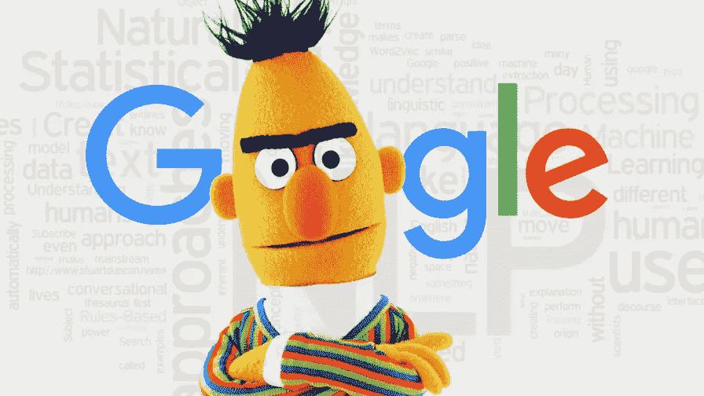

# Kaggle 知识点:伯特的五种汇集法

> 原文：<https://levelup.gitconnected.com/kaggle-knowledge-points-berts-five-pooling-methods-b55d61dd9968>



BERT 模型可以用于多个任务，也是当前 NLP 模型的必要方法。在文本分类中，我们会使用`[CLS]`的相应输出来完成文本分类，当然还有其他方法。

这允许每个`token`对应的输出被使用`pooling`，然后在通过后被分类。本文将介绍几种构建和使用 BERT 的常用方法。

# 方法 1:平均汇集

`token`计算每个对应输出的平均值，这里需要考虑`attention_mask`，即需要考虑有效输入`token`。

```
class MeanPooling(nn.Module):
    def __init__(self):
        super(MeanPooling, self).__init__()

    def forward(self, last_hidden_state, attention_mask):
        input_mask_expanded = attention_mask.unsqueeze(-1).expand(last_hidden_state.size()).float()
        sum_embeddings = torch.sum(last_hidden_state * input_mask_expanded, 1)
        sum_mask = input_mask_expanded.sum(1)
        sum_mask = torch.clamp(sum_mask, min = 1e-9)
        mean_embeddings = sum_embeddings/sum_mask
        return mean_embeddings
```

# 方法 2:最大池化

计算每个`token`对应输出的最大值，这里需要考虑`attention_mask`，也就是有效输入需要考虑`token`。

```
class MaxPooling(nn.Module):
    def __init__(self):
        super(MaxPooling, self).__init__()

    def forward(self, last_hidden_state, attention_mask):
        input_mask_expanded = attention_mask.unsqueeze(-1).expand(last_hidden_state.size()).float()
        embeddings = last_hidden_state.clone()
        embeddings[input_mask_expanded == 0] = -1e4
        max_embeddings, _ = torch.max(embeddings, dim = 1)
        return max_embeddings
```

# 方法 3:最小公摊

计算每个`token`对应输出的最小值，这里需要考虑`attention_mask`，即需要考虑有效输入`token`。

```
class MinPooling(nn.Module):
    def __init__(self):
        super(MinPooling, self).__init__()

    def forward(self, last_hidden_state, attention_mask):
        input_mask_expanded = attention_mask.unsqueeze(-1).expand(last_hidden_state.size()).float()
        embeddings = last_hidden_state.clone()
        embeddings[input_mask_expanded == 0] = 1e-4
        min_embeddings, _ = torch.min(embeddings, dim = 1)
        return min_embeddings
```

# 方法 4:加权池

计算每个`token`对应输出的重量。这里的权重可以通过特征计算，也可以通过 IDF 计算。

```
class WeightedLayerPooling(nn.Module):
    def __init__(self, num_hidden_layers, layer_start: int = 4, layer_weights = None):
        super(WeightedLayerPooling, self).__init__()
        self.layer_start = layer_start
        self.num_hidden_layers = num_hidden_layers
        self.layer_weights = layer_weights if layer_weights is not None \
            else nn.Parameter(
                torch.tensor([1] * (num_hidden_layers+1 - layer_start), dtype=torch.float)
            )
```

```
 def forward(self, ft_all_layers):
        all_layer_embedding = torch.stack(ft_all_layers)
        all_layer_embedding = all_layer_embedding[self.layer_start:, :, :, :] weight_factor = self.layer_weights.unsqueeze(-1).unsqueeze(-1).unsqueeze(-1).expand(all_layer_embedding.size())
        weighted_average = (weight_factor*all_layer_embedding).sum(dim=0) / self.layer_weights.sum() return weighted_average
```

# 方法 5:集中注意力

将每个`token`特征单独添加到一个图层中进行关注度计算，增加模型的建模能力。

```
class AttentionPooling(nn.Module):
    def __init__(self, in_dim):
        super().__init__()
        self.attention = nn.Sequential(
        nn.Linear(in_dim, in_dim),
        nn.LayerNorm(in_dim),
        nn.GELU(),
        nn.Linear(in_dim, 1),
        )
```

```
 def forward(self, last_hidden_state, attention_mask):
        w = self.attention(last_hidden_state).float()
        w[attention_mask==0]=float('-inf')
        w = torch.softmax(w,1)
        attention_embeddings = torch.sum(w * last_hidden_state, dim=1)
        return attention_embeddings
```

# 总结

从模型复杂度来看:attention pooling > weighted layer pooling > mean pooling/min pooling/max pooling

从模型精度来看:注意池>加权层池>平均池>最大池>最小池

使用多种池的目的是增加 BERT 模型的多样性，并考虑在模型集成中使用它。

喜欢这篇文章吗？成为一个媒介成员，通过无限制的阅读继续学习。如果你使用[这个链接](https://machinelearningabc.medium.com/membership)成为会员，你将支持我，不需要你额外付费。提前感谢，再见！

# 分级编码

感谢您成为我们社区的一员！在你离开之前:

*   👏为故事鼓掌，跟着作者走👉
*   📰查看[升级编码出版物](https://levelup.gitconnected.com/?utm_source=pub&utm_medium=post)中的更多内容
*   🔔关注我们:[Twitter](https://twitter.com/gitconnected)|[LinkedIn](https://www.linkedin.com/company/gitconnected)|[时事通讯](https://newsletter.levelup.dev)

🚀👉 [**加入升级达人集体，找到一份惊艳的工作**](https://jobs.levelup.dev/talent/welcome?referral=true)