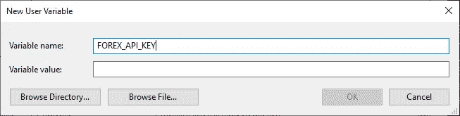
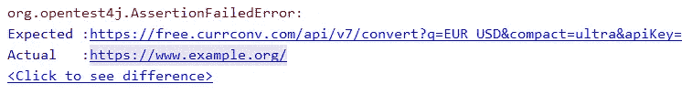

# 将 API 密钥放在 Git 存储库之外:几个具体的例子

> 原文：<https://levelup.gitconnected.com/keep-api-keys-out-of-git-repositories-a-few-concrete-examples-80f2544789aa>


照片由[蒂姆·埃文斯](https://unsplash.com/@tjevans?utm_source=medium&utm_medium=referral)在 [Unsplash](https://unsplash.com?utm_source=medium&utm_medium=referral) 上拍摄

你可以在网上找到很多关于如何将 API 密匙和密码之类的“秘密”排除在 Git 库之外的建议，但是我还没有找到 Java 程序的具体例子。本文将详细介绍这些具体的例子。

有很多不同的方法可以将 API 密匙放在 Git 仓库之外，每种方法都有自己的优缺点。一些文章解释了利弊，但是没有例子，很难评估哪种方法是你的特定项目的最佳方法。

希望我在这里展示的这些例子能够帮助您找出哪种将 API 键放在您自己的 Java Git 库之外的方法对您自己的项目最有意义。

对于本文的例子，我将使用`CurrencyConverter`类，它只有一个函数，静态的`convert()`函数。那个函数有一个`CurrencyAmount`对象和一个`Currency`对象(后者来自`java.util`包，前者是我一直在做的)。

`convert()`函数查询一个在线 API，如果一切顺利，返回一个新的`CurrencyAmount`对象，该对象对应于转换为指定`Currency`的原始`CurrencyAmount`对象。

如果这个函数接收到一个对应于$100.00 和`Currency.getInstance(Locale.JAPAN)`的`CurrencyAmount`对象，它应该返回一个对应于 10901 的新的`CurrencyAmount`对象，上下相差几日元。

我们可以使用一些不同的 API 来实现这个目的。有些是免费的，不需要 API 密钥，但它们的货币很少，数据可能长达一周。

一些更好的 API，有更多最新的信息和更广泛的货币选择，也是免费的，但它们需要一个 API 密钥(如果你找到一个免费的、拥有世界上大多数货币、相当最新且不需要 API 密钥的好 API，请在评论中告诉我)。

Manny 的转换 API 有几个付费层，[一个免费层](https://free.currencyconverterapi.com/)对我来说非常好。据我所知，它包括今天使用的每一种政府发行的货币，贵金属，甚至一些记账单位(我没有测试过历史货币，像旧的俄罗斯卢布)。

即使我没有为我的 API 密匙付费，我仍然被期望保守这个秘密。我应该这么做，因为如果有人滥用我的 API 密匙，它将被撤销，我也不会得到一个新的。

因此，在本文中，我将使用“EXAMPLE0000-0001”作为虚构的示例 API 键。这是一个*不*做什么的例子:

不管 Git 存储库是私有的还是要点是秘密的，API 密匙仍然可能泄漏。如果你在公共知识库上发布这样的东西，你也可以在社交媒体上发布。

记住:API 密匙的发行者可能会因为任何原因在任何时候撤销它。API 密钥公开无疑是撤销密钥的好理由。

将密钥放在存储库之外的一个好方法是在项目中创建一个`secrets`包，并将整个包添加到项目的 Git Ignore 文件中。

```
# Files and directories with API keys, IAM usernames and passwords, # etc.
src/secrets
test/secrets
```

然后，在`src/secrets`中，我们创建了`APIKeyStore`类。

并从我们的`CurrencyConverter`存根引用它:

运行`git status`命令以确定`CurrencyConverter`是否列在可通过`git add`命令添加的已跟踪变更或未跟踪文件中，并确认`APIKeyStore`未被列出。

用户名、密码和其他凭证也可以存储在`secrets`包中。

API 密匙可能以某种方式泄露出去的风险仍然存在，但在我看来这不太可能。一个更严重的问题等待着那些分叉这个存储库的人。

即使在他们将 JDK 和 JUnit 库连接到他们的本地机器上之后，仍然会有问题，即`APIKeyStore`无处可寻，并且他们必须想出如何编写它(如果他们不放弃整个努力的话)。

在我看来，更好的选择是将 API 键放在本地环境变量中。我在几个地方看到过这个建议，但是没有给出任何例子。所以我必须弄清楚。

局部环境变量的一个问题是它们依赖于平台。在我们从 Java 访问它们之前，这个例子必须是特定于 Windows 10 的。

在 Windows 10 任务栏的搜索栏中，键入“环境变量”即使只有“env”可能也足以让操作系统将控制面板显示为“最佳匹配”

点击它，打开系统属性对话框，前面有高级标签。在对话框的底部附近，您应该会看到一个标有“环境变量…”的按钮

这将打开另一个对话框，显示当前用户的环境变量和系统环境变量。如果您的计算机上只有一个用户帐户，用户和系统之间的区别可能无关紧要。这对 Java 运行时来说似乎无关紧要。

根据您的选择，单击用户环境变量或系统环境变量下的“新建…”按钮。这将打开“新建用户变量”对话框。我在变量名字段中输入了“FOREX_API_KEY”。



Windows 10 中的新用户变量对话框。

然后我输入了 Manny 免费转换 API 的实际 API 密钥。我没有截图，原因很明显。

浏览目录…和浏览文件…按钮用于选择变量值的路径名(如 path)，它们不用于从*加载名称和值对。环境文件。

要从 Java 访问本地环境变量，使用`System.getenv()`函数。如果没有参数，它将返回一个带有名称和值对的`Map<String, String>`。

通过一个`String`参数，比如“OS”或“FOREX_API_KEY”，它返回对应于变量名的变量值。但是要注意:如果没有指定名称的变量，函数将返回 null。

在我们的用例中，我们使用 API 键`String`构建 URL，如果没有具有预期名称的环境变量，可能不会导致可怕的`NullPointerException`。

那是因为一个 null 变成了被胁迫成实际的`String`“null”。我们可能没有意识到发生了什么，直到我们检查一个失败的 API 请求，看到 URL 以“& apiKey=null”结尾。

因此，为了空安全和更容易发现问题，我写了一个类，它本质上包装了`getenv()`函数，这样缺少的变量会导致带有缺少的变量名的`NoSuchElementException`。

请注意，我没有将这个放在`secrets`包装中。

接下来，我将我的`CurrencyConverter`草稿改为使用`EnvironmentVariableStore`而不是`APIKeyStore`。

我在这里使用了通配符导入来保持要点简短。

这仍然没有完全消除 API 密钥泄漏到存储库中的风险。这里有一个 API 密匙泄漏的牵强方法:通过测试结果。但是，请不要在这些问题上失去想象力。

例如，IntelliJ 报告了一个函数的测试结果，该函数为一个 API 请求构建了欧元对美元汇率的 URL:



IntelliJ 展示了 JUnit 测试中预期 URL 和实际 URL 之间的差异。

当然，我截取了截图，省略了 API 键。此外，测试类访问 API 键的方式与被测试类相同:通过`EnvironmentVariableStore`的查找。

因为我想让测试第一次失败，所以我编写了忽略其参数的函数，并总是返回一个到[example.org](https://example.org/)的链接。

IntelliJ 在哪里存储测试结果？我不知道。但是，查看 Git 状态让我确信，没有准备提交的更改和适合准备提交的未跟踪文件都是我所知道的文件。

我再次向您保证，API 键不在测试中，它是通过`EnvironmentVariableStore`加载到测试类的私有常量中的，也叫做`API_KEY`。

由于单一责任原则，我决定将在线 API 调用转移到一个单独的类中，`ExchangeRateProvider`。这意味着切断这条线

```
private static final String API_KEY
        = EnvironmentVariableStore.getVariable("FOREX_API_KEY");
```

来自`CurrencyConverter`并粘贴在`ExchangeRateProvider`上。

这种使用环境变量的方法比将实际的 API 键放在源文件中更可取，即使它是一个像`secrets`包中那样被忽略的文件。

像 IntelliJ 这样的集成开发环境(IDE)使得从一个文件复制和粘贴到另一个文件变得非常容易。存在 API 密钥可能从被忽略的文件复制到被跟踪的文件的风险。

API 键从环境变量复制到被跟踪文件的风险要低得多，但也不是零。

在我的用例中，使用环境变量非常有效，这是为了提供一个用于教育目的的具体例子。对于一个需要在遍布一个国家或世界各地的几个团队之间协调非常有价值的 API 键的项目来说，这可能不太好。

这样的团队可能需要一个更健壮的解决方案，比如一个专门的程序来扫描存储库中的 API 密钥和其他凭证，甚至可能提供一种安全的方法来同步可信团队成员之间的凭证。以后我可能会写一篇关于这些的文章。

这个问题没有完美的解决方案，但是仅仅意识到这个问题就有很大的帮助。

# 资源

*   MacKenzie Jackson，[“管理和存储包括 API 密钥和其他凭证在内的秘密的最佳实践[2020]，](https://blog.gitguardian.com/secrets-api-management/)发表于 2020 年 6 月 12 日 GitGuardian 博客。权衡几种安全方法及其优缺点。不过，没有例子。
*   我的[玩具示例](https://github.com/Alonso-del-Arte/toy-examples) GitHub 仓库。特别是，看看 Git Ignore，以及`currency`和`sysops`包。