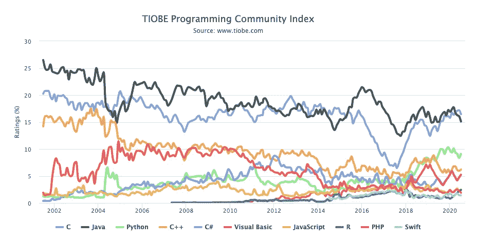
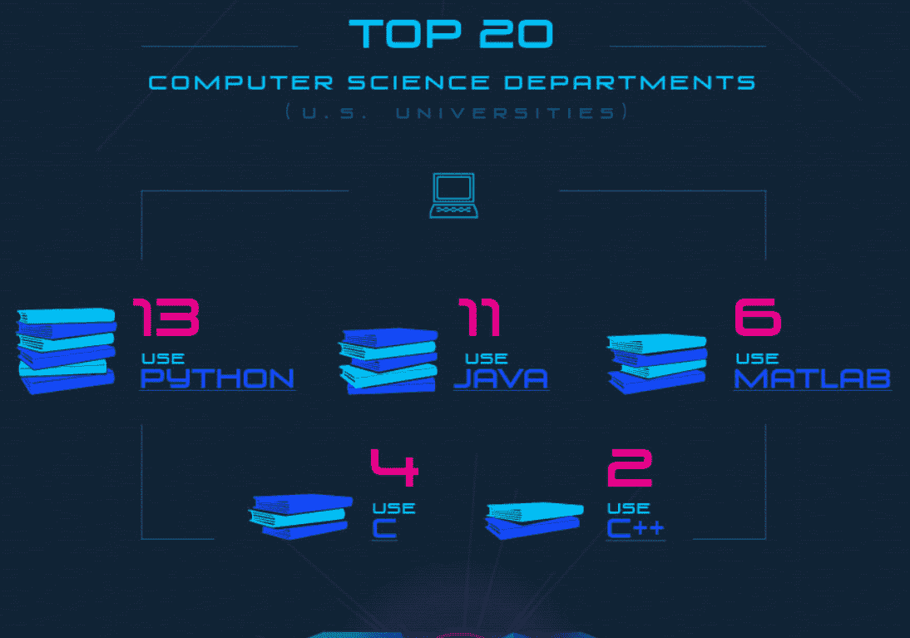
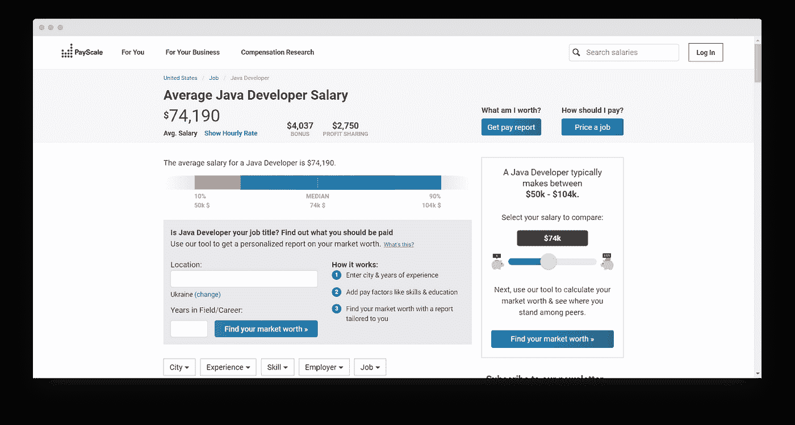
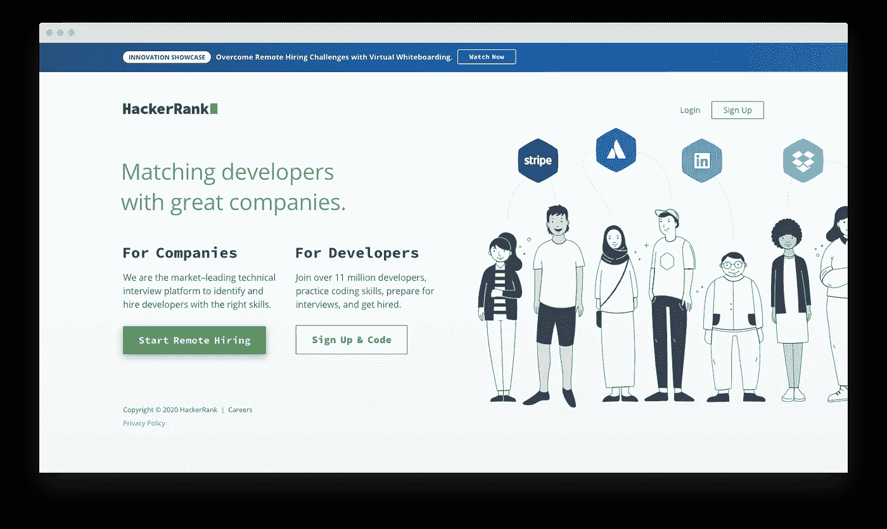
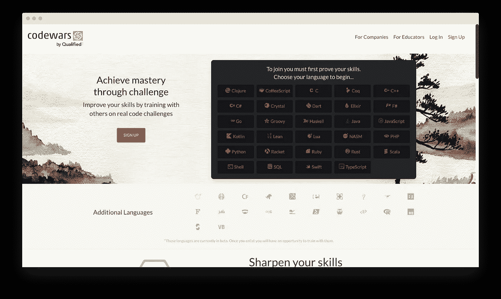

# 保持冷静，开始编码:如何对抗编码焦虑

> 原文：<https://levelup.gitconnected.com/keep-calm-and-start-coding-how-to-fight-coding-anxiety-dee06efd8b9c>

编程对你来说听起来是一份压力很大的工作吗？人们认为不应该这样，因为似乎所有的程序员都坐在屏幕前打字。与医药、银行或会计相比，这里没有生死攸关的情况，也没有巨大的责任。从技术上讲，软件开发*应该是比较平静的工作之一。*

然而，事实证明，编码焦虑是真实的。当我和我的编程学生交谈时，发现许多人在工作超过一小时后就无法保持注意力，并被在技术领域找工作的压力所消耗。

这就是为什么我想分享一些帮助编程学习者减轻教育压力的技巧。运用这些方法会给你更多的自信，让你享受学习的每一个小时。

# 为什么编程学习者压力大？

首先，让我们仔细看看技术学习者压力的主要原因。为了不使你厌烦冗长的列表，我将编码员感到不平静的原因列表缩减为三个:

*   冒名顶替综合症。由于一名程序员的平均工资相当高(根据 Payscale 的数据，86k 美元/年，[)，开发人员通常认为他们的技能不值得薪水。在团队中工作也增加了压力——你总是与那些看起来更敏锐、更精通技术、以大局为重或关注细节的同事保持联系。所有这些都让软件开发人员低估了价值，并开始强调有一天其他人可能会称他们为伪装者。](https://www.payscale.com/research/US/Job=Software_Engineer/Salary)
*   不是“真正的程序员”。如果你对技术感兴趣的时间够长，你对“真正的程序员”原型就不会陌生。你经常可以在脸书小组、Reddit 或 Stack Overflow 上看到这些程序员，告诉他们工作有多努力，他们对周末或业余时间有多不关心。将程序员视为没有生命力的人变得如此普遍，以至于初学编程的人开始怀疑:“我不能连续 8 小时编码——也许软件开发不适合我？”。事实是，每天工作 16 个小时会适得其反——[根据斯坦福大学的一项研究](https://cs.stanford.edu/people/eroberts/cs201/projects/crunchmode/econ-hours-productivity.html)，每周工作 40 个小时的员工比那些连续工作 60 个小时的员工工作效率高出三倍。
*   开始得太晚了。虽然在我看来，只要你渴望学习和吸收新技术，编码是没有年龄限制的，但我的一些学生似乎并不这么认为。的确，关于 14 岁人工智能工程师的故事可以恐吓和阻止任何人。30 多岁的编程学习者感觉受到年轻编程天才的威胁，开始低估他们的熟练程度，并且不冒险在工作中要求更高的薪水。

如果你也在这些问题上挣扎(我们都至少经历过一次)，好消息是，总有一些积极的方法来处理编码焦虑并提高你的学习效率。

# 轻松学习编程的 4 个技巧

你如何让学习如何编码变得愉快和一致？如何确保同龄人的成功和失败不会让你嫉妒或气馁？这些是我多年来在学习编程语言和与初学 Java 的程序员一起工作时得到的技巧。

## 提示 1。选择主要的编程语言

精通一门编程语言好还是多门中级程序员好是软件开发中常见的争论。就我个人而言，我不介意学习多种语言。但是，我相信每个程序员都应该有一门技术是他了如指掌的。

想想我们说的语言——有很多人知道两种、三种或五种语言。然而，我们大多数人对一种语言(最多两种)的熟练程度是最高的——我们用这种语言与我们社交圈中的大多数人进行思考和交谈。编程在这一点上是相似的——你可以精通多种语言——但是，作为一名开发人员，一定要有一种你“想”用的语言。

编程学生应该先学哪种语言？就个人而言，我建议考虑学习资源的数量、就业市场和技术的多功能性。我建议编程学习者从 Java 开始他们的软件开发之旅——原因如下。

**Java 在招聘数量上领先**

据全球最大的工作聚合器 Indeed 称，就工作机会数量而言，Java、Python 和 Javascript 是领先的编程语言。

**Java 教得好**

编程学习者经常感到压力和不知所措，因为他们不信任他们在网上找到的资源。为了确保你是在按照最高的行业标准学习编程语言，查阅顶级大学和学习实践是有帮助的。

如果你想使用学术资料进行学习，选择 Java 是一个明智的选择，因为该国排名前 10 的 CS 学位选择这门语言作为入门课程(Python 的数量较少，有 13 个可用的程序)。

**Java 开发人员收入丰厚**

最后但并非最不重要的一点是，不能保证你的工作报酬丰厚是有压力的。这就是为什么确保你学习的编程语言的工作在经济上有利可图是至关重要的。至于 Java，它是计算机科学研究中报酬最高的领域之一。[根据 PayScale](https://www.payscale.com/research/US/Job=Java_Developer/Salary) ，Java 开发人员的平均年薪为 74000 美元。

# 秘诀 2。规划你的教育

对于初学编程的人来说，在没有对编程语言的基本概念做太多研究的情况下就直接学习编程语言是很常见的。他们过于依赖他们在网上找到的所有学习内容——通常情况下，这是一条通往混乱的直路。大多数初学者过早地开始涉足高级概念，并因语言的复杂性和缺乏进展而气馁。

这就是为什么如果你想在最短的时间内成为一名成功的程序员，绘制学习曲线是至关重要的。

如何创建一个你会真正坚持的高效课程？

首先，按照复杂程度递增的顺序写下组成你想学的语言的概念。对于 Java，该列表如下所示:

*   基本 Java 语法
*   主要 OOP 概念
*   集合和数据结构
*   数据库
*   并发和多线程
*   JVM 和内存管理
*   Java 生态系统熟练程度

将这些概念分解成更小的模块——这些将是日常学习的主题。下面是 Java 语法的分解情况:

**Java 语法概念:**

*   变量
*   数据类型
*   If-else 运算符
*   环
*   连续和中断语句

因为这不是一篇专门针对 Java 的文章，所以我不会在这里列出全部课程。然而，网上有很多学习路线图，一定要去看看。

为每一个模块设定一个明确的截止日期——这样，你就能清楚地知道完成一部分课程需要多少时间。

不要吝惜你的估计——编程语言的概念可能比你想象的更复杂。最好有一个开销，而不是开始几个小时的压力练习。

# 秘诀三。收集合适的资源

在现实世界中学习时，必须应用获得的知识是发展学生的一个主要原因。一位 Freecodecamp 论坛用户完美地总结了这种焦虑:

最近我意识到，每当我写代码的时候，我都开始害怕有一天我会被其他职业程序员面试

如果你也害怕自己不具备在面试中胜出的条件，那么你用来学习的资源可能是罪魁祸首。虽然书籍和视频课程对于吸收这门语言的精髓很重要，但我相信程序员应该在学习的同时非常重视实践。

当与初学 Java 的开发人员交谈时，我通常建议使用下面的资源栈

# 书籍和教程—占所有资源的 20%，主要用于参考

据统计，大部分开发人员都不看书。我明白为什么——大部分都很无聊、过时，而且没有很好地印在你的脑海里。然而，如果我在做一个项目时遇到困难，我很乐意知道在找到问题的解决方案时可以参考哪些书籍、文档资源和教程。在我看来，你不应该一本书接一本书地读，但是读几本书会给你一个坚实的语言理论框架。

以下是我最喜欢的 Java 书籍和教程:

**书籍:**

*   [Head First Java](https://www.amazon.com/Head-First-Java-Kathy-Sierra/dp/0596009208)——一本吸引人的、初学者友好的读物，让你快速了解这种语言是如何使用的及其基本结构。
*   [有效的 Java](https://www.amazon.com/Effective-Java-Joshua-Bloch/dp/0134685997)——这是一本为想要充分利用该语言工具集的有经验的程序员编写的独一无二的书。
*   Java 难题——Java 陷阱和挑战的诚实指南。阅读这本书将节省您处理部署后威胁的时间。

**教程:**

*   [Java 代码极客](https://www.javacodegeeks.com/) —一个结构良好的 Java 相关帖子列表，在从事新项目时很容易用作参考。
*   [Java Oracle 教程](https://docs.oracle.com/javase/tutorial/)—Oracle 官方教程是大多数开发人员(包括我自己)的首选参考资源。
*   [Programming Creek](https://www.programcreek.com/)——另一个直观且易于使用的 Java 教程数据库——这个绝对值得列入您的最爱列表。

# 在线课程——深入了解语言、混合理论和实践——占所有资源的 30%

在我的软件开发学习资源列表中，视频在线课程排在第二位。不像书，这些更实用，更吸引人。讲师通常以案例研究为特色，并分享真实世界的语言应用。除此之外，还有一些学习平台可以让学生与教育工作者取得联系并提出问题。

虽然在线视频课程没有给你足够的练习空间来自信你的编码技能，但它们绝对是为你在书中读到的概念建立背景的可靠方法。

**下面是我最喜欢的 Java 课程:**

*   [Coursera 的 Java 面向对象编程](https://www.coursera.org/learn/object-oriented-java)
*   [Java 基础](https://www.pluralsight.com/courses/java-fundamentals-language)by plur sight
*   面向完全初学者的 Java 编程

# 基于实践的平台—所有资源的 50%

在编码方面，熟能生巧。这就是为什么解决现实生活中的问题与从书本和在线课程中汲取语言的语法一样重要。

我强烈建议学生花点时间研究练习游戏和平台，无论你选择哪种编程语言，它们都有助于你提高水平。以下是我最喜欢的 Java:

*   [Codegym](https://codegym.cc/) —成为熟练 Java 程序员的强大实践平台。有超过 1200 个练习任务结合简短的讲座，帮助你刷新每个问题背后的理论。Codegym 涵盖了该语言的所有方面——Java 核心、集合、多线程、服务和 JSP，甚至数据库处理和 SQL。

*   [HackerRank](https://www.hackerrank.com/) —一个简单易用、结构良好的平台，有 Java 练习题。如果您想与其他编程学习者进行比较，这是通过完成小型挑战来相互竞争的合适场所。有不同复杂程度的任务——这对初学者和高级开发者都有帮助。

*   [Codewars](https://www.codewars.com/) 是一个社区驱动的 Java 实践资源，开发者在这里为彼此创造挑战和实践任务。除了 Java，该平台还支持 JS、C、C++和许多其他语言。

# 4.不加入社区

我见过的开发学生犯的一个致命错误是试图独自克服编程的困难。编码是艰难和孤独的，而且，你的家人可能会努力理解你的教育困难。

为了确保你不会将挑战内化，不会因小挫折而气馁，向同事寻求帮助。就我个人而言，我是 Reddit、Freedcodecamp 和 Stack Overflow 的超级粉丝——但你必须找到适合你的。

下面是一个编程社区列表，可以作为起点:

**Reddit:**

*   [r/codetogether](https://www.reddit.com/r/codetogether/)
*   [r/计算机科学](https://www.reddit.com/r/computerscience/)
*   [r/daily program](https://www.reddit.com/r/dailyprogrammer/)
*   [r/compsci](https://www.reddit.com/r/compsci/)
*   [r/java](https://www.reddit.com/r/java/)
*   [r/learnpython](https://www.reddit.com/r/learnpython/)
*   [r/机器学习](https://www.reddit.com/r/MachineLearning/)

**其他平台:**

*   [自由代码营论坛](https://www.freecodecamp.org/forum/)
*   斯塔克维尔福
*   [GitHub](https://github.com/)
*   [PHP 编程论坛](https://www.php-forum.com/phpforum/)
*   [JavaScript 论坛](https://www.sitepoint.com/community/c/javascript)
*   [Gamedev.net](https://www.gamedev.net/)

# 结论

如果你是一名正在努力应对编码焦虑的编程学生，请记住你并不孤单。虽然应对学习压力有不同的方法，但以我的经验来看，对你的 CS 教育有一个明确的目标和计划将有助于你以平静的心态对待学习的每一天。

首先，选择一门你想精通的语言，创建一个详细的、有期限的课程。寻找合适的资源——书籍、课程和实践平台——来推进你的学习。不要忘记与其他开发人员联系——一起学习编程更容易克服困难。

来自 Level Up Coding 的提示:订阅我们的 [YouTube 频道](https://www.youtube.com/channel/UC3v9kBR_ab4UHXXdknz8Fbg?sub_confirmation=1)，加入 [Skilled.dev 获取编码面试教程和职业建议](https://skilled.dev)。

 [## 编写面试问题

### 掌握编码面试的过程

技术开发](https://skilled.dev)