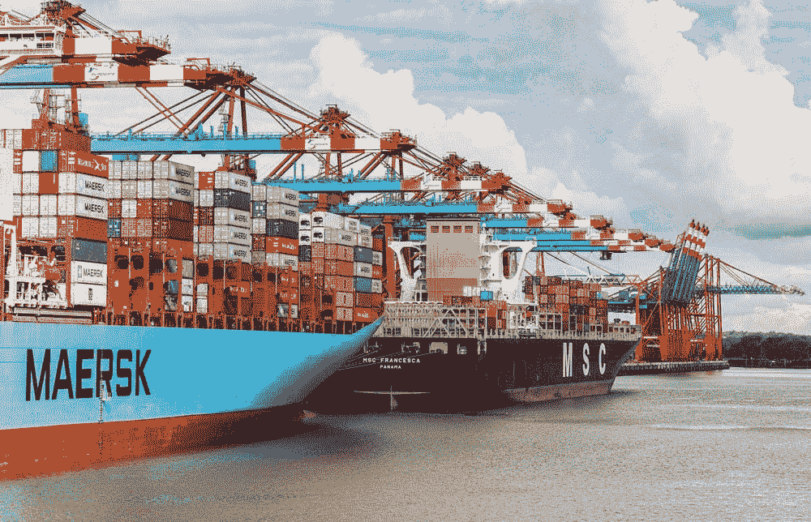
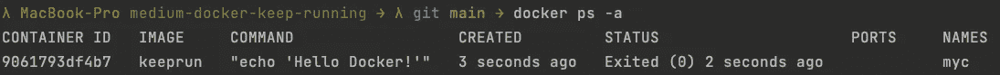
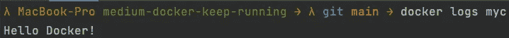
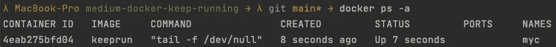
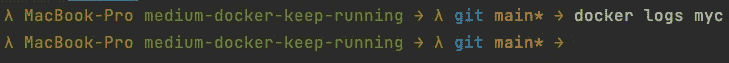
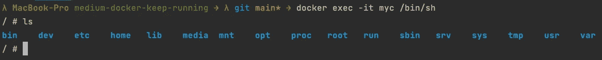

# 保持 Docker 容器运行以进行调试

> 原文：<https://levelup.gitconnected.com/keep-docker-container-running-for-debugging-fc2dfa39472c>

让你的本地 Docker 容器保持运行以进行调试的简短指南。



由[张秀坤·吕克曼](https://unsplash.com/@exdigy)在 [Unsplash](https://www.unsplash.com/) 上拍摄

**演示代码**

像往常一样，我准备了一个 [GitHub 库](https://github.com/Abszissex/medium-docker-keep-running)供您查看完成的代码库，并遵循本文中描述的步骤。

[](https://github.com/Abszissex/medium-docker-keep-running) [## GitHub-abszisex/medium-docker-保持运行

### docker build -t 保持运行。

github.com](https://github.com/Abszissex/medium-docker-keep-running) 

## 为什么要做呢？

您经常会遇到这样的问题:构建 Docker 容器，启动它，然后它由于某种错误而退出。例如，我过去经常遇到的一个错误是，特定的文件不可用或没有正确构建，所以我的 Docker 容器内的应用程序退出并停止了容器，我不知道这是为什么。

如果您在本地运行它，您将检查您的本地文件系统，看看是否一切就绪。但是由于您的应用程序是在 Docker 容器中运行的，您需要 SSH 到容器中，但是大多数情况下，容器已经停止了，您没有机会再检查文件系统。

在本教程中，我想向您展示如何让您构建的 Docker 容器保持运行，这样您就可以 SSH 到其中并搜索根本原因。

## 密码

首先，让我们创建一个简单的 Docker 容器，它只将`Hello Docker!`打印到终端。

尽管这个容器在运行时不会出错，但这没关系，因为它在打印到终端后仍然会停止。容器为什么停止并不重要，对本教程来说重要的是它停止了。

让我们构建 Docker 容器:

```
docker build -t keeprun .
```

并运行它:

```
docker run -d --name myc keeprun
```

如下图所示，容器已经运行并退出:



让我们也通过`docker logs myc`检查容器的日志:



在这种情况下，容器做了它应该做的，并打印到终端。但是让我们假设容器由于某种错误而停止了，我们现在想要调查它。

保持容器运行的最简单方法是将它的入口点改为一个将永远继续运行的命令。

让我们用`tail -f /dev/null`。

```
docker run -d --name myc keeprun <ENTRY_POINT>
docker run -d --name myc keeprun tail -f /dev/null
```

通过`docker ps -a`重新检查正在运行的容器，我们可以看到我们的容器已经启动并运行了几秒钟，还没有停止。



另外，您可能会注意到`COMMAND`的值已经改变。通过覆盖 Docker 容器的入口点，我们现在使用`tail -f /dev/null`作为开始命令，而不是触发 Docker 文件中定义的`echo "Hello Docker!"`。

我们还可以通过检查容器的日志来再次验证这一点。正如您在下图中看到的，因为没有运行`echo`命令，所以没有日志。



现在容器已经永远运行了，是时候 SSH 进入容器并检查系统了。首先，我们在 Docker 容器中创建一个 shell，并使用下面的命令连接到它。

```
docker exec -it myc /bin/sh
```

之后，我们可以运行`ls`来查看 Docker 容器中的文件和文件夹。



连接到 Docker 容器后，您可以调查文件系统，运行之前出错的应用程序，或者做任何您需要的事情来调查出错的原因。👏🏻👏🏻👏🏻

除了在`docker run`更改入口点，您还可以在 Dockerfile 中的构建步骤更改它。

所以不用通过`CMD ["echo", "Hello Docker!"]`回显，你可以用`CMD ["tail", "-f", "/dev/null"]`代替它，并以通常的方式运行容器，而不用在运行时覆盖入口点。

尽管我更喜欢使用第一种方法，因为我不必重新构建 Docker 容器，也不必更改 Docker 文件。

# 摘要

在这篇简短的教程中，您应该已经学会了如何通过覆盖入口点来保持停止的 Docker 容器运行，以便进行调试。

## 你想联系吗？

如果你想联系我，请在 LinkedIn 上联系我。

另外，请随意查看我的书籍推荐📚。

[](https://mr-pascal.medium.com/my-book-recommendations-4b9f73bf961b) [## 我的书籍推荐

### 在接下来的章节中，你可以找到我对所有日常生活话题的书籍推荐，它们对我帮助很大。

mr-pascal.medium.com](https://mr-pascal.medium.com/my-book-recommendations-4b9f73bf961b) [](https://mr-pascal.medium.com/membership) [## 通过我的推荐链接加入 Medium—Pascal Zwikirsch

### 作为一个媒体会员，你的会员费的一部分会给你阅读的作家，你可以完全接触到每一个故事…

mr-pascal.medium.com](https://mr-pascal.medium.com/membership)