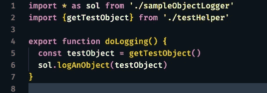
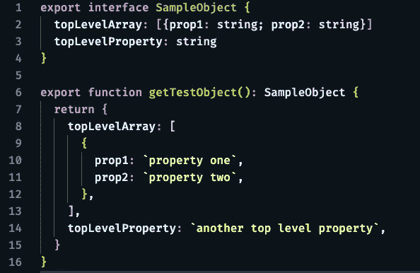
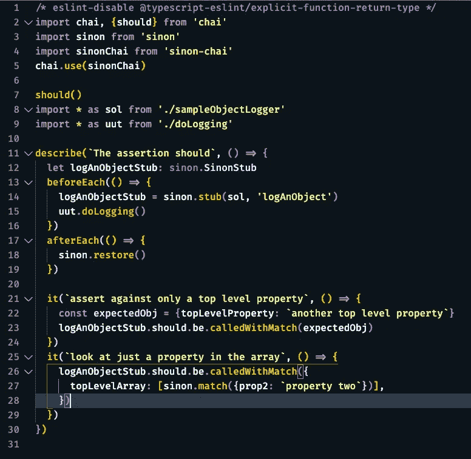

# 保持你的主张的重点

> 原文：<https://levelup.gitconnected.com/keep-your-assertions-focused-9d3f0dc74c38>

## [JavaScript 和类型脚本测试](https://gentille.us/b3601fb73472?sk=0dc73c81df810c0f181c432c9db3e085)

## 处理复杂对象的单元测试应该只断言由测试操作的对象部分。

寻找物体的正确部分

# 目标受众

虽然任何编写单元测试的开发人员都可以从本文中受益，但本文的目标读者是熟悉使用 mocha/chai/sinon 测试工具套件进行单元测试的 JavaScript/TypeScript 开发人员。

# 问题是

我测试了一些不返回任何东西的代码，但是构造了一个复杂的对象并把它传递给了一个 API。这意味着单元测试需要测试存根是用预期的对象调用的。虽然我可以编写所有的测试来每次比较整个对象，但这会使测试更难阅读和维护。我想只测试对象中发生变化的部分。在我将在这里强调的特殊情况下，我想深入研究包含一组对象的单个属性。此外，我只想查看数组中一个元素的一个属性。

# 被测单元

为了保持对解决方案的关注，我展示的代码是人为的。这是测试中的单元:

doLogging()测试中的单元

我们想要测试`doLogging()`，但是我们需要剔除导入的`logAnObject()`函数。这里`logAnObject()`只是将对象登录到终端，但是我们可以想象在一个真实的应用程序中，我们可能会调用 API 或者写入数据库。

# 样本对象

查看示例对象将有助于全面理解解决方案。同样，这是非常人为的，真实世界的例子往往要复杂得多。此外，导出的接口通常不会包含在测试数据中，但在此将其包含在内是为了帮助理解。

样本测试对象

有两个测试目标:

1.  测试`topLevelProperty`是否具有预期值。
2.  测试`topLevelArray[0].prop2` 是否有预期值

在生产代码中，设置这些属性会涉及到某种类型的逻辑，我们将验证这种逻辑。

# 解决方案

这里有很多设置，但回报只是几行代码。

目标 1:解决方案是第 23 行。我们可以使用`calledWithMatch`断言来指定我们只关心传入的对象有一个名为`topLevelProperty`的属性，并且该属性应该有一个值`another top level property.`。传入的对象可以有其他属性，但是我们只关心这一个属性。

第 26 行和第 27 行实现了目标 2。我们再次使用`calledWithMatch()`来允许对象上存在其他属性。在这种情况下，我们指定保存数组的属性名。然后在数组内部，我们使用`sinon.match()`函数来指定一个匹配的属性。这个数组中可能有其他元素，每个元素中可能有其他属性。

如果你发现自己喜欢这种技术，并且希望在 sinon 不参与的情况下也能做类似的事情，不要错过 [*保持你的断言重点:第二部分*](/keep-your-assertions-focused-part-ii-3cddadcb36fe) *。*

还有更多 [JavaScript/TypeScript 测试](https://gentille.us/b3601fb73472?sk=0dc73c81df810c0f181c432c9db3e085)技巧文章。

平静地编码。