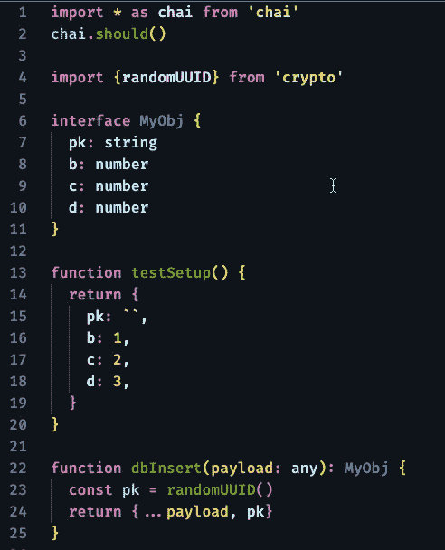
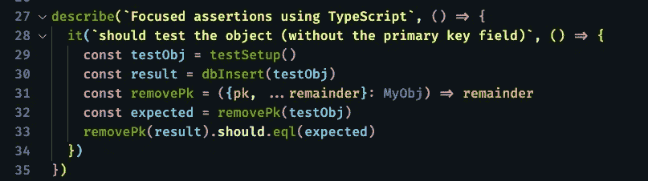

# 保持你的断言的焦点:第二部分

> 原文：<https://levelup.gitconnected.com/keep-your-assertions-focused-part-ii-3cddadcb36fe>

## [JavaScript 和类型脚本测试](https://gentille.us/b3601fb73472?sk=0dc73c81df810c0f181c432c9db3e085)

## 即使你没有碰到任何东西，你也应该只断言感兴趣的对象的部分。

只关注感兴趣的属性

# 前情提要…

在本系列的[上一篇文章中，我们讨论了如何使用`sinon` 提供的特性，比如`calledWithmatch`和`sinon.match`，只测试我们关心的对象部分，但是如果你什么都不做，你会怎么做呢？有时这种情况会发生在单元测试中，但是在集成测试中却经常发生。](/keep-your-assertions-focused-9d3f0dc74c38?sk=4e656dde0f9adf3c59ff26f216ef1b8c)

你通常只需要一个 JavaScript 就够了。与 Sinon 方法相比，这可能需要一两行额外的代码，但是当您只更改几个属性时，这比创建一个完整的新对象来测试要好。此外，当数据库之类的东西在幕后生成主键时，您通常需要测试返回值。在这些情况下，您不能创建一个完整的对象进行测试，因为您不知道主键。

让我们用一个人为的例子来避免被代码分散注意力。

生成主键的假数据库插入

这里我们有一个具有四个属性的简单对象，其中第一个属性`pk`代表我们的数据库将创建的主键。然后我们的假数据库插入函数`dbInsert`获取一个对象，向`pk`字段添加一个 UUID，并返回一个表示插入内容的新对象。有许多方法可以针对返回值编写测试，但是一个相当健壮的方法是删除我们不关心的属性。在测试之外，我在[省略 TypeScript 中的属性](/eliding-properties-in-typescript-b170cd83ee09?sk=b548a3ba40024cc90c2daf050a98acfc)中深入探讨了这种技术。

在断言之前，删除您不关心的属性

注意第 31 行定义的λ`removePk`。它将接受一个`MyObj`，并返回一个没有`pk`属性的对象副本。为了清楚起见，我在第 32 行设置了一个`expected`变量，但是这个操作也可以在第 33 行的断言中内嵌完成。

如果您只关心一两个属性，那么针对每个属性编写多个断言可能会更简单。我的经验告诉我，这种方法通常会导致额外的测试维护。如果你的测试单元和测试生成器增加了更多的属性，你必须重新访问每一个测试。

*本文显示的代码是 GitHub* *中可用的* [*。*](https://github.com/Rolias/blog-posts/tree/master/src/focused-assertions)

还有更多 [JavaScript/TypeScript 测试](https://gentille.us/b3601fb73472?sk=0dc73c81df810c0f181c432c9db3e085)技巧文章。

平静地编码。