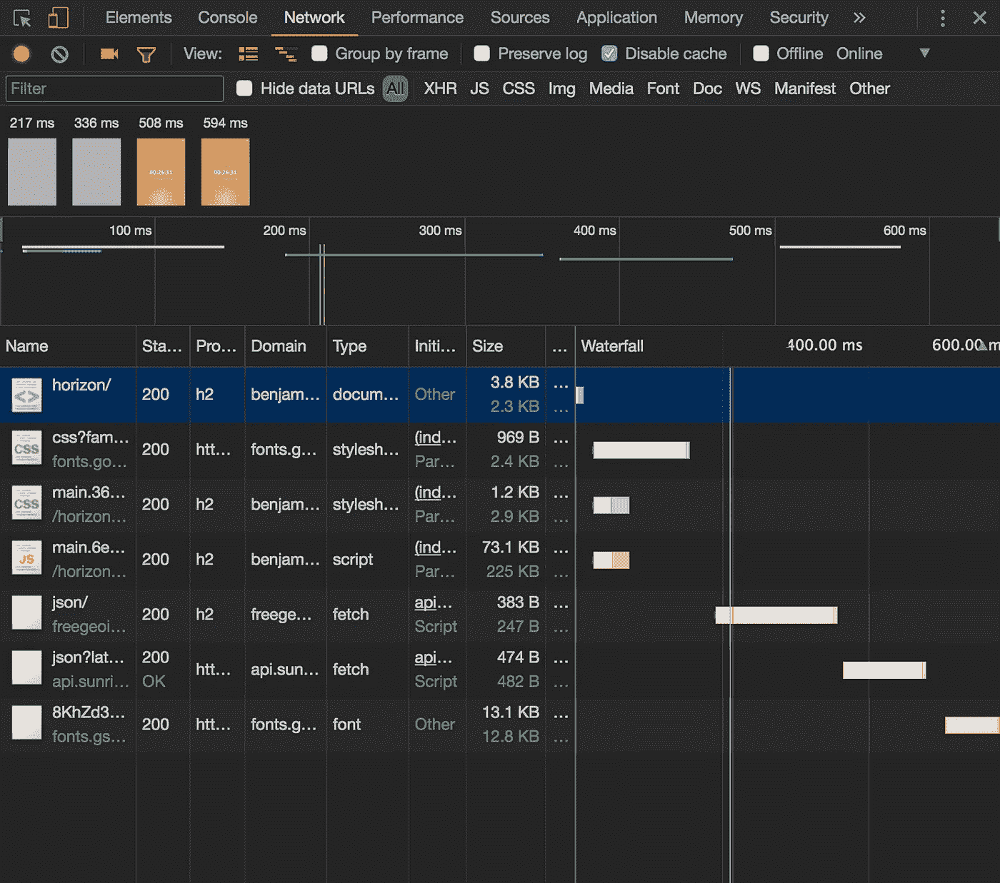
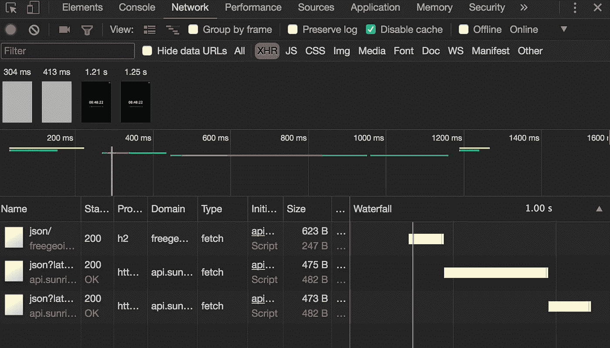
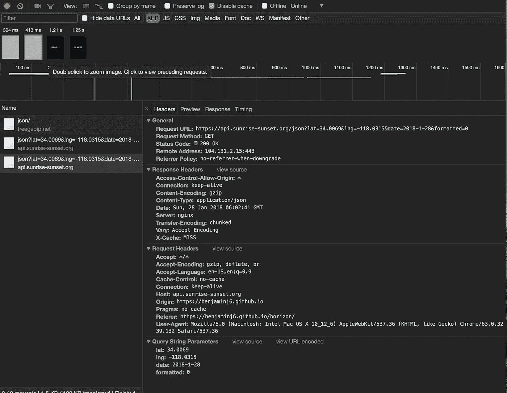
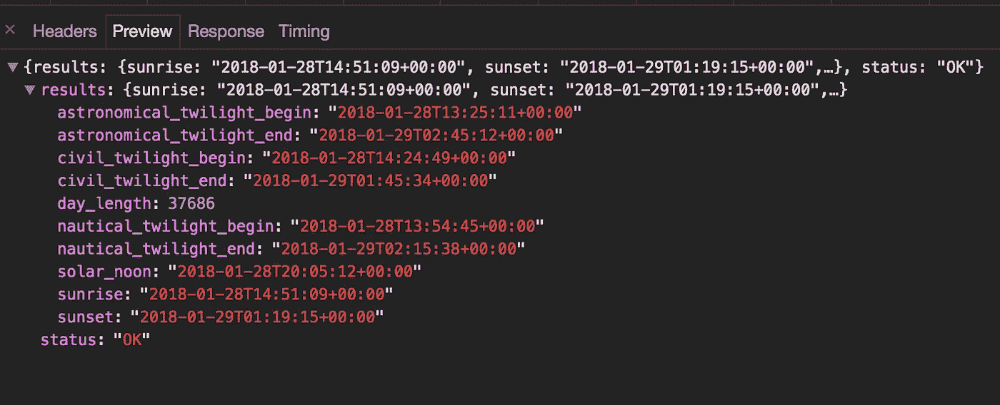

# 保持控制台清洁

> 原文：<https://levelup.gitconnected.com/keeping-a-clean-console-2c45fe91fcce>

## 使用 Chrome DevTools 检查来自 API 请求的 JSON 响应


我很幸运地指导了许多人，并与他们一起工作，这些人正通过我大约一年半前参加的同一个训练营开始编写代码😜).最近我做了一系列关于 Chrome Devtools 的研讨会，在那里我教授很多前端开发人员日常使用的 Chrome DevTools 的常见部分。我注意到的最常见的低效之一是使用`console.log`来预览来自 API 的 JSON 响应。

直到我开始第一份真正的开发者工作，我才学会如何使用 Chrome DevTools。我知道如何做基本的事情——预览 CSS 的变化，改变 HTML，基本上是在`Elements`标签里的一些东西。

我也从我目前工作的一些同事那里听到过类似的故事——调试和开发工具通常是在人们开始工作后的第八天才学会的。一个原因是，3-6 个月对于学习如何编程来说是很短的时间，更不用说学习如何很好地使用开发人员工具了(但我离题了…也许那是另一篇博客文章)。

我最近的研讨会集中在 Chrome DevTools `Network`标签上:如何分析你的加载时间和我收集的其他“生产力技巧”。

# 问题:日志，日志，无处不在

学习 web 开发过程中的第一课是理解如何通过 AJAX 处理数据。大多数重要的应用程序都需要从一个 API 获取 JSON，然后在这个 JSON 上操作。

很多时候，我会发现自己在源代码中做这样的事情，以便预览 JSON 响应。

```
fetch('https://jsonplaceholder.typicode.com/posts') 
  .then(res => res.json()) 
  .then(json => { 
    console.log(json) // to see what the response was
    // code to operate on the JSON goes here
 })
```

为了预览我的 JSON，我要么将`console.log`分散在我的代码库中，并在浏览器控制台窗口中寻找我的 JSON，要么将端点复制粘贴到 Postman 或`cURL`请求中。所有这些都可以工作，但是如果有一种更快的方法来调试浏览器中的 JSON 响应呢？

# Chrome DevTools 助您一臂之力！

多亏了 Chrome DevTools，我们可以预览我们的 JSON *而不用接触我们的源代码*(理解为:更高的生产率和更小的你不小心忘记删除一个`console.log`的机会)。

# 1.打开网络选项卡

我将在我自己的一个名为 [Horizon](https://benjaminj6.github.io/horizon) 的应用程序上演示这一切。它本质上是一个日落跟踪器，从 https://sunrise-sunset.org/获取数据。欢迎您跟随或使用您选择的任何应用程序，只要它通过互联网发送 JSON。

首先，因为我们将通过网络选项卡进行调试，所以我们希望打开它。一旦你打开它，你会看到这样的东西。



太好了！现在我们已经准备好开始调试了。

# 2.过滤依据`XHR`

虽然我的示例应用程序可能没有太多的请求，但许多应用程序在初始页面加载时可以包含 100 多个请求，这使得找到我们正在寻找的特定 AJAX 请求变得更加困难。

幸运的是，Chrome DevTools 允许我们根据响应类型进行过滤。您将在顶部栏附近看到所有可用的选项。选择`**XHR**`(这代表**X**ml**H**TTP**R**equest)，它包含所有通过`fetch`(或`$.ajax`、`axios`，或任何你用来抓取数据的方法)拉入应用程序的 JSON 数据。

过滤响应后，您的网络选项卡应如下所示:



真是油嘴滑舌！现在，我们只需解析几个请求就可以找到我们要找的东西。

# 3.检查和预览…瞧！

找到您感兴趣的请求。单击请求，您应该会看到弹出这样的菜单。



最后一步是我们选择`Preview`选项卡。一旦选中，您应该会看到类似这样的内容。



这是我们的 JSON！我们已经成功地找到了它*而没有触及我们的源代码*。这意味着我们可以在任何可以使用 Chrome DevTools 的地方使用这种调试*的方法——包括用简化的 JavaScript 调试生产中的站点。*

# 结论

如果你是一个经验丰富的专业人士，并且一直读到最后，你可能会想，“我知道这个已经很多年了，人们真的从来没有学过这个吗？”

当我第一次发现这种调试网络请求的方法时，我感觉自己刚刚被赋予了超能力。我感谢我职业生涯中的开发人员，他们教会了我如何使用工具并提高我的生产率。一个放置得当的`console.log`可能是一个非常有效的工具，但是将它分散在源代码中感觉就像整个“马斯洛之锤”的困境:

> *我想，如果你唯一的工具是一把锤子，那么把一切都当成钉子是很有诱惑力的。*
> 
> *—亚伯拉罕·马斯洛，1966 年*

一如既往，如果你读了这篇文章并喜欢它，我很想知道！在我的 [Twitter](https://twitter.com/benjamminj) 上给我发一条推文，或者在 [LinkedIn](https://www.linkedin.com/in/benjamin-d-johnson/) 上与我联系。

*原载于*[*www . Benjamin Johnson . me*](https://www.benjaminjohnson.me/blog/clean-console-using-chrome-devtools-to-stop-logging-to-the-console/)*。*