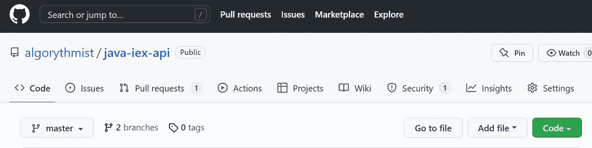
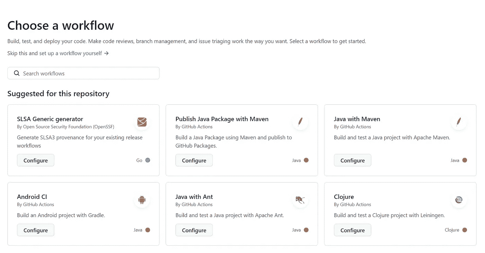
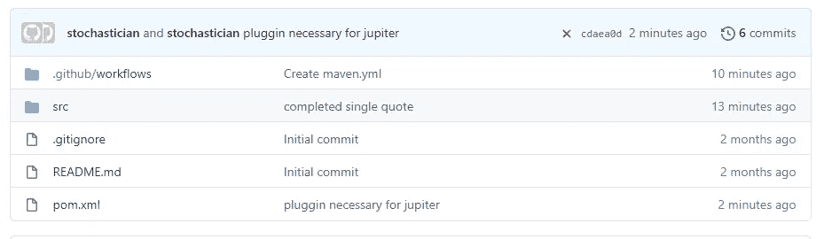
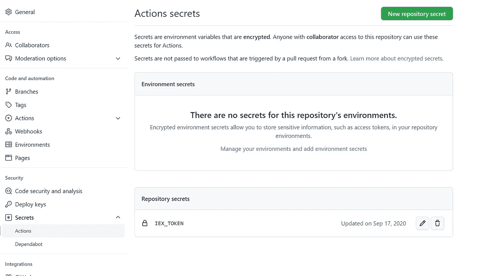
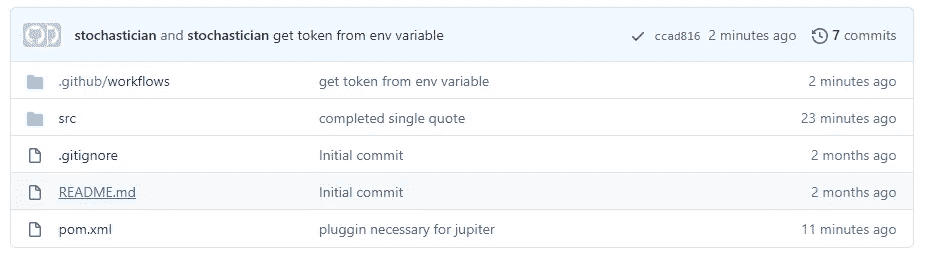

# 在 GitHub 上保守秘密

> 原文：<https://levelup.gitconnected.com/keeping-a-secret-a0d7028c6607>

## 如何隐藏公共项目的密码


有时我开发需要访问第三方 API 的开源代码，比如金融报价提供商、AWS 云解决方案、账户聚合器等等。大多数 API 提供者需要注册，并且只允许使用特定于用户的密码或秘密令牌来访问他们的服务。

所以我有以下情况:

1.  我需要在我的代码中使用第三方 API，这需要一个个性化的秘密令牌。
2.  我的代码在一个公共的 GitHub 库中。
3.  我运行持续集成来执行单元测试，这需要访问秘密令牌。
4.  我不想在代码或存储库中的某个配置文件中暴露我的秘密令牌。

**解决方案:**

GitHub 让您能够在组织或存储库级别将秘密存储为键/值对。您可以在 CI 构建中将这些秘密值作为环境变量或程序参数传递。

# GitHub 操作

GitHub Actions 是 GitHub 内置的持续集成工具。我们简要回顾一下它是如何工作的。

1.  转到您的存储库页面，例如，【https://github.com/algorythmist/java-iex-api 
2.  从顶部菜单中，单击“操作”



3.选择“新工作流程”。有太多的工作流程可供选择。在本例中，我们将选择“带有 Maven 的 Java CI”



这将创建一个新的提交，引入文件/ [。github](https://github.com/algorythmist/iex-kuotes/tree/master/.github) /workflows/maven.yml

在大多数情况下，它将只是照原样工作，但几个定制是可能的。其中之一是添加环境变量，我们很快就会看到。

文件看起来像这样。

```
# This workflow will build a Java project with Maven
# For more information see: [https://help.github.com/actions/language-and-framework-guides/building-and-testing-java-with-maven](https://help.github.com/actions/language-and-framework-guides/building-and-testing-java-with-maven)name: Java CI with Mavenon:
 push:
 branches: [ master ]
 pull_request:
 branches: [ master ]jobs:
 build:runs-on: ubuntu-lateststeps:
 — uses: actions/checkout@v2
 — name: Set up JDK 1.8
 uses: actions/setup-java@v1
 with:
 java-version: 1.8
 — name: Build with Maven
 run: mvn -B package — file pom.xml
```

3.单击“开始提交”和“提交新文件”。工作流将被合并到主分支中，并开始构建。

# GitHub 秘密

此时，如果您要求从环境中提供任何密钥，构建将会失败。失败由一个红色的小 x 表示，如下所示。要查看构建的详细信息，您可以单击红色的 x。



我的代码从环境变量中查找一个令牌，如下所示:

```
Map<String,String> env = System.*getenv*();
**return** env.get(**IEX_TOKEN**);
```

下面是我如何将这个环境变量用于我的 GitHub 构建:

1.  在屏幕的左上角，单击“设置”
2.  在左侧面板，点击“秘密”，然后选择下面的“行动”
3.  单击“新建存储库密码”。输入环境变量的名称和密码值。点击“添加密码”。该值将不可见，但如果需要，可以在以后进行更改。



4.编辑 maven.yml:找到步骤“用 maven 构建”,并添加一个 env 标签:

```
*# This workflow will build a Java project with Maven
# For more information see: https://help.github.com/actions/language-and-framework-guides/building-and-testing-java-with-maven* **name**: Java CI with Maven

**on**:
  **push**:
    **branches**: [ master ]
  **pull_request**:
    **branches**: [ master ]

**jobs**:
  **build**:

    **runs-on**: ubuntu-latest

    **steps**:
    - **uses**: actions/checkout@v2
    - **name**: Set up JDK 1.8
      **uses**: actions/setup-java@v1
      **with**:
        **java-version**: 1.8
    - **name**: Build with Maven
      **env**: *# lookup key as an environment variable* **IEX_TOKEN**: ${{ secrets.IEX_TOKEN }}
      **run**: mvn -B package --file pom.xml
```

提交更改。这将触发重建。当 CI 管道正在运行时，它会用一个黄点表示。当构建完成时，假设没有其他失败，您将得到一个绿色的复选标记，如下所示:

