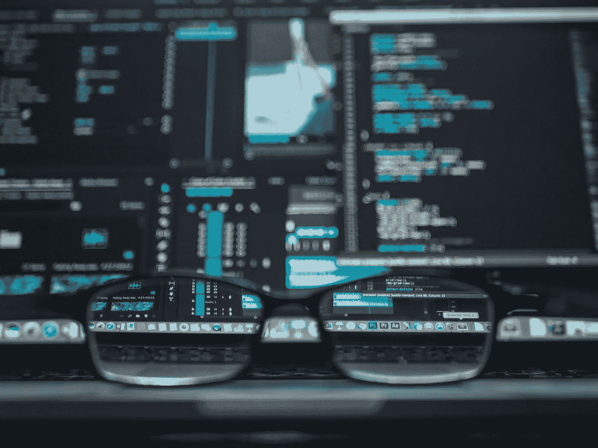

# 将敏感数据排除在日志之外

> 原文：<https://levelup.gitconnected.com/keeping-sensitive-data-out-of-your-logs-58a0d12a61cf>

凯文·Ku 在 [Unsplash](https://unsplash.com/s/photos/hacker?utm_source=unsplash&utm_medium=referral&utm_content=creditCopyText) 上的照片

## 咖啡店里的编码

如果您的组织构建或维护一个处理客户数据的应用程序堆栈，那么您应该知道保护个人身份信息(PII)和个人医疗保健信息(PHI)等敏感数据对于保持您的业务持续发展和赢得客户信任至关重要。您可能认为安全地存储 PII 和 PHI 就足够了，只需通过系统的 UI 和 API 在适当的上下文中公开它们。然而，一些最大的客户数据泄露事件已经发生，因为敏感数据进入了安全性差的日志。

你如何确保 PII 和 PHI 远离你的日志？在本文中，我们将讨论如何隔离这些敏感数据，以及哪些做法可以让您的客户相信您会保护他们的数据。

# 为什么企业必须隔离 PII 和 PHI

在我们开始“如何”隔离 PII 并保持您的日志干净之前，让我们简单地了解一下[为什么给予客户数据特殊待遇](https://www.skyflow.com/post/handle-with-care-why-you-should-isolate-and-protect-pii)很重要。毕竟，客户一直在与我们分享他们的数据。如果他们这么愿意交出它，那我们为什么要特别小心地对待它呢？

## 顾客期望

您的客户合理地假设，如果他们直接与您的企业共享他们的数据，那么您会将这些数据专门用于预期的业务用途。客户的基本期望是，他们的数据只会用于他们特别授权的目的。除非你明确告知你的客户他们的数据将被共享，否则他们希望你格外小心地对待他们的数据，就好像它带有“小心处理”的标签一样。

## 数据隐私法规和合规性

根据客户的所在地，您的企业可能还需要遵守某些数据隐私法规。在欧盟，你要服从 GDPR。在美国，几个州的消费者隐私法(包括[加州](https://oag.ca.gov/privacy/ccpa)、[科罗拉多州](https://leg.colorado.gov/bills/sb21-190)和[康涅狄格州](https://www.cga.ct.gov/2022/ACT/PA/PDF/2022PA-00015-R00SB-00006-PA.PDF))将保护客户数据的责任直接交给了收集数据的企业。

## 不同于事务性数据

应该小心处理 PII 的另一个重要原因是，它本质上不同于其他事务性应用程序数据。虽然在用户与您的应用程序的典型交互过程中会生成大量数据，但可以识别您客户个人身份的数据不是一时兴起就可以更改的，就像泄露的密码可以更改一样。有些 PII 就像生日一样，根本无法改变！许多种类的 PII，如果泄露给恶意行为者，会对人们的生活产生巨大的影响，导致身份盗窃和其他种类的欺诈。

出于客户信任和法律责任，企业必须隔离 PII，并特别小心对待它。

# 如何隔离 PII 和 PHI

我们已经制定了基本规则:企业必须特别小心地对待 PII 和 PHI。在我们讨论如何确保 PII 和 PHI 不会出现在您的日志中之前，让我们看看在收集和存储时如何隔离 PII 和 PHI 的关键注意事项。

## 你有理由储存它吗？

对于您从客户那里收集的任何数据，您都应该有一个存储它的好理由。如果你没有理由保留客户的数据，那就不要保留。简而言之:不需要？那就不要储存。

你甚至可能认为某条客户信息是良性的。然而，如果它是可以与特定客户联系起来的东西，而你对它没有真正的用途，那么不把它放在身边会更安全。

## 是什么样的数据？

即使您不确定某个数据是否足够敏感以保证隔离，您仍然应该仔细考虑您存储的数据类型。以下是 PII 的典型例子:

*   全名
*   物理地址
*   电子邮件地址
*   官方身份号码(例如，驾照或护照上的号码)
*   电话号码

然而，上面的例子并不是唯一值得特别注意和控制的数据类型。仔细想想你会在系统中保存哪些财务或医疗信息。密码对于保持安全也很重要。您还应该非常小心客户设备的 IP 地址。同样，如果你不需要这些信息，那么你最好不要存储它们。

## 当您确实需要存储它时，请使用数据保密库

思考完上述问题后，您可能会得出结论，您仍然有存储一些 PII 和 PHI 的合理需求。这并不意味着您应该将它转储到您的主应用程序数据库中。不，你应该使用一个[数据隐私库](https://www.skyflow.com/product/pii-data-privacy-vault)来确保你的客户数据保持隔离，远离你系统中的其他一切。通过为这些特别敏感的信息使用专门的存储解决方案，您可以更好地保持日志整洁，降低严重数据泄露的风险。

由[简·德米拉普](https://unsplash.com/@jdemiralp?utm_source=unsplash&utm_medium=referral&utm_content=creditCopyText)在 [Unsplash](https://unsplash.com/s/photos/category?utm_source=unsplash&utm_medium=referral&utm_content=creditCopyText) 上拍摄

# 让 PII 和 PHI 远离你的日志

许多开发人员利用常识性技术将某些敏感信息排除在日志之外，例如，过滤掉密码或 IP 地址。这些都是显而易见的。但是，[确保 PII 和 PHI 不被记录是特别重要的](https://www.skyflow.com/post/how-to-keep-sensitive-data-out-of-your-logs-nine-best-practices)。攻击者首先试图攻击的目标之一是你的日志，希望找到 PII 或 PHI 的宝藏。

## 在数据库中存储加密的敏感数据是不够的

即使当企业试图通过将敏感数据加密存储在单独的数据库中来隔离敏感数据时，未加密的数据也往往会出现在日志文件中。通常，各种商业操作需要解密 PII 或 PHI 来使用它。这通常是日志被写入文件的时候。就这样，未加密的敏感数据最终会记录在日志中。

让我们来看看如何确保您的日志中的敏感数据得到适当的清理。

## 令牌化，令牌化，令牌化

任何时候你有机会传递或存储参考 PII 和 PHI 存储在您的数据隐私库，而不是实际的数据，你绝对应该。通过对敏感数据进行标记，可以防止将实际的原始敏感数据元素写入日志文件。无论是在这些日志中、客户访问的 URL 中，还是客户可以进行的 API 调用中，使用对 PII 和 PHI 数据的令牌化引用都有助于确保这些数据的安全。

随着 PII 和 PHI 的适当标记化，可能发生的最坏情况是您的应用程序无意中记录了标记化的数据，这不会造成伤害。如果您的 data privacy vault 保持安全，并且您只是传递令牌化的值，那么没有人能够访问原始的敏感数据。

重要的是要记住，忽略敏感数据的标记化是数据最常泄露的方式之一。工程师可能会竭尽全力加密数据并保护他们的系统，但如果将敏感的 PII 和 PHI 数据元素的完整值写入日志，那么所有这些工作都将被规避。

## 管理

安全地存储您的数据只是等式的一部分。围绕如何在您的组织中使用数据，拥有定义明确、理解透彻的控制也是至关重要的。这就是有效的[数据治理](https://www.skyflow.com/post/introducing-the-skyflow-data-governance-engine)模型发挥作用的地方。有了适当的数据治理，您就可以确保考虑并回答以下问题:

*   您会将敏感数据存储在系统中多长时间？
*   什么时候不再需要保留某些敏感数据元素？
*   贵公司如何允许使用敏感数据？
*   如果某些类型的敏感数据被泄露，您会如何应对？

这些肯定是很难回答的问题，但记住它们将有助于您建立一个更加注重隐私的团队，并让您为实际的数据泄露事件做好准备。

# 结论

总之，我想重申企业特别关注客户 PII 和 PHI 的重要性，为了客户信任和法律合规性，将敏感数据与其他应用程序数据隔离开来。隔离敏感数据意味着了解它是什么类型的数据，以及您是否需要存储它。当您别无选择，只能存储客户数据时，请使用安全的数据隐私存储，它有助于令牌化和屏蔽，以防止原始 PII 被写入系统日志。最后，每个企业都应该制定一个数据治理计划，为企业如何处理客户数据设置护栏。

在现代应用程序可用的数据隐私保险库中，Skyflow 值得考虑。它提供了上面描述的所有功能，并且它提供了一个[免费试用](https://www.skyflow.com/try-skyflow)，所以你可以检查它的数据隐私 API。