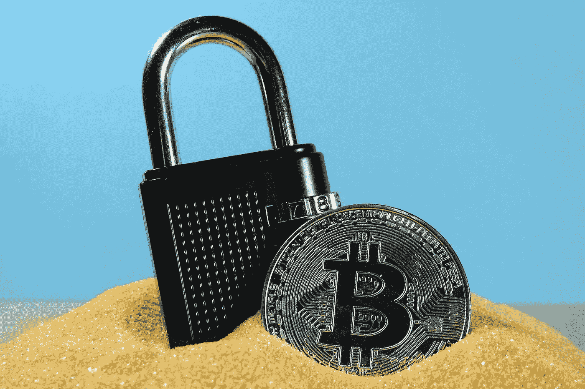
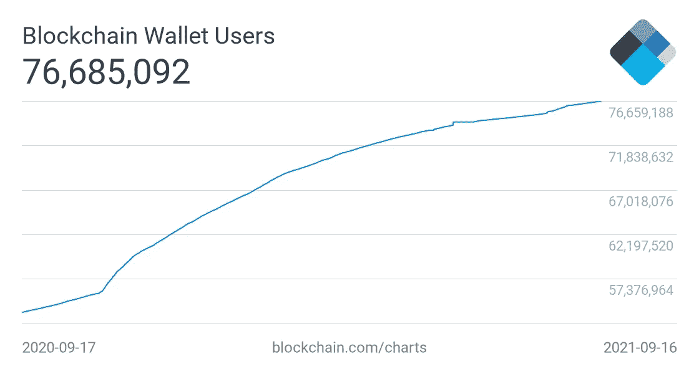
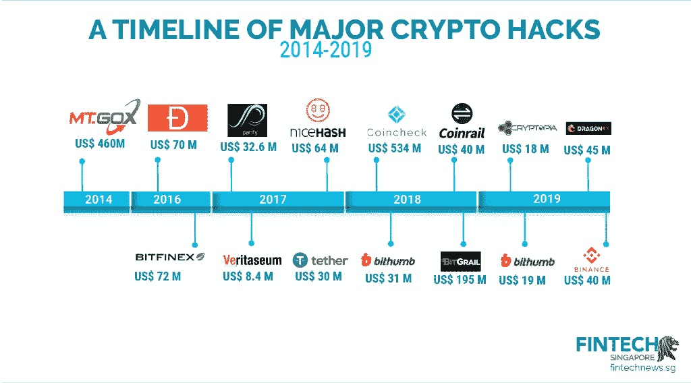

# 保护您的密码安全:保护您的加密货币钱包的 4 种基本方法

> 原文：<https://levelup.gitconnected.com/keeping-your-crypto-safe-4-essential-ways-to-secure-your-cryptocurrency-wallets-e1f10f5b4ea1>

近年来，加密货币席卷全球，越来越多的用户蜂拥购买比特币、以太坊和一些替代货币，以建立投资组合和拥抱数字金融。然而，代币的数字特性意味着许多用户很难安全地持有他们的加密货币。

可悲的是，加密货币领域长期以来一直存在安全漏洞，黑客将数字代币视为窃取合法所有者资产的绝佳目标。

作为保护加密货币安全的一种手段，[钱包被交易所普遍使用。还有很多专门针对智能手机和桌面用户的钱包应用，如 MetaMask、Trust Wallet 和 Gemini。](/a-crypto-wallet-is-not-what-it-seems-daf4557ad566)

*(图片:* [*区块链探索者*](https://www.blockchain.com/charts/my-wallet-n-users) *)*

从上面的数据中我们可以看出，随着比特币之类的[在 2020 年末至 2021 年初之间经历了反弹，总部位于](/is-warren-buffett-secretly-buying-bitcoin-101147fcd45c)[区块链的](/creating-a-blockchain-from-scratch-9a7b123e1f3e)加密货币钱包用户的数量迅速增加。

加密货币钱包的行为方式与物理钱包类似，因为它们是一个可以存储资产的位置。然而，许多加密钱包也可以安全地转换您的货币和代理电子交易。

*(图片:* [*Fintech 新闻*](https://fintechnews.sg/23594/blockchain/cryptocurrency-hack-binance/) *)*

可悲的是，在[加密货币格局](/the-7-types-of-cryptocurrencies-you-must-know-3b26b2ce0eb8)形成的几年里，安全性一直是一个重大问题，黑客攻击已经成为交易所之间的一个问题。最值得注意的是，我们可以看到 Mt. Gox 发现自己处于 2014 年 4.6 亿美元黑客攻击的中心。从那以后，许多交易所被黑客暴露了——说明了使用安全钱包的重要性。

考虑到这一点，让我们来看看如何使您的加密货币钱包尽可能安全，免受网络攻击的威胁:

# 考虑冷藏

没有比选择一个“冷”钱包更好的保护你的加密资产的方法了。简而言之，冷钱包是没有连接到互联网的硬件——这意味着你的投资组合不可能在网上被盗。

冷钱包将用户的地址和私钥存储在一个没有连接到互联网的驱动器上，它通常配备有软件，使观众能够查看他们的投资组合，而不必将他们的私钥置于风险之中。

也有可能创造一个纸质钱包——这可能是存储加密货币最安全的形式。某些网站允许你通过在一张纸上打印你的公钥和私钥来创建一个纸钱包。这使得访问你的加密货币是不可能的，除非你拥有那张纸。

为了增加安全性，一些密码持有者将他们的纸质钱包密钥层压在一起，并将其存储在当地银行的保险箱中。

有很多基于硬件的钱包提供商，所以如果你想采用最安全的加密方式，做点功课是值得的。然而，重要的是避免意外丢失你的加密货币钱包，从而丢失你的加密货币——正如一些投资者[发现的惨痛教训](https://www.cnbc.com/2021/01/15/uk-man-makes-last-ditch-effort-to-recover-lost-bitcoin-hard-drive.html)。

# 在线时拥抱 VPN

正如我们已经从过去七年发生的加密货币黑客事件的时间表中看到的那样，在线持有加密货币可能是一项风险很高的业务。然而，对于打算在相对较短的时间内交易和持有资产的用户来说，这也很实用。此外，对于缺乏经验的[加密货币](https://levelup.gitconnected.com/crypto/home)投资者来说，通过比特币基地和币安等主要交易所使用内置钱包可能要简单得多。

即使存储在网上，也有可能尽可能保证您的资产安全，并且在进行交易或登录您的钱包之前使用虚拟专用网络对于在您的资产上添加这一至关重要的保护层是非常理想的。

尽管许多交易所声称他们有自己的高质量加密技术，但至少可以说，该行业抵御威胁的历史是不完整的。通过使用在线的无日志 VPN 服务，您可以放心地进行交易，即使在公共 WiFi 位置也是如此— [安全地知道](https://bestpaidvpn.com/are-vpns-worth-it-4-strong-arguments-that-will-help-you-decide/)没有人会窥探您的资产。

一些加密钱包应用程序，如 Samourai Wallet，主要是为了提供更高级别的匿名和隐私。该钱包不使用地址重用，并支持基于 Tor 和 VPN 的财务管理。

# 不要纠结于你的密码

美国[多达四分之三的千禧一代在超过 10 种设备上使用同一个密码](https://cisomag.eccouncil.org/cryptocurrency-wallet-security/)。这是一个巨大的分发量，如果其中一个设备落入坏人之手，将会造成巨大的潜在损失。

考虑到这一点，在你的钱包里使用不同的密码当然是值得的。尽管使用包含多个特殊字符的更长密码可能会令人沮丧，但这比冒着在受损账户中损失财富的风险要好得多。此外，如果你觉得有些事情不太对劲，或者如果你已经使用你的密码好几个月了，一定要改变事情，创造一个新的和不可预测的短语。

此外，确保在适用的情况下使用双因素身份认证(2FA)或多因素身份认证(MFA)。

# 对网络钓鱼保持警惕

黑客获取你钱包最简单的方法是通过[网络钓鱼攻击](https://www.finimize.com/wp/guides/hold-cryptocurrency-safely/)，他们在一个真实网站的假版本上诱骗你输入密码或私钥。

在这里，当你在没有理由 100%信任的网站上输入个人信息时，保持警惕是至关重要的。在通过不常用的超链接访问网站时，在输入信息之前一定要仔细检查，如果网站要求登录详细信息，一定要查看网站的 URL。

幸运的是，[加密货币生态系统](/what-would-a-ripple-ipo-mean-for-the-world-of-cryptocurrencies-eb50b9c0c4bf)正在快速成熟，该行业被主流采用意味着它在面对攻击时变得更加强大。然而，对你来说，保持警惕，寻找保护你的资产安全的方法总是至关重要的。投资加密一直是一件令人兴奋的事情，没有你的硬币丢失的威胁——由于冷钱包和 VPN 加密，享受加密货币的刺激更容易，而不用担心失去你的资产。