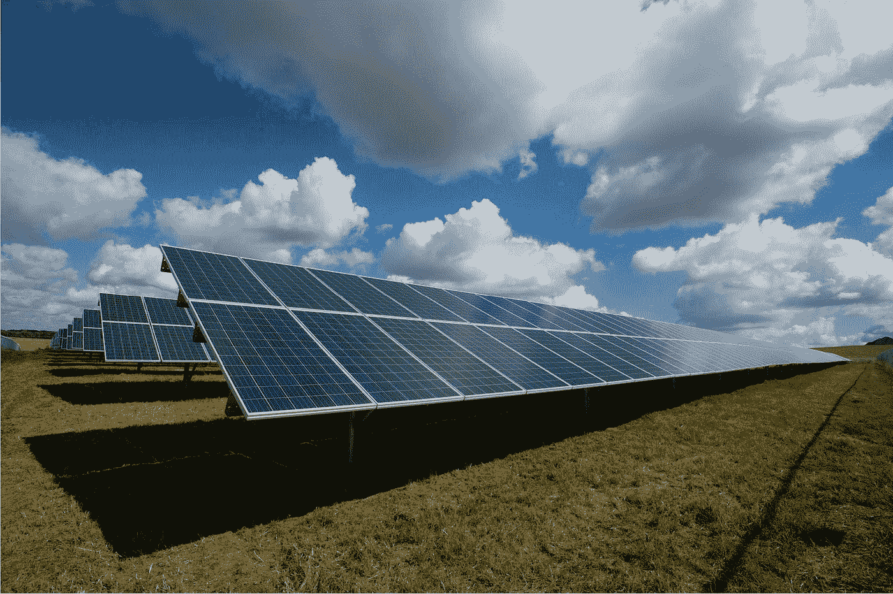

# 肯塔基州将自己定位为比特币开采的美国之家

> 原文：<https://levelup.gitconnected.com/kentucky-positions-itself-as-the-us-home-of-bitcoin-mining-2d65de41821f>

## 另一个州没有等联邦政府表态就接受了区块链

图片由来自 [Pixabay](https://pixabay.com/?utm_source=link-attribution&utm_medium=referral&utm_campaign=image&utm_content=3126814) 的 [Aaron Olson](https://pixabay.com/users/aaronjolson-4628445/?utm_source=link-attribution&utm_medium=referral&utm_campaign=image&utm_content=3126814) 拍摄

3 月 18 日，肯塔基州议会最终批准了众议院 230 号法案，为选择在本州经营地下采矿业务的公司提供能源和税收优惠。人们希望这些优惠政策能吸引企业，从而促进就业，更广泛地帮助当地经济。

该法案是由大会代表克里斯·弗里兰(Chris Freeland)和史蒂文·鲁迪(Steven Rudy)提出的，他们希望肯塔基州能够及时成为加密采矿领域的全国领导者——与此类业务相关的很大一部分成本是满足处理与比特币生产相关的复杂算法的计算能力需求所需的能源。因此，降低能源成本对那些希望尽可能提高运营利润的企业来说极具吸引力。

虽然这些措施对企业来说意义重大，但当谈到比特币时，人们很少会忘记与如此巨大的能源消耗相关的环境影响问题。

# 比特币使用的能量

对比特币持怀疑态度的人的主要反对意见之一是比特币开采过程中使用的能源。有一整套值得深入探讨的论点来专门解决这个话题，我已经在一篇单独的文章[中更完整地总结了其中的许多论点。](/is-bitcoin-an-environmental-disaster-waiting-to-happen-d770e4bea5e9)

关于比特币及其能源使用的标题通常是情绪化的，旨在激起愤怒。取决于你相信哪个估计，比特币可以被比作一个瑞士大小的国家的能源消耗(当考虑到整个网络使用的能源时，包括采矿和处理交易)。尽管这些统计数据令人印象深刻，也可能令人担忧，但它们只是故事的一半。

## 能源的合理使用？

在判断使用的能源是否过量之前，我们需要首先考虑这种使用是否值得，是否对人类有用。这是每个人自己的价值判断。

目前，这项技术仍然相对较新，比特币的各种好处只是逐渐被核心比特币社区之外的人更广泛地理解。最近，[公众对 NFTs](/what-makes-a-digital-image-file-worth-69-million-4d49a9eabcb7) 认识的提高进一步加剧了关于区块链技术使用能源的争论。

来源:[推特](https://twitter.com/nlw/status/1369616842822717444?s=20)

争论的激烈并不意味着它的能源使用是不合理的。

你的意见将取决于你是否认为现有的金融体系在长期内是可行的，而政府正在[无情地凭空印刷新的钞票](https://www.cityam.com/almost-a-fifth-of-all-us-dollars-were-created-this-year/)以支撑陷入困境的全球经济。这将取决于像比特币这样的系统(具有先天的有限供给)是否是未来价值储存和交换的合适手段。

想想看，2015 年美国的圣诞灯与萨尔瓦多等国家消耗的能源一样多。对于那些不庆祝节日的人来说，或者对环境比对圣诞节精神更关心的人来说，这也可能被认为是对能源的无聊和不必要的使用？

## 电到哪里去了？

以比特币名义使用的能量被与比特币开采相关的计算机设备消耗，并通过向区块链技术写入条目来记录和验证网络上发生的交易。

在采矿的情况下，设备需要具有高规格，以便采矿钻机能够快速解决复杂算法的数据处理。该网络以每 10 分钟 1 比特币的相对固定比率在全球范围内产生新的比特币来奖励矿工。每一枚新硬币都奖励给最先解决每个计算问题的矿工。

因此，采矿节点需要快速运行，这需要良好的组件和相应的现成(理想情况下，便宜)的能源。

# 肯塔基州和可再生能源

反对比特币采矿的能源使用的一大部分理由是，尽可能多地使用清洁和绿色的能源——从可再生资源中产生。由于比特币网络遍布全球，采矿业务没有必要设在主要城市。因此，采矿作业可以位于绿色能源附近，而不需要将能源运输到需要的地方。

看来肯塔基州作为一个州，普遍采用可再生能源是有动力的，这一定是它如此看好成为比特币采矿业务首选州的部分原因。水力发电是这种能源的一个很好的例子——肯塔基州有潜力通过仅从现有的大坝恢复 887 兆瓦的电力供应，使其目前的水力发电供应翻一番。

作为一个国家，德国在太阳能发电方面领先世界，但肯塔基州有潜力超越这一点，因为已经采取措施，到 2025 年太阳能发电将满足 [15%的能源需求。](https://www.energylivenews.com/2020/06/03/kentucky-expands-renewable-footprint-through-shared-solar-generation/)

肯塔基州仍然严重依赖燃煤发电，2019 年[大约 73%的能源](https://www.ewg.org/energy/23138/after-pandemic-kentucky-can-rebuild-economy-and-create-jobs-investing-clean-energy)来自煤炭。随着它寻求将自己宣传为未来比特币开采的首选目的地，这可能有助于推动该州更普遍地转向可再生能源——这一转变可能对比特币和蓝草州都有利。

Unsplash 上[美国公共电力协会](https://unsplash.com/@publicpowerorg?utm_source=unsplash&utm_medium=referral&utm_content=creditCopyText)的照片

# 率先采用比特币的州

虽然美国联邦政府继续[评估其对比特币和加密货币的立场](https://www.pymnts.com/cryptocurrency/2020/us-treasury-proposes-new-disclosure-rules-on-bitcoin-other-cryptos/)——最根本的是如何以及是否应该监管和控制它们(以及这是否可行)，但似乎各个州的领导人正在一个接一个地做出自己的决定。这本身可能表明，那些希望开始采用比特币的州已经不耐烦了。

肯塔基州的举动肯定被视为具有前瞻性——这是一种识别未来基础设施中可能成为关键部分的手段，并为企业来到该州提供了令人信服的理由。其他州也很早加入进来，并宣布自己“支持比特币”。

怀俄明州已经竭尽全力(包括通过零州公司和个人所得税)吸引数字资产和区块链技术公司在该州立足——两代情、北海巨妖加密交易所和 [now Ripple](https://www.coindesk.com/videos/recent-videos/why-crypto-companies-like-ripple-are-moving-to-wyoming) 都已将怀俄明州作为自己的地盘。

最近，怀俄明州引入了一个新系统，允许基于区块链计算的[公司和法律文件归档。](https://www.coindesk.com/state-of-wyoming-introduces-bill-for-blockchain-filing-system)

迈阿密市也在探索如何在运营中拥抱比特币。市长 Francis Suarez 引入了各种措施，包括给予城市雇员用比特币支付的机会，以及允许市民也用比特币支付[费用和税收。该市可能最终也会效仿 MicroStrategy 和特斯拉(Tesla)等公司，将部分国库投资于比特币。](https://www.forbes.com/sites/rogerhuang/2021/02/01/miamis-mayor-leads-the-charge-to-bring-bitcoin-to-americas-largest-cities/)

虽然这些措施目前不可避免地是零敲碎打和有点支离破碎的，但它确实表明了美国各地的政治领导人正在认真看待比特币和区块链技术所提供的潜力。

# 比特币和区块链是变革的催化剂。

对于肯塔基州来说，推动比特币在采矿企业中的应用应该被视为一种进步和前瞻性的举措——这可能会带来新的就业机会，并为该地区带来企业投资。该倡议还可能为该州迁移到可再生能源的倡议提供健康和受欢迎的推动——有效地作为用清洁能源取代燃煤电力的催化剂。

美国其他州和城市也在以开放的态度看待比特币、数字资产和区块链技术，因为他们评估了它们在未来可能提供的可能性。虽然所有人都有权在技术成熟和进步时保留判断，但那些具有前瞻性和早期采用者也可能是最先受益的人。

如果说比特币本身证明了什么的话，那就是随着它的成熟，早期采用者将获得最多的收益。

如果你喜欢阅读这样的故事，并且愿意支持 Medium 上的作家，考虑注册成为 Medium 会员。一个月 5 美元，给你无限的故事。如果你注册使用我的链接，我会赚一小笔佣金。

 [## 通过我的推荐链接加入灵媒——托比·黑兹伍德

### 作为一个媒体会员，你的会员费的一部分会给你阅读的作家，你可以完全接触到每一个故事…

tobyhazlewood.medium.com](https://tobyhazlewood.medium.com/membership) 

注:*本文仅供参考。不应将其视为财务或法律建议。在做任何重大财务决定之前，先咨询财务专家。*

## [如果你喜欢这篇文章，我希望你能加入我的邮件列表。](http://bit.ly/TobyHazlewoodList)