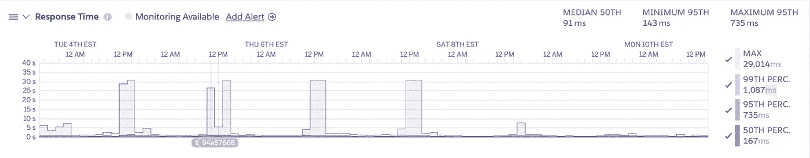
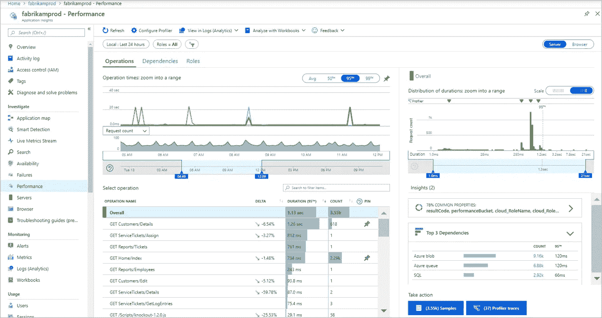
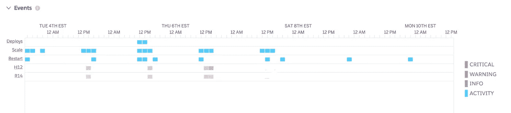
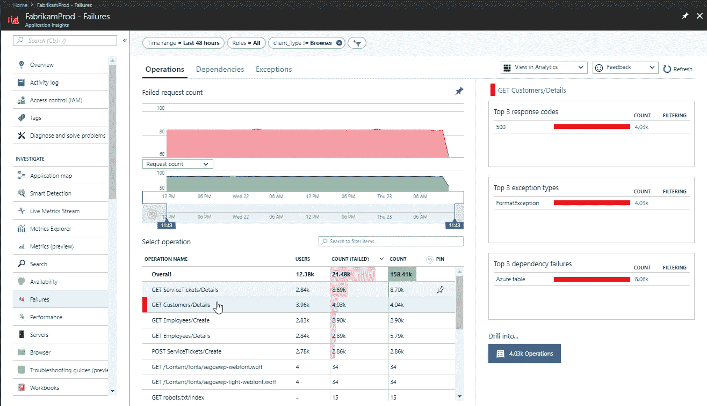

# 面向开发人员的关键应用指标和监控

> 原文：<https://levelup.gitconnected.com/key-application-metrics-and-monitoring-for-developers-5ed1837d3cad>

> 你终于上线了，恭喜你！现在怎么办？

# 介绍

过去，代码和基础设施是由完全独立的组织处理的。开发人员编写代码，而 IT 人员设置服务器。开发人员修复 bug，而 IT 部门处理基础设施维护。然而，随着开发运维的趋势以及平台即服务(PaaS)可用性的增加，开发和 IT 之间的重叠越来越多。对于开发人员来说，这可能意味着关注基础设施，这是一项与标准应用程序开发截然不同的任务。

作为一名全栈开发人员，我不得不处理越来越多与基础设施相关的职责，包括监控生产应用程序。我们刚刚在 https://www.life-global.org 为惠普基金会推出了基于 Next.js 的学习管理系统。作为开发团队的领导者，我一直在研究如何通过度量来最好地支持和维护应用程序。

在本文中，我将介绍我认为重要的三个基本指标:响应时间、错误率和缓慢的事务。这些与开发人员特别相关。对于每个指标，我将解释它是什么，为什么您应该关注它，以及如何在 [Azure](https://azure.microsoft.com/) 和 [Heroku](https://www.heroku.com/) 中监控它。最后，我还将谈一谈主动监控的好处。

但是首先——到底什么是度量？

# 什么是度量？

根据 Investopedia,[指标](https://www.investopedia.com/terms/m/metrics.asp)是一种“定量评估方法”,通常用于评估、比较和跟踪绩效。从这个定义中，我们可以梳理出度量的几个属性。首先，指标是一种统计工具；第二，指标告诉我们的是相对绩效，而不是绝对绩效。

# 统计工具

度量是统计工具。因此，我们对统计了解得越多，我们就越能正确地解释和利用我们的指标。是的，这意味着我们不仅需要理解均值、中值和范围等术语，还需要理解分布和百分比。例如，如果第 95 个百分位数的响应时间是 350 毫秒，这意味着 95%的响应时间小于或等于 350 毫秒。

对于那些对深入研究统计学感兴趣的人来说， [Think Stats](http://greenteapress.com/thinkstats/) 可以在网上免费获得，它在向开发者介绍基本概念方面做得很好。

# 相对性能

作为开发人员，很容易陷入绝对化的陷阱。例如，当您执行代码评审时，请考虑一下您自己:

> 这是解决这个问题的错误方法。

或者，您可能正在调试产品中的一个 bug，并且最终找到了问题。你可能会想:

> *这部法典自始至终都是错误的；如果我们一开始就想到这个案子，我们就能处理好。*

然而，度量是一种统计工具，统计通常不会给你绝对“正确”或绝对“错误”的信息。更确切地说，度量提供了理解应用程序当前和过去状态的洞察力。通过比较这两者，您可以了解应用程序的**相对性能**。我们将学习“更好”或“更差”，而不是“好”或“坏”。理解这一点对于正确使用指标至关重要。

现在我们对指标有了更好的理解，让我们来看看我们的三个指标。

# 三个指标

我们要看的三个指标是响应时间、错误率和缓慢的事务。我选择这些指标有几个原因。首先，这三个指标*与基础设施设置*相关。无论您是使用无服务器设置、托管应用程序实例、Kubernetes swarm，还是直接在实际硬件上托管您的应用程序，这些指标仍然适用。

第二，这些指标直接与应用程序的用户体验联系在一起。用户对与他们交互的应用程序的响应能力和可靠性有着根深蒂固的期望，并且通常在发现问题时已经太晚了。对这些指标的主动监控有助于保持用户对您的应用❤️.的喜爱

现在，让我们进入指标！首先，让我们看看响应时间。

# 响应时间

## 这是什么？

响应时间是应用程序响应客户端请求所花费的时间。

## 我为什么要在乎？

这是应用程序对用户输入或页面切换响应的一个关键指标。长响应时间意味着用户等待应用程序的时间更长。它们也是高服务器负载的指示，因为服务器需要为每个请求花费更多的时间。Heroku 建议您的 web 应用程序[的响应时间低于 500 毫秒](https://devcenter.heroku.com/articles/request-timeout)，这是一个很好的经验法则。

## 我如何监控这个？

首先，让我们澄清一下我们应该关注哪些统计数据。您可能倾向于查看平均响应时间，但这可能会被异常值(如超长请求)扭曲。

相反，我建议查看基于百分比的响应时间统计数据。中位数，也称为第 50 个百分位数，是一个有用的指标，因为它让我们知道所有请求中有一半花费的时间等于或少于这个时间。第 95 和第 99 个百分位数也很有用，因为它们可以告诉你大多数用户是如何整体体验你的应用程序的。Heroku 仪表板提供了一组很好的可视化效果，显示了这三个关键统计数据:

类似地，Azure 在其应用洞察模块下提供了服务器响应时间指标:

# 出错率

接下来，我们来看看错误率。

## 这是什么？

错误率是应用程序在一段时间内产生的错误数。

## 我为什么要在乎？

作为开发人员，我们习惯于研究 bug，这些 bug 是对一组指定需求的可重复的偏离。然而，在现实世界的应用程序环境中，有时会由于我们的应用程序代码之外的网络和基础设施变量而发生错误。因此，不仅要考虑单个错误，还要考虑作为应用程序稳定性指标的总体错误率，这一点很重要。

## 我如何监控这个？

错误率监控与其说是一门科学，不如说是一门艺术，因为它在很大程度上取决于错误的类型。您可以从查看 Heroku 的 Metrics 选项卡中的 Events 部分开始。将鼠标悬停在每一个方块上，您将获得该事件的详细信息。

对于 Azure，您可以转到应用洞察失败面板:

从那里，记下每单位时间的错误频率和每个请求的错误频率。单位时间内的**频率**将让您了解整个应用程序发生错误的频率。**每次请求的频率**关注用户体验，并说明用户遇到错误的频率占应用程序整体使用的百分比。随着时间的推移，跟踪这两个错误率的度量将使您深入了解应用程序的健康状况是如何变化的。

同样，这里很难给出绝对数字——相对性能是我们所追踪的。也就是说，如果您的应用程序有服务级别目标或协议，那么这可能会影响您的目标速率。[谷歌 SRE 工作簿](https://landing.google.com/sre/workbook/chapters/alerting-on-slos/)给出了一个为 99.9%的 SLO 设置提醒的例子。如果您的应用程序追求这种级别的可靠性，那么您想要的错误率应该是< 0.1%。关键是设定一个现实的、可实现的目标。

此外，看看最常见的异常类型，并做一些基本的分类。如果出现任何可能导致数据丢失的严重错误或问题，请在下一次审查之前记录下来并进行调查。这更类似于解决一个标准的 bug。

# 缓慢的交易

最后，我们来探讨一下慢速交易。

## 它们是什么？

任何需要很长时间的交易。当然，“长”可以是相对的，取决于应用程序和事务类型。

## 我为什么要在乎？

有时，我们可能会遇到一些请求，这些请求发生的频率不够高，不足以影响响应速度，而且它们也不会完全出错。但是，由于所需的长度和计算能力，它们仍然会影响应用程序的响应能力。缓慢的事务经常会暴露出性能瓶颈，这些瓶颈对用户体验的影响比频率可能显示的要大。

此外，长时间运行的事务会占用过多的计算资源，这会对其他事务产生负面影响。

## 我如何监控这个？

监控缓慢的事务并不简单。有两种主要的方法可以得到慢速交易的列表。最简单的是按持续时间对事务列表进行排序，并查看我们运行时间最长的事务的长度和频率。正如我们在响应时间一节中所讨论的，我建议挑出任何对于一般 web 应用程序来说超过 500 毫秒的事务。

一种更复杂的方法是查看持续时间超过 95%响应时间的事务。类似地，您可以使用任何您喜欢的百分比。然而，对于资源受限的小型开发团队，我不建议降低这个百分比太多。

无论哪种方式，一旦有了长时间运行的事务类型的列表，就可以通过计算给定事务类型在单位时间内花费的总时间来对它们进行排序。例如，对于一个长时间运行的 SQL 查询，平均运行时间为 1.3 秒，在过去七天中运行了 1，000 次，只需乘以 1.3 * 1000 = 1300 秒/周。为每种事务类型计算这个值，以了解哪些事务类型应该优先处理。通常情况下，需要最多时间的项目可能是您应该首先处理的项目。但是，其他因素，如事务处理期间的内存/CPU 使用情况，也可能会对此产生影响。

这是我们将在本文中研究的三个指标中的最后一个。然而，在我结束之前，我要简要说明一下我们应该和不应该如何监控:

# 主动监控与被动灭火

作为一名开发人员，很容易养成我称之为**反应式救火、**或者仅仅或主要对报告的问题或错误做出反应的习惯。这些问题很容易确定优先级，因为很明显用户已经遇到了问题或停机时间。然而，当您正忙于救火时，大火继续破坏应用程序停机时间或导致一些其他问题。

**主动监控**是减少火灾数量的最佳方式。本质上，您需要定期监控您的指标。这是**主动**，因为它要求您或您的团队在用户报告任何问题之前查看您的应用程序响应时间、错误率和缓慢的事务。通过定期检查您的度量，您可以在用户报告问题之前识别问题*，并且您可以主动解决可能成为更大问题的错误或瓶颈。*

此外，定期监控您的指标会让您感觉到对于您的应用程序什么是“正常”的，什么是不正常的。如前所述，在阐明相对性能而非绝对性能时，度量是最有帮助的。Heroku 建议[在每次查看度量标准时创建一个评审文档](https://devcenter.heroku.com/articles/reviewing-your-key-application-performance-metrics?preview=1#start-a-review-document)。养成这个习惯将允许您跟踪您的应用程序随着时间的推移是如何执行的。

# 摘要

在本文中，我列出了三个基本指标来帮助您开始应用程序监控之旅！然而，响应时间、错误率和缓慢的事务只是开始。

对于那些准备投身于网站可靠性工程世界的人来说，谷歌的[页面](https://landing.google.com/sre/)和[书籍](https://landing.google.com/sre/sre-book/toc/index.html)是无可匹敌的，而且是免费的！也就是说，对于一般的应用程序开发人员来说，这是一个非常陌生的领域，所以我建议监控一些小的东西，而不是什么都没有。

如果您有任何问题或意见，请随时通过 [hello@henryjin.dev](mailto:hello@henryjin.dev) 与我联系，或者通过 [https://henryjin.dev](https://henryjin.dev) 查看我的网站，了解更多关于我的信息。感谢阅读！