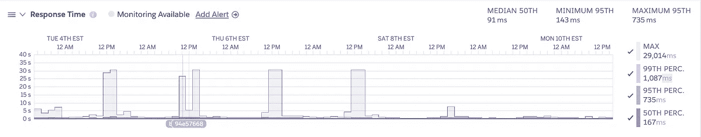
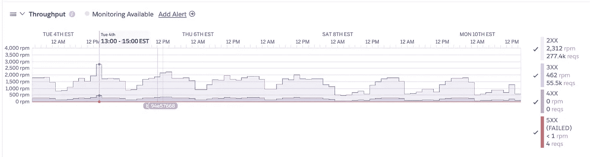
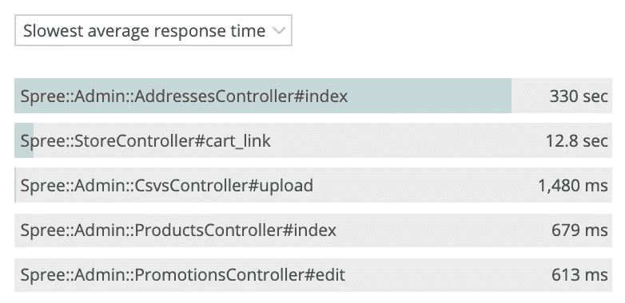

# 从统计员转变为开发人员的角度看关键应用程序性能指标

> 原文：<https://levelup.gitconnected.com/key-application-performance-metrics-from-the-viewpoint-of-a-statistician-turned-developer-ae86a0e9be28>

在 [Unsplash](https://unsplash.com?utm_source=medium&utm_medium=referral) 上由 [Carlos Muza](https://unsplash.com/@kmuza?utm_source=medium&utm_medium=referral) 拍摄的照片

你刚刚发布了你的新应用到野外，在生产中生活。成功！现在怎么办？你的工作完成了，对吗？不对。既然您已经部署了您的代码，那么是时候监控它、收集数据并分析您的度量了。

如果没有应用程序性能监控，您就无法准确地确定事情进展得有多顺利。人们在使用你的应用吗？app 性能好吗？页面加载速度快吗？您的用户遇到过任何错误吗？如果有，在哪里？多久一次？

收集此类数据的第一步是应用程序监控。一旦你有了数据，正确地分析它是很重要的。数字可能会说谎，确保你得出准确的结论是很重要的。

在本文中，我们将讨论一些关键的应用程序性能指标，以及如何从统计学的角度考虑它们。

# 关于我的一点点

在我们开始之前，先简单介绍一下我。我开始了我的大学教育，主修心理学。几年后，我意识到比起社会科学方面，我更喜欢心理学的硬科学部分，所以我把专业改为统计学。在我学习统计学的时候，我参加了几门编程课程，学习统计学家学习的各种语言，比如 R、SAS 和 SQL。我爱上了编程，并从此走上了这条道路。尽管我毕业时获得了统计学学士学位，重点是应用统计学，但我的整个职业生涯都是在做软件工程师。

我告诉你这些的原因是，我仍然有一个统计学家的心态。我喜欢好的图表和有趣的研究。但是误导性的数据、错误的推理、糟糕的调查方法和没有证据支持的结论让我如此困扰！

因此，当我们探索这些关键应用程序性能指标时，让我们确保正确地衡量和理解它们。

# 关键应用性能指标

那么，什么是“关键应用程序性能指标”？简而言之，这些是基本的指标，可以帮助你很好地了解你的应用程序的性能。它们中没有一个能单独讲述整个故事，但是通过整体地看这些指标，我们开始看到更大的画面。在考虑这些指标时，将它们视为一种主动的预防性工具，而不仅仅是一种被动的工具，会有所帮助。通过主动监控您的应用程序，您可以掌握潜在的问题，并在它们演变成更大的客户问题之前将其扼杀在萌芽状态。

如果你在谷歌上搜索“关键应用性能指标”，专家们对你应该衡量什么有一个普遍的共识。我们将关注这五个方面:

1.  响应时间
2.  出错率
3.  请求速率
4.  应用可用性
5.  缓慢的交易和昂贵的查询

您的平台即服务(Paas)或基础设施即服务(IaaS)提供商通常可以为您提供这些指标的视图。在本文中，我们将展示一些来自 [Heroku 度量仪表板](https://devcenter.heroku.com/articles/metrics)的例子。

如果您正在使用 [Heroku](http://heroku.com/) 部署和托管您的代码，您可以通过导航到您的应用程序的 Heroku 仪表板，然后单击 Metrics 选项卡，找到您自己项目的 Metrics 仪表板。(请注意，度量仪表板不适用于免费帐户。)

好吧，我们开始吧。

# 1.响应时间

我们要看的第一个指标是响应时间。响应时间衡量应用程序响应请求所需的时间。您可以查看 API 的响应时间，也可以查看用户访问您的站点时加载页面所需的响应时间。

## 统计学家的观点

这里要记住的重要一点是，不要只看**平均**响应时间。当您有正态分布的数据时，查看平均值有时就足够了。但是，当您有倾斜的数据时，平均值可能会产生误导。例如，考虑两个数据集:

数据集 1: [5，5，5，5，5]

数据集 2: [1，1，1，1，21]

这两组数字的平均值是 5。想象这些是响应时间。在第一个数据集中，您的应用程序始终在 5 秒内做出响应。在您的第二个数据集中，您的应用程序通常在 1 秒内响应，但在一个实例中，它花了 21 秒。这两个数据集讲述了非常不同的故事，如果你只看平均值，你会错过！

正因如此，不如看看**中位数**。在此示例中，第一个数据集的中值为 5，第二个数据集的中值为 1。查看像第 95 或 99 百分位这样的百分位**也会有所帮助。简单地说，查看 95%用户的响应时间，你会发现你的应用程序对 95%用户的响应时间是 X 倍或更快。使用这些指标可以帮助您更好地识别数据中的异常值，或者远离数据体其余部分的数据点。**

Heroku 的响应时间仪表板在展示平均值、中间值和百分位数方面做得很好，所以大声喊出来，让他们做对。

Heroku 中显示的响应时间报告

# 2.出错率

接下来，我们来谈谈错误率。如果这个名称不够简单明了，那么错误率就是应用程序在给定时间内产生的错误数量。您应该关心您的用户看到什么错误，他们在什么页面上看到这些错误，以及这些错误出现的频率。有几个很棒的错误监控工具可以为你提供这种非常详细的信息，但是[新遗迹](https://newrelic.com/)和[哨兵](https://sentry.io/)是我最喜欢的两个。

## 统计学家的观点

查看错误时，在**时序图**中查看这些错误很重要。简而言之，时间序列图向您展示了数据是如何随时间变化的。例如，很明显，你不会一直只看应用程序中的错误总数。查看特定时间段内的错误更有意义，例如过去 24 小时或过去一周。

新遗迹中显示的错误率

在时序图中查看您的错误率有助于您识别模式。例如，您是否发现本周的错误比上周多？是什么导致了错误率激增？新版本？由于糟糕的代码审查和测试导致应用程序整体质量下降？或者你的错误率会随着时间的推移而下降吗？如果是这样，继续努力吧！

作为一个额外的“陷阱”，为了避免被误导，查看给定时间段内活动用户或活动会话总数的错误率也是有用的。如果在 24 小时内记录了 100 个错误，并且在此期间有 50 个活动用户会话，则平均每个会话有两个错误。现在，假设第二天您看到 5000 个错误，但当天有 2500 个活动用户会话。虽然担心错误的急剧增加可能很诱人，但明智的做法是后退一步，理解 5000 个错误除以 2500 个会话仍然是每个会话两个错误。所以在这种情况下，很可能你实际上并没有引入大量新的坏代码；相反，更多的人只是在使用你的应用。他们可能只是看到了前一天存在的相同错误。(您仍然需要修复那些错误。别慌。)

# 3.请求速率

接下来，让我们看看请求率。此指标衡量给定时间段内来自用户的请求数量。

除了作为监控应用程序性能的有用指标之外，从网络安全的角度来看，请求率也对您有益。例如，如果您看到请求率出现峰值，并且您的登录 API 受到单个 IP 地址的攻击，那么很有可能有人试图强行进入某个帐户。

在另一个场景中，如果一个频繁使用的 API 端点突然报告零请求，那么可能出了问题。也许一项重要的服务已经停止了。是时候救火了！

## 统计学家的观点

评估和理解请求率的建议与我们讨论的错误率非常相似:使用时间序列图，寻找趋势，不要脱离其他应用使用统计数据来查看您的请求率数据。

为了帮助您监控这一点， [Heroku 的吞吐量仪表板](https://devcenter.heroku.com/articles/reviewing-your-key-application-performance-metrics?preview=1#record-your-response-times-and-throughput)允许您查看给定时间段内每分钟的请求，甚至可以按 HTTP 状态代码分解响应。

Heroku 中显示的吞吐量报告

# 4.应用可用性

第四，让我们讨论一下应用程序可用性。这通常在与客户的服务水平协议(SLA)中使用。例如，您可能有一个 99%正常运行时间的 SLA。因此，如果你的应用程序不可用的时间超过 1%，你可能欠你的客户一些钱。

应用程序可用性的指标通常通过简单的健康检查端点来实现。为了实现[系统随机抽样](https://en.wikipedia.org/wiki/Systematic_sampling)，以一定的时间间隔向该端点发出请求，如果返回 200 响应，则认为应用程序是健康和可用的。正常运行时间只是“OK”响应总数除以对健康检查端点的请求总数的简单计算。很简单。

## 统计学家的观点

这里的关键是选择合适的**采样间隔**，或者通过点击健康检查端点并记录其响应来收集数据样本的频率。

作为*不*做什么的一个例子，假设您要在每天上午 9 点向您的健康检查端点发出请求。你这样做 10 天，收到 10 个“好”的回应。太好了！满分，10/10。但是，如果您的应用程序从上午 10 点到晚上 10 点停机了 12 个小时，会怎么样呢？因为您的采样间隔很少，所以在那段停机时间内您从未收集过任何数据。由于滥用抽样方法，您应用程序可用性统计数据有点虚假。

现在，每天只收集一个回复有点极端。那么，您应该多久检查一次您的应用程序健康状况？每小时吗？每一分钟？每秒钟？我建议如果可能的话，每秒检查一次应用程序的健康状况，或者尽可能频繁地检查。

最终，您选择的采样间隔很大程度上取决于客户需求和您的应用程序的性质。例如，金融科技应用可能比公司博客有更高的可用性要求。但是，请记住，数据样本之间的任何时间间隔都会产生猜测，因为您并不真正知道在这段时间内您的应用程序是否可用。

# 5.缓慢的交易和昂贵的查询

最后，让我们检查一下缓慢的事务和昂贵的查询。注意应用程序中导致用户速度变慢的瓶颈。这些瓶颈可能是需要一段时间来响应的 API 端点，低效的数据库查询，或者两者的结合。您的提供商通常可以让您深入了解这些瓶颈可能是什么，比如在 [Heroku 诊断选项卡](https://devcenter.heroku.com/articles/reviewing-your-key-application-performance-metrics?preview=1#identify-your-expensive-queries)或 [New Relic 的 APM 解决方案](https://newrelic.com/products/application-monitoring)中。

新遗迹中显示的缓慢交易

## 统计学家的观点

在寻找优化应用的方法时，记住[帕累托法则](https://en.wikipedia.org/wiki/Pareto_principle)(也称为 80/20 法则)很重要:“大约 80%的结果来自 20%的原因。”在应用程序缓慢的上下文中，这可以解释为“大约 80%的应用程序缓慢是由于 20%的代码效率低下造成的。”

实际数字可能会有所不同，但原则是您的应用程序可能有几个核心部分需要优化，以获得最大的性能提升。您尝试优化的应用程序部分越多，收益递减定律就越适用。换句话说，仅仅为了节省 3 毫秒的时间而花费时间优化你的应用程序中的每一行代码是不值得的。由于这两个原则，识别将产生高投资回报的瓶颈是关键。

# 结论

总而言之，您需要应用程序性能监控，并且需要注意监控工具提供的指标。然而，不要只收集数据，只看表面价值。确保你明白你真正测量的是什么，并且你正确地解释了数据。通过运用统计思维，你可以将数据转化为洞察力。