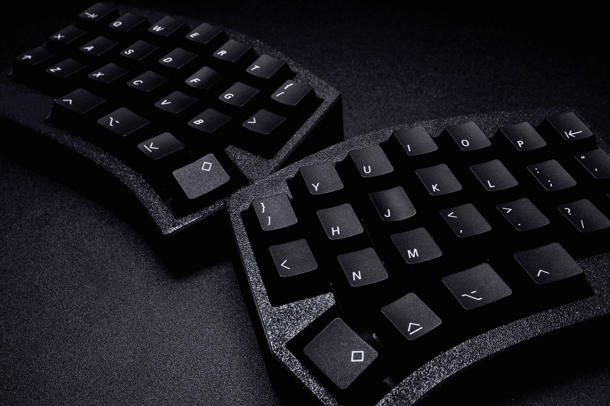
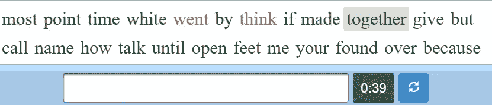
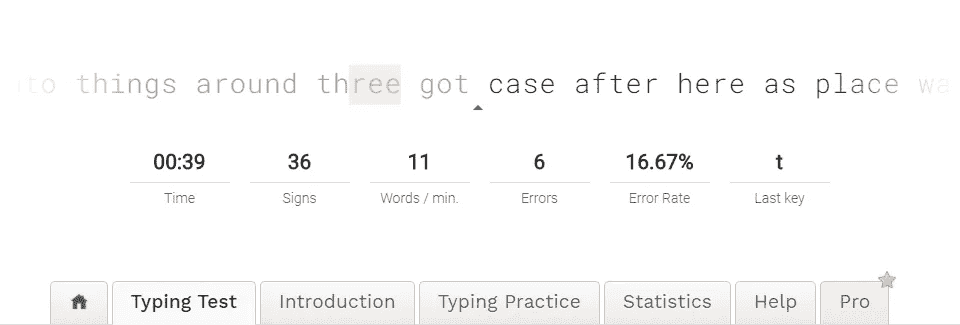
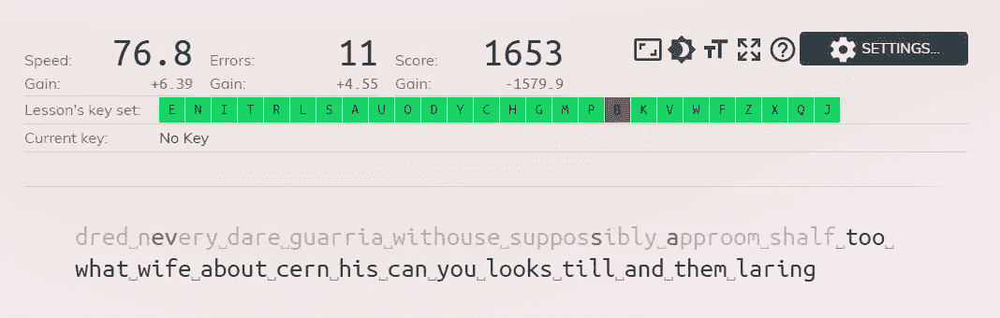
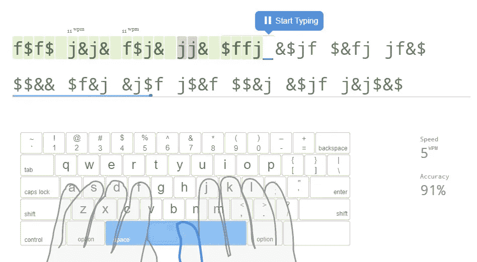

# 键盘输入

> 原文：<https://levelup.gitconnected.com/keyboard-input-typing-practice-w-machine-learning-b5c5a9a362a7>

## 通过机器学习进行打字练习

*免责声明:虽然这个系列是关于机器学习的，但这个帖子不会有任何内容。*

> 本系列文章:
> 1。[简介](https://medium.com/@bayan.bennett/typing-practice-with-machine-learning-introduction-aa3bb5d24134)2
> 。[伪英语](/pseudo-english-typing-practice-with-machine-learning-5700eb4dc54)
> 3。[键盘输入](/keyboard-input-typing-practice-w-machine-learning-b5c5a9a362a7)(你在这里)
> 4。 [Web Worker 推断](/inference-using-web-workers-f47266b7ef11)
> 
> 完工项目位于:[https://www.bayanbennett.com/projects/rnn-typing-practice](https://www.bayanbennett.com/projects/rnn-typing-practice)



照片由 [Peppy Toad](https://unsplash.com/@peppytoad?utm_source=medium&utm_medium=referral) 在 [Unsplash](https://unsplash.com?utm_source=medium&utm_medium=referral) 上拍摄

# 要求

*   显示用户必须激活的区域
*   显示一系列字母
*   接收键盘输入
*   将输入与当前字母进行比较
*   用正确的输入从一个字母前进到另一个字母
*   当光标到达行尾时，它移动到下一行。

# 信

**符合要求:**

*   显示一系列字母

我很好奇想看看其他人制作了什么。以下是一些流行的实现:

## 10fastfingers.com



目标文本和键入区域是分开的。点击空格键更新目标文本并清除输入。当前输入错误的单词以红色突出显示。未纠正的错误有红色字体。

打字区域和目标文本的分离有点不协调。任何时候，当我不得不看着我的文本纠正错误时，我不得不把我的目光从目标文本上移开，这使得一旦我犯了一个错误，就很难保持任何流动。有时完全跳过这个单词比试图改正它更容易。

## 打字学院



一个三角形标记了光标的当前位置。当出现错误时，它不会让用户继续，直到错误被纠正。之后，它会用红色字母标记错误。虽然这种将光标保持在中间并将文本推过用户的方法看起来很花哨，但它没有正确的感觉。

1.  我们的眼睛会自然地向前看，看即将发生的事情。在正常情况下，单词在扫视过程中不会移动。在这种情况下，我们必须用目光瞄准移动的目标。
2.  在阅读我们输入的单词时，我们的眼睛也需要运动。
3.  大多数屏幕的刷新率不超过 60Hz，所以移动的文本更难阅读，因为它在移动时会模糊不清。

## keybr.com



光标是一个闪烁的矩形，就像您在终端中看到的一样。一旦一封信被打出来，如果你打对了，它会变成灰色，如果你打错了，它会变成红色。如果你做得不对，这个页面不会让你进入下一个字符…嗯，在某种程度上。有一个例外，如果你开始正确地输入下一个单词，它会直接跳到那个单词。我喜欢这个页面的一点是，如果你想继续练习，你不必与这个页面互动。

## typingclub.com



这个网站是其中最有特色的。绿色代表你写对了，红色代表你写错了，黄色代表你改正了。光标是蓝色下划线。一旦你完成了你的台词，你必须与页面互动才能进入下一课。

## 我的实现


一些显而易见的选择:

```
/* use the browser default monospaced font */
font-family: monospace;/* remove the margins */
margin: 0;/* center the child elements */
display: flex;
flex-flow: row nowrap;
```

最初，我设计了类似 typing.academy 的东西，但由于 typing.academy 部分提到的原因，我对它并不满意。我喜欢 keybr 和 typingclub 处理这个问题的方式。我想要的一件事是有一个连续的文本流供用户输入。

为此，我使用了一个由 5 行组成的数组。

```
0: Hidden line
1: Previous line
2: Current line
3: Next line
4: Hidden line
```

当用户完成输入一行时，删除`0`行，生成下一行并连接到行数组的末尾，使行数回到 5。实现这一切的诀窍是改变线条的高度:

*   `1` ➡ `0`:高度缩小到`0px`
*   `4` ➡ `3`:当身高增长到`1.5em`

设置高度的逻辑在下面的最终样式组件中。在同一组件中，对于不是当前行的所有行，不透明度也被设置为`0.1`。

这是最终的样式组件:

```
const Letters = styled.h1`
  font-family: monospace;
  margin: 0;
  display: flex;
  flex-flow: row nowrap;
  justify-content: center;
  transition: height 0.3s ease, opacity 0.3s ease;

  /* Sets the height and opacity based on the index of the line */ 
  height: ${(p) => (p.index === 0 || p.index === 4 ? 0 : “1.5em”)};
  opacity: ${(p) => (p.index === 2 ? 1 : 0.1)};
`;
```

# 信

有趣的是，不同的地点是如何对待空间的。我喜欢 keybr.com 用标记来明确表示空格的方式。然而，我选择了一个小圆点(`·`)，因为当你点击 MS Word 上的`¶`符号来显示隐藏的格式符号时，这是用作空格的。

```
const Letter = styled.span`
  position: relative;
  opacity: ${(p) => (p.prev ? 0.3 : 1)};
  transition: opacity 0.3s ease;
  ::after {
    opacity: ${(p) => (p.current ? 1 : 0)};
    position: absolute;
    content: “🔺”;
    font-size: 0.4em;
    text-align: center;
    bottom: -1ch;
    left: -0.5ch;
    right: -0.5ch;
  }
`;
```

相对定位只是为了让`::after`伪元素被绝对定位，并且需要一些东西来锚定。

当字符是当前字符时，我们希望箭头在它下面。当一个字符是前一个字符时，它的不透明度应该为“0.3”。

# 输入栏

**满足要求:**

*   显示用户必须激活的区域
*   接收键盘输入

为什么这是必要的？不是的。

在任何运行 JavaScript 的网站中，有可能让任何元素监听按键，而普通用户却不知道。有点吓人，对吧？这就是为什么 [XSS](https://en.wikipedia.org/wiki/Cross-site_scripting) 如此危险的原因之一，把一个网页变成键盘记录器并不需要太多。

具有专用输入元件解决了两个问题:

1.  这给了用户一些信心，他们的按键不会被听到，除非他们点击一个按钮。这不是一个保证，但它至少告诉用户这是一个被想到的东西。
2.  它允许移动用户在输入区域点击时弹出键盘。

虽然这个应用程序不是为移动使用而设计的，但对于用户来说，能够在移动上使用这个应用程序仍然是一个不错的选择。

## 属性

```
**value=""** to make sure the input area starts with an empty string
**placeholder="CLICK TO ACTIVATE"** this text will show when the input is not focused
**autoCapitalize="none"** prevents mobile keyboards from capitalizig the first letter
**autoCorrect="false"** prevent auto-correct
```

下面是最终组件的样子(使用样式化组件编写)。对`p.theme`的任何引用都来自[材质 UI 的主题](https://material-ui.com/customization/default-theme/)

```
const Input = styled.input.attrs({
 value: “”,
 placeholder: “CLICK TO ACTIVATE”,
 autoCapitalize: “none”,
 autoCorrect: “false”,
})`
  resize: none;
  position: absolute;
  left: 0;
  top: 0;
  right: 0;
  bottom: 0;
  width: 100%;
  height: 100%;
  opacity: 0.87;
  z-index: 1; 
  cursor: default;
  border: none;
  border-radius: ${(p) => p.theme.shape.borderRadius}px;
  margin: 0;
  background-color: ${(p) => p.theme.palette.primary.main};
  text-align: center;
  transition: box-shadow 0.1s ease;
  ::placeholder {
    color: ${(p) => p.theme.palette.primary.contrastText};
    ${(p) => p.theme.typography.h5}
  }
  :focus {
    background-color: transparent;
    cursor: none;
    color: transparent;
    box-shadow: ${(p) => p.theme.shadows[8]};
    outline: none;
    ::placeholder {
      color: transparent;
    }
 }
`;
```

## 键盘输入

**满足要求:**

*   将输入与当前字母进行比较
*   用正确的输入从一个字母前进到另一个字母
*   当光标到达行尾时，它移动到下一行

获取输入就像给`Input`元素添加一个`onChange`属性一样简单。在将值发送到“handleKeypress”操作之前，它是小写的，并从我们的有效字符集中转换为整数。

```
<Input
  onChange={
  ({ target }) => dispatch({
    type: “handleKeypress”,
    payload: char2Int(target.value.toLowerCase())
    })
  }
/>
```

使用`dispatch`是因为我正在使用 Reducer 来管理我的状态([参见:useReducer](https://reactjs.org/docs/hooks-reference.html#usereducer) )

```
const handleKeypress = (state, charInt) => {
  const {
    linesOfText,
    cursor,
    prevTime,
    prevCharInt,
    mlKeyboardWorker,
    bigram,
 } = state; // If there aren’t enough lines, do nothing
  if (linesOfText.length < 3) return state; // Get the current time (higher precision than Date.now())
  const keypressTime = performance.now(); // Check that the pressed key is the current key
  const requiredCharInt = linesOfText[2].keys[cursor].charInt;
  if (charInt !== requiredCharInt) return state; // Record the duration between keypresses
  const duration = keypressTime — prevTime; // If the previous pressed key exists
  // and the duration is less than the maximum allowed,
  // save the duration to our bigram
  if (prevTime !== null && prevCharInt !== null && duration < MAX_DURATION) {
    const {
      [prevCharInt]: { [charInt]: prevTime = null },
    } = bigram;
    bigram[prevCharInt][charInt] = calcEma(prevTime, duration);
 } // Increment the cursor
  const nextCursor = cursor + 1; if (nextCursor < MAX_LENGTH) {
    return {
      …state,
      linesOfText,
      cursor: nextCursor,
      prevCharInt: charInt,
      prevTime: keypressTime,
      bigram,
   };
  }
  // Handle what happens at the end of the line // Remove first line
  linesOfText.shift(); // Send a message to our web worker to get the next line
  mlKeyboardWorker.postMessage({
    type: actionTypes.worker.getNextLine,
    payload: bigram,
  }); return {
    …state,
    linesOfText,
    cursor: 0,
    prevCharInt: null,
    prevTime: null,
    bigram,
  };
};
```

# 摘要

这里有一个需求的快速回顾

*   显示用户必须激活的区域
*   显示一系列字母
*   接收键盘输入
*   将输入与当前字母进行比较
*   用正确的输入从一个字母前进到另一个字母
*   当光标到达行尾时，它移动到下一行

当一个项目包含触觉部分时，它总是特别的。尝试一个新功能，看看感觉如何，可以做出明智的设计决策。

本系列的最后一部分是关于使用 TensorFlow 和 Web Workers 的推理！

*来源于:*

[](https://www.bayanbennett.com/posts/keyboard-input-typing-practice-w-machine-learning) [## 键盘输入-使用机器学习进行打字练习

### 完成的项目位于这里:https://www.bayanbennett.com/projects/rnn-typing-practice 的要求得到满足:我是…

www.bayanbennett.com](https://www.bayanbennett.com/posts/keyboard-input-typing-practice-w-machine-learning)