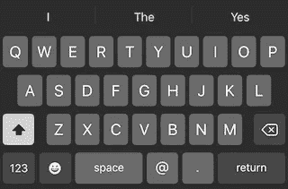
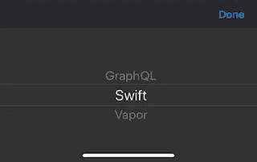

# SwiftUI 字段的键盘选项

> 原文：<https://levelup.gitconnected.com/keyboards-options-for-swiftui-fields-c8ee81083a2>


Camille Orgel 在 [Unsplash](https://unsplash.com?utm_source=medium&utm_medium=referral) 上拍摄的照片

当用户在 iOS 应用程序上填写表格时，改善用户体验的方法之一是使用键盘类型。键盘类型可用于根据字段的上下文显示不同的键盘。例如，如果它是一个电子邮件字段，您可能更喜欢呈现一个易于访问 at ( `@`)和 dot ( `.`)等字符的键盘。

在本帖中，我们将看到不同的键盘选项如何与 SwiftUI 配合使用。首先，我们将涵盖“常见”场景，包括姓名、电子邮件、号码等字段的键盘。然后，我们将看看如何添加更多的自定义选项，如带有选择器视图的键盘。

# 常见案例

对于最常见的情况，SwiftUI 在一个`View`扩展中提供了函数`keyboardType`。这个函数有一个类型为`UIKeyboardType`的参数，这是一个带有`emailAddress`、`numberPad`、`URL`等情况的枚举。

> *全套案例可以参考* [*文档页*](https://developer.apple.com/documentation/uikit/uikeyboardtype) *。*

您可以通过以下方式在任何 SwiftUI 视图中使用该扩展:

```
**TextField**("Type the email...", text: $email)
    **.keyboardType**(**.**emailAddress)
```



但是如果我们想添加一个自定义视图呢？例如，一个 picker 视图，就像我们可以使用 UIKit？

# 带有选取器视图的键盘

你可能已经猜到了，答案就在那里。

我们将不得不使用 UIKit 的`UITextField`，并通过创建一个符合`UIViewRepresentable`协议的结构来使它对 SwiftUI 可用。

不过还是一步一步来，看看怎么才能创造出`PickerField`；一个显示带有选择器的键盘的字段，如下图所示。



为了保持事物的分离，让我们创建一个`UITextField`的子类，在这里我们将实现逻辑来显示一个带有选择器的键盘。

在这个代码片段中，首先，我们声明两个属性；一个是选择器选项，一个是`Binding`属性，它既可以作为字段预填充时的输入，也可以作为用户更改选择器值时的输出。

然后，在初始化器中，我们期待两个参数，我们将用它们来实例化这两个属性。之后，我们将属性`inputView`设置为`UIPickerView`的实例，并使用`inputAccessoryView`设置一个带有“完成”按钮的`UIToolbar`来帮助用户关闭键盘。

最后，如果有预选值，我们从`UIPickerView`中选择该选项。

在这个文件中，我们还添加了一个扩展来实现符合`UIPickerViewDataSource`和`UIPickerViewDelegate`的函数，并将`UIPickerView`的`dataSource`和`delegate`设置为 self。

值得注意的是`didSelectRow`的实现，其中我们将选中的行设置为`Binding`属性`selectionIndex`，以将该信息传递给父视图。

这样，我们将创建一个新的结构，用于在 UIKit 视图和 SwiftUI 世界之间进行通信。

和`PickerTextField`类一样，这个结构也有两个属性；包含选项和字段值绑定属性的列表。

我们将再次使用初始化器通过它的参数传递这些属性的值。如果字段没有值，初始化器为`UITextField`的占位符多取一个参数。

然后，我们提供了`UIViewRepresentable`协议的`makeUIView`和`updateUIView`需求的实现。

在第一个示例中，我们通过设置占位符的值来设置文本字段的初始状态。在第二个例子中，我们用从 SwiftUI 获得的任何新信息来更新`PickerField`的值。

最后，从任何 SwiftUI 视图来看，我们可以按以下方式使用这个结构:

你可以找到这个`[PickerTextField](https://gist.github.com/diamantidis/061d101853f6400f76780345614b2c90#file-pickertextfield-swift)`的代码，以及[其余的代码](https://gist.github.com/diamantidis/061d101853f6400f76780345614b2c90#file-pickerfield-swift)和[一个如何从 SwiftUI 视图](https://gist.github.com/diamantidis/061d101853f6400f76780345614b2c90#file-contentview-swift)中使用它的例子。

# 结论

也就这样了！在这篇文章中，我们首先看到了 SwiftUI 的`TextField`对键盘类型的当前支持水平。然后，我们研究了如何依靠 UIKit 的 UITextField 及其属性`inputView`来提供对更多选项的支持。这样，我们可以呈现一个带有`UIPickerView`的键盘，或者我们想要的任何其他视图。

感谢阅读，我希望你觉得这篇文章有用，如果你对这篇文章有任何问题或评论，请随时在 Twitter 上联系我！

下次见！

*原载于 2020 年 6 月 21 日*[*https://diamantidis . github . io*](https://diamantidis.github.io/2020/06/21/keyboard-options-for-swiftui-fields)*。*