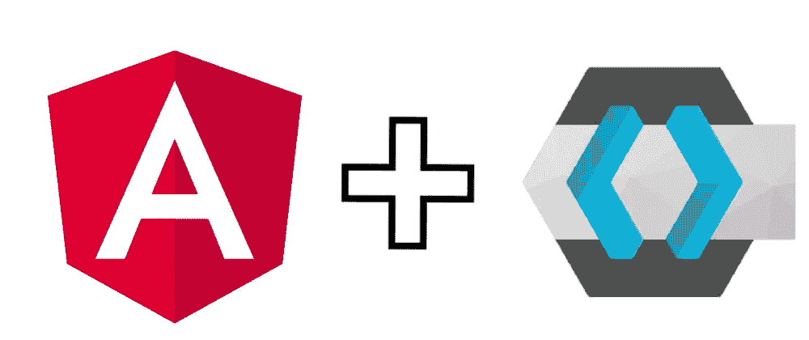
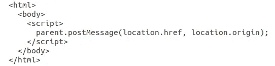
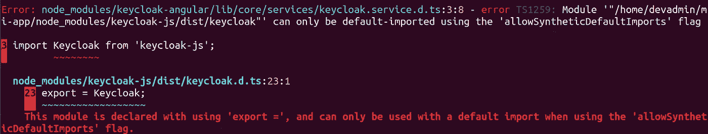
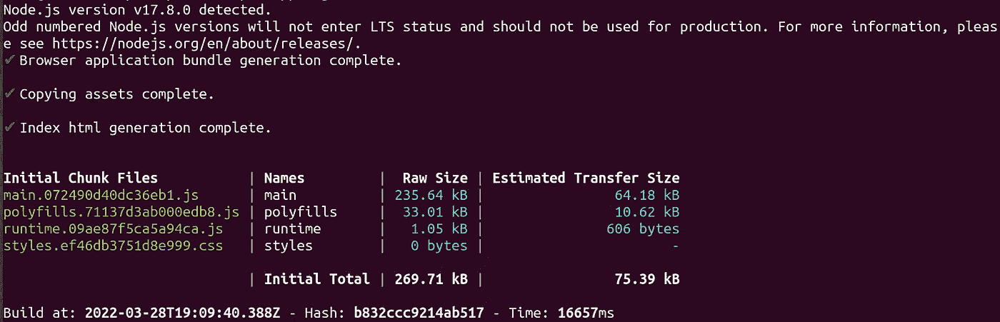
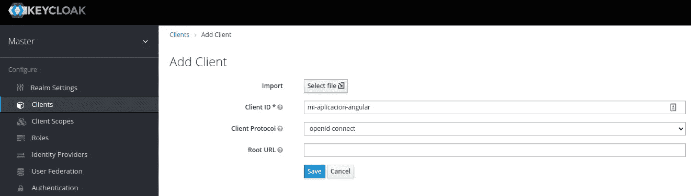
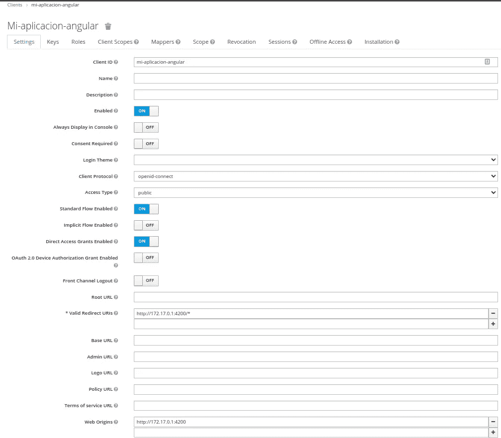
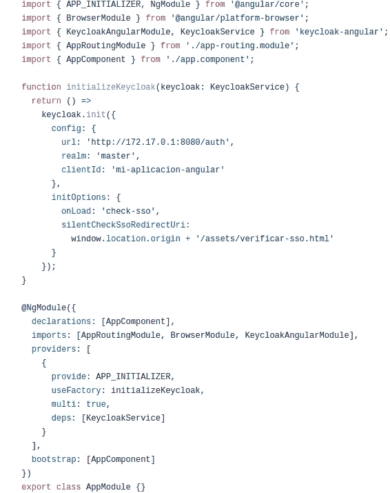
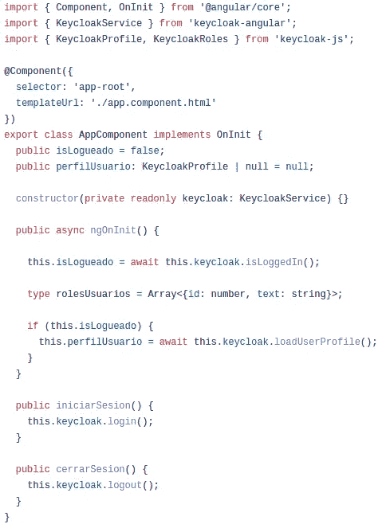
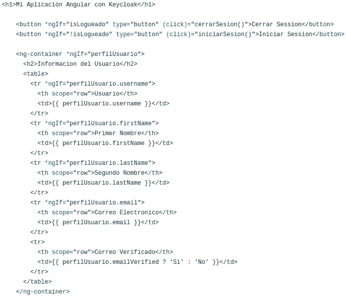

# 角度应用中的键锁

> 原文：<https://levelup.gitconnected.com/keycloak-in-angular-application-980260b4b196>

逐步地



角度和键锁

这些是在 angular 中的应用程序中执行 Keycloak 集成的要求。

# 1.安装 Node.js

Node.js 是一个在服务器上使用 JavaScript 的开源服务器环境。我们必须安装 LTS 版本，因为它是推荐给大多数用户的。目前最新的 LTS 版本是 17.8.0(包括 npm 8.5.5)。

```
curl -sL [https://deb.nodesource.com/setup_17.x](https://deb.nodesource.com/setup_17.x) | sudo -E bash -
sudo apt install -y nodejs
```

最新的 Node.js LTS 版本信息可以在 [Node.js 网站](https://nodejs.org/en/download/)上找到。

# 2.安装 npm

通常，NPM 会和 Node.js 一起安装。但是，我们可以使用下面的命令将其更新到最新版本。

```
sudo npm install npm@latest-g
```

# 3.安装 Angular CLI 和其他组件包

这里我们使用 sudo 来避免任何可能发生的权限问题。

```
sudo npm install @angular/cli
sudo npm install @angular-devkit/architect
sudo npm install @angular-devkit/build-angular
sudo npm install @angular-devkit/core
sudo npm install @angular-devkit/schematics
sudo npm install @schematics/angular
sudo npm install rxjs
sudo npm install typescripts
```

# 4.创建我的应用程序的工作空间

```
sudo ng new mi-aplicacion
```

在我的 angular 项目中安装 keycloak 库和包，我们进入我们的目录 mi-aplicacion

```
cd mi-aplicacion
```

我们安装我们的 keycloak-angular 和 keycloak-js 库和包

```
sudo npm install keycloak-angular keycloak-js
```

在示例中，我们将配置 keycloak 来使用 silent-check-sso-redirect-uri。启用此功能后，您的浏览器将不会执行完全重定向到 Keycloak 服务器并返回到您的应用程序，而是在隐藏的 iframe 中执行此操作，因此您的应用程序资源只需在应用程序初始化时在浏览器中加载和解析一次，而无需在 Keycloak 重定向到您的应用程序后再次加载和解析。

为了确保 Keycloak 可以通过 iframe 进行通信，您需要在 silentCheckSsoRedirectUri 中提供的位置提供来自应用程序的静态 HTML。

在应用程序的资产目录中创建一个名为 verify-sso.html**的文件，并粘贴如下所示的内容:**



../src/assets/verify-sso.html

验证 **app-routing.module.ts** 文件是否在..src/app 目录

此时，我们可以构建我们的项目来检查关于 keycloak-js 的任何错误配置，如果编译时出现以下**allowSyntheticDefaultImport**错误。



然后我们必须通过更新下面的 **tsconfig.ts** 文件来解决这个问题

修改 tsconfig.json 文件，添加编译器选项
**“allowSyntheticDefaultImports”:true**

# 5.我们进行编译，构建

```
ng build
```

在项目开发和配置的这一阶段，您的控制台中应该会出现以下输出。



# 6.在 Keycloak 中创建客户端 mi-aplicacion-angular

现在有趣的部分来了，我们很清楚，至少您已经安装并配置了 keycloak 服务器…作为继续这个开发示例的先决条件，我将跳过 keycloak 的安装…我将只展示如何在 keycloak 管理控制台中创建和配置客户端的部分。



首先，您需要在 keycloak 中创建客户端

然后配置客户端



在 keycloak 中配置客户端

然后按下 save 按钮，我们已经在 Keycloak 工具中配置了我们的客户端…所以我们继续返回到我们的 mi-aplicacion 项目 Angular 中，抛出下面的 Angular 组件中的代码。

# 7.修改应用程序模块

创建函数 initialize keycloak，在这一部分，我们必须配置在前面步骤中已经完成的客户端的 keycloak 配置，例如指定 keycloak 服务器的 url、领域和 clientId



../src/app/app.module.ts

默认情况下，要进行身份验证，您需要调用`login`函数。但是，有两个选项可以让适配器自动进行身份验证。您可以将`login-required`或`check-sso`传递给 init 函数。`login-required`如果用户已登录{project_name}，将对客户端进行身份验证，否则将显示登录页面。`check-sso`将只在用户已经登录的情况下对客户端进行身份验证，如果用户没有登录，浏览器将被重定向回应用程序并保持未经身份验证。

您可以配置一个*静音*选项。启用此功能后，您的浏览器不会完全重定向到{project_name}服务器并返回到您的应用程序，但此操作将在隐藏的 iframe 中执行，因此您的应用程序资源只需在应用程序初始化时由浏览器加载和解析一次，而无需在从{project_name}重定向回您的应用程序后再次加载和解析。这在 SPAs(单页应用程序)的情况下特别有用。

要启用*静默* `check-sso`，您必须在 init 方法中提供一个`silentCheckSsoRedirectUri`属性。此 URI 必须是应用程序中的有效端点(当然，它必须在{project_name}管理控制台中配置为客户端的有效重定向):

最后，我们在[@ ng module](http://twitter.com/NgModule)approving module、KeycloakAngularModule 及其 keycloakService 依赖项中执行以下导入

# 8.修改，app . component . ts

这里，为了方便起见，我们修改了我们的组件，并添加了一些业务逻辑，例如，我们询问用户是否登录了 **"isLogueado"** 会话，以及他是否启动了会话，然后要求 keycloak 返回用户配置文件**" profilusario "**，并且我们创建了两个公共方法，在这两个方法中，它向我们返回登录信息 **"iniciarSession"** 和注销信息 **"cerrarSesion"**



../src/app/app.componet.ts

# 9.修改，app.componet.html

我们用 html 组件中的代码替换所有默认的内容



../src/app/app.component.html

# 开发服务器

最后，我们在 Angular 中部署了我们的应用

```
ng serve --host=0.0.0.0
```

您可以从 GitHub 资源库下载源代码

[https://github . com/ecol lado 1/key cloak-angular-application/tree/master/mi-aplicacion](https://github.com/ecollado1/keycloak-angular-application/tree/master/mi-aplicacion)