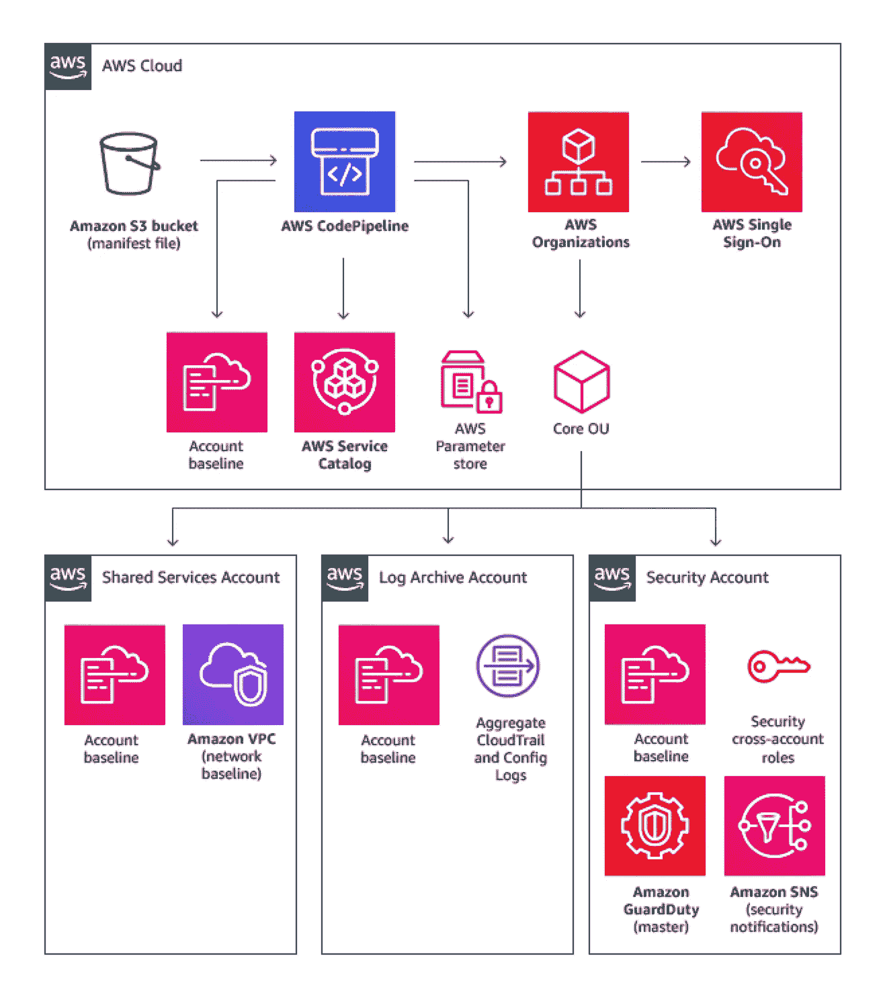

# 在 AWS 上进行软件开发的关键

> 原文：<https://levelup.gitconnected.com/keys-to-crushing-it-at-software-development-on-aws-5ca0853cad85>

[大卫·琼斯](https://unsplash.com/@davidjones?utm_source=medium&utm_medium=referral)在 [Unsplash](https://unsplash.com?utm_source=medium&utm_medium=referral) 上拍照

2022 年的每一种媒体都开始接受这种企业美学，这看起来像是让资本主义更具吸引力的心理实验。总有一张像自行车或盆栽植物之类的照片被随意扔在那里。

> 当然，我绝不会堕落到使用这种策略。

无论如何，这里有一些*绝对粉碎 AWS 上的“疯狂 fuggin”即兴重复的关键！*

## 如果您需要的只是一个仪表板…

我强烈建议停下来，看看如何使用 Honeycode、Quicksight 或 Cloudwatch 仪表盘。很多时候，我们认为我们需要重新发明轮子，从头开始编写另一个定制应用程序。2022 年真的不再是这样了。亚马逊 Honeycode 是一个无代码的解决方案，可以给你一个经过认证的原生移动应用，可以在各种显示器上显示你的数据。您可以选择一些模板，比如库存系统、项目跟踪工具等等。

如果您需要更精细的可视化或特定的数据源 [Amazon Quicksight](https://aws.amazon.com/quicksight/) 是一款易于使用的云软件，用于创建商业智能仪表盘等。然后 [Amazon Cloudwatch](https://aws.amazon.com/cloudwatch/) 集成了几乎所有的 AWS，并具有仪表板功能。您可以从运行在 EC2、ECS、Lambda 或任何地方的任何应用程序获取日志，并以最小的努力显示指标。它还具有惊人的能力。此外，还可以从 AWS 物联网核心中提取设备遥测数据，以便在 Cloudwatch 中可视化。

## 试着在前面有尽可能多的需求

我应该使用数百万个 Lambda 函数和数百万个提供的并发自动伸缩策略[还是简单地构建一个足够强大的 EC2 实例并结束一天的工作](https://news.ycombinator.com/item?id=28839232)？。[您的客户群位于世界的什么地方？我是从另一个托管服务迁移过来的吗？我的预期流量是多少？这东西需要多安全？慈爱的上帝怎么会允许如此多的苦难？提前找到这些紧迫问题的答案。](https://aws.amazon.com/solutions/implementations/multi-region-application-architecture/)

## 做最快的事

从 [serverlessland](https://serverlessland.com/patterns) 、 [stelligent](https://github.com/stelligent/cloudformation_templates) 、 [awsome-cdk](https://github.com/awesome-cdk) 、 [aws-samples](https://github.com/aws-samples) 、 [construct-hub](https://constructs.dev/) 等处寻找解决方案。它完成了你想要的 90%,并填充了剩下的部分。有可能这些模板也比从头开始编写的东西更健壮。

## 始终有一个管道，始终有代码形式的基础设施(IaC)

CI/CD 管道有太多关于它们的文献，我甚至不打算触及这个主题。请注意，这是任何现代成功应用程序的必要条件。此外，您将希望通过该管道部署您的基础设施变更，而不是让这样的变更占用您的终端一整天。AWS [Cloudformation](https://aws.amazon.com/cloudformation/) 、 [SAM](https://aws.amazon.com/serverless/sam/) 和 [CDK](https://aws.amazon.com/cdk/) 最适合部署基础设施，因为它们由 AWS 的人员维护(尽管 SAM 和 CDK 是开源的)。萨姆和 CDK 只是 Cloudformation 的包装器，它们可以被编译成模板文件。其他第三方框架包括[无服务器](https://www.serverless.com/)(用于无服务器应用，顾名思义)和 [Terraform](https://www.terraform.io/) 。此外，您可以使用 [AWS OpsWorks](https://aws.amazon.com/opsworks/) 和 [Chef](https://www.chef.io/) 或 [Puppet](https://puppet.com/use-cases/application-delivery-operations/) 将基础设施配置管理带到云中。

CDK 一直是我个人最喜欢的，因为你可以用更少的行获得同样的输出。另外，它是字面上的代码，所以你可以使用面向对象的编程来扩展现有的模式并节省大量时间。无论您选择什么，我都高度强调 IaC linter 的使用，并在您的 CI/CD 管道中添加该 linter 作为通过要求。如果您选择 CF/SAM/CDK 路线，我选择的工具是 cfn nag:

 [## GitHub - stelligent/cfn_nag:云形成模板的林挺工具

### cfn-nag 工具在 CloudFormation 模板中寻找可能指示不安全基础设施的模式。

github.com](https://github.com/stelligent/cfn_nag) 

## 确保您也遵循云基础架构最佳实践

在您开始在“开发”客户中工作之前，请确保正确的 AWS 客户治理已经到位。通过建立一个 AWS 控制塔多账户环境来减少爆炸影响半径。一个典型的多帐户策略看起来像这样，带有一个额外的“帐户自动售货机”来设置开发人员沙盒环境，以及开发、测试和生产环境。

AWS 多账户战略

## 了解你的定价！

软件开发相关服务的定价可能很棘手，因为有太多的条件。以 AWS Lambda 为例。影响你账单的基本因素包括:[区域](https://aws.amazon.com/about-aws/global-infrastructure/regions_az/)，CPU 架构( [x86 或者 ARM](https://filia-aleks.medium.com/aws-lambda-battle-x86-vs-arm-graviton2-perfromance-3581aaef75d9) )，内存分配( [128 MB 到 2022 年前的 10240 MB](https://docs.aws.amazon.com/lambda/latest/operatorguide/computing-power.html))，函数执行时长( [1 秒到 15 分钟](https://aws.amazon.com/lambda/faqs/))，调用次数。此后，你的定价算法中会出现额外的变量。您是否在定制的 VPC“内部”运行您的功能(您的答案应该是肯定的)？您的函数是否数据密集到 512 MB 的临时存储空间不够大？[冷启动时间](https://aws.plainenglish.io/keep-your-aws-lambda-functions-warm-and-avoid-cold-start-1c80e02ea6f9)对您的延迟敏感型服务来说是个问题吗？

知道你的价格不仅仅是为了避免昂贵的东西。你可以从这些知识中真正受益的地方是[了解 AWS 著名的免费层。](https://medium.com/javarevisited/aws-free-tier-blindspots-70c174487d73)

## 探索面向垂直行业的专业化解决方案

AWS 为医疗保健、汽车、能源、媒体、供应链和制造业等多个行业提供[服务](https://aws.amazon.com/industries/)和[全功能产品](https://awsindustryproducts.splashthat.com/)。例如，*制造设备*可以通过[AWS monitoron](https://aws.amazon.com/monitron/)提供的专用硬件进行监控。如果您想使用自己的监控设备， [AWS Lookout for Equipment](https://aws.amazon.com/lookout-for-equipment/) 可以设置在检测到异常时采取的自动行动，而 [AWS IoT Sitewise](https://aws.amazon.com/iot-sitewise/) 可以收集、存储、组织和监控数据。

## 选择一个源代码控制策略并坚持下去

CodeCommit 是我的首选，因为它已经与 AWS 的其余部分集成在一起。Github 将是我的第二选择，因为它拥有广泛的行业采用率和大量的文档、集成、社区论坛等。Gitlab 和 Bitbucket 以我的经验来看整合起来稍微困难一点。至于分支策略，我通常倾向于基于主干的策略；我不太关注这个，因为你可能会掉进一个真正的兔子洞

代码审查可能很耗时，因此审查人员越少越好。准备好合适的工具，比如 linters、单元测试和安全扫描，减少了我们过去担心投入生产的大部分事情。你仍然需要至少有一双眼睛盯着每个 PR 中的代码，以确保你没有忽略显而易见的东西。结合使用 [git 钩子](https://git-scm.com/book/en/v2/Customizing-Git-Git-Hooks)和 [git guardian](https://docs.gitguardian.com/internal-repositories-monitoring/integrations/git_hooks/pre_commit) 可以在安全漏洞到达 PR 阶段之前将其捕获。始终通过拉请求和自动部署触发器进行部署。

## 学会正确记录

所有阶段的日志记录都可以通过 AWS Cloudwatch(应用程序日志记录)和 AWS Cloudtrail(访问日志记录)的组合来完成，它们大多数时候不需要任何额外的配置，并且很容易推理。

## 结论

这些是我能马上想到的钥匙。对我说的话不要全信。我从 2015 年就开始使用 AWS，但由于有超过 200 种服务，不可能了解所有情况。

# 分级编码

感谢您成为我们社区的一员！更多内容见[级编码出版物](https://levelup.gitconnected.com/)。
跟随:[推特](https://twitter.com/gitconnected)，[领英](https://www.linkedin.com/company/gitconnected)，[通迅](https://newsletter.levelup.dev/)
**升一级正在改造理工大招聘➡️** [**加入我们的人才集体**](https://jobs.levelup.dev/talent/welcome?referral=true)