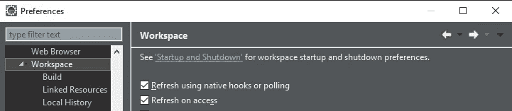

# 启动角度全栈开发，停止使用“ng 发球”

> 原文：<https://levelup.gitconnected.com/kickoff-angular-full-stack-development-b42a41ded696>


# TL；博士

在 Angular 全栈开发中，这里有一些从开发到生产构建高效环境的技巧:

*   停止使用`ng serve`运行应用程序。
*   **将**前端和后端与`ng build --watch **--output-path**`集成，将编译好的角页输出到后端的静态内容文件夹。
*   在你的后端服务器中启用**实时重载**。以**跳靴**为例，添加`spring-boot-devtools`依赖。
*   使用[扩展](https://chrome.google.com/webstore/detail/livereload/jnihajbhpnppcggbcgedagnkighmdlei)在 Chrome 中启用 LiveReload。
*   设置`.gitignore`防止编译后的 Angular 代码被提交给源代码管理。
*   如果你使用**路由器**，当用户登陆一个有路由的 URL 时，处理 404 错误。
*   设置 CI/CD 以在构建期间执行集成。

# 问题是

你是一个说 **Angular** 的全栈开发人员，你希望有一个结合前端和后端的本地 HTTP 服务器。然而，所有这些教程都要求你去做`**ng serve**`。这是前端专用的，并且**不是**设计来让你从 Angular 调用 API 的。在 Angular 中做模拟数据或伪造数据也很耗时，因为你可以自己完成所有真正的后端工作。让我们尽量避免这些废话。

本系列文章以 JAVA ( **SpringBoot** )为例，指导您如何建立整个全栈开发工具链。你可以将类似的想法应用到你的 NodeJS (express，koa)，Python (flask，django)，Go (beego，gin，revel)，PHP (laravel，codeigniter)，ASP.NET，或者任何你喜欢的后端语言/方法。

# 主要思想

我们将简单地用`ng build`代替`ng serve`。

为了使**自动检测**角度源代码变化并自动触发重新编译，我们添加了`--watch`选项。

为了使编译后的 Angular 代码位于我们的**后端的静态页面文件夹**中，而不是默认的`/dist`文件夹中，我们添加了`--output-path`选项，并指定了目标文件夹。

下面是我们正在使用的命令:

```
ng build **--watch** **--output-path=**/d/my-backend/src/main/resources/static
```

我们的后端静态文件夹将如下所示:(以 JAVA/SpringBoot 为例)


简单，嗯？

# 提高效率

`ng serve`快速高效，因为它在内存中，内置的**实时重新加载**功能(在 NodeJS 中)可以在代码发生变化时自动刷新浏览器页面。(有了 [Ivy](https://angular.io/guide/ivy) 的帮助，现在瞬间的构建甚至更快了。)

要实现我们自己的 live-reload，我们需要一个具有这种能力的服务器，并且客户端(前端)要有相应的 websocket 服务。

**服务器端:**以 **SpringBoot** 为例，将`spring-boot-devtools`添加到你的开发依赖中。

```
<dependency>
  <groupId>org.springframework.boot</groupId>
  <artifactId>**spring-boot-devtools**</artifactId>
  <optional>true</optional>
</dependency>
```

**客户端:**在 Chrome 中安装 [LiveReload 扩展](https://chrome.google.com/webstore/detail/livereload/jnihajbhpnppcggbcgedagnkighmdlei)。


[镀铬的 LiveReload extension](https://chrome.google.com/webstore/detail/livereload/jnihajbhpnppcggbcgedagnkighmdlei)

如果您使用 IDE 来启动服务器，那么实时重新加载可能会变慢，因为它可能有自己的更改检测机制。你必须调整设置，使其更好地响应文件的变化。以 Eclipse 为例，您可以启用本机挂钩。



在 Eclipse 中启用本机挂钩

# 具体细节

让我们考虑一下我们现在将面临的一些缺点。

## 404 未找到

假设您使用 Angular 的路由。URL“http://localhost:4200/user/jen”将在浏览器中打开 Jen 的联系信息。然而，这个魔法只对`ng serve`有效。在你自己的后端服务器中，它不会识别出这是你的 SPA 中的一条路线。它只是试图定位静态文件`/user/jen`，但失败了，并返回一个 404 错误。

在 SpringBoot 中，你可以[配置资源处理器规则](https://stackoverflow.com/a/46854105/1118626)，或者简单地让你的后端[将所有 404 错误转发给 index.html](https://stackoverflow.com/a/40281409/1118626)。

## 停止提交编译的角度代码

我们只是让编译好的前端代码自动复制到后端项目中。我们不希望那些重复的代码每次都被提交，所以将静态内容文件夹添加到`.gitignore`是个好主意。

## 在 CI/CD 中构建 webapp

最后但同样重要的是，我们将需要在构建期间做同样的复制到静态文件夹的事情。(我们刚刚`.gitignore`了静态文件夹中的所有代码，因此当 CI/CD 刚刚`git clone`了它时，该文件夹将是空的)以 good-o-Jenkins 为例，我们可以添加这些预构建脚本:


Jenkins 预构建脚本示例(该 Jenkins 从机是一台 Windows 机器)

# 结果

在这篇文章中，我们只讨论这个想法。现实中事情可能会变得更加困难。接下来的文章将给出更多的教程和示例代码，并揭示更多的细节。