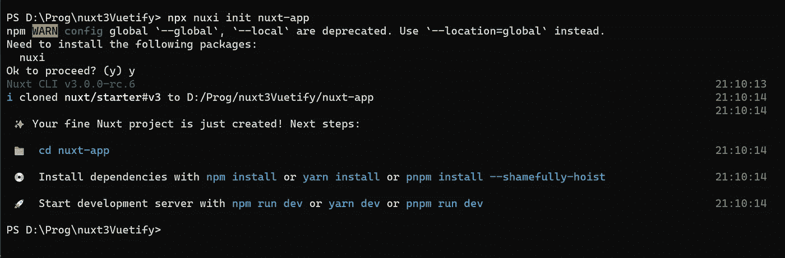
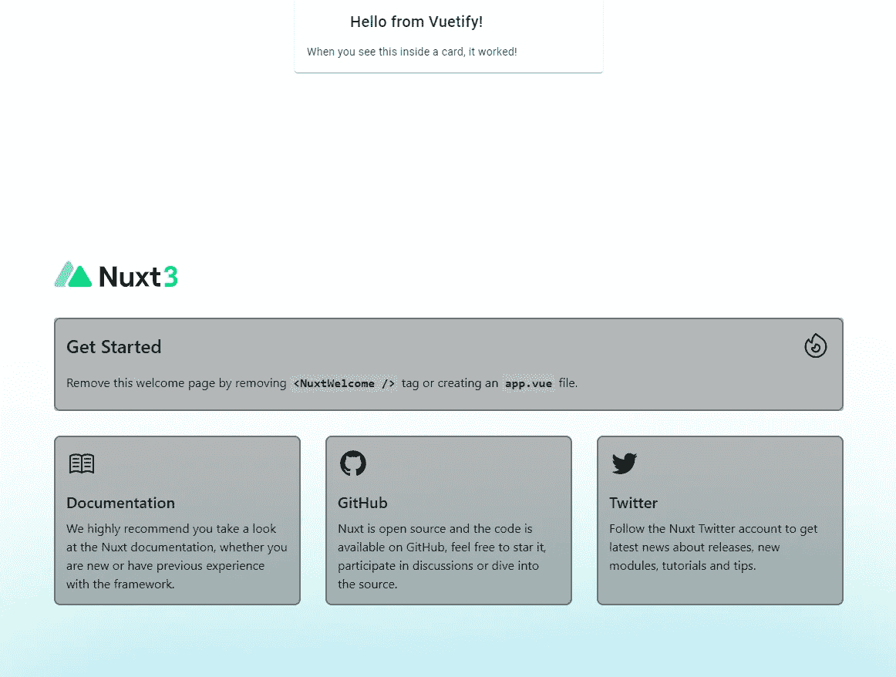

# 用 Nuxt3 和 vuetify3 启动你的下一个项目

> 原文：<https://levelup.gitconnected.com/kickstart-your-next-project-with-nuxt3-and-vuetify3-2257427bd80d>

我将指导你通过设置过程来使用 Vuetify 3 和 Nuxt 3！我还将向您展示启动和运行的基本配置。

所以让我们开始吧！


照片由[努贝尔森·费尔南德斯](https://unsplash.com/@nublson?utm_source=medium&utm_medium=referral)在 [Unsplash](https://unsplash.com?utm_source=medium&utm_medium=referral) 上拍摄

# 创建一个 Nuxt 3 项目

Nuxt 3 基于 Vue3，如果你已经熟悉 vue3，太好了！

为了使本文适合所有的编辑器选择，我将使用 CLI 来创建项目。

要设置您的 nuxt 项目运行

`npx nuxi init nuxt-app`

在您想要的文件夹中。



你可能需要安装 nuxi，新的 nuxt 命令行界面，如果你被要求，只需输入 y。

然后项目就设置好了，这一步不到一秒钟，我们就准备好了。

然后导航到您的 nuxt-app 目录，或者将该目录的内容移动到您想要的位置。我将它移动到我的根文件夹中，因为我喜欢将 package.json 直接包含在我的根文件夹中。

那就跑

`npm install`

像往常一样，首先加载所有的依赖项。

一切完成后，运行

`npm run dev`

启动 vite 服务器并使 nuxt 在 [http://localhost:3000/](http://localhost:3000/) 上可用。

***与 nuxt 2*** 的第一大区别是，这将花费不到一分钟的时间，因为 nuxt 3 是由 [vite](https://vitejs.dev/) 驱动的。

你现在会看到 Nuxt 3 漂亮的登陆页面。

# 在 Nuxt 3 内部安装 Vuetify 3

**Vuetify 3** 目前也在 **beta** 中。要使用它运行:

`npm install vuetify@next`

这将安装来自 [npm](https://www.npmjs.com/package/vuetify) 的 vuetify 的最新测试版。

同样安装 vuetify vite 插件，如这里所述[。](https://github.com/nuxt/framework/discussions/1183#discussioncomment-1997354)

`npm install -D vuetify@next vite-plugin-vuetify`

如果还没有，那么创建一个*插件*目录。

在这个目录中，创建一个名为 vuetify.ts 的文件。

将以下代码粘贴到其中:

```
// plugins/vuetify.ts
```

```
import { createVuetify } from 'vuetify'export default defineNuxtPlugin(nuxtApp => {
    const vuetify = createVuetify({
        // your config will come here
    }) nuxtApp.vueApp.use(vuetify)
})
```

在你的 *nuxt.config.js* 中粘贴以下代码:注意:通过使用 vuetify/vite 插件，你将自动导入。因此，您不需要显式导入组件或指令之类的东西。当你需要的时候，Vite 会为你做这件事。感谢 [KaelWD](https://github.com/KaelWD) 指出这一点！

```
// nuxt.config.ts
import vuetify from 'vite-plugin-vuetify'
```

```
export default defineNuxtConfig({
    css: ['vuetify/styles'], // vuetify ships precompiled css, no need to import sass
    vite: {
        // @ts-ignore
        // curently this will lead to a type error, but hopefully will be fixed soon #justBetaThings
        ssr: {
            noExternal: ['vuetify'], // add the vuetify vite plugin
        },
    },
    modules: [
        // @ts-ignore
        // this adds the vuetify vite plugin
        // also produces type errors in the current beta release
        async (options, nuxt) => {
            nuxt.hooks.hook('vite:extendConfig', config => config.plugins.push(
                vuetify()
            ))
        }
    ]
}
```

如果你有关于 vite 插件 vuetify 的**问题，你可以**或者**试试这个配置。**

```
// alternative nuxt.config.js without vite plugin
export default defineNuxtConfig({
    css: ['vuetify/lib/styles/main.css'],
    build: {
      transpile: ["vuetify"],
    },
  });
```

为了验证安装，我们将在欢迎屏幕的顶部添加一个简单的卡片。

```
<template>
  <div>
    <v-card
class="mx-auto"
width="400"
prepend-icon="mdi-home"
    >
      <templatev-slot:title>
        Hello from Vuetify!
      </template>
      <v-card-text>
        When you see this inside a card, it worked!
      </v-card-text>
    </v-card>
    <NuxtWelcome />
  </div>
</template>
```

安装成功后，您应该会看到类似这样的内容:



# Vuetify 3 的进一步配置

我喜欢 Vuetify 的一点是它干净的全局配置。

这也适用于 Vuetify 3，概念是相同的，但语法略有不同，因为 vue3 语法也发生了变化。

# 更改 Vuetify 3 中的全局主题

如果你想设置为默认的深色主题，你可以在配置中很容易地做到这一点。

将此输入* `createVuetify*({`以启用黑暗主题作为默认主题:

```
theme: {
    defaultTheme: 'dark'
  }
```

或者您也可以创建自己的自定义主题:

```
const myAllBlackTheme: ThemeDefinition = {
  dark: false,
  colors: {
    background: '#000000',
    surface: '#000000',
    primary: '#000000',
    'primary-darken-1': '#000000',
    secondary: '#000000',
    'secondary-darken-1': '#000000',
    error: '#000000',
    info: '#000000',
    success: '#000000',
    warning: '#000000',
  }
}
```

```
export default createVuetify({
  theme: {
    defaultTheme: 'myAllBlackTheme',
    themes: {
      myAllBlackTheme,
    }
  }
})
```

# 向 Vuetify 3 添加图标字体

默认可以选择大家熟知的字体: [**材质设计图标**](https://materialdesignicons.com/) ， [**材质图标**](https://material.io/resources/icons/?style=baseline) ， [**字体牛逼 4**](https://fontawesome.com/v4.7.0/) **，**[**字体牛逼 5**](https://fontawesome.com/) **。**

要添加字体到 vuetify，只需从 icon sets 目录导入所需的字体，并在导出中将其引入 vuetify。

# 未显示解析虚拟化图标

添加图标后，可能会出现图标不显示的情况。

我第一次尝试时也有这个问题。

要修复 **Vuetify 图标未显示错误**，请确保安装相应的字体并将其 CSS 添加到您的插件配置中。

请注意，随着 Vuetify beta 的发展，这可能会改变，因为文档中也没有提到这个过程。

我将向你展示如何使用字体牛逼和 mdi 来做到这一点。

**如果你想安装自定义字体，这也适用！**

安装字体

`npm install @fortawesome/fontawesome-free -D`

`npm install @mdi/font`

将字体 CSS 添加到你的 vuetify 插件中。

`import* '@mdi/font/css/materialdesignicons.css'`

`import* '@fortawesome/fontawesome-free/css/all.css'`

*确保你使用的是 CSS 加载器。*

```
import { createVuetify } from 'vuetify'

import { aliases, fa } from 'vuetify/iconsets/fa'
import {mdi} from "vuetify/lib/iconsets/mdi";
// make sure to also import the coresponding css
import '@mdi/font/css/materialdesignicons.css' // Ensure you are using css-loader
import '@fortawesome/fontawesome-free/css/all.css' // Ensure your project is capable of handling css files
export default defineNuxtPlugin(nuxtApp => {
    const vuetify = createVuetify({ // Replaces new Vuetify(...)
        theme: {
            defaultTheme: 'dark'
        },
        icons: {
            defaultSet: 'fa',
            aliases,
            sets: {
                mdi,
                fa
            }
        },
    })
    nuxtApp.vueApp.use(vuetify)
})
```

在上面的代码片段中，我使用 font-awesome 作为默认图标字体，mdi 作为附加字体。

你现在可以使用你的图标了！

```
<v-icon icon="fas fa-plus" /> To render a FontAwesome icon
<v-icon icon="mdi:mdi-minus" /> To render a MDI icon
```

# Vuetify 3 的当前状态

到 2022 年 7 月 19 日写这篇文章的时候，vuetify 已经支持了 vuetify2 的大部分众所周知的特性+一些新鲜的东西，比如[默认值](https://next.vuetifyjs.com/en/components/defaults-providers/)。

违约对我来说很有用。

您可以定义默认值，如全局默认高程，并将其应用于应用程序中的所有元素。或者您可以使用[本地默认值](https://next.vuetifyjs.com/en/components/defaults-providers/)，将这些值仅应用于包装在`<v-defaults-provider>`标签中的元素。我认为这对达成一致的设计会有很大的帮助。

因此，你可以将一系列卡片包装在一个`<v-defaults-provider>`中，让它们看起来一致，而不必一遍又一遍地复制所有的道具。或者设置一个全局默认值，让应用程序中的所有卡片都具有相同的高度。

为了保持与 Vuetify 3 版本的同步，您可以经常查看他们的[发布页面](https://next.vuetifyjs.com/en/getting-started/release-notes/)。

2022 年 12 月 8 日更新

Vuetify3 已于 31 日发布。十月，这绝对不是一个令人震惊的万圣节。

它已经稳定，现在也推荐生产！到目前为止，仍然缺少一些组件，如数据表，所以升级时要记住这一点！

# 结论

随着 Nuxt 3 和 Vuetify 3 的推出，vue2 生态系统中我最喜欢的两个部分终于来到了 vue3。

Nuxt 3 和 Vuetify 3 都是完全重写的，他们在这方面确实做得很好。

Vuetify 3 已经移植了 vuetify2 及其指令和网格系统中的大部分组件。你绝对应该尝试一下！

如果你想跟上 Nuxt 3 和 Vuetify 3 的发布，我建议遵循他们的路线图。

**你可以在** [**我的 GitHub**](https://github.com/gromann/nuxt3Vuetify) **上找到这篇文章的代码。**

这篇文章最初发表在我的博客 the-koi.com 上。

快乐编码，

亚历克斯

# 资源

[带模板的 GitHub 回购](https://github.com/gromann/nuxt3Vuetify)

[验证节点包](https://www.npmjs.com/package/vuetify)

[Nuxt 文档](https://nuxt.com)

[验证文档](https://next.vuetifyjs.com/en/)

[验证发布页面](https://next.vuetifyjs.com/en/getting-started/release-notes/)