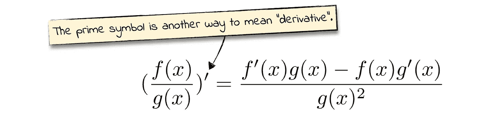

# 黑仔组合:软最大值和交叉熵

> 原文：<https://levelup.gitconnected.com/killer-combo-softmax-and-cross-entropy-5907442f60ba>

*soft max 的导数和交叉熵损失，逐步解释。*

看一看典型的神经网络——特别是它的最后一层。最有可能的是，您会看到类似这样的内容:

softmax 和交叉熵损失就像面包和黄油一样合在一起。原因如下:要用反向传播训练网络，需要计算损失的导数。在一般情况下，导数会变得复杂。但是如果你使用软最大值和交叉熵损失，复杂性就会消失。你得到的不是一个又长又笨的公式，而是这个简洁、易于计算的东西:

有几个[编程机器学习](https://pragprog.com/titles/pplearn/)的读者问我这个导数从何而来。这篇文章就是关于这个计算的:它向你展示了如何一步一步地推导出上面的公式。

声明:这篇文章包含了很多公式，但是在数学方面我有点无能。铁杆数学迷会觉得我的解释非常罗嗦。如果你在寻找一个遵循严格数学符号的简洁的形式证明，你会在[这篇论文](https://www.ics.uci.edu/~pjsadows/notes.pdf)中找到。

在我们开始计算之前，让我们先列出我们需要的数学工具。

# 我们需要一些工具

在这篇文章的其余部分，我们将需要一些派生规则。我将在这里概述其中的四个。

先说我们有两个函数: *f(x)* 和 *g(x)* 。 [*链式法则*](https://www.khanacademy.org/math/ap-calculus-ab/ab-differentiation-2-new/ab-3-1a/v/chain-rule-introduction) 告诉我们如何计算它们合成的导数， *f(g(x))* :

我们还将使用 [*商规则*](https://www.khanacademy.org/math/ap-calculus-ab/ab-differentiation-1-new/ab-2-9/v/quotient-rule) 来计算分数的导数:

最后，我们需要一些基本的导数——那种你通过死记硬背学习的导数。对数函数的[导数，以及指数函数](https://www.khanacademy.org/math/ap-calculus-ab/ab-differentiation-1-new/ab-2-7/v/derivative-of-lnx)的[导数:](https://www.khanacademy.org/math/ap-calculus-ab/ab-differentiation-1-new/ab-2-7/v/derivative-of-ex)

有了这些工具，让我们计算应用于 softmax 的交叉熵损失的导数。让我们从 softmax 的导数开始，稍后我们将回到交叉熵损失。

# 导出 Softmax

我们来看看 softmax 函数。提醒一下，softmax 的输出也是整个神经网络的输出，我称之为 *ŷ.它的输入是最后一个隐藏层的节点。他们通常被称为*逻辑*，所以在这个公式中我把他们命名为 *l* :*

softmax 的输入和输出数量相等，因此ŷ*和 l* 的数量相同。我用字母 *k* 表示输入和输出的数量。

分母中的和有点难读，我们会看到很多。为了便于阅读，我将省略它的索引:

现在我们要计算 softmax 对其输入的导数:

两个索引 *i* 和 *n* 可以取 1 到 *k* 之间的任意值。

这个导数起初可能看起来令人困惑。这里有一个更容易处理的技巧:不要试图计算任何一个 *n* 和 *i* 值的一般导数。取而代之的是，针对两种不同的情况进行计算:I*I*和 n*n*相同的情况，以及它们不同的情况。就这么办吧。

## i=n 的情况

先说 *i* 和 *n* 相同的情况。这意味着我们正在计算 softmax 输出相对于其匹配输入的导数。

你还记得我们前几段提到的商法则吗？很好！让我们好好利用它:

## 我≠n 的情况

现在我们来看看 *i* 和 *n* 不一样的情况。因此，我们计算输出相对于任何非匹配输入的导数:

## 总结 Softmax 的衍生产品

让我们把发现的导数压缩成一个公式:

数学家们有自己的符号来表示:“只有当这个条件为真时，才应用公式的这一部分”。我用了颜色来代替。公式中绿色方框适用于 *i=n* 时，蓝色标签适用于 *i≠n* 时。

这样，我们就有了 softmax 的导数。交叉熵损失的导数！

# **推导交叉熵损失**

以下是神经网络单个输出的交叉熵损失公式:

要获得所有网络输出的总损耗，我们可以对每个输出的损耗求和:

为了避免混淆，我不得不离题了。在[书](https://pragprog.com/titles/pplearn/)和[的另一篇文章](/grokking-the-cross-entropy-loss-cda6eb9ec307)中，我向你展示了交叉熵损失的一个微妙不同的公式。这两个公式都有效，但它们的含义不同。上面的例子是单个例子的丢失——通过网络传输的一段数据。在这个公式中， *yᵢ* 的意思是:“标签的第 *i* 个成分。”相比之下，书中的公式是整个数据集的总损失。在那里， *yᵢ* 的意思是:“第*个标签。”为了得到总损失，你可以使用上面的公式计算每个例子的损失，然后平均所有这些损失。*

换句话说:这和你从书中了解到的，并且希望爱上的，是同一个损失。然而，在书中，我们着眼于大局，而在这篇文章中，我们着眼于细节。

好了，题外话说完了。让我们对它的一个输入取交叉熵损失的导数。提示:在深入研究之前，请记住链式法则。

之前，我们计算了 softmax 的导数。现在我们有了交叉熵损失的导数，用 softmax 的导数表示。让我们把这两个公式混合起来，看看我们会得到什么。

# 把所有的放在一起

我保证我们就快到了。我们还有最后一个计算要做——但这是一个棘手的计算。让我们将 softmax 的导数替换为交叉熵损失的导数:

现在我们有了:应用于 softmax 的交叉熵损失的导数。计算这个东西花了一些时间——但是现在我们有了它，我们可以放松下来，欣赏它的简单。更好的是:我们再也不用计算这个导数了！

*本帖是* [编程机器学习](http://www.progml.com/) *的衍生，程序员零到英雄入门，从基础到深度学习。去* [*这里*](http://www.pragprog.com/titles/pplearn) *找电子书，* [*这里*](https://www.amazon.com/gp/product/1680506609/ref=as_li_qf_asin_il_tl?ie=UTF8&tag=ductyp-20&creative=9325&linkCode=as2&creativeASIN=1680506609&linkId=21357a11b4a7bc9be95476540d1d3a09) *找纸质书，或者来* [*论坛*](https://forum.devtalk.com/tag/book-programming-machine-learning) *如果你有问题和评论！*