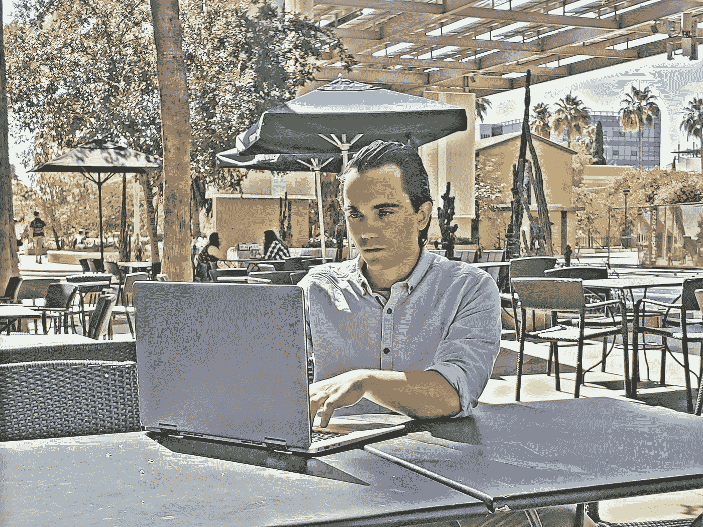
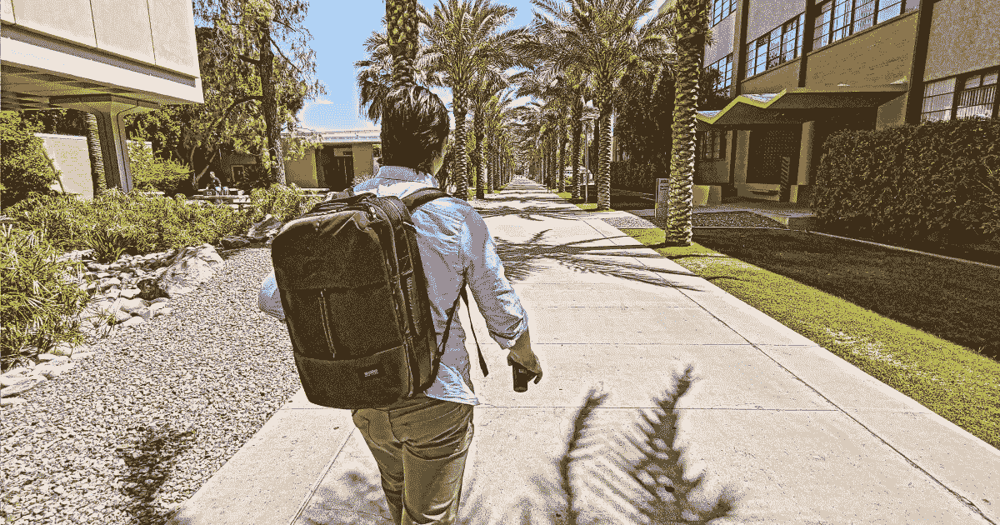

# 基里尔·诺维克:你的职业生涯并不总是直线型的——它是一段旅程和实验室实验

> 原文：<https://levelup.gitconnected.com/kirill-novik-career-is-not-always-linear-it-is-a-journey-or-a-lab-experiment-132a72e74f4f>

自由职业者基里尔

我采访了目前受雇于 [Soshace](https://soshace.com/) 的多功能全栈开发人员 [Kirill Novik](https://www.linkedin.com/in/kirill-novik-07882762/) 。Kirill 精通 Python、JavaScript、Java 和 C#。他拥有科罗拉多大学博尔德分校的分子生物学和计算机科学学士学位。

当基里尔还在上高中的时候，他就和家人从俄罗斯搬到了美国。基里尔上了一所社区大学，并将其中一些学分转到了大学，后来他在那里学习了分子生物学。然而，真正让他感兴趣的是现代生物工具背后的数学和计算方面，他决定从事计算机科学，以拓宽和加深他对生物学研究的理解。

基里尔曾在生物技术领域的“微软”美敦力短暂工作过，但很快意识到办公室环境并不是他真正想要的。他选择了自由职业，这给了他表达自己和创新的自由，也给了他继续学术生涯的机会。在这次采访中，他分享了他从俄罗斯到美国的经历，谈到了开源和他最喜欢的技术，对前端和后端解决方案的未来的看法，以及在开发人员社区中提出了一个重要的精神健康意识问题。

***你好基里尔！谢谢你接受我的面试邀请。先说你的故事。***

嗨！非常感谢你的邀请和你的兴趣。除了说我出生在莫斯科之外，我不想过多地谈论我早年的生活。五岁时，我搬到了泽列诺格拉德，在那里度过了我的童年。关于我的兴趣——生物和化学一直是我在学校最喜欢的科目。

请描述一下，你是如何离开俄罗斯进入美国大学的。

我父亲给了我一个在美国生活的机会。当时，他在一家名为“Parascript”的软件公司工作，总部位于科罗拉多州的博尔德。他们提供了一个机会，让我们全家搬迁一年，并有可能延长逗留时间。最初的想法是在那里呆一年，然后搬回来继续和哥哥一起学生物。

有趣的是，第一年过去后，我们得知我们成了科罗拉多州的居民，这基本上意味着我们上学的学费比非居民低四倍。这是一个游戏改变者，所以我们面临着一个选择，要么在美国接受教育，要么回来继续我们在俄罗斯已经开始的事业。

这个机会太酷了，不能错过。然而，有一个很大的障碍，那就是学费。大学学费，即使你是居民，少交四倍的学费，仍然很贵。我们正在讨论，如果你幸运的话，每人一个学位 50，000 美元。这是一个非常乐观的预测。通常情况下，人均学费会超过 10 万美元。这太疯狂了。这本来是不可能完成的，但幸运的是，剥猫皮的方法不止一种，在美国更是如此。

原来，你可以在两年制的社区大学开始你的学位，然后把你所有的学分转到大学。社区学院是提供高等教育的教育机构，但有一定的局限性，例如，不提供雇主通常要求的学士学位，但它们便宜得多。所以我们决定尝试从这样的大学里获得一些课程。有一所离我们住的地方很近——“前山社区大学”一般的规则是，你把可转的先修课程去掉，它们一般是最简单的课程，但是你必须确保你可以把它们转到大学，不要浪费你的时间。

两年制大学的整个教育轻而易举。这太容易了，我几乎觉得自己是个天才，然而，当我们转到一所真正的大学时，这种幻想就破灭了。结构、速度、要求、规则，一切都不一样，从一个超级容易的两年事情的转变是非常谦卑和有压力的，但幸运的是，它变成了一个非常成功的企业。

***你在转型过程中遇到过哪些困难？***

转变当然非常困难。在维基百科的“文化冲击”页面上，你可以找到文化适应的四个阶段。有趣的是，根据我的经验，这个模型听起来是如此的真实。蜜月期简直不可思议。你喜欢你看到的一切，人们看起来都很好，一切似乎都有可能，这感觉就像你中了彩票。你甚至会觉得自己在语言方面进步很快。然而，粉红色的眼镜很快就脱落了。人们通常不理解你，社交是很有挑战性的，通常，如果你不认识任何人，就没什么可做的。幸运的是，在这个转变过程中，我有我的哥哥陪着我。

你对美国和美国人民的第一印象是什么？与俄罗斯和俄罗斯人有什么不同？

我对美国和美国人的第一印象棒极了。然而，我必须强调一件事。我很幸运生活在落基山之州科罗拉多。我住的地方离一个非常美丽的山脉和博尔德镇非常近，这是一个非常特别的地方。它与美国的许多地方大不相同。人们很冷，他们一般都很富裕，有一所大学超级近，每年有成千上万的学生和游客经过。一切都超级干净。所以马上，这感觉就像你来到了另一个星球。

不要惹总统先生；)

这与莫斯科——一个人口过剩的超级大都市——有着显著的不同。一个从莫斯科来到博尔德的人不会相信生活是多么悠闲，人们是多么冷漠。莫斯科可以和纽约或洛杉矶相比

***美国人如何看待俄罗斯人？你认为你曾经因为你是谁和你来自哪里而受到不同的对待吗？***

美国人总体上对俄罗斯了解不多。老一辈人记得冷战。似乎每个人对俄国的了解是，弗拉基米尔·普京是俄国总统，他们似乎有点尊重他的强硬态度。总的来说，美国人似乎对与外国人交谈很感兴趣，你通常会期望得到热情的接待，这是一种很棒的态度。

然而，当然也有例外。有些人可能对俄罗斯和俄罗斯人有一些个人厌恶，因此可能会虐待你。不幸的是，它发生了，但幸运的是，这并不罕见——它发生在任何地方。

***你为什么决定从生物转到编程？为了计算机科学抛弃自然科学很难吗？你觉得这些天你会想念生物和医学吗？***

这不是一个开关的翻转；这是一个过渡。开始探索计算机科学方向的决定是在我在大学上了一堂生物信息学课之后做出的。从某种意义上说，这是一门不寻常的课，我们不仅仅是从教科书中学习材料，而是阅读和讨论研究文章，谈论我们从家庭读物中学到的算法和方法。这个班由计算机科学和生物学的研究生和本科生组成。这非常令人愉快，然而论文中有如此多的信息需要消化，也需要理解算法背后的一般思想。这是势不可挡的，我很快意识到我想拓宽我的理解，以便我可以更自由地浏览这种类型的信息。

我觉得对现代生物工具背后的数学和计算方面有一个坚实的理解对我未来的职业生涯非常有帮助。我开始学习更多的编程课程。起初，我认为辅修计算机科学可能是对学位的一个很好的补充，所以我开始参加所有的必修课。有相当多的入门课感觉像是浪费时间，它们毫不费力，我也没学到多少东西，但它们是必要的，因为它们大大提高了我的平均绩点，随着平均绩点的提高，会有更多的奖学金。

现在回想起来，我仍然无法接受这样一个事实，那就是我不仅没有支付第二专业的费用，而第二专业最初是我的辅修专业，计算机科学，而且因为我有良好的 GPA 和在实验室工作，我还从大学获得了额外的资金来完成它。

拓宽我生物学视角的课程只有几门，即“算法”和“数据挖掘”，其余的课程帮助我很好地理解了计算机。我最喜欢的课是“计算机系统+操作系统”和“编程语言原理”

在我学习计算机科学课程的同时，我也在一个实验室工作，研究母牛分枝杆菌的特殊性质。我的导师正在研究这种细菌与人类免疫系统的相互作用，这种相互作用带来了一些奇妙的健康益处，包括治疗创伤后应激障碍和其他心理疾病，以及对胃肠道的诸多益处。实验室的工作主要包括查询生物信息学工具 web APIs。我们使用的一个工具是 BLAST(用于寻找两个或更多 DNA 或蛋白质序列之间相似性的基本局部比对搜索工具)。另一个工具是 RAST(一个基因注释工具)。我们试图找到与分枝杆菌其他部分脱节的基因子集——该物种独特优势的潜在候选者。我用 Python 写了所有的东西，学到了很多关于 Python 和它的库在数据处理和分析方面有多么有用的知识。

然而，回过头来看，我认为如果我们有 2013 年 es6 的所有语法，我会更好地使用 JavaScript 来查询 web APIs，但 Python 在数据操作方面很糟糕。

这次实验室经历是我人生中第一次使用我的编程技能来解决现实世界的问题。这也是我第一次真正接触网络，但那还不是网络开发。

在国际合成生物学会议的一个项目中，我接触到了 HTML、CSS 和 JavaScript。这是一场大学团队的国际比赛，他们必须使用该组织提供的标准化实验室工具包来进行大肠杆菌实验。例如，我们的项目围绕着利用噬菌体创造一种治疗结核病的方法。我的部分包括为我们的团队创建一个维基页面([http://2014.igem.org/Team:CU-Boulder](http://2014.igem.org/Team:CU-Boulder))。这是一件令人讨厌的事。在编辑维基页面时，我们必须创建一个或多或少独特的网站，但没有真正的指南告诉我们如何去做。绕过 MediaWiki 的所有限制需要做很多工作，但最终，我做到了，它正式成为我的第一个 web 开发项目。

***描述你加入***[***Soshace.com***](https://soshace.com/)之前的工作经历

我不喜欢“职业阶梯”这样的词，因为对我来说，发展并不是线性的，也不一定是薪水的提升。对我来说，职业生涯是一次旅程或实验室实验。

在我毕业后，从一个非常舒适的学术世界到未知且相当敌对的行业世界的过渡是不愉快的，我花了一些时间来适应它。

正式来说，我的职业生涯始于在生物医学技术行业巨头美敦力公司的实习。对许多人来说，这是一生难得的机会。它完全可以和生物技术领域的微软相提并论。然而，恰恰是这样——微软在生物技术领域，不是谷歌在生物技术领域，也不是苹果在生物技术领域，如果你明白我的意思。如果我决定在实习结束后留在那里，我可能会成就一份伟大的事业，这将是一个真正的阶梯，但有太多的小事对我不起作用。着装规范，严格的工作时间，通关，很少有开发新事物的自由。除了财务方面，这整个企业不适合我，我决定继续前进，继续寻找。

在寻找工作的过程中有很多陷阱。我一直在创业公司的海洋中漂流。这是一个真正的狂野西部。老实说，我对自己在初创公司的工作经历没什么好评价。

但后来我似乎找到了我要找的东西，那是一家名为 ISONAS 的公司。这是一家老牌初创公司，主要专注于安全系统硬件。我的工作是制作和维护仪表板，以便与他们的设备进行交互。我喜欢那份工作的一切。首先，我开始接触后端的 Java，使用非常低级的 API 通过 TCP/IP 与安全系统硬件交互。我可以在 AWS 中自由设计云基础设施。在公司工作期间，我学到了很多东西。我离开的原因是由于公司管理层的变化，我真的不喜欢。它对我不起作用了。

在 ISONAS 之后，我又回到了起点，从事更小的项目。我甚至试图回到俄罗斯，尝试看看在那里工作是什么样子。我为 AlfaBank 工作，我真的很喜欢它，但是莫斯科实在是太让人受不了了，一种压力很大的持续奔波的生活。我开始怀疑软件开发是否真的适合我。

然而，仍有一些未开发的领域。其中一个在远程工作。我决定尝试一下。Soshace 是第一家在“jsremotely”网站上搜索到的公司。

迄今为止，我已经远程工作了四个月，这是我职业生涯中迄今为止最好的经历之一。

从长远来看，我认为自己更多的是在学术领域，而不是在工业领域，我希望远程工作能帮助我继续学业，并通过它在经济上支持我。

**你知道哪些编程语言、框架？你是怎么学会的？你是自学者吗？**

这很有趣，但是除了 Python，我从来没有学过编程语言。在大学，每个班级项目都有不同的编程语言。介绍类是用 Python 编写的；系统类在 C 和汇编中；Scala 编程语言的原理；大数据类是在 JavaScript 和 Java 等语言中。这让你学得很快。幸运的是，几乎每种技术和语言都有文档的“入门”部分。它让谷歌成为了我的延伸，我无法想象不使用搜索引擎作为一名开发人员工作。

> 我熟悉多种语言，但要说我懂其中任何一种都是言过其实。这可以比作懂得一门人类语言。我可以说我懂俄语和英语，但是如果你用其中任何一种语言来测试我，你很快就会发现我的知识有很多空白。我会说我知道足够的计算机语言来解决现实世界的问题。

说到计算机语言和技术，我是一个自学者，但是当然，我喜欢参加研讨会、聚会、上课。然而，这更费时间。

***你最喜欢的技术有哪些？你的技能非常全面，我的意思是，你显然知道很多前端和后端开发的东西。但你最热衷的是什么？***

我喜欢三种技术。从最喜欢到最不喜欢:Typescript，RxJS，React。

Typescript 让 Javascript 变得令人愉快。类型系统非常灵活，它支持 IntelliSense——这是每种编程语言都必须具备的特性(对于大多数 ide 来说，JavaScript 本身并没有自带 IntelliSense，这通常会使开发体验变得枯燥而痛苦)。

RxJS 使异步编程变得优雅、可测试和令人愉快，更重要的是，它使前端开发变得容易。可组合流的整个概念并不新鲜，但是非常强大和非常有用。

反过来，React 不需要太多的介绍，因为它不言自明。它是一个框架，让您可以用 JavaScript(或者更好，用超级棒的 IntelliSense 处理 TypeScript)处理所有的表示逻辑。

我不一定对前端或后端开发充满热情。我会说我热衷于解决问题，尤其是寻找优雅的解决方案。最近，我更多地参与前端开发。不管大多数人怎么想，这可能比后端开发更具挑战性，但随之而来的挑战允许解决许多问题。随着我使用 Typescript，我一天比一天更喜欢它。作为一名开发人员，这让我的生活变得轻松多了。它附带的静态类型检查使我不必编写额外的测试，也使我避免了许多愚蠢的错误。

***您对前端和后端解决方案的未来有何预测&它们会激烈竞争、协作、过时还是合并？***

Web 应用程序是分布式程序的子集，所有的表示逻辑都在客户端执行。围绕 web 应用程序的分布式本质，我至少看到了两个主要趋势。首先，有一种趋势是将计算密集型逻辑和业务逻辑转移到客户端(参见 Web Assembly、Web Workers 等)，另一种趋势是将所有内容转移到后端，并以流的形式进行演示(这与视频游戏更相关)。

我真的很喜欢网络应用的分布式本质，我喜欢你只需安装浏览器和良好的互联网连接就可以做几乎任何事情，我喜欢所有的软件都是基于网络的。然而，我不喜欢的是，web 浏览器的竞争给开发带来了许多挑战，而 JavaScript 支持仍然是一项正在进行的工作。

> 在理想世界中，快速互联网像空气一样无处不在，前端开发没有意义。从密集计算到演示的一切都可以在后端完成，并传输到客户端，以超低延迟视频游戏流为例，这是今天的现实。在这样一个世界里，计算机实质上变成了交互式视频播放器，价格便宜，容易更换，但功能却是无限的。

不幸的是，我们不是在一个理想的世界，互联网仍然是一种奢侈品。我最近去了趟堪萨斯，才意识到在路上找到一个稳定快速的互联网有多难。因为这样的环境，web workers 和 web assembly 是相关的，我希望它们不是:)但是因为倾向于将尽可能多的逻辑转移到客户端，前端开发将保持其作为应用程序开发领域的权利。

***你是怎么决定成为自由职业者的？你能给其他想要挣脱办公室枷锁的有志自由职业者什么建议？***

自由职业当然很有趣

正如我之前所说，这是我在寻找适合自己的工作时尚未探索的领域之一。我发现在家工作的奢侈非常令人愉快，并强烈鼓励任何人去尝试。首要的建议是不要害怕尝试新事物，不要害怕在寻找理想工作时冒险。

***你从事自由职业面临的挑战是什么？自由职业和办公室工作的核心区别是什么？***

对我来说，作为一名自由职业者，只有当我的工作由像索沙切这样的第三方调解时才有意义，索沙切帮助我找到客户，并调解自由职业现实的许多方面。独自做一名自由职业者是非常困难和冒险的。我听说过有人拿不到报酬，无缘无故被禁止进入 Upwork 等平台，甚至欠客户钱的故事。

有了这些粗略的东西，自由职业者的工作变得非常愉快。很少有什么能比得上在家工作的舒适。对我来说，每天睡两到四个午觉来保持高效率是至关重要的，但是在办公室里，我做不到。我经常不得不在车里打盹，这很尴尬。我也喜欢在工作的时候休息一下。在办公室里，这样做很不方便。

然而，在办公室工作也有积极的一面。与你一起工作的团队就在现场，你可以面对面地交流。有时候这让解决问题变得更容易。在办公室工作时，一般会给你配备好的设备。同样值得一提的是，当你在办公室全职工作时，工资通常会高得多。

***你的职业抱负和职业目标是什么？***

我的主要目标是回到大学继续我的学业。理想情况下，获得一个博士学位。我目前正在考虑攻读人工智能学位，我认为在这个时代这是必须的。从那以后，我相信会有很多机会将人工智能知识与生物学研究结合起来。

***你曾经为开源项目做过贡献吗？***

我有，但是我的贡献很小。我对 Alfabank 的 U.I .框架“ARUI Feather”做了一些修改，这是一个开源的框架。我希望我在开源社区中更加活跃，但是我倾向于从事个人项目，这占用了我所有的时间，而不是在已经存在的东西上合作。我真的很尊重为开源项目做出贡献的人，我确信我会在人生的某个时刻加入他们。我认为开源是我们今天享受的所有主要技术背后的驱动力。

***你参与过的最具挑战性的项目是什么？***

有许多项目在各个方面都具有挑战性。有时是与管理层谈判，有时是技术方面，有时是时间限制，但也有三者结合的情况。最具挑战性的项目是在非常有限的时间内将遗留代码重构为微服务。

你是怎么和索沙司扯上关系的？为了被录取，你必须通过哪些面试？你能给其他想在 Soshace 申请工作的程序员什么建议？

我在“jsremotely”网站上找到了 Soshace 当时我正在寻找远程工作。第一次面试是“电话筛选”式的面试，我被问了一些关于我背景的一般性问题。其余的采访都是技术性的。有一个在线技能测试，测试 React、React Native、Vue、Angular 等的熟练程度。所有的采访都很合理。我不会说它们很难，但在 Skype 上解决算法问题有点挑战性。给申请人的建议——这份工作不适合初学者，所以在考虑通过 Soshace 工作之前，最好先积累一些经验。

***请描述一下，你是如何通过 Soshace 找到工作的？***

我目前在旧金山外的一家初创公司工作——自动化英雄。来自 Soshace 的一名开发人员为他们工作，他们希望将另一名开发人员引入团队。他们在寻找一个拥有多种技能的人——Typescript 和. NET。幸运的是，我对这两种技术都有相当多的经验。

事情进展得相当顺利。面试进行得很顺利。

***你的爱好是什么，空闲时间都做些什么？***

我喜欢演奏和作曲。我喜欢卡拉 ok。公路旅行。健身。编程。看哲学书。柏拉图是我个人的最爱。

***你是如何处理烧坏的？你认为在开发者社区传播心理健康意识重要吗？***

> 当务之急是在开发者中传播心理健康意识。软件开发是一个快节奏的、有目标的、面向生产力的、压力极大的活动。作为一名开发人员，意味着你要承受持续的高度焦虑和自我怀疑。

我发现自己多次被工作和截止日期压得喘不过气来，简直处于昏迷状态。我感觉被卡住了，可怕的恐慌袭击压垮了我。幸运的是，我有很多处理它的经验，但当我没有这样做时，感觉世界在我周围崩溃，一点也不好玩。

精疲力竭通常伴随着严重的抑郁。当我试图治疗抑郁症时，我做过的最糟糕的决定之一就是开始服药。可怕的错误。对我来说，药物的副作用远比我正在治疗的疾病更严重。通过反复试验，我停止了药物治疗，开始每周去看一次治疗师。找到一个好的治疗师需要一些时间，但是一旦你找到了合适的，你很快就会看到好处。我强烈建议每个开发人员每周去看一次治疗师。

散步是另一种疗法

*我在*[*Soshace.com*](http://Soshace.com)*做文案，一个招聘网页开发者的平台:* [*招聘*](https://soshace.com/for-clients) *一个开发者或者* [*应聘*](https://soshace.com/for-developers) *远程工作。如果你有有趣的故事要讲，请在 Twitter 上 ping 我@*[*MaryVorontsov*](https://twitter.com/MaryVorontsov)*我很乐意收到你的来信并分享你的故事。*