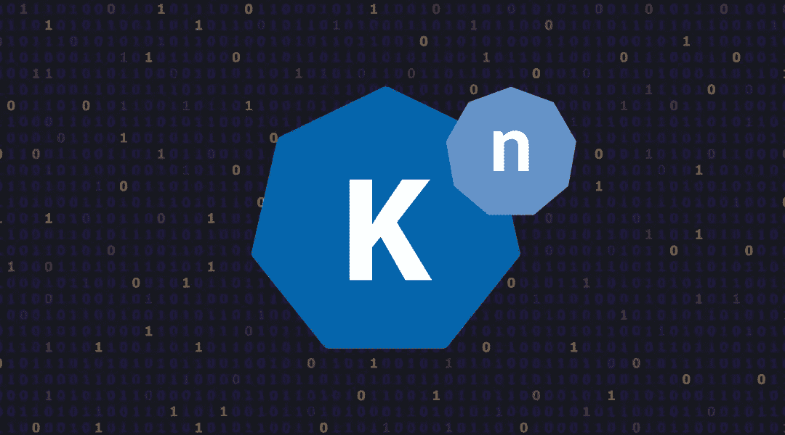
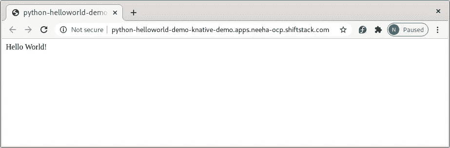
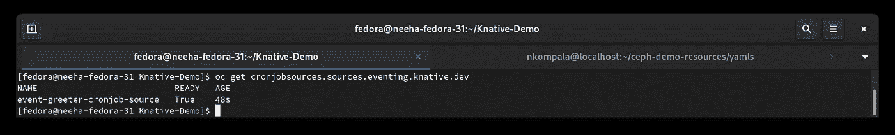
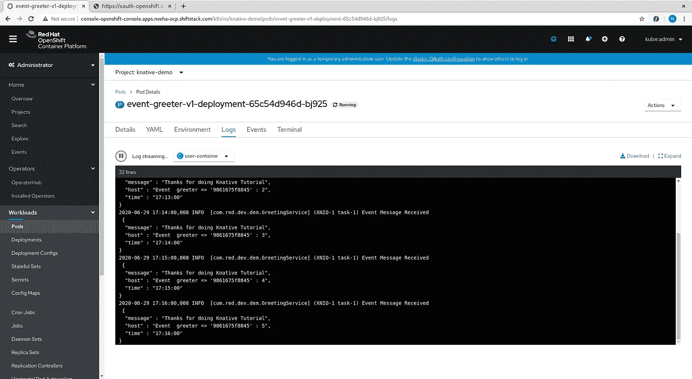

# Knative:服务和事件教程

> 原文：<https://levelup.gitconnected.com/knative-serving-and-eventing-tutorial-586b41099dd2>



本教程有两个简单的先决条件:

*   已安装的 Knative 服务操作员([https://docs . open shift . com/container-platform/4.3/server less/installing _ server less/installing-knative-serving . html](https://docs.openshift.com/container-platform/4.3/serverless/installing_serverless/installing-knative-serving.html)
*   已安装 Knative Eventing 操作员([https://docs . open shift . com/container-platform/4.3/server less/installing _ server less/installing-knative-Eventing . html # installing-knative-Eventing](https://docs.openshift.com/container-platform/4.3/serverless/installing_serverless/installing-knative-eventing.html#installing-knative-eventing))

一旦两个先决条件都得到满足。我们将从演示开始。

> 另外，在开始这个演示之前，您可以先尝试一下**Kafka**入门演示！[https://medium . com/swlh/getting-started-with-Kafka-on-open shift-c 44 c 0 fdec 384](https://medium.com/swlh/getting-started-with-kafka-on-openshift-c44c0fdec384)

我们首先创建一个新项目:

```
oc new-project knative-demo
```

## 有创意的服务

要开始本教程，我们需要创建一个图像。您可以点击此链接[上传您的第一张 Docker 图片，使用 Podman | Neeharika Kompala | Level Up Coding(medium.com)](https://medium.com/gitconnected/uploading-your-first-docker-image-using-podman-87713e2043a0)创建图片并上传至 docker.io 或 quaoy.io

准备好映像后，我们开始编写 service.yaml 文件，该文件将包含连接映像和部署映像的详细信息。

在上面的 YAML 文件中，您需要根据您已经创建并正在使用的图像文件更新**名称**和**图像**细节。**名称空间**是您在演示的第一步中创建的项目的名称。

转到保存 service.yaml 文件的位置(这里 service.yaml 在我的 knative-serving 文件夹中) :

```
oc apply -f knative-serving/service.yaml
```

创建服务后，您可以运行 oc get pods 命令来查看 pod 是否启动并运行。现在运行下面的命令，更改的名称，你会得到一个 URL，你需要把这个 URL 添加到你的 etc/hosts 文件中。

```
oc get ksvc python-helloworld-demo — output=custom-columns=NAME:.metadata.name,URL:.status.url
```

将 URL 添加到 etc/hosts 文件后，现在您可以在 web 浏览器中打开链接。在你的浏览器中打开链接，你会看到“Hello World！”。



## 失败事件

现在我们将处理事件，我们首先部署一个服务来显示来自事件源的事件。

转到保存 event-display.yaml 文件的位置(此处 event-display.yaml 位于我的 knative-eventing 文件夹中) :

```
oc apply -f knative-eventing/event-display.yaml
```

现在你的事件欢迎将被创建，它是上面 YAML 文件中提到的名字。

我们使用 Cronjob 事件源定期发送事件。事件数据被发送到已配置的接收器。

要部署事件源，

转到保存 event-source.yaml 文件的位置(此处 event-source.yaml 位于我的 knative-eventing 文件夹中) :

```
oc apply -f knative-eventing/event-source.yaml
```

现在，一旦创建了 event-greeter-cronjob-source，就可以检查 cronjob 的状态了:

```
oc get cronjobsources.sources.eventing.knative.dev
```



你可以在 Openshift 控制台中查看日志，你得到了 Knative-Demo pod 并查看事件欢迎程序的日志



Knative 非常适合分析，在我接下来的文章中，我们将进一步讨论容器化分析和其他使用 Kafka 和 Knative 执行的工作。