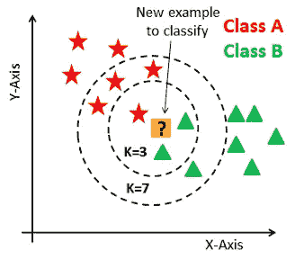

# KNN:失败案例、限制和选择正确 K 的策略

> 原文：<https://levelup.gitconnected.com/knn-failure-cases-limitations-and-strategy-to-pick-right-k-45de1b986428>

在这篇文章中，我们将讨论 KNN 的失败案例，它的局限性，以及如何选择正确的“K”值。

如果你错过了第一部分，我强烈建议你先过一遍， [***这里***](/knn-k-nearest-neighbours-d3ce76380e14) 。

## KNN 的失败案例:

## 案例 1

考虑下面的例子:

作者图片

在这种情况下，数据是随机分布的，因此无法从中获得有用的信息。现在，在这种情况下，当我们给定一个查询点(黄点)时，KNN 算法将试图找到 k 个最近的邻居，但由于数据点是混乱的，准确性是值得怀疑的。

## 案例 2

考虑下面的例子:

作者图片

## 在这种情况下，数据被分组到簇中，但是查询点似乎远离实际的分组。在这种情况下，我们可以使用 K 个最近邻来识别类，但是，这没有多大意义，因为查询点(黄点)离数据点真的很远，因此我们不能非常确定它的分类。

## KNN 的局限性:

KNN 是一个非常强大的算法。也叫“懒学习者”。但是，它有以下一组限制:

**1。不适用于大型数据集:**
由于 KNN 是一种基于距离的算法，计算新点和每个现有点之间的距离的成本非常高，从而降低了算法的性能。

**2。不适用于维数较高的情况:**
同样，原因同上。在高维空间中，计算距离的成本变得昂贵，因此影响性能。

**3。对异常值和缺失值敏感:**
KNN 对异常值和缺失值敏感，因此我们首先需要估算缺失值，并在应用 KNN 算法之前去除异常值。

## 如何挑选合适的“K”值？

这是这个算法下最关键的一步。让我在这里重新构建我们在[之前的文章](/knn-k-nearest-neighbours-d3ce76380e14)中的例子。

[图像来源](https://medium.com/@madanflies/k-nearest-neighbour-for-classification-on-breast-cancer-data-results-with-preprocessing-and-w-o-e21b0cc98a2f)

因此，当 K 的值=3 时，我们将查询点分类为 B 类，如果 K 的值=7，我们将查询点分类为 A 类，这就是关于选择哪个 K 值的困惑所在。

让我们首先理解一个叫做**决策面**的术语。

因此，考虑下面的例子:

作者图片

现在，你可以观察到有一条蓝色的曲线将积极点和消极点分开。所以，当我们说，我们正在建立一个模型，将点分为积极和消极的点，我们基本上是在寻找一个函数，会为我们实现这一点。你看到的这条曲线就是那个函数。这条曲线是我们的模型。

现在，除了几个点之外，我们看到这条曲线/决策面分隔了所有的正负点。此外，给定任何查询点，根据查询点位于决策表面的哪一侧(考虑到与邻居的距离)，它将被分类为正点或负点。

让我们把注意力集中在绿点上。这个绿点是我的查询点，目标是将这个绿点分类到其中一个类中。

让我们把这个变得更有趣一些。考虑以下 3 种情况，以获得更好的直觉。

## **案例 1**

假设我选择 K=1 的值。也就是说，我必须选择我的查询点的 1-最近邻，无论那个 1-NN 的类标签是什么，我都需要把它赋给查询点。在这种情况下，我的 1-NN 是一个正的点，因此我需要给我的查询点分配一个正的类标签。但是等等！我的疑问点在决策面的负面。是的。没错，但那是从几何角度来说的。当我们应用 KNN(其中 K=1)时，最近的邻居是我的正点，因此算法将其分类为正点。这也被称为**过拟合**。

## 案例 2

这里，我选择 K=5 的值。现在，我需要考虑 5 个最近的邻居。当我考虑 5-NN，取多数票时，我可以把查询点归为负面。

## 案例 3

这里，我的 K 值=n，其中 n =数据集中的点的总数。为了便于理解，我们假设我有 1000 个数据点，在这 1000 个数据点中，600 个点是负的，400 个点是正的。所以我的 K=1000。这意味着我们将把所有的 1000 个数据点视为我们的邻居。现在，当我们考虑所有数据点并考虑多数投票时，我们的查询点将被分类为负，因为负点数大于正点数。

我想在这里强调一个有趣的事实。考虑用蓝色标记的查询点。该查询点在正聚类的深处，但是对于 K=1000，该查询点将被认为是负的，因为当考虑多数投票时，因为我有 600 个负点对 400 个正点，所以它将被认为是负点。因此，我想说的是，不管我的查询点在哪里，因为我将所有的数据点视为最近的邻居，并且我的负类标签占大多数，所以我的所有查询点都将被归类为负点。这也被称为欠拟合。

现在，你可能会想，这一切听起来很有趣，但困惑仍然普遍存在。如何选择合适的“K”值？

这个问题的答案是，没有一步一步的指南来解释找到“K”的正确值的最佳方法。

一种方法是针对不同的 K 值训练 KNN，并获取该 K 值的性能指标。例如，您将精度视为性能指标，然后我们绘制精度与不同 K 值的关系图，并选择一个获得最佳精度的点。

Ogunkeye，Fiyinfoba。(2020).怎样才能在 K 近邻中找到最优的 K？检索自:[来源](https://www.researchgate.net/post/How_can_we_find_the_optimum_K_in_K-Nearest_Neighbor/5eed1eda27aecf741e3dd6db/citation/download)

## 结论:

到目前为止，我们了解了 KNN 的失败案例及其局限性，以及如何选择正确的 k 值。在下一节中，我们将了解交叉验证和 k 倍交叉验证。

如果您有任何疑问/建议，请点击“关注”按钮，在评论区随意回复。

直到那时，快乐学习！